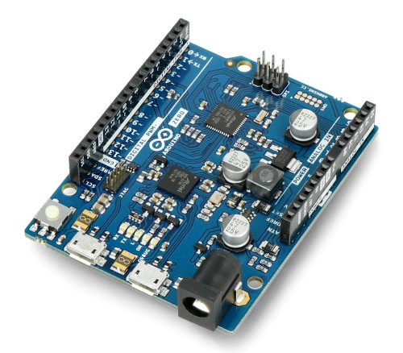
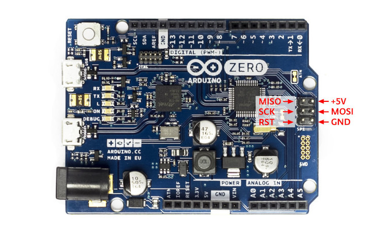
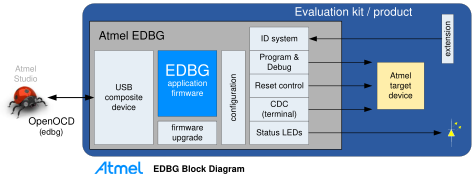

.. _arduino_zero:

Arduino/Genuino Zero
####################

.. admonition:: Downstream Copy!
   :class: note

   This board description is a copy from Zephyr with identical name and will
   be used for further development, improvement and preparation of changes for
   Zephyr within Bridle. However, the original board description still lives
   within the Zephyr namespace under the exactly same board name:
   :ref:`zephyr:arduino_zero`.

Overview
********

The Arduino Zero is a maker-friendly development board with Atmel’s Embedded
Debugger (`EDBG`_), which provides a full debug interface without the need for
additional hardware.

Hardware
********

- `ATSAMD21G18A`_ ARM Cortex-M0+ processor at 48 MHz
- 32.768 kHz crystal oscillator
- 256 KiB flash memory and 32 KiB of RAM
- 3 user LEDs (L/Rx/Tx)
- One reset button
- On-board USB based EDBG unit with serial console
- Native USB port
- |Arduino UNO R3| header
- Arduino ICSP header

Supported Features
==================

The :code:`arduino_zero` board configuration supports the following
hardware features:

+-----------+------------+------------------------------------------+
| Interface | Controller | Driver/Component                         |
+===========+============+==========================================+
| ADC       | on-chip    | Analogue to digital converter            |
+-----------+------------+------------------------------------------+
| DAC       | on-chip    | Digital to analogue converter            |
+-----------+------------+------------------------------------------+
| DMA       | on-chip    | Direct memory access                     |
+-----------+------------+------------------------------------------+
| Flash     | on-chip    | Can be used with LittleFS to store files |
+-----------+------------+------------------------------------------+
| GPIO      | on-chip    | I/O ports                                |
+-----------+------------+------------------------------------------+
| HWINFO    | on-chip    | Hardware info                            |
+-----------+------------+------------------------------------------+
| I2C       | on-chip    | Inter-Integrated Circuit                 |
+-----------+------------+------------------------------------------+
| NVIC      | on-chip    | nested vector interrupt controller       |
+-----------+------------+------------------------------------------+
| PWM       | on-chip    | Pulse Width Modulation                   |
+-----------+------------+------------------------------------------+
| SPI       | on-chip    | Serial Peripheral Interface ports        |
+-----------+------------+------------------------------------------+
| SYSTICK   | on-chip    | systick                                  |
+-----------+------------+------------------------------------------+
| USART     | on-chip    | Serial ports                             |
+-----------+------------+------------------------------------------+
| USB       | on-chip    | USB device                               |
+-----------+------------+------------------------------------------+
| WDT       | on-chip    | Watchdog                                 |
+-----------+------------+------------------------------------------+

Other hardware features are not currently supported by Zephyr.

The default configuration can be found in the Kconfig
:bridle_file:`boards/arm/arduino_zero/arduino_zero_defconfig`.

Board Configurations
====================

The :code:`arduino_zero` board can be configured for the following different
use cases.

.. rubric:: :command:`west build -b arduino_zero`

Use the serial port SERCOM5 over EDBG as Zephyr console and for the shell.

.. rubric:: :command:`west build -b arduino_zero -S usb-console`

Use the native USB device port with CDC-ACM as Zephyr console and for the shell,
see :ref:`snippet-usb-console`.

Connections and IOs
===================

The `Arduino store`_ has detailed information about board connections. Download
the `Arduino Zero Schematic`_ or `Arduino Zero Design Data`_ for more detail.
There is also an `Arduino Zero Pinout Diagram`_.

System Clock
============

The SAMD21 MCU is configured to use the 32.768 kHz external crystal with the
on-chip PLL generating the 48 MHz system clock. The internal APB and GCLK unit
are set up in the same way as the upstream Arduino libraries.

GPIO (PWM) Ports
================

The SAMD21 MCU has 2 GPIO ports, 3 PWM able Timer/Capture-Counter (TCC) and
2 simple Timer/Counter (TC). On the Arduino Zero, TCC2 channel 1 is
available on first user LED (L), all other user LEDs can be controlled
as GPIO. Only if :kconfig:option:`CONFIG_PWM_SAM0_TCC` is enabled then the
first user LED (L) is driven by TCC2 instead of by GPIO. All channels of
TCC0 and TCC1 are available on the |Arduino UNO R3| header.

ADC/DAC Ports
=============

The SAMD21 MCU has 1 DAC and 1 ADC. On the Arduino Zero the DAC voltage
output (VOUT) is available on A0 of the |Arduino UNO R3| header. The ADC
channels 2-5 and 10 are available on A1-A5 of the |Arduino UNO R3| header.

The external voltage reference VREFA can be used optional for the DAC and
ADC on same time and is available on AREF of the |Arduino UNO R3| header.

SPI Port
========

The SAMD21 MCU has 6 SERCOM based SPIs. On the Arduino Zero, SERCOM4 is
available on the 6 pin ICSP connector at the edge of the board. To the
|Arduino UNO R3| header SERCOM1 is connect to external devices over D11 (MOSI),
D12 (MISO), and D13 (SCK). All signals of both busses are connected in
parallel to the Atmel EDBG.

I2C Port
========

The SAMD21 MCU has 6 SERCOM based I2Cs. On the Arduino Zero, SERCOM3 is
signals are connected in parallel to the Atmel EDBG.

Serial Port
===========

The SAMD21 MCU has 6 SERCOM based USARTs. One of the USARTs (SERCOM5) is
connected to the onboard Atmel Embedded Debugger (EDBG) and is the Zephyr
console. This is captured by the standard board configuration. SERCOM0 is
available on the D0 (RX) and D1 (TX) of the |Arduino UNO R3| header.

USB Device Port
===============

.. image:: img/arduino_zero_usb.jpg
   :align: right
   :scale: 50%
   :alt: Arduino Zero Native and Programming USB Ports

The SAMD21 MCU has a (native) USB device port that can be used to communicate
with a host PC. See Zephyr :ref:`zephyr:usb-samples` for more, such as the
:doc:`zephyr:samples/subsys/usb/cdc_acm/README` sample which sets up a virtual
serial port that echos characters back to the host PC. As an alternative to the
default Zephyr console on serial port the Bridle :ref:`snippet-usb-console`
can be used to enable :ref:`zephyr:usb_device_cdc_acm` and switch the console
to USB::

   USB device idVendor=2341, idProduct=804d, bcdDevice= 3.05
   USB device strings: Mfr=1, Product=2, SerialNumber=3
   Product: Arduino Zero (CDC ACM)
   Manufacturer: Arduino LLC
   SerialNumber: 9CF503EE1D54A301

Programming and Debugging
*************************

The Arduino Zero ships the BOSSA compatible `UF2 bootloader`_ also known as
`Arduino Zero Bootloader`_, a modern `SAM-BA`_ (Boot Assistant) replacement.
The bootloader can be entered by pressing the RST button twice::

   USB device idVendor=2341, idProduct=004d, bcdDevice= 2.00
   USB device strings: Mfr=1, Product=2, SerialNumber=0
   Product: Arduino Zero
   Manufacturer: Arduino LLC

Additionally, if :kconfig:option:`CONFIG_USB_CDC_ACM` is enabled then the
bootloader will be entered automatically when you run :program:`west flash`.

.. tip::

   When ever you need to restore this original bootloader you should read
   and following the directions in `Arduino Zero Advanced Features`_ and
   `Update the Bootloader on the Arduino Zero`_.
   There is also a backup copy of the original bootloader together with
   a ready to use Segger JFlash control file inside the Bridel project:

   * :bridle_file:`boards/arm/arduino_zero/doc/bootloader/samd21_bossa_arduino.hex`
   * :bridle_file:`boards/arm/arduino_zero/doc/bootloader/samd21_bossa_arduino.jflash`

   The Segger JFlash control file is only usefull when the EDBG firmware
   was upgrade to the latest `J-Link firmware for Atmel EDBG`_. This was a
   special OEM firmware version for Atmel's Xplained Platforms, based on the
   `AT32UC3A4256S`_ 32-bit AVR microcontroller.

      .. danger::

         **It is neither guaranteed nor tested that the J-Link firmware
         for Atmel EDBG will also work on the EDGB populated on the Arduino
         Zero!**  See also the warning to Atmel Studio 7 below. In doubt
         you should never touch the EDBG firmware on Arduino Zero.

   So if that didn't happen, OpenOCD or, even easier, the small tool
   :program:`edbg`, the `CMSIS-DAP programmer`_ by a Microchip employee,
   should be used:

   .. code-block:: console

      srec_cat samd21_sam_ba.hex -Intel -Output samd21_sam_ba.bin -Binary
      edbg --list    # convert HEX to BIN file and get <your_edbg_sn>

      edbg --verbose --serial <your_edbg_sn> --target samd21 \
           --erase --program --verify --file samd21_sam_ba.bin

   It is also possible to use Microchip's own `Python MCU programmer`_
   together with the `Python Kit information`_ utility and write the
   Intel HEX file directly back to flash without conversion to BIN file:

   .. code-block:: console

      pykitinfo # get <your_edbg_sn>
      pymcuprog --verbose info --tool edbg --serialnumber <your_edbg_sn> \
                --device atsamd21g18a --file samd21_sam_ba.hex \
                --erase --verify write

.. rubric:: Atmel Embedded Debugger (EDBG)

The Arduino Zero also comes with an Atmel Embedded Debugger (`EDBG`_). That
provides a debug interface to the SAMD21 chip and is supported by OpenOCD
for bootloader restore or direct programming and debugging. The Atmel EDGB
is connected to the debug USB port for programming::

   USB device idVendor=03eb, idProduct=2157, bcdDevice= 1.01
   USB device strings: Mfr=1, Product=2, SerialNumber=3
   Product: EDBG CMSIS-DAP
   Manufacturer: Atmel Corp.
   SerialNumber: E8VRDGVEYNKJTF8LS45K

.. admonition:: Arduino Zero, Atmel EDBG, and Atmel Studio 7
   :class: danger

      .. image:: img/atmel_edbg.png
         :align: right
         :alt: Atmel Embedded Debugger (EDBG) Chip

      The Arduino Zero was designed in partership with Atmel (now
      Microchip) which dedicated to this board a special USB PID with
      the major purpose to make the board recognizable and differentiate
      it form other evaluation boards in Atmel Studio. The EDBG chip is
      used on several Atmel evaluation boards and programmers, you can
      find the list
      `here <https://onlinedocs.microchip.com/pr/GUID-33422CDF-8B41-417C-9C31-E4521ADAE9B4-en-US-2/GUID-7EF3D274-1BA4-40A3-80C8-51D1D0E4FA75.html>`_.
      You should consider the Arduino Zero dedicated USB PID (:code:`0x2157`)
      as another USB PID to add to that list. **During the manufacturing
      process Arduino upgrade the EDBG firmware and customize the USB
      descriptor fields.**

      -- https://github.com/arduino/ArduinoCore-samd/issues/286#issuecomment-354807646

   Upgrading the firmware with a new one provided by Atmel Studio 7 using
   the :program:`atfw.exe` tool will erase all the factory "Arduino Zero"
   USB configurations and will set the USB PID to :code:`0x2111`. **But
   consider that you couldn't revert the Arduino USB descriptor settings!**

Flashing
========

#. Build the Zephyr kernel and the :ref:`zephyr:hello_world` sample application:

   .. zephyr-app-commands::
      :zephyr-app: samples/hello_world
      :board: arduino_zero
      :goals: build
      :compact:

#. Connect the Arduino Zero to your host computer using the **native USB**
   port (before the USB debug port) to rech the bootloader.

#. Connect the Arduino Zero to your host computer using the **USB debug**
   port (after the native USB port) to reach the virtual console of **EDBG**.

#. Run your favorite terminal program to listen for output. Under Linux the
   terminal should be :code:`/dev/ttyACM0`. For example:

   .. code-block:: console

      $ minicom -D /dev/ttyACM0 -o

   The -o option tells minicom not to send the modem initialization
   string. Connection should be configured as follows:

   - Speed: 115200
   - Data: 8 bits
   - Parity: None
   - Stop bits: 1

#. Pressing the RST button twice quickly to enter bootloader mode.

#. Flash the image:

   .. zephyr-app-commands::
      :zephyr-app: samples/hello_world
      :board: arduino_zero
      :goals: flash
      :compact:

   You should see "Hello World! arduino_zero" in your terminal.

Debugging
=========

**Debugging is only possible over SWD with the help of EDBG!**

#. Do the for the debug session necessary steps as before except
   enter the bootloader mode and the flashing.

#. Flash the image and attach a debugger to your board:

   .. zephyr-app-commands::
      :app: zephyr/samples/hello_world
      :board: arduino_zero
      :gen-args: -DBOARD_FLASH_RUNNER=openocd
      :goals: debug
      :compact:

   You should ends up in a debug console (e.g. a GDB session).

More Samples
************

LED Blinky
==========

.. zephyr-app-commands::
   :app: zephyr/samples/basic/blinky
   :board: arduino_zero
   :goals: flash
   :compact:

LED Fade
========

.. zephyr-app-commands::
   :app: zephyr/samples/basic/fade_led
   :board: arduino_zero
   :goals: flash
   :compact:

Basic Threads
=============

.. zephyr-app-commands::
   :app: zephyr/samples/basic/threads
   :board: arduino_zero
   :goals: flash
   :compact:

Hello Shell with USB-CDC/ACM Console
====================================

.. zephyr-app-commands::
   :app: bridle/samples/helloshell
   :board: arduino_zero
   :west-args: -S usb-console
   :goals: flash
   :compact:

.. rubric:: Simple test execution on target

.. tabs::

   .. group-tab:: Basics

      .. code-block:: console

         uart:~$ hello -h
         hello - say hello
         uart:~$ hello
         Hello from shell.

         uart:~$ hwinfo devid
         Length: 16
         ID: 0xde73d01ae52511ed9cf503ee1d54a301

         uart:~$ kernel version
         Zephyr version 3.5.0

         uart:~$ bridle version
         Bridle version 3.5.0

         uart:~$ bridle version long
         Bridle version 3.5.0.0

         uart:~$ bridle info
         Zephyr: 3.5.0
         Bridle: 3.5.0

         uart:~$ device list
         devices:
         - eic@40001800 (READY)
         - gpio@41004480 (READY)
         - gpio@41004400 (READY)
         - cdc-acm-uart-0 (READY)
         - sercom@42001c00 (READY)
         - sercom@42000800 (READY)
         - adc@42004000 (READY)
         - dac@42004800 (READY)
         - sercom@42001400 (READY)
         - tcc@42002800 (READY)
         - nvmctrl@41004000 (READY)

         uart:~$ history
         [  0] history
         [  1] device list
         [  2] bridle info
         [  3] bridle version long
         [  4] bridle version
         [  5] kernel version
         [  6] hwinfo devid
         [  7] hello
         [  8] hello -h

   .. group-tab:: GPIO

      Operate with the yellow Rx user LED:

      .. code-block:: console

         uart:~$ gpio get gpio@41004480 3
         Reading gpio@41004480 pin 3
         Value 0

         uart:~$ gpio conf gpio@41004480 3 out
         Configuring gpio@41004480 pin 3

         uart:~$ gpio set gpio@41004480 3 1
         Writing to gpio@41004480 pin 3

         uart:~$ gpio set gpio@41004480 3 0
         Writing to gpio@41004480 pin 3

         uart:~$ gpio blink gpio@41004480 3
         Blinking port gpio@41004480 index 3. Hit any key to exit

   .. group-tab:: PWM

      Operate with the builtin user LED:

      .. code-block:: console

         uart:~$ pwm usec tcc@42002800 1 20000 20000
         uart:~$ pwm usec tcc@42002800 1 20000 19000
         uart:~$ pwm usec tcc@42002800 1 20000 18000
         uart:~$ pwm usec tcc@42002800 1 20000 17000
         uart:~$ pwm usec tcc@42002800 1 20000 16000
         uart:~$ pwm usec tcc@42002800 1 20000 15000
         uart:~$ pwm usec tcc@42002800 1 20000 10000
         uart:~$ pwm usec tcc@42002800 1 20000 5000
         uart:~$ pwm usec tcc@42002800 1 20000 2500
         uart:~$ pwm usec tcc@42002800 1 20000 500
         uart:~$ pwm usec tcc@42002800 1 20000 0

   .. group-tab:: DAC/ADC

      Operate with the loop-back wire from A0 (DAC CH0 VOUT)
      to A1 (ADC CH2 AIN):

     .. code-block:: console

        uart:~$ dac setup dac@42004800 0 10
        uart:~$ adc adc@42004000 resolution 12
        uart:~$ adc adc@42004000 acq_time 10 us
        uart:~$ adc adc@42004000 channel positive 2

        uart:~$ dac write_value dac@42004800 0 512
        uart:~$ adc adc@42004000 read 2
        read: 2016

        uart:~$ dac write_value dac@42004800 0 1023
        uart:~$ adc adc@42004000 read 2
        read: 4047

   .. group-tab:: Flash access

      .. code-block:: console

         uart:~$ flash read nvmctrl@41004000 136b0 40
         000136B0: 61 72 64 75 69 6e 6f 5f  7a 65 72 6f 00 48 65 6c |arduino_ zero.Hel|
         000136C0: 6c 6f 20 57 6f 72 6c 64  21 20 49 27 6d 20 54 48 |lo World ! I'm TH|
         000136D0: 45 20 53 48 45 4c 4c 20  66 72 6f 6d 20 25 73 0a |E SHELL  from %s.|
         000136E0: 00 69 6c 6c 65 67 61 6c  20 6f 70 74 69 6f 6e 20 |.illegal  option |

         uart:~$ flash read nvmctrl@41004000 3c000 40
         0003C000: ff ff ff ff ff ff ff ff  ff ff ff ff ff ff ff ff |........ ........|
         0003C010: ff ff ff ff ff ff ff ff  ff ff ff ff ff ff ff ff |........ ........|
         0003C020: ff ff ff ff ff ff ff ff  ff ff ff ff ff ff ff ff |........ ........|
         0003C030: ff ff ff ff ff ff ff ff  ff ff ff ff ff ff ff ff |........ ........|

         uart:~$ flash test nvmctrl@41004000 3c000 400 2
         Erase OK.
         Write OK.
         Erase OK.
         Write OK.
         Erase-Write test done.

         uart:~$ flash read nvmctrl@41004000 3c000 40
         0003C000: 00 01 02 03 04 05 06 07  08 09 0a 0b 0c 0d 0e 0f |........ ........|
         0003C010: 10 11 12 13 14 15 16 17  18 19 1a 1b 1c 1d 1e 1f |........ ........|
         0003C020: 20 21 22 23 24 25 26 27  28 29 2a 2b 2c 2d 2e 2f | !"#$%&' ()*+,-./|
         0003C030: 30 31 32 33 34 35 36 37  38 39 3a 3b 3c 3d 3e 3f |01234567 89:;<=>?|

         uart:~$ flash page_info 3c000
         Page for address 0x3c000:
         start offset: 0x3c000
         size: 256
         index: 960

         uart:~$ flash erase nvmctrl@41004000 3c000 400
         Erase success.

         uart:~$ flash read nvmctrl@41004000 3c000 40
         0003C000: ff ff ff ff ff ff ff ff  ff ff ff ff ff ff ff ff |........ ........|
         0003C010: ff ff ff ff ff ff ff ff  ff ff ff ff ff ff ff ff |........ ........|
         0003C020: ff ff ff ff ff ff ff ff  ff ff ff ff ff ff ff ff |........ ........|
         0003C030: ff ff ff ff ff ff ff ff  ff ff ff ff ff ff ff ff |........ ........|

   .. group-tab:: I2C

      The Arduino Zero has no on-board I2C devices. For this example the
      |Grove BMP280 Sensor|_ was connected.

      .. code-block:: console

         uart:~$ log enable none i2c_sam0

         uart:~$ i2c scan sercom@42001400
              0  1  2  3  4  5  6  7  8  9  a  b  c  d  e  f
         00:             -- -- -- -- -- -- -- -- -- -- -- --
         10: -- -- -- -- -- -- -- -- -- -- -- -- -- -- -- --
         20: -- -- -- -- -- -- -- -- 28 -- -- -- -- -- -- --
         30: -- -- -- -- -- -- -- -- -- -- -- -- -- -- -- --
         40: -- -- -- -- -- -- -- -- -- -- -- -- -- -- -- --
         50: -- -- -- -- -- -- -- -- -- -- -- -- -- -- -- --
         60: -- -- -- -- -- -- -- -- -- -- -- -- -- -- -- --
         70: -- -- -- -- -- -- -- 77
         3 devices found on sercom@42001400

         uart:~$ log enable inf i2c_sam0

      The I2C address ``0x77`` is a Bosch BMP280 Air Pressure Sensor and their
      Chip-ID can read from register ``0xd0``. The Chip-ID must be ``0x58``:

      .. code-block:: console

         uart:~$ i2c read_byte sercom@42001400 77 d0
         Output: 0x58

      .. hint::

         The I2C address ``0x28`` is the **Data Gateway Interface** (`DGI`_)
         to the builtin Atmel `EDBG`_. See the old `ASF3`_ example code on
         GitHub, `SAM EDBG TWI Information Interface Example`_, to learn
         how to work with this I2C device:

            The DGI consists of several physical data interfaces to
            communicate with the host computer; I2C is only one of
            them. Communication over the interfaces is bidirectional.
            It can be used to send events and values from the ATSAMD21G18A,
            or as a generic printf-style data channel. Traffic over the
            interfaces can be timestamped on the EDBG for a more accurate
            tracing of events. Note that timestamping imposes an overhead
            that reduces maximal throughput. The DGI uses a proprietary
            protocol, and is thus only compatible with Atmel Studio.

            -- https://docs.arduino.cc/tutorials/zero/arduino-zero-edbg

References
**********

.. target-notes::

.. _Arduino Store:
    https://store.arduino.cc/arduino-zero

.. _Arduino Zero Pinout Diagram:
    https://content.arduino.cc/assets/Pinout-ZERO_latest.pdf

.. _Arduino Zero Schematic:
    https://content.arduino.cc/assets/ArduinoZeroV4.0_sch.pdf

.. _Arduino Zero Design Data:
    https://content.arduino.cc/assets/ArduinoZeroV4.0_Reference.zip

.. _EDBG:
   https://ww1.microchip.com/downloads/en/DeviceDoc/Atmel-42096-Microcontrollers-Embedded-Debugger_User-Guide.pdf

.. _DGI:
   http://atmel-studio-doc.s3-website-us-east-1.amazonaws.com/webhelp/GUID-43D69EB5-28C5-4F23-97B7-43CD3961DC33-en-US-3/GUID-4D73F4BD-3162-4A6D-8814-F3DA6DCFA518.html

.. _ASF3:
   https://asf.microchip.com/docs/latest

.. _SAM EDBG TWI Information Interface Example:
   https://github.com/avrxml/asf/blob/master/sam/applications/edbg_twi_information_interface/main.c

.. _ATSAMD21G18A:
    https://www.microchip.com/product/ATSAMD21G18

.. _AT32UC3A4256S:
    https://www.microchip.com/product/AT32UC3A4256S

.. _UF2 bootloader:
    https://github.com/Microsoft/uf2#user-content-bootloaders

.. _Arduino Zero Bootloader:
    https://github.com/arduino/ArduinoCore-samd/tree/master/bootloaders/zero

.. _Arduino Zero Advanced Features:
    https://docs.arduino.cc/tutorials/zero/arduino-zero-edbg

.. _Update the Bootloader on the Arduino Zero:
    https://docs.arduino.cc/tutorials/zero/zero-bootloader-update

.. _J-Link firmware for Atmel EDBG:
    https://www.segger.com/jlink-edbg.html

.. _CMSIS-DAP programmer:
    https://github.com/ataradov/edbg

.. _Python MCU programmer:
    https://microchip-pic-avr-tools.github.io/pymcuprog

.. _Python Kit information:
    https://microchip-pic-avr-tools.github.io/pykitinfo

.. _SAM-BA:
    https://microchipdeveloper.com/atstart:sam-d21-bootloader

.. |Arduino UNO R3| replace::
   :dtcompatible:`Arduino UNO R3 <arduino-header-r3>`

.. |Grove BMP280 Sensor| replace::
   :strong:`Grove Temperature and Barometer Sensor – BMP280`
.. _`Grove BMP280 Sensor`:
   https://www.seeedstudio.com/Grove-Barometer-Sensor-BMP280.html
