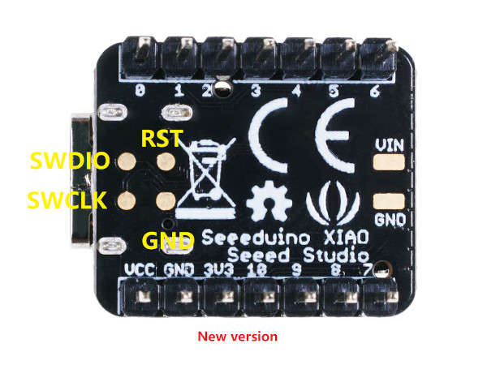

.. _seeed_xiao_samd21:

Seeed Studio XIAO SAMD21 (Seeeduino XIAO)
#########################################

.. admonition:: Downstream Copy!
   :class: note

   This board description is a copy from Zephyr with a slightly changed name
   and will be used for further development, improvement and preparation of
   changes for Zephyr within Bridle.  However, the original board description
   still lives within the Zephyr namespace under the original board name:
   :ref:`zephyr:seeeduino_xiao`.

Overview
********

The Seeed Studio XIAO SAMD21 (Seeeduino XIAO) is a tiny (20 mm x 17.5 mm)
ARM development board with onboard LEDs, USB port, and range of digital
or analog I/O broken out onto 14 pins.

.. image:: img/seeed_xiao_samd21.jpg
     :align: center
     :alt: Seeed Studio XIAO SAMD21 (Seeeduino XIAO)

Hardware
********

- `ATSAMD21G18A`_ ARM Cortex-M0+ processor at 48 MHz
- 32.768 kHz crystal oscillator
- 256 KiB flash memory and 32 KiB of RAM
- 3 user LEDs (L/Rx/Tx)
- One reset pad (solderable), beside an free GND pad
- |Seeed XIAO| header
- Native USB port

Supported Features
==================

The :code:`seeed_xiao_samd21` board configuration supports the following
hardware features:

+-----------+------------+------------------------------------------+
| Interface | Controller | Driver/Component                         |
+===========+============+==========================================+
| DMA       | on-chip    | Direct memory access                     |
+-----------+------------+------------------------------------------+
| Flash     | on-chip    | Can be used with LittleFS to store files |
+-----------+------------+------------------------------------------+
| GPIO      | on-chip    | I/O ports                                |
+-----------+------------+------------------------------------------+
| HWINFO    | on-chip    | Hardware info                            |
+-----------+------------+------------------------------------------+
| I2C       | on-chip    | Inter-Integrated Circuit                 |
+-----------+------------+------------------------------------------+
| NVIC      | on-chip    | nested vector interrupt controller       |
+-----------+------------+------------------------------------------+
| PWM       | on-chip    | Pulse Width Modulation                   |
+-----------+------------+------------------------------------------+
| SPI       | on-chip    | Serial Peripheral Interface ports        |
+-----------+------------+------------------------------------------+
| SYSTICK   | on-chip    | systick                                  |
+-----------+------------+------------------------------------------+
| USART     | on-chip    | Serial ports                             |
+-----------+------------+------------------------------------------+
| USB       | on-chip    | USB device                               |
+-----------+------------+------------------------------------------+
| WDT       | on-chip    | Watchdog                                 |
+-----------+------------+------------------------------------------+

Other hardware features are not currently supported by Zephyr.

The default configuration can be found in the Kconfig file
:bridle_file:`boards/arm/seeed_xiao_samd21/seeed_xiao_samd21_defconfig`.

Board Revisions
===============

The :code:`seeed_xiao_samd21` board can be configured for the following
revisions. These are not really specific hardware revisions, rather than
specific configurations for different use cases.

.. rubric:: :code:`seeed_xiao_samd21@uartcons`

Use the serial port SERCOM5 over |Seeed XIAO| header as Zephyr console
and for the shell.

.. rubric:: :code:`seeed_xiao_samd21@usbcons`

Use the native USB device port with CDC-ACM as Zephyr console
and for the shell.

Connections and IOs
===================

The `Seeed Studio XIAO SAMD21 wiki`_ has detailed information about the board
including `pinouts`_ and the `schematic`_. There are also
`Seeed Studio XIAO SAMD21 Design Data for Eagle`_ and
`Seeed Studio XIAO SAMD21 Design Data for KiCAD`_.

System Clock
============

The SAMD21 MCU is configured to use the 32.768 kHz external crystal with the
on-chip PLL generating the 48 MHz system clock.  The internal APB and GCLK unit
are set up in the same way as the upstream Arduino libraries.

GPIO (PWM) Ports
================

The SAMD21 MCU has 2 GPIO ports, 3 PWM able Timer/Capture-Counter (TCC) and
2 simple Timer/Counter (TC).  On the Seeed Studio XIAO SAMD21, TCC2 channel 1
is available on first user LED (L), all other user LEDs can be controlled
as GPIO.  Only if :kconfig:option:`CONFIG_PWM_SAM0_TCC` is enabled then the
first user LED (L) is driven by TCC2 instead of by GPIO.  All channels of
TCC0 and TCC1 are available on the |Seeed XIAO| header.

SPI Port
========

The SAMD21 MCU has 6 SERCOM based SPIs.  On the Seeed Studio XIAO SAMD21,
SERCOM0 can be put into SPI mode and used to connect to devices over the
|Seeed XIAO| header pin 9 (MISO), pin 10 (MOSI), and pin 8 (SCK).

I2C Port
========

The SAMD21 MCU has 6 SERCOM based USARTs. On the Seeed Studio XIAO SAMD21,
SERCOM2 is available on the |Seeed XIAO| header pin 4 (SDA) and pin 5 (SCL).

Serial Port
===========

The SAMD21 MCU has 6 SERCOM based USARTs.  On the Seeed Studio XIAO SAMD21,
SERCOM4 is the Zephyr console and is available on the |Seeed XIAO| header
pins 7 (RX) and 6 (TX).  This is captured by the standard board revision
``uartcons``.

USB Device Port
===============

The SAMD21 MCU has a (native) USB device port that can be used to communicate
with a host PC.  See the :ref:`usb-samples` sample applications for more, such
as the :ref:`usb_cdc-acm` sample which sets up a virtual serial port that echos
characters back to the host PC.  As an alternative to the default Zephyr console
on serial port the special board revision ``usbcons`` can be used to enable
:ref:`usb_device_cdc_acm` and switch the console to USB::

   USB device idVendor=2886, idProduct=802f, bcdDevice= 3.03
   USB device strings: Mfr=1, Product=2, SerialNumber=3
   Product: Seeeduino XIAO (CDC ACM)
   Manufacturer: Seeed Studio
   SerialNumber: AC3FB5052F48A3F7

Programming and Debugging
*************************

The Seeed Studio XIAO SAMD21 ships the BOSSA compatible `UF2 bootloader`_ also
known as `Arduino Zero Bootloader`_, a modern `SAM-BA`_ (Boot Assistant)
replacement.  The bootloader can be entered by shorting the RST and GND pads
twice::

   USB device idVendor=2886, idProduct=002f, bcdDevice=42.01
   USB device strings: Mfr=1, Product=2, SerialNumber=3
   Product: Seeeduino XIAO
   Manufacturer: Seeed Studio
   SerialNumber: 2601F57F2E175D24AC3FB5052F48A3F7

Additionally, if :kconfig:option:`CONFIG_USB_CDC_ACM` is enabled then the
bootloader will be entered automatically when you run :code:`west flash`.

.. tip::

   When ever you need to restore this original bootloader you should read
   and following the directions in `Flashing the Arduino Bootloader using
   DAP Link`_.
   There is also a backup copy of the original bootloader together with
   a ready to use Segger JFlash control file inside the Bridel project:

   * :bridle_file:`boards/arm/seeed_xiao_samd21/doc/bootloader/samd21_sam_ba.hex`
   * :bridle_file:`boards/arm/seeed_xiao_samd21/doc/bootloader/samd21_sam_ba.jflash`

There are also SWD pads on board (PCB bottom side) which have to be
used with tools like Segger J-Link for programming for bootloader restore
or direct programming and debugging.

Flashing
========

#. Build the Zephyr kernel and the :ref:`hello_world` sample application:

   .. zephyr-app-commands::
      :zephyr-app: samples/hello_world
      :board: seeed_xiao_samd21
      :goals: build
      :compact:

#. Connect the Seeed Studio XIAO SAMD21 to your host computer using USB.

#. Connect a 3.3 V USB to serial adapter to the board and to the
   host.  See the `Serial Port`_ section above for the board's pin
   connections.

#. Run your favorite terminal program to listen for output. Under Linux the
   terminal should be :code:`/dev/ttyUSB0`. For example:

   .. code-block:: console

      $ minicom -D /dev/ttyUSB0 -o

   The -o option tells minicom not to send the modem initialization
   string. Connection should be configured as follows:

   - Speed: 115200
   - Data: 8 bits
   - Parity: None
   - Stop bits: 1

#. Short the RST and GND pads twice quickly to enter bootloader mode.

#. Flash the image:

   .. zephyr-app-commands::
      :zephyr-app: samples/hello_world
      :board: seeed_xiao_samd21
      :goals: flash
      :compact:

   You should see "Hello World! seeed_xiao_samd21" in your terminal.

Debugging
=========

**Debugging is only possible over SWD!**

#. Do the for the debug session necessary steps as before except
   enter the bootloader mode and the flashing.

#. Connect the Segger J-Link to the SWD header (J10).

#. Flash the image and attach a debugger to your board:

   .. zephyr-app-commands::
      :app: zephyr/samples/hello_world
      :board: seeed_xiao_samd21
      :gen-args: -DCONFIG_BUILD_OUTPUT_HEX=y -DBOARD_FLASH_RUNNER=openocd
      :goals: debug
      :compact:

   You should ends up in a debug console (e.g. a GDB session).

References
**********

.. target-notes::

.. _Seeed Studio XIAO SAMD21 wiki:
    https://wiki.seeedstudio.com/Seeeduino-XIAO/

.. _pinouts:
    https://wiki.seeedstudio.com/Seeeduino-XIAO/#hardware-overview

.. _schematic:
    https://wiki.seeedstudio.com/Seeeduino-XIAO/#resourses

.. _Seeed Studio XIAO SAMD21 Design Data for Eagle:
   https://files.seeedstudio.com/wiki/Seeeduino-XIAO/res/Seeeduino-XIAO-v1.0.zip

.. _Seeed Studio XIAO SAMD21 Design Data for KiCAD:
   https://files.seeedstudio.com/wiki/Seeeduino-XIAO/res/Seeeduino-XIAO-KICAD.zip

.. _ATSAMD21G18A:
    https://www.microchip.com/product/ATSAMD21G18

.. _UF2 bootloader:
    https://github.com/Microsoft/uf2#bootloaders

.. _Arduino Zero Bootloader:
    https://github.com/Seeed-Studio/ArduinoCore-samd/tree/master/bootloaders/XIAOM0

.. _Flashing the Arduino Bootloader using DAP Link:
    https://wiki.seeedstudio.com/Flashing-Arduino-Bootloader-DAPLink/

.. _SAM-BA:
    https://microchipdeveloper.com/atstart:sam-d21-bootloader

.. |Seeed XIAO| replace::
   :dtcompatible:`Seeed XIAO <seeed,xiao-gpio>`
