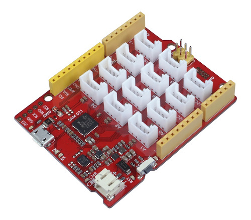
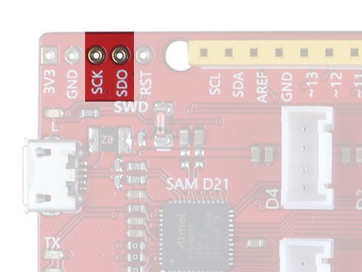

.. _seeeduino_lotus:

Seeeduino Lotus Cortex-M0+
##########################

Overview
********

The Seeeduino Lotus Cortex-M0+ is an Arduino form factor development board
based on an Atmel SAMD21 ARM with onboard LEDs, USB port, and range of 14
digital I/O (10 of which support PWM) and 6 analog I/O broken out onto
|Arduino UNO R3| header and multiple |Grove connectors|.

Hardware
********

- `ATSAMD21G18A`_ ARM Cortex-M0+ processor at 48 MHz
- 32.768 kHz crystal oscillator
- 256 KiB flash memory and 32 KiB of RAM
- 3 user LEDs (blue/Rx/Tx)
- One reset button
- Native USB port
- 12 |Grove connectors|
- |Arduino UNO R3| header
- Arduino ICSP header
- `MP2617B`_, switching battery charger (max. 2A)
- JST2.0 Li-Po battery connector

Supported Features
==================

The :code:`seeeduino_lotus` board configuration supports the following
hardware features:

+-----------+------------+------------------------------------------+
| Interface | Controller | Driver/Component                         |
+===========+============+==========================================+
| ADC       | on-chip    | Analogue to digital converter            |
+-----------+------------+------------------------------------------+
| DAC       | on-chip    | Digital to analogue converter            |
+-----------+------------+------------------------------------------+
| DMA       | on-chip    | Direct memory access                     |
+-----------+------------+------------------------------------------+
| Flash     | on-chip    | Can be used with LittleFS to store files |
+-----------+------------+------------------------------------------+
| GPIO      | on-chip    | I/O ports                                |
+-----------+------------+------------------------------------------+
| HWINFO    | on-chip    | Hardware info                            |
+-----------+------------+------------------------------------------+
| I2C       | on-chip    | Inter-Integrated Circuit                 |
+-----------+------------+------------------------------------------+
| NVIC      | on-chip    | nested vector interrupt controller       |
+-----------+------------+------------------------------------------+
| PWM       | on-chip    | Pulse Width Modulation                   |
+-----------+------------+------------------------------------------+
| SPI       | on-chip    | Serial Peripheral Interface ports        |
+-----------+------------+------------------------------------------+
| SYSTICK   | on-chip    | systick                                  |
+-----------+------------+------------------------------------------+
| USART     | on-chip    | Serial ports                             |
+-----------+------------+------------------------------------------+
| USB       | on-chip    | USB device                               |
+-----------+------------+------------------------------------------+
| WDT       | on-chip    | Watchdog                                 |
+-----------+------------+------------------------------------------+

Other hardware features are not currently supported by Zephyr.

The default configuration can be found in the Kconfig file
:bridle_file:`boards/arm/seeeduino_lotus/seeeduino_lotus_defconfig`.

Board Configurations
====================

The :code:`seeeduino_lotus` board can be configured for the following different
use cases.

.. rubric:: :command:`west build -b seeeduino_lotus`

Use the serial port SERCOM2 as Zephyr console and for the shell.

.. rubric:: :command:`west build -b seeeduino_lotus -S usb-console`

Use the USB device port with CDC-ACM as Zephyr console and for the shell.

Connections and IOs
===================

The `Seeeduino Lotus Cortex-M0+ wiki`_ has detailed information about
the board including `pinouts`_ and the `schematic`_.

.. _seeeduino_lotus_grove_if:

Laced Grove Signal Interface
----------------------------

In addition to the |Arduino UNO R3| header, there are also 12 |Grove connectors|.
These are provided by a specific interface for general signal mapping, the
|Laced Grove Signal Interface|.

Following mappings are well known:

* ``grove_gpios``: GPIO mapping
* ``grove_pwms``: PWM mapping

.. tabs::

   .. group-tab:: GPIO mapping ``grove_gpios``

      This is the **GPIO signal line mapping** from the `Arduino Uno R3`_
      header bindet with :dtcompatible:`arduino-header-r3` to the set of
      |Grove connectors| provided as |Laced Grove Signal Interface|.

      +-----------------------------+-------------------------+--------------------------------+
      | phandle index to shield --> | **Signal** : *Meaning*  |   ``seeeduino_lotus``          |
      +=============================+=========================+================================+
      | ``<&grove_gpios 0 …>``      | **D0:** *UART-RX*       | | ``<&grove_uart_header 0 …>`` |
      |                             | (SERCOM5)               | | ↳                            |
      +-----------------------------+-------------------------+--------------------------------+
      | ``<&grove_gpios 1 …>``      | **D1:** *UART-TX*       | | ``<&grove_uart_header 1 …>`` |
      |                             | (SERCOM5)               | | ↳                            |
      +-----------------------------+-------------------------+--------------------------------+
      | ``<&grove_gpios 2 …>``      | **D2**                  | | ``<&grove_d2_header 0 …>``   |
      |                             |                         | | ↳ ``<&arduino_header 8 …>``  |
      +-----------------------------+-------------------------+--------------------------------+
      | ``<&grove_gpios 3 …>``      | **D3**                  | | ``<&grove_d3_header 0 …>``,  |
      |                             |                         | | ``<&grove_d2_header 1 …>``   |
      |                             |                         | | ↳ ``<&arduino_header 9 …>``  |
      +-----------------------------+-------------------------+--------------------------------+
      | ``<&grove_gpios 4 …>``      | **D4**                  | | ``<&grove_d4_header 0 …>``,  |
      |                             |                         | | ``<&grove_d3_header 1 …>``   |
      |                             |                         | | ↳ ``<&arduino_header 10 …>`` |
      +-----------------------------+-------------------------+--------------------------------+
      | ``<&grove_gpios 5 …>``      | **D5**                  | | ``<&grove_d5_header 0 …>``,  |
      |                             |                         | | ``<&grove_d4_header 1 …>``   |
      |                             |                         | | ↳ ``<&arduino_header 11 …>`` |
      +-----------------------------+-------------------------+--------------------------------+
      | ``<&grove_gpios 6 …>``      | **D6**                  | | ``<&grove_d6_header 0 …>``,  |
      |                             |                         | | ``<&grove_d5_header 1 …>``   |
      |                             |                         | | ↳ ``<&arduino_header 12 …>`` |
      +-----------------------------+-------------------------+--------------------------------+
      | ``<&grove_gpios 7 …>``      | **D7**                  | | ``<&grove_d7_header 0 …>``,  |
      |                             |                         | | ``<&grove_d6_header 1 …>``   |
      |                             |                         | | ↳ ``<&arduino_header 13 …>`` |
      +-----------------------------+-------------------------+--------------------------------+
      | ``<&grove_gpios 8 …>``      | **D8**                  | | ``<&grove_d7_header 1 …>``,  |
      |                             |                         | | ↳ ``<&arduino_header 14 …>`` |
      +-----------------------------+-------------------------+--------------------------------+
      | ``<&grove_gpios 9 …>``      | **D9**                  |   **not wired**                |
      +-----------------------------+-------------------------+--------------------------------+
      | ``<&grove_gpios 10 …>``     | **D10:** *SPI-CS*       |   **not wired**                |
      +-----------------------------+-------------------------+--------------------------------+
      | ``<&grove_gpios 11 …>``     | **D11:** *SPI-MOSI*     |   **not wired**                |
      +-----------------------------+-------------------------+--------------------------------+
      | ``<&grove_gpios 12 …>``     | **D12:** *SPI-MISO*     |   **not wired**                |
      +-----------------------------+-------------------------+--------------------------------+
      | ``<&grove_gpios 13 …>``     | **D13:** *SPI-CLK*      |   **not wired**                |
      +-----------------------------+-------------------------+--------------------------------+
      | ``<&grove_gpios 14 …>``     | **D14:** *A0* as GPIO   | | ``<&grove_a0_header 0 …>``   |
      |                             |                         | | ↳ ``<&arduino_header 0 …>``  |
      +-----------------------------+-------------------------+--------------------------------+
      | ``<&grove_gpios 15 …>``     | **D15:** *A1* as GPIO   | | ``<&grove_a1_header 0 …>``,  |
      |                             |                         | | ``<&grove_a0_header 1 …>``   |
      |                             |                         | | ↳ ``<&arduino_header 1 …>``  |
      +-----------------------------+-------------------------+--------------------------------+
      | ``<&grove_gpios 16 …>``     | **D16:** *A2* as GPIO   | | ``<&grove_a2_header 0 …>``,  |
      |                             |                         | | ``<&grove_a1_header 1 …>``   |
      |                             |                         | | ↳ ``<&arduino_header 2 …>``  |
      +-----------------------------+-------------------------+--------------------------------+
      | ``<&grove_gpios 17 …>``     | **D17:** *A3* as GPIO   | | ``<&grove_a2_header 1 …>``,  |
      |                             |                         | | ↳ ``<&arduino_header 3 …>``  |
      +-----------------------------+-------------------------+--------------------------------+
      | ``<&grove_gpios 18 …>``     | **D18:** *I2C-SDA*      | | ``<&grove_i2c_header 1 …>``, |
      |                             |                         | | ↳ ``<&arduino_header 20 …>`` |
      +-----------------------------+-------------------------+--------------------------------+
      | ``<&grove_gpios 19 …>``     | **D19:** *I2C-SCL*      | | ``<&grove_i2c_header 0 …>``  |
      |                             |                         | | ↳ ``<&arduino_header 21 …>`` |
      +-----------------------------+-------------------------+--------------------------------+
      | ``<&grove_gpios 20 …>``     | **D20:** *ADC6* as GPIO |   **not wired**                |
      +-----------------------------+-------------------------+--------------------------------+
      | ``<&grove_gpios 21 …>``     |                         |                                |
      +-----------------------------+-------------------------+--------------------------------+
      | ``<&grove_gpios 22 …>``     |                         |                                |
      +-----------------------------+-------------------------+--------------------------------+
      | ``<&grove_gpios 23 …>``     |                         |                                |
      +-----------------------------+-------------------------+--------------------------------+
      | ``<&grove_gpios 24 …>``     |                         |                                |
      +-----------------------------+-------------------------+--------------------------------+
      | ``<&grove_gpios 25 …>``     |                         |                                |
      +-----------------------------+-------------------------+--------------------------------+
      | ``<&grove_gpios 26 …>``     |                         |                                |
      +-----------------------------+-------------------------+--------------------------------+
      | ``<&grove_gpios 27 …>``     |                         |                                |
      +-----------------------------+-------------------------+--------------------------------+
      | ``<&grove_gpios 28 …>``     |                         |                                |
      +-----------------------------+-------------------------+--------------------------------+
      | ``<&grove_gpios 29 …>``     |                         |                                |
      +-----------------------------+-------------------------+--------------------------------+
      | ``<&grove_gpios 30 …>``     |                         |                                |
      +-----------------------------+-------------------------+--------------------------------+
      | ``<&grove_gpios 31 …>``     |                         |                                |
      +-----------------------------+-------------------------+--------------------------------+

   .. group-tab:: PWM mapping ``grove_pwms``

      The corresponding mapping is always board or SOC specific. In addition
      to the **PWM signal line mapping**, the valid references to the PWM
      function units in the SOC or on the board are therefore also defined
      as **Grove PWM Labels**. The following table reflects the currently
      supported mapping for :code:`seeeduino_lotus`, but this list will be
      growing up with further development and maintenance.

      **This list must not be complete!**

      +--------------------+-----------------------------+-------------------------+-------------------------+
      | Grove PWM Label    | phandle index to shield --> | **Signal** : *Meaning*  | ``seeeduino_lotus``     |
      +====================+=============================+=========================+=========================+
      |                    | ``<&grove_pwms 0 …>``       | **D0:** *UART-RX*       | **not possible**        |
      +--------------------+-----------------------------+-------------------------+-------------------------+
      |                    | ``<&grove_pwms 1 …>``       | **D1:** *UART-TX*       | **not possible**        |
      +--------------------+-----------------------------+-------------------------+-------------------------+
      | ``&grove_pwm_d2``  | ``<&grove_pwms 2 …>``       | **D2**                  | ``<&tcc0 0 …>`` (WO4)   |
      +--------------------+-----------------------------+-------------------------+-------------------------+
      | ``&grove_pwm_d3``  | ``<&grove_pwms 3 …>``       | **D3**                  | ``<&tcc0 1 …>`` (WO1)   |
      +--------------------+-----------------------------+-------------------------+-------------------------+
      | ``&grove_pwm_d4``  | ``<&grove_pwms 4 …>``       | **D4**                  | ``<&tcc0 0 …>`` (WO0)   |
      +--------------------+-----------------------------+-------------------------+-------------------------+
      | ``&grove_pwm_d5``  | ``<&grove_pwms 5 …>``       | **D5**                  | ``<&tcc0 1 …>`` (WO5)   |
      +--------------------+-----------------------------+-------------------------+-------------------------+
      | ``&grove_pwm_d6``  | ``<&grove_pwms 6 …>``       | **D6**                  | ``<&tcc0 2 …>`` (WO6)   |
      +--------------------+-----------------------------+-------------------------+-------------------------+
      | ``&grove_pwm_d7``  | ``<&grove_pwms 7 …>``       | **D7**                  | ``<&tcc0 3 …>`` (WO7)   |
      +--------------------+-----------------------------+-------------------------+-------------------------+
      | ``&grove_pwm_d8``  | ``<&grove_pwms 8 …>``       | **D8**                  | ``<&tcc1 0 …>`` (WO0)   |
      +--------------------+-----------------------------+-------------------------+-------------------------+
      |                    | ``<&grove_pwms 9 …>``       | **D9**                  | **not wired**           |
      +--------------------+-----------------------------+-------------------------+-------------------------+
      |                    | ``<&grove_pwms 10 …>``      | **D10:** *SPI-CS*       | **not wired**           |
      +--------------------+-----------------------------+-------------------------+-------------------------+
      |                    | ``<&grove_pwms 11 …>``      | **D11:** *SPI-MOSI*     | **not wired**           |
      +--------------------+-----------------------------+-------------------------+-------------------------+
      |                    | ``<&grove_pwms 12 …>``      | **D12:** *SPI-MISO*     | **not wired**           |
      +--------------------+-----------------------------+-------------------------+-------------------------+
      |                    | ``<&grove_pwms 13 …>``      | **D13:** *SPI-CLK*      | **not wired**           |
      +--------------------+-----------------------------+-------------------------+-------------------------+
      |                    | ``<&grove_pwms 14 …>``      | **D14:** *A0*           | **not possible**        |
      +--------------------+-----------------------------+-------------------------+-------------------------+
      |                    | ``<&grove_pwms 15 …>``      | **D15:** *A1*           | **not possible**        |
      +--------------------+-----------------------------+-------------------------+-------------------------+
      |                    | ``<&grove_pwms 16 …>``      | **D16:** *A2*           | **not possible**        |
      +--------------------+-----------------------------+-------------------------+-------------------------+
      |                    | ``<&grove_pwms 17 …>``      | **D17:** *A3*           | **not possible**        |
      +--------------------+-----------------------------+-------------------------+-------------------------+
      | ``&grove_pwm_d18`` | ``<&grove_pwms 18 …>``      | **D18:** *I2C-SDA*      | ``<&tcc0 0 …>`` (WO4)   |
      +--------------------+-----------------------------+-------------------------+-------------------------+
      | ``&grove_pwm_d19`` | ``<&grove_pwms 19 …>``      | **D19:** *I2C-SCL*      | ``<&tcc0 1 …>`` (WO5)   |
      +--------------------+-----------------------------+-------------------------+-------------------------+
      |                    | ``<&grove_pwms 20 …>``      | **D20:** *ADC6*         | **not wired**           |
      +--------------------+-----------------------------+-------------------------+-------------------------+
      |                    | ``<&grove_pwms 21 …>``      |                         |                         |
      +--------------------+-----------------------------+-------------------------+-------------------------+
      |                    | ``<&grove_pwms 22 …>``      |                         |                         |
      +--------------------+-----------------------------+-------------------------+-------------------------+
      |                    | ``<&grove_pwms 23 …>``      |                         |                         |
      +--------------------+-----------------------------+-------------------------+-------------------------+
      |                    | ``<&grove_pwms 24 …>``      |                         |                         |
      +--------------------+-----------------------------+-------------------------+-------------------------+
      |                    | ``<&grove_pwms 25 …>``      |                         |                         |
      +--------------------+-----------------------------+-------------------------+-------------------------+
      |                    | ``<&grove_pwms 26 …>``      |                         |                         |
      +--------------------+-----------------------------+-------------------------+-------------------------+
      |                    | ``<&grove_pwms 27 …>``      |                         |                         |
      +--------------------+-----------------------------+-------------------------+-------------------------+
      |                    | ``<&grove_pwms 28 …>``      |                         |                         |
      +--------------------+-----------------------------+-------------------------+-------------------------+
      |                    | ``<&grove_pwms 29 …>``      |                         |                         |
      +--------------------+-----------------------------+-------------------------+-------------------------+
      |                    | ``<&grove_pwms 30 …>``      |                         |                         |
      +--------------------+-----------------------------+-------------------------+-------------------------+
      |                    | ``<&grove_pwms 31 …>``      |                         |                         |
      +--------------------+-----------------------------+-------------------------+-------------------------+

System Clock
============

The SAMD21 MCU is configured to use the 32 kHz external crystal with
the on-chip PLL generating the 48 MHz system clock. The internal APB
and GCLK unit are set up in the same way as the upstream Arduino
libraries.

GPIO (PWM) Ports
================

The SAMD21 MCU has 2 GPIO ports, 3 PWM able Timer/Capture-Counter (TCC) and
2 simple Timer/Counter (TC). On the Lotus Cortex-M0+, TCC2 channel 1 is
available on first user LED (blue), all other user LEDs can be controlled
as GPIO. Only if :kconfig:option:`CONFIG_PWM_SAM0_TCC` is enabled then the
first user LED (blue) is driven by TCC2 instead of by GPIO. All channels of
TCC0 are available on the |Arduino UNO R3| header and the |Grove connectors|
(see above, :ref:`seeeduino_lotus_grove_if`).

ADC/DAC Ports
=============

The SAMD21 MCU has 1 DAC and 1 ADC. On the Lotus Cortex-M0+, the DAC voltage
output (VOUT) is available on A0 of the |Arduino UNO R3| header. The ADC
channels 2-5 and 10 are available on A1-A5 of the |Arduino UNO R3| header.

The external voltage reference VREFA can be used optional for the DAC and
ADC on same time and is available on AREF of the |Arduino UNO R3| header.

SPI Port
========

The SAMD21 MCU has 6 SERCOM based SPIs. On the Lotus Cortex-M0+, SERCOM1
can be put into SPI mode and used to connect to devices over D11 (MOSI),
D12 (MISO), and D13 (SCK) of the |Arduino UNO R3| header.

I2C Port
========

The SAMD21 MCU has 6 SERCOM based I2Cs. On the Lotus Cortex-M0+, SERCOM3
is available on D18 (SDA) and D19 (SCL) of the |Arduino UNO R3| header and
on pin 1 (SCL) and pin 2 (SDA) of the two Grove I2C connectors.

Serial Port
===========

The SAMD21 MCU has 6 SERCOM based USARTs. On the Lotus Cortex-M0+, SERCOM2
is available on D0 (RX) and D1 (TX) of the |Arduino UNO R3| header and is the
Zephyr console. SERCOM5 is available on pin 1 (RX) and pin 2 (TX) of the Grove
UART connector and is an optional second serial port for applications.

USB Device Port
===============

The SAMD21 MCU has a (native) USB device port that can be used to communicate
with a host PC. See the :ref:`zephyr:usb-samples` sample applications for more,
such as the :doc:`zephyr:samples/subsys/usb/cdc_acm/README` sample which sets
up a virtual serial port that echos characters back to the host PC. As an
alternative to the default Zephyr console on serial port the Bridle
:ref:`snippet-usb-console` can be used to enable
:ref:`zephyr:usb_device_cdc_acm` and switch the console to USB::

   USB device idVendor=2886, idProduct=8026, bcdDevice= 3.05
   USB device strings: Mfr=1, Product=2, SerialNumber=3
   Product: Seeeduino Lotus Cortex-M0+ (CDC ACM)
   Manufacturer: Seeed LLC
   SerialNumber: 9973734CA4207846

Programming and Debugging
*************************

The Lotus Cortex-M0+ ships the BOSSA compatible `UF2 bootloader`_ also known as
`Arduino Zero Bootloader`_, a modern `SAM-BA`_ (Boot Assistant) replacement.
The bootloader can be entered by pressing the RST button twice::

   USB device idVendor=2886, idProduct=0026, bcdDevice= 2.00
   USB device strings: Mfr=1, Product=2, SerialNumber=0
   Product: Seeeduino_lotus
   Manufacturer: Arduino LLC

Additionally, if :kconfig:option:`CONFIG_USB_CDC_ACM` is enabled then the
bootloader will be entered automatically when you run :program:`west flash`.

.. tip::

   When ever you need to restore this original bootloader you should read
   and following the directions in `Flashing the Arduino Bootloader using
   DAP Link`_.
   There is also a backup copy of the original bootloader together with
   a ready to use Segger JFlash control file inside the Bridel project:

   * :bridle_file:`boards/arm/seeeduino_lotus/doc/bootloader/samd21_sam_ba.hex`
   * :bridle_file:`boards/arm/seeeduino_lotus/doc/bootloader/samd21_sam_ba.jflash`

There is also a SWD header (J10, not populated) on board which have to be
used with tools like Segger J-Link for programming for bootloader restore
or direct programming and debugging.

Flashing
========

#. Build the Zephyr kernel and the :ref:`zephyr:hello_world` sample application:

   .. zephyr-app-commands::
      :app: zephyr/samples/hello_world
      :board: seeeduino_lotus
      :build-dir: seeeduino_lotus
      :west-args: -p
      :goals: build
      :compact:

#. Connect the Lotus Cortex-M0+ to your host computer using USB.

#. Connect a 3.3 V USB to serial adapter to the board and to the
   host. See the `Serial Port`_ section above for the board's pin
   connections.

#. Run your favorite terminal program to listen for output. Under Linux the
   terminal should be :code:`/dev/ttyUSB0`. For example:

   .. code-block:: console

      minicom -D /dev/ttyUSB0 -o

   The -o option tells minicom not to send the modem initialization
   string. Connection should be configured as follows:

   - Speed: 115200
   - Data: 8 bits
   - Parity: None
   - Stop bits: 1

#. Pressing the RST button twice quickly to enter bootloader mode.

#. Flash the image:

   .. code-block:: bash

      west flash -d build/seeeduino_lotus

   You should see "Hello World! seeeduino_lotus" in your terminal.

Debugging
=========

**Debugging is only possible over SWD!**

#. Do the for the debug session necessary steps as before except
   enter the bootloader mode and the flashing.

#. Connect the Segger J-Link to the SWD header (J10).

#. Flash the image and attach a debugger to your board:

   .. zephyr-app-commands::
      :app: zephyr/samples/hello_world
      :board: seeeduino_lotus
      :build-dir: seeeduino_lotus
      :gen-args: -DBOARD_FLASH_RUNNER=openocd
      :west-args: -p
      :goals: debug
      :compact:

   You should ends up in a debug console (e.g. a GDB session).

More Samples
************

LED Blinky
==========

.. zephyr-app-commands::
   :app: zephyr/samples/basic/blinky
   :board: seeeduino_lotus
   :build-dir: seeeduino_lotus
   :west-args: -p
   :goals: flash
   :compact:

LED Fade
========

.. zephyr-app-commands::
   :app: zephyr/samples/basic/fade_led
   :board: seeeduino_lotus
   :build-dir: seeeduino_lotus
   :west-args: -p
   :goals: flash
   :compact:

Basic Threads
=============

.. zephyr-app-commands::
   :app: zephyr/samples/basic/threads
   :board: seeeduino_lotus
   :build-dir: seeeduino_lotus
   :west-args: -p
   :goals: flash
   :compact:

Hello Shell with USB-CDC/ACM Console
====================================

.. zephyr-app-commands::
   :app: bridle/samples/helloshell
   :board: seeeduino_lotus
   :build-dir: seeeduino_lotus
   :west-args: -p -S usb-console
   :goals: flash
   :compact:

.. rubric:: Simple test execution on target

.. tabs::

   .. group-tab:: Basics

      .. code-block:: console

         uart:~$ hello -h
         hello - say hello
         uart:~$ hello
         Hello from shell.

         uart:~$ hwinfo devid
         Length: 16
         ID: 0xefa3ee60dfcb11ed9973734ca4207846

         uart:~$ kernel version
         Zephyr version 3.5.0

         uart:~$ bridle version
         Bridle version 3.5.0

         uart:~$ bridle version long
         Bridle version 3.5.0.0

         uart:~$ bridle info
         Zephyr: 3.5.0
         Bridle: 3.5.0

         uart:~$ device list
         devices:
         - eic@40001800 (READY)
         - gpio@41004480 (READY)
         - gpio@41004400 (READY)
         - snippet_cdc_acm_console_uart (READY)
         - sercom@42001c00 (READY)
         - sercom@42001000 (READY)
         - tc@42003800 (DISABLED)
         - tc@42003000 (DISABLED)
         - adc@42004000 (READY)
         - dac@42004800 (READY)
         - nvmctrl@41004000 (READY)
         - sercom@42001400 (READY)
         - tcc@42002800 (READY)
         - tcc@42002000 (READY)

         uart:~$ history
         [  0] history
         [  1] device list
         [  2] bridle info
         [  3] bridle version long
         [  4] bridle version
         [  5] kernel version
         [  6] hwinfo devid
         [  7] hello
         [  8] hello -h

   .. group-tab:: GPIO

      Operate with the red Rx user LED:

      .. code-block:: console

         uart:~$ gpio get gpio@41004480 3
         Reading gpio@41004480 pin 3
         Value 0

         uart:~$ gpio conf gpio@41004480 3 out
         Configuring gpio@41004480 pin 3

         uart:~$ gpio set gpio@41004480 3 1
         Writing to gpio@41004480 pin 3

         uart:~$ gpio set gpio@41004480 3 0
         Writing to gpio@41004480 pin 3

         uart:~$ gpio blink gpio@41004480 3
         Blinking port gpio@41004480 index 3. Hit any key to exit

   .. group-tab:: PWM

      Operate with the blue user LED:

      .. code-block:: console

         uart:~$ pwm usec tcc@42002800 1 20000 20000
         uart:~$ pwm usec tcc@42002800 1 20000 19000
         uart:~$ pwm usec tcc@42002800 1 20000 18000
         uart:~$ pwm usec tcc@42002800 1 20000 17000
         uart:~$ pwm usec tcc@42002800 1 20000 16000
         uart:~$ pwm usec tcc@42002800 1 20000 15000
         uart:~$ pwm usec tcc@42002800 1 20000 10000
         uart:~$ pwm usec tcc@42002800 1 20000 5000
         uart:~$ pwm usec tcc@42002800 1 20000 2500
         uart:~$ pwm usec tcc@42002800 1 20000 500
         uart:~$ pwm usec tcc@42002800 1 20000 0

   .. group-tab:: DAC/ADC

      Operate with the loop-back wire from A0 (DAC CH0 VOUT)
      to A1 (ADC CH2 AIN):

     .. code-block:: console

        uart:~$ dac setup dac@42004800 0 10
        uart:~$ adc adc@42004000 resolution 12
        uart:~$ adc adc@42004000 acq_time 10 us
        uart:~$ adc adc@42004000 channel positive 2

        uart:~$ dac write_value dac@42004800 0 512
        uart:~$ adc adc@42004000 read 2
        read: 2025

        uart:~$ dac write_value dac@42004800 0 1023
        uart:~$ adc adc@42004000 read 2
        read: 4061

   .. group-tab:: Flash access

      .. code-block:: console

         uart:~$ flash read nvmctrl@41004000 17d34 40
         00017D34: 73 65 65 65 64 75 69 6e  6f 5f 6c 6f 74 75 73 00 |seeeduin o_lotus.|
         00017D44: 48 65 6c 6c 6f 20 57 6f  72 6c 64 21 20 49 27 6d |Hello Wo rld! I'm|
         00017D54: 20 54 48 45 20 53 48 45  4c 4c 20 66 72 6f 6d 20 | THE SHE LL from |
         00017D64: 25 73 0a 00 69 6c 6c 65  67 61 6c 20 6f 70 74 69 |%s..ille gal opti|

         uart:~$ flash read nvmctrl@41004000 3c000 40
         0003C000: ff ff ff ff ff ff ff ff  ff ff ff ff ff ff ff ff |........ ........|
         0003C010: ff ff ff ff ff ff ff ff  ff ff ff ff ff ff ff ff |........ ........|
         0003C020: ff ff ff ff ff ff ff ff  ff ff ff ff ff ff ff ff |........ ........|
         0003C030: ff ff ff ff ff ff ff ff  ff ff ff ff ff ff ff ff |........ ........|

         uart:~$ flash test nvmctrl@41004000 3c000 400 2
         Erase OK.
         Write OK.
         Verified OK.
         Erase OK.
         Write OK.
         Verified OK.
         Erase-Write-Verify test done.

         uart:~$ flash read nvmctrl@41004000 3c000 40
         0003C000: 00 01 02 03 04 05 06 07  08 09 0a 0b 0c 0d 0e 0f |........ ........|
         0003C010: 10 11 12 13 14 15 16 17  18 19 1a 1b 1c 1d 1e 1f |........ ........|
         0003C020: 20 21 22 23 24 25 26 27  28 29 2a 2b 2c 2d 2e 2f | !"#$%&' ()*+,-./|
         0003C030: 30 31 32 33 34 35 36 37  38 39 3a 3b 3c 3d 3e 3f |01234567 89:;<=>?|

         uart:~$ flash page_info 3c000
         Page for address 0x3c000:
         start offset: 0x3c000
         size: 256
         index: 960

         uart:~$ flash erase nvmctrl@41004000 3c000 400
         Erase success.

         uart:~$ flash read nvmctrl@41004000 3c000 40
         0003C000: ff ff ff ff ff ff ff ff  ff ff ff ff ff ff ff ff |........ ........|
         0003C010: ff ff ff ff ff ff ff ff  ff ff ff ff ff ff ff ff |........ ........|
         0003C020: ff ff ff ff ff ff ff ff  ff ff ff ff ff ff ff ff |........ ........|
         0003C030: ff ff ff ff ff ff ff ff  ff ff ff ff ff ff ff ff |........ ........|

   .. group-tab:: I2C

      The Lotus Cortex-M0+ has no on-board I2C devices. For this example the
      |Grove BMP280 Sensor|_ was connected.

      .. code-block:: console

         uart:~$ log enable none i2c_sam0

         uart:~$ i2c scan sercom@42001400
              0  1  2  3  4  5  6  7  8  9  a  b  c  d  e  f
         00:             -- -- -- -- -- -- -- -- -- -- -- --
         10: -- -- -- -- -- -- -- -- -- -- -- -- -- -- -- --
         20: -- -- -- -- -- -- -- -- -- -- -- -- -- -- -- --
         30: -- -- -- -- -- -- -- -- -- -- -- -- -- -- -- --
         40: -- -- -- -- -- -- -- -- -- -- -- -- -- -- -- --
         50: -- -- -- -- -- -- -- -- -- -- -- -- -- -- -- --
         60: -- -- -- -- -- -- -- -- -- -- -- -- -- -- -- --
         70: -- -- -- -- -- -- -- 77
         3 devices found on sercom@42001400

         uart:~$ log enable inf i2c_sam0

      The I2C address ``0x77`` is a Bosch BMP280 Air Pressure Sensor and their
      Chip-ID can read from register ``0xd0``. The Chip-ID must be ``0x58``:

      .. code-block:: console

         uart:~$ i2c read_byte sercom@42001400 77 d0
         Output: 0x58

References
**********

.. target-notes::

.. _Seeeduino Lotus Cortex-M0+ wiki:
    https://wiki.seeedstudio.com/Seeeduino_Lotus_Cortex-M0-/

.. _pinouts:
    https://wiki.seeedstudio.com/Seeeduino_Lotus_Cortex-M0-/#pinout

.. _schematic:
    https://wiki.seeedstudio.com/Seeeduino_Lotus_Cortex-M0-/#resources

.. _ATSAMD21G18A:
    https://www.microchip.com/product/ATSAMD21G18

.. _MP2617B:
    https://www.monolithicpower.com/mp2617b.html

.. _UF2 bootloader:
    https://github.com/Microsoft/uf2#user-content-bootloaders

.. _Arduino Zero Bootloader:
    https://github.com/Seeed-Studio/ArduinoCore-samd/tree/master/bootloaders/seeed_zero

.. _Flashing the Arduino Bootloader using DAP Link:
    https://wiki.seeedstudio.com/Flashing-Arduino-Bootloader-DAPLink/

.. _SAM-BA:
    https://microchipdeveloper.com/atstart:sam-d21-bootloader

.. |Arduino UNO R3| replace::
   :dtcompatible:`Arduino UNO R3 <arduino-header-r3>`

.. |Grove connectors| replace::
   :dtcompatible:`Grove connectors <seeed,grove-connector>`

.. |Laced Grove Signal Interface| replace::
   :dtcompatible:`Laced Grove Signal Interface <seeed,grove-laced-if>`

.. |Grove BMP280 Sensor| replace::
   :strong:`Grove Temperature and Barometer Sensor – BMP280`
.. _`Grove BMP280 Sensor`:
   https://www.seeedstudio.com/Grove-Barometer-Sensor-BMP280.html
