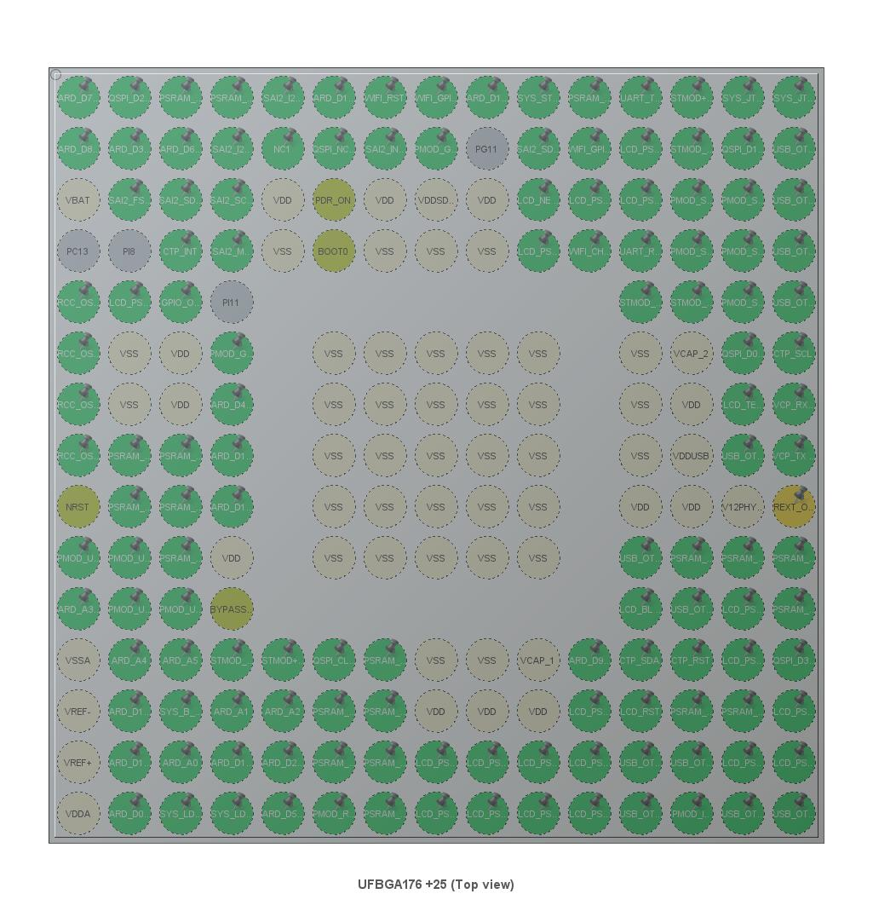

.. _stm32f7308_dk_board:

ST STM32F7308-DK Discovery Kit
##############################

The discovery kit enables a wide diversity of applications taking benefit
from audio, multi-sensor support, graphics, security, video, and high-speed
connectivity features.

Hardware
********

The STM32F7308-DK discovery kit provides the following hardware components:

.. list-table::
   :align: center
   :width: 100%
   :widths: 66, 33

   * - .. rubric:: Features and Resources
     - .. rubric:: Printed Circuit Board (MB1260)

   * - :hwftlbl-vdd:`5V/500㎃`
       :hwftlbl-vdd:`5V(OUT)`
       :hwftlbl-vdd:`3.3V/500㎃`
       :hwftlbl-vdd:`3.3V(OUT)`

       :hwftlbl:`216㎒`
       :hwftlbl:`64㎅ Flash`
       :hwftlbl:`64㎆ QSPI Flash`
       :hwftlbl:`176+16㎅ SRAM`
       :hwftlbl:`1㎆ PSRAM`
       :hwftlbl-dbg:`STLinkV2/SWD`

       :hwftlbl-btn:`RST`
       :hwftlbl-btn:`USR`
       :hwftlbl-led:`USR`
       :hwftlbl-scr:`LCD`
       :hwftlbl:`SAI/SPDIF`
       :hwftlbl:`ST/MEMS`
       :hwftlbl-con:`USB-AB-OTG-HS`
       :hwftlbl-con:`USB-AB-OTG-FS`

       :hwftlbl-con:`Arduino`
       :hwftlbl-con:`ESP-01`
       :hwftlbl-con:`Pmod`
       :hwftlbl-con:`STMod+`
       :hwftlbl-con:`mikroBUS`
       :hwftlbl-con:`Grove UART`
       :hwftlbl-con:`Grove I²C`

       .. rst-class:: rst-columns

       - .. rubric:: STM32F730I8K6 MCU featuring

         - in BGA176 package
         - ARM 32-bit Cortex®-M7 CPU with FPU
         - 216㎒ max. CPU frequency
         - 64㎅ of Flash memory
         - 176+16㎅ of SRAM, 64㎅ DTCM, 16㎅ ITCM
         - 4㎅ of backup SRAM
         - DMA Controller
         - CRC calculation unit
         - True random number generator
         - GPIO with external interrupt capability
         - 12-bit DAC (2) and 12-bit ADC (3)
         - RTC and Advanced-control Timer
         - General Purpose Timers (14)
         - Watchdog Timers (2)
         - USART/UART (8) and CAN (1)
         - I2C (3) and SPI (5)
         - 2xSAI (serial audio interface)

       - .. rubric:: On-board key features

         - 512-Mbit Quad-SPI Flash memory
         - 8-Mbit PSRAM (4-Mbit memory accessible)
         - Two pushbuttons (user and reset)
         - 1.54-inch 240x240 color LCD-TFT with capacitive touch screen
         - SAI audio codec
         - Audio line in and line out jack
         - Four ST MEMS microphones
         - SPDIF RCA input connector
         - USB OTG HS with Micro-AB connectors (on-chip PHY)
         - USB OTG FS with Micro-AB connectors (on-chip full-speed PHY and ULPI)
         - ESP8266 Wi-Fi® 802.11 b/g/n 2.4 GHz module ESP-01

       - .. rubric:: On-board ST LINK/V2-1 supporting

         - USB re-enumeration capability
         - USB functions: virtual COM port, mass storage, debug port

       - .. rubric:: Five power supply options

         - ST LINK/V2-1
         - USB FS connector
         - USB HS connector
         - VIN from Arduino connector (LDO 7-12V/5V)
         - External 5V from connector (not fitted)

       - .. rubric:: Four board expansion connectors

         - Arduino™ Uno R3
         - ESP-01 Wi-Fi® module connector
         - STMod+
         - Pmod™

       - .. rubric:: Five fanout board expansion connectors

         - STMod+ pin header for breadboard
         - ESP-01 Wi-Fi® module connector
         - MikroElektronika mikroBUS™
         - Seeed Studio™ Grove UART
         - Seeed Studio™ Grove I2C

       .. rubric:: Design Data
       .. rst-class:: rst-columns

       - `MB1260 F7308/D02 Schematic`_
       - `STM32F7308-DK User Manual`_

     - .. image:: img/stm32f7308_dk_hardware.jpg
          :align: center
          :alt: STM32F7308-DK (MB1260)

More information about the board can be found at the `STM32F7308-DK Website`_.

.. ...........................................................................

Positions
*********

.. tabs::

   .. group-tab:: STM32F7308-DK (MB1260)

      .. list-table::
         :align: center
         :width: 66%
         :header-rows: 1

         * - .. image:: img/stm32f7308_dk_positions.jpg
                :align: center
                :width: 1000
                :alt: STM32F7308-DK (MB1260) details

         * - .. container:: twocol

                .. container:: leftside

                   1. | :strong:`USB/OTG FS Micro-AB connector`
                      | Supports USB1.1 hosts and slave devices
                   #. | :strong:`USB/OTG HS Micro-AB connector`
                      | Supports USB2.0 hosts and slave devices
                   #. :strong:`USER/WAKE-UP button`
                   #. :strong:`RESET button`
                   #. :strong:`USER/Arduino™ LEDs`
                   #. | :strong:`FRD154BP2902` (:strong:`ST7789H2`)
                      | 1.54-inch 240×240 pixels 262K colorful IPS LCD
                   #. :strong:`Touch Panel controller`
                   #. | :strong:`MP34DT01-M`
                      | Four ST-MEMS microphones over stereo audio codec
                   #. :strong:`ESP-01` connector
                   #. :strong:`STMod+` connector
                   #. :strong:`Pmod™` connector
                   #. :strong:`STM32F730I8K6`
                   #. | :strong:`MX25L51245G`
                      | 64㎆ serial NOR-Flash

                .. container:: rightside

                   14. | :strong:`IS66WV51216EBLL`
                       | 1㎆ PSRAM/CRAM over FMC (512㎅ accessible)
                   #.  | :strong:`WM8994ECS/R`
                       | Stereo audio codec over SAI/SPDIF
                   #.  | :strong:`ST LINK/V2-1`
                       | JTAG/SWD interface based on :strong:`STM32F103CBT6`
                   #.  | :strong:`Arduino™ 7-12V to external 5V Power Supply`
                       | :strong:`LD1117S50TR`: 5V/800㎃ LDO regulator
                   #.  | :strong:`5V to 3V3/1V8 Power Supply`
                       | :strong:`ST890CDR`: 1.2A DC-DC limiter, power switch
                       | :strong:`LD3985M33R`: 3V3/150㎃ LDO for ST LINK/V2-1
                       | :strong:`LD39050PU33R`: 3V3/500㎃ LDO for STM32F7308-DK
                       | :strong:`LD1117S18TR`: 1V8/500㎃ LDO for STM32F730I8K6
                   #.  :strong:`External 5V` connector
                   #.  :strong:`Audio in/out` connector
                   #.  | :strong:`Pinout`
                       | compatible with Arduino™ Uno R3

      .. rubric:: Data Sheets
      .. rst-class:: rst-columns

      - .. rubric:: `STM32F730I8`_
      - `STM32F730x8 Data Sheet`_
      - `STM32F72xxx/F73xxx Errata Sheet`_
      - `STM32F72xxx/F73xxx Reference Manual`_
      - `STM32F7/H7 Programming Manual`_
      - .. rubric:: `MX25L51245G`_
      - `MX25L51245G Data Sheet`_
      - .. rubric:: `IS66WV51216EBLL`_
      - `IS66WV51216EBLL Data Sheet`_
      - .. rubric:: `WM8994`_
      - `WM8994 Data Sheet`_
      - .. rubric:: `MP34DT01-M`_
      - `MP34DT01-M Data Sheet`_
      - .. rubric:: `Freda TFT LCD`_
      - `FRD154BP2902`_
      - .. rubric:: `ST7789H2`_
      - `ST7789H2 Data Sheet V1.2`_
      - `ST7789H2 Data Sheet V1.0`_
      - .. rubric:: `LD1117`_
      - `LD1117 Data Sheet`_
      - .. rubric:: `LD3985`_
      - `LD3985 Data Sheet`_
      - .. rubric:: `LD39050`_
      - `LD39050 Data Sheet`_
      - .. rubric:: `ST890`_
      - `ST890 Data Sheet`_

      .. rubric:: `ST LINK/V2-1`
      .. rst-class:: rst-columns

      - .. rubric:: `STSW-LINK007`_
      - `STSW-LINK007 Firmware`_
      - `STSW-LINK007 Data Brief`_
      - `STSW-LINK007 Release Notes`_
      - .. rubric:: `STSW-LINK009`_
      - `STSW-LINK009 Driver`_
      - `STSW-LINK009 Data Brief`_
      - .. rubric:: `STM32F103CB`_
      - `STM32F730x8 Data Sheet`_
      - `STM32F10(1/2/8)x(8/B) Errata Sheet`_
      - `STM32F10(1/2/3/5/7)xx Reference Manual`_
      - `STM32(F10/F20/F21/L1x)xxx Programming Manual`_
      - `STM32F10xxx FPEC Programming Manual`_

   .. group-tab:: Fanout (MB1280)

      .. list-table::
         :align: center
         :width: 66%
         :header-rows: 1

         * - .. image:: img/stm32f7308_dk_positions_fanout.jpg
                :align: center
                :width: 500
                :alt: Fanout expansion board (MB1280) details

         * - .. container:: twocol

                .. container:: leftside

                   1. :strong:`MikroElektronika mikroBUS™`
                   #. :strong:`Seeed Studio™ Grove I²C`

                .. container:: rightside

                   3. :strong:`ESP-01 Wi-Fi® module connector`
                   #. :strong:`Seeed Studio™ Grove UART`

      .. rubric:: Data Sheets and Shields
      .. rst-class:: rst-columns

      - .. rubric:: `Seeed Studio™ Grove`_
      - :ref:`grove_shield`

Supported Features
==================

The Zephyr ``stm32f7308_dk`` board configuration supports the following
hardware features:

.. table:: Hardware Supported Features in Zephyr
   :class: longtable
   :align: center

   +-----------+------------+-------------------------------------------------+
   | Interface | Controller | Driver/Component                                |
   +===========+============+=================================================+
   | UART      | on-chip    | :ref:`uart_api` (!) (?)                         |
   +-----------+------------+-------------------------------------------------+
   | PINCTRL   | on-chip    | :ref:`pinctrl-guide` (:ref:`API <pinctrl_api>`) |
   +-----------+------------+-------------------------------------------------+
   | GPIO      | on-chip    | :ref:`gpio_api`                                 |
   +-----------+------------+-------------------------------------------------+
   | USB       | on-chip    | :ref:`usb_api`                                  |
   +-----------+------------+-------------------------------------------------+
   | I2C       | on-chip    | :ref:`i2c_api`                                  |
   +-----------+------------+-------------------------------------------------+
   | SPI       | on-chip    | :ref:`spi_api` (?)                              |
   +-----------+------------+-------------------------------------------------+
   | PWM       | on-chip    | :ref:`pwm_api`                                  |
   +-----------+------------+-------------------------------------------------+
   | RTC       | on-chip    | :ref:`rtc_api` as :ref:`counter_api`            |
   +-----------+------------+-------------------------------------------------+
   | IWDG/WWDG | on-chip    | :ref:`watchdog_api` (°)                         |
   +-----------+------------+-------------------------------------------------+
   | RNG       | on-chip    | :ref:`entropy_api`                              |
   +-----------+------------+-------------------------------------------------+
   | RCC       | on-chip    | Reset & :ref:`clock_control_api`                |
   +-----------+------------+-------------------------------------------------+
   | QSPI      | on-chip    | Quad-SPI Controller (QSPI-NOR Flash)            |
   +-----------+------------+-------------------------------------------------+
   | QSPI-NOR  | on-board   | 512-Mbit serial QSPI NOR Flash                  |
   +-----------+------------+-------------------------------------------------+
   | FMC       | on-chip    | Memory Controller (PSRAM and LCD)               |
   +-----------+------------+-------------------------------------------------+
   | PSRAM     | on-board   | 8-Mbit PSRAM (4-Mbit memory accessible)         |
   +-----------+------------+-------------------------------------------------+
   | NVIC      | on-chip    | Nested Vector :ref:`interrupts_v2` Controller   |
   +-----------+------------+-------------------------------------------------+

(!) Shared IRQ line on STM32 devices:
    Share the same interrupt line on STM32 devices over multiple driver
    instances of same device class is not supported properly by Zephyr, see:
    https://github.com/zephyrproject-rtos/zephyr/issues/26874 and
    https://github.com/zephyrproject-rtos/zephyr/pull/27886

(?) DMA transfer for STM32 devices:
    Data cache invalidate/clean operation in DMA context is not properly
    integrated for STM32 devices, see:
    https://github.com/zephyrproject-rtos/zephyr/pull/27911,
    https://github.com/zephyrproject-rtos/zephyr/issues/29798,
    https://github.com/zephyrproject-rtos/zephyr/pull/32832 and
    https://github.com/zephyrproject-rtos/zephyr/issues/33485

(°) IWDG only tested:
    WWDG (Window Watchdog Timer) not yet part of board support,
    testet only with IWDG (Independent Watchdog Timer).

Other hardware features are not yet supported on this Zephyr board support.
The default configuration can be found in the defconfig file:
:bridle_file:`boards/arm/stm32f7308_dk/stm32f7308_dk_defconfig`

Pin Mapping
===========

STM32F7308-DK discovery kit has 9 GPIO controllers. These controllers are
responsible for pin muxing, input/output, pull-up, etc.

For more details please refer to `STM32F7308-DK User Manual`_.

Default Zephyr Peripheral Mapping:
----------------------------------

The STM32F7308-DK discovery kit features an Arduino Uno V3 connector. The board
is configured as follows:

- UART_6 TX/RX : PC6/PC7 (ST-Link Virtual Port Com)
- UART_2 TX/RX : PA2/PA3 (Arduino Serial)
- I2C2 SCL/SDA : PH4/PH5 (Arduino I2C)
- SPI1 NSS/SCK/MISO/MOSI : PA1/PA5/PB4/PB5 (Arduino SPI)
- PWM_3_CH3 : PB0 (Arduino D5/PWM)
- User PB1 (blue) : PA0 (Wake-up)
- User LD6 (green) : PB1
- User LD5 (red) : PA7
- Arduino LD1 (blue) : PA5
- USB FS DM/DP : PA11/PA12
- USB HS DM/DP : PB14/PB15
- QSPI NOR:

   - CLK/NCS/SD0/SD1/SD2/SD3 : PB2/PB6/PC9/PC10/PE2/PD13

- FMC PSRAM :

   - D0-D15 : PD14/PD15/PD0/PD1/PE7/PE8/PE9/PE10/PE11/PE12/PE13/PE14/PE15/PD8/PD9/PD10
   - A0-A17 : PF0/PF1/PF2/PF3/PF4/PF5/PF12/PF13/PF14/PF15/PG0/PG1/PG2/PG3/PG4/PG5/PD11/PD12
   - NWE/NOE : PD5/PD4
   - NBL0/NBL1/NE : PE0/PE1/PD7

System and Real-Time Clock
--------------------------

The STM32F730I8K6 System Clock can be driven by an internal or external
oscillator, as well as by the main PLL clock. By default, the System clock is
driven by the PLL clock at 216MHz, driven by a 25MHz high speed external clock.

The STM32F730I8K6 Real-Time Clock on the STM32F7308-DK discovery kit could be
driven by an internal or external oscillator. By default, the Real-Time Clock
is driven by the internal 32±15 kHz low-speed on-chip RC-oscillator and will be
changed in future to an 32.768 kHz low-speed on-board clock.

See :ref:`stm32f7308_dk_board_clocktree_with_dts_bindings_kconfig`
for a more detailed specification.

External Quad-SPI NOR Flash
---------------------------

The STM32F7308-DK discovery kit provides the on-board 512-Mbit serial NOR Flash
chip `MX25L51245G`_ connected to the STM32 Quad-SPI Controller (QSPI).

See :ref:`stm32f7308_dk_board_qspiflash_with_dts_bindings_kconfig`
for a more detailed specification.

External FMC PSRAM/CRAM (CellularRAM™)
--------------------------------------

The STM32F7308-DK discovery kit provides the on-board 8-Mbit PSRAM/CRAM chip
`IS66WV51216EBLL`_ connected to the STM32 Flexible Memory Controller (FMC),
whereby only 4-Mbit of memory will be accessible (A18 = GND).

See :ref:`stm32f7308_dk_board_fmc_psram_with_dts_bindings_kconfig`
for a more detailed specification.

User LED
--------

The STM32F7308-DK discovery kit provides three LEDs for user purposes, one blue,
one red, and one green.

See :ref:`stm32f7308_dk_board_gpioleds_with_dts_bindings`
for a more detailed specification.

User Button
-----------

The STM32F7308-DK discovery kit provides two micro-push puttons, one black for
system reset and one blue for user purposes.

See :ref:`stm32f7308_dk_board_gpiokeys_with_dts_bindings`
for a more detailed specification.

Serial Port
-----------

The STM32F730I8K6 has up to 4 UARTs and 4 USARTs, but not all are open usable or
accessible. The Zephyr console output is assigned to **USART6** which connected
to the on-board ST-LINK/V2 Virtual COM port interface. Default communication
settings are 115200 8N1 **without* hardware flow control** (RTS/CTS).

See :ref:`stm32f7308_dk_board_console_with_dts_bindings`
for a more detailed specification.

USB OTG
-------

The STM32F730I8K6 on the STM32F7308-DK discovery kit has two independent
USB 2.0 OTG controller, one full-speed (FS) with an on-chip PHY and one
high-speed (HS) or full-speed (FS) with an on-chip PHY and ULPI. Both
controllers supports device or host mode. The STM32F7308-DK discovery kit
uses the first USB 2.0 OTG FS controller in USB device mode. The second
USB 2.0 OTG HS controller is reserved for USB device or host mode.

See :ref:`stm32f7308_dk_board_usbdevice_with_dts_bindings`
for a more detailed specification.

.. ...........................................................................

Programming and Debugging
*************************

Applications for the ``stm32f7308_dk`` board configuration can be built and
flashed in the usual way (see :ref:`zephyr:build_an_application` and
:ref:`zephyr:application_run` for more details).

Flashing
========

The STM32F7308-DK discovery kit includes an ST-LINK/V2 embedded debug tool
interface. This interface is supported by the OpenOCD version included in
the Zephyr SDK.

Flashing an application to STM32F7308-DK
----------------------------------------

First, connect the STM32F7308-DK discovery kit to your host computer using the
USB port to prepare it for flashing. Then build and flash your application.

Here is an example for the :ref:`zephyr:hello_world` application.

Run a serial host program to connect with your STM32F7308-DK discovery kit:

.. code-block:: console

   $ screen /dev/ttyACMx 115200,cs8,parenb,-parodd,-cstopb

Build and flash the application:

.. zephyr-app-commands::
   :zephyr-app: zephyr/samples/hello_world
   :build-dir: hello_world-stm32f7308_dk
   :board: stm32f7308_dk
   :goals: build flash
   :west-args: -p always
   :host-os: unix
   :compact:

You should see the following message on the console:

.. code-block:: console

   *** Booting Zephyr OS version x.y.z  ***
   Hello World! stm32f7308_dk

Debugging
=========

You can debug an application in the usual way.  Here is an example for the
:ref:`zephyr:hello_world` application.

.. zephyr-app-commands::
   :zephyr-app: zephyr/samples/hello_world
   :build-dir: hello_world-stm32f7308_dk
   :board: stm32f7308_dk
   :maybe-skip-config:
   :goals: debug
   :host-os: unix

.. ...........................................................................

Tests and Examples
******************

Examples and Demonstrations
===========================

Zephyr provides a large number of samples and demonstration applications, some
of which can be used for the start-up of the STM32F7308-DK discovery kit without
any further modification:

.. toctree::
   :maxdepth: 1
   :glob:

   samples/**/*

.. ...........................................................................

Detailed Specification
**********************

.. _stm32f7308_dk_board_clocktree_with_dts_bindings_kconfig:

System Clock with DTS Bindings and Kconfig
==========================================

The DTS binding following the :ref:`devicetree:dtbinding_st_stm32_rcc`,
:ref:`devicetree:dtbinding_st_stm32f7_pll_clock`,
:ref:`devicetree:dtbinding_st_stm32_hse_clock` and
:ref:`devicetree:dtbinding_st_stm32_lse_clock` specification.
The Kconfig default configuration is for STM32 RTC (Real-Time Clock Controller)
and will be used by counter driver behind DTS binding following the
:ref:`devicetree:dtbinding_st_stm32_rtc` specification.

.. list-table:: System Clock DTS Bindings and Kconfig
   :class: longtable
   :align: center
   :widths: 75, 25
   :header-rows: 1

   * - Clock-Tree
     - DTS Bindings / Kconfig

   * - .. image:: img/STM32F7308-DK_clocktree.jpg
          :alt: STM32F7308-DK System Clock Tree
          :align: center
          :scale: 75 %

     - :ref:`devicetree:dtbinding_st_stm32_hse_clock` configuration:

       .. literalinclude:: ../stm32f7308_dk.dts
          :caption: stm32f7308_dk.dts
          :language: DTS
          :encoding: ISO-8859-1
          :emphasize-lines: 3
          :linenos:
          :start-at: clk_hse {
          :end-at: }; // clk_hse

       :ref:`devicetree:dtbinding_st_stm32f7_pll_clock` configuration:

       .. literalinclude:: ../stm32f7308_dk.dts
          :caption: stm32f7308_dk.dts
          :language: DTS
          :encoding: ISO-8859-1
          :emphasize-lines: 3
          :linenos:
          :start-at: pll {
          :end-at: }; // pll

       :ref:`devicetree:dtbinding_st_stm32_rcc` configuration:

       .. literalinclude:: ../stm32f7308_dk.dts
          :caption: stm32f7308_dk.dts
          :language: DTS
          :encoding: ISO-8859-1
          :emphasize-lines: 3,7
          :linenos:
          :start-at: rcc {
          :end-at: }; // rcc

       :ref:`devicetree:dtbinding_st_stm32_lse_clock` configuration:

       .. literalinclude:: ../stm32f7308_dk.dts
          :caption: stm32f7308_dk.dts
          :language: DTS
          :encoding: ISO-8859-1
          :emphasize-lines: 3
          :linenos:
          :start-at: clk_lsi {
          :end-at: }; // clk_lsi

       :ref:`devicetree:dtbinding_st_stm32_rtc` configuration:

       .. literalinclude:: ../stm32f7308_dk.dts
          :caption: stm32f7308_dk.dts
          :language: DTS
          :encoding: ISO-8859-1
          :emphasize-lines: 3-4
          :linenos:
          :start-at: rtc {
          :end-at: }; // rtc

       :kconfig:option:`CONFIG_CLOCK_CONTROL` and
       :kconfig:option:`CONFIG_COUNTER` configuration:

       .. literalinclude:: ../stm32f7308_dk_defconfig
          :caption: stm32f7308_dk_defconfig
          :language: cfg
          :encoding: ISO-8859-1
          :emphasize-lines: 2,5
          :linenos:
          :start-at: Clock Configuration
          :end-before: Enable Pin-Controller

.. _stm32f7308_dk_board_qspiflash_with_dts_bindings_kconfig:

External QSPI NOR Flash with DTS Bindings and Kconfig
=====================================================

The DTS binding following the :ref:`devicetree:dtbinding_st_stm32_qspi` with
:ref:`devicetree:dtbinding_st_stm32_qspi_nor` specification.
The Kconfig default configuration is for Flash STM32 QSPI (Quad-SPI) and will
be enabled automatically by using the Zephyr global feature FLASH.

.. list-table:: External QSPI NOR Flash Pin Binding
   :class: longtable
   :align: center
   :widths: 40, 60
   :header-rows: 1

   * - Multiplexing
     - Device-Tree

   * - .. csv-filter:: External QSPI NOR Flash Pin Multiplexing
          :file: STM32F7308-DK_with_alt.csv
          :encoding: ISO-8859-1
          :class: longtable
          :align: center
          :delim: ,
          :widths: 12, 12, 6
          :included_cols: 4,3,1
          :include: {1: '(PB2|PB6|PC9|PC10|PE2|PD13)$'}
          :header-rows: 1
          :stub-columns: 1

     - :kconfig:option:`CONFIG_FLASH` and
       :kconfig:option:`CONFIG_FLASH_STM32_QSPI` and
       :ref:`devicetree:dtbinding_st_stm32_qspi` and
       :ref:`devicetree:dtbinding_st_stm32_qspi_nor` configuration:

       .. literalinclude:: ../stm32f7308_dk.dts
          :caption: stm32f7308_dk.dts
          :language: DTS
          :encoding: ISO-8859-1
          :emphasize-lines: 4-10,12,15-16
          :linenos:
          :start-at: quadspi {
          :end-at: }; // quadspi

       DTS :ref:`aliases <dt-alias-chosen>` and
       :kconfig:option:`CONFIG_FLASH` and
       :kconfig:option:`CONFIG_FLASH_SHELL` configuration:

       .. literalinclude:: ../stm32f7308_dk.dts
          :language: DTS
          :encoding: ISO-8859-1
          :start-at: zephyr,flash-controller
          :end-at: zephyr,flash-controller

       .. literalinclude:: ../stm32f7308_dk.dts
          :language: DTS
          :encoding: ISO-8859-1
          :start-at: spi-flash0 =
          :end-at: spi-flash0 =

.. _stm32f7308_dk_board_fmc_psram_with_dts_bindings_kconfig:

External FMC PSRAM with DTS Bindings and Kconfig
================================================

The DTS binding following the :ref:`devicetree:dtbinding_st_stm32_fmc` with
:ref:`devicetree:dtbinding_st_stm32_fmc_nor_psram` and
:ref:`devicetree:dtbinding_zephyr_memory_region` and
:ref:`devicetree:dtbinding_mmio_sram` specification.
The Kconfig default configuration is for STM32 FMC (Flexible Memory Controller)
and STM32 NOR/PSRAM and will be enabled automatically by using the Zephyr
global feature MEMC (Memory Controller).

.. list-table:: External PSRAM Pin Binding
   :class: longtable
   :align: center
   :widths: 40, 60
   :header-rows: 1

   * - Multiplexing
     - Device-Tree

   * - .. csv-filter:: External PSRAM Pin Multiplexing
          :file: STM32F7308-DK_with_alt.csv
          :encoding: ISO-8859-1
          :class: longtable
          :align: center
          :delim: ,
          :widths: 12, 12, 6
          :included_cols: 4,3,1
          :include: {1: '(PD7|PG9|PD5|PD4|PE0|PE1|PF0|PF1|PF2|PF3|PF4|PF5|PF12|PF13|PF14|PF15|PG0|PG1|PG2|PG3|PG4|PG5|PD11|PD12|PD14|PD15|PD0|PD1|PE7|PE8|PE9|PE10|PE11|PE12|PE13|PE14|PE15|PD8|PD9|PD10)$'}
          :header-rows: 1
          :stub-columns: 1

     - :kconfig:option:`CONFIG_MEMC` and
       :kconfig:option:`CONFIG_MEMC_STM32` and
       :ref:`devicetree:dtbinding_st_stm32_fmc` configuration:

       .. literalinclude:: ../stm32f7308_dk.dts
          :caption: stm32f7308_dk.dts
          :language: DTS
          :encoding: ISO-8859-1
          :emphasize-lines: 4-5,7-28,30-45
          :linenos:
          :start-at: fmc {
          :end-before: nor-psram {
          :append: }; // fmc

       :kconfig:option:`CONFIG_MEMC_STM32_NOR_PSRAM` and
       :ref:`devicetree:dtbinding_st_stm32_fmc_nor_psram` configuration:

       - FMC parameters for `IS66WV51216EBLL`_ PSRAM access, taken from
         original `STMicroelectronics STM32F7308-DK BSP v1.0.1`_, C file
         |stm32f7308_discovery_psram.c|_, function |BSP_PSRAM_Init()|_
       - FMC parameters for `FRD154BP2902`_ LCD I/O access, taken from
         original `STMicroelectronics STM32F7308-DK BSP v1.0.1`_, C file
         |stm32f7308_discovery.c|_, function |FMC_BANK2_Init()|_

       .. literalinclude:: ../stm32f7308_dk.dts
          :caption: stm32f7308_dk.dts
          :language: DTS
          :encoding: ISO-8859-1
          :emphasize-lines: 5-21,24-39
          :linenos:
          :start-at: nor-psram {
          :end-at: }; // nor-psram

       :ref:`devicetree:dtbinding_zephyr_memory_region` and
       :ref:`devicetree:dtbinding_mmio_sram` configuration:

       .. literalinclude:: ../stm32f7308_dk.dts
          :caption: stm32f7308_dk.dts
          :language: DTS
          :encoding: ISO-8859-1
          :emphasize-lines: 4-6
          :linenos:
          :start-at: psram:
          :end-at: }; // psram

       .. literalinclude:: ../stm32f7308_dk.dts
          :caption: stm32f7308_dk.dts
          :language: DTS
          :encoding: ISO-8859-1
          :emphasize-lines: 4-6
          :linenos:
          :start-at: lcdio:
          :end-at: }; // lcdio

.. _stm32f7308_dk_board_gpioleds_with_dts_bindings:

User LED with DTS Bindings
==========================

The DTS binding following the :ref:`devicetree:dtbinding_gpio_leds` and
:ref:`devicetree:dtbinding_pwm_leds` specification.

.. list-table:: User LED Pin Binding
   :class: longtable
   :align: center
   :widths: 40, 60
   :header-rows: 1

   * - Multiplexing
     - Device-Tree

   * - .. csv-filter:: User LED Pin Multiplexing
          :file: STM32F7308-DK_with_alt.csv
          :encoding: ISO-8859-1
          :class: longtable
          :align: center
          :delim: ,
          :widths: 12, 12, 6
          :included_cols: 4,3,1
          :include: {1: '(PA5|PA7|PB1)$'}
          :header-rows: 1
          :stub-columns: 1

     - :ref:`devicetree:dtbinding_gpio_leds` configuration:

       .. literalinclude:: ../stm32f7308_dk.dts
          :caption: stm32f7308_dk.dts
          :language: DTS
          :encoding: ISO-8859-1
          :emphasize-lines: 4,8,12
          :linenos:
          :start-at: leds {
          :end-at: }; // leds

       DTS :ref:`aliases <dt-alias-chosen>`:

       .. literalinclude:: ../stm32f7308_dk.dts
          :language: DTS
          :encoding: ISO-8859-1
          :start-at: led0 =
          :end-at: led2 =

       :ref:`devicetree:dtbinding_pwm_leds` configuration:

       .. literalinclude:: ../stm32f7308_dk.dts
          :caption: stm32f7308_dk.dts
          :language: DTS
          :encoding: ISO-8859-1
          :emphasize-lines: 4
          :linenos:
          :start-at: pwmleds {
          :end-at: }; // pwmleds

       DTS :ref:`aliases <dt-alias-chosen>`:

       .. literalinclude:: ../stm32f7308_dk.dts
          :language: DTS
          :encoding: ISO-8859-1
          :start-at: pwm-led0 =
          :end-at: pwm-led0 =

.. _stm32f7308_dk_board_gpiokeys_with_dts_bindings:

User Button with DTS Bindings
=============================

The DTS binding following the :ref:`devicetree:dtbinding_gpio_keys`
specification.

.. list-table:: User Button Pin Binding
   :class: longtable
   :align: center
   :widths: 40, 60
   :header-rows: 1

   * - Multiplexing
     - Device-Tree

   * - .. csv-filter:: User Button Pin Multiplexing
          :file: STM32F7308-DK_with_alt.csv
          :encoding: ISO-8859-1
          :class: longtable
          :align: center
          :delim: ,
          :widths: 12, 12, 6
          :included_cols: 4,3,1
          :include: {1: '(PA0-WKUP)$'}
          :header-rows: 1
          :stub-columns: 1

     - :ref:`devicetree:dtbinding_gpio_keys` configuration:

       .. literalinclude:: ../stm32f7308_dk.dts
          :caption: stm32f7308_dk.dts
          :language: DTS
          :encoding: ISO-8859-1
          :emphasize-lines: 4
          :linenos:
          :start-at: gpio_keys {
          :end-at: }; // gpio_keys

       DTS :ref:`aliases <dt-alias-chosen>`:

       .. literalinclude:: ../stm32f7308_dk.dts
          :language: DTS
          :encoding: ISO-8859-1
          :start-at: sw0 =
          :end-at: sw0 =

.. _stm32f7308_dk_board_console_with_dts_bindings:

Serial Console with DTS Bindings
================================

The DTS binding following the :ref:`devicetree:dtbinding_st_stm32_uart`
specification.

.. list-table:: Serial Console Pin Binding
   :class: longtable
   :align: center
   :widths: 40, 60
   :header-rows: 1

   * - Multiplexing
     - Device-Tree

   * - .. csv-filter:: Serial Console Pin Multiplexing
          :file: STM32F7308-DK_with_alt.csv
          :encoding: ISO-8859-1
          :class: longtable
          :align: center
          :delim: ,
          :widths: 12, 12, 6
          :included_cols: 4,5,1
          :include: {1: '(PC6|PC7)$'}
          :header-rows: 1
          :stub-columns: 1

     - :ref:`devicetree:dtbinding_st_stm32_uart` configuration:

       .. literalinclude:: ../stm32f7308_dk.dts
          :caption: stm32f7308_dk.dts
          :language: DTS
          :encoding: ISO-8859-1
          :emphasize-lines: 4-5
          :linenos:
          :start-at: usart6 {
          :end-at: }; // usart6

       DTS :ref:`aliases <dt-alias-chosen>` and
       :kconfig:option:`CONFIG_CONSOLE_SUBSYS` and
       :kconfig:option:`CONFIG_LOG_BACKEND_UART` configuration:

       .. literalinclude:: ../stm32f7308_dk.dts
          :language: DTS
          :encoding: ISO-8859-1
          :start-at: zephyr,console
          :end-at: zephyr,console

       DTS :ref:`aliases <dt-alias-chosen>` and
       :kconfig:option:`CONFIG_SHELL` and
       :kconfig:option:`CONFIG_SHELL_BACKEND_SERIAL` configuration:

       .. literalinclude:: ../stm32f7308_dk.dts
          :language: DTS
          :encoding: ISO-8859-1
          :start-at: zephyr,shell-uart
          :end-at: zephyr,shell-uart

.. _stm32f7308_dk_board_usbdevice_with_dts_bindings:

USB OTG with DTS Bindings
=========================

The DTS binding following the :ref:`devicetree:dtbinding_st_stm32_otgfs`
and :ref:`devicetree:dtbinding_st_stm32_otghs` specification.

.. list-table:: USB OTG Pin Binding
   :class: longtable
   :align: center
   :widths: 40, 60
   :header-rows: 1

   * - Multiplexing
     - Device-Tree

   * - .. csv-filter:: USB OTG FS Pin Multiplexing
          :file: STM32F7308-DK_with_alt.csv
          :encoding: ISO-8859-1
          :class: longtable
          :align: center
          :delim: ,
          :widths: 12, 12, 6
          :included_cols: 4,3,1
          :include: {1: '(PA11|PA12)$'}
          :header-rows: 1
          :stub-columns: 1

     - :ref:`devicetree:dtbinding_st_stm32_otgfs` configuration:

       .. literalinclude:: ../stm32f7308_dk.dts
          :caption: stm32f7308_dk.dts
          :language: DTS
          :encoding: ISO-8859-1
          :emphasize-lines: 4-5
          :linenos:
          :start-at: usbotg_fs {
          :end-at: }; // usbotg_fs

       DTS :ref:`aliases <dt-alias-chosen>` and
       :kconfig:option:`CONFIG_USB_DEVICE_STACK` and
       :ref:`usb_api` configuration:

       .. literalinclude:: ../stm32f7308_dk.dts
          :language: DTS
          :encoding: ISO-8859-1
          :start-at: zephyr,usb-device
          :end-at: zephyr,usb-device

   * - .. csv-filter:: USB OTG HS Pin Multiplexing
          :file: STM32F7308-DK_with_alt.csv
          :encoding: ISO-8859-1
          :class: longtable
          :align: center
          :delim: ,
          :widths: 12, 12, 6
          :included_cols: 4,3,1
          :include: {1: '(PB14|PB15)$'}
          :header-rows: 1
          :stub-columns: 1

     - :ref:`devicetree:dtbinding_st_stm32_otghs` configuration:

       .. literalinclude:: ../stm32f7308_dk.dts
          :caption: stm32f7308_dk.dts
          :language: DTS
          :encoding: ISO-8859-1
          :emphasize-lines: 4-5
          :linenos:
          :start-at: usbotg_hs {
          :end-at: }; // usbotg_hs

       .. admonition:: Not yet configured!
          :class: warning

          | Only USB device function is supported in Zephyr at the moment
          | (https://github.com/zephyrproject-rtos/zephyr/issues/12386).
          |
          | Since end of 2020 there is an PR with experimental USB host
          | support for Zephyr -- but that must be checked in detail
          | (https://github.com/zephyrproject-rtos/zephyr/pull/30361).

STM32CubeMX Pin Multiplexing
============================

The STM32F7 exposes its various function blocks to the outside of the
device through a programmable I/O multiplex matrix on its hundreds of
pins. In order to be able to create and modify the configuration data
for this matrix in a semantically correct way, the CPU manufacturer
provides the tool `STM32CubeMX`_. This tool must then be used with the
IOC project file provided by this documentation to edit or export the
exact corresponding pin configurations of the given hardware design,
e.g. to CSV representation or PDF report:

* STM32F7308-DK STM32F7 IOC project file: :download:`STM32F7308-DK.ioc`
* STM32F7308-DK STM32F7 PDF report file: :download:`STM32F7308-DK.pdf`

.. csv-table:: STM32F7 Pin Multiplexing
   :file: STM32F7308-DK_no_alt.csv
   :encoding: ISO-8859-1
   :class: longtable
   :align: center
   :delim: ,
   :widths: 12, 24, 12, 36, 36
   :header-rows: 1
   :stub-columns: 1

.. ...........................................................................

References
**********

.. target-notes::

.. _STM32F7308-DK Website:
   https://www.st.com/en/evaluation-tools/stm32f7308-dk.html

.. _STM32F7308-DK User Manual:
   http://store.li-pro.net/electronic-boards/STMicroelectronics/STM32F7308-DK/UM2469-R1-201810.pdf
.. https://www.st.com/resource/en/user_manual/dm00537055-discovery-kit-with-stm32f730i8-mcu-stmicroelectronics.pdf

.. _MB1260 F7308/D02 Schematic:
   http://store.li-pro.net/electronic-boards/STMicroelectronics/STM32F7308-DK/MB1260-SCH-F7308-D02-V10-20180911.pdf
.. https://www.st.com/resource/en/schematic_pack/mb1260-f7308-d02_schematic.pdf

.. _STM32F730I8:
   https://www.st.com/en/microcontrollers-microprocessors/stm32f730i8.html

.. _STM32F730x8 Data Sheet:
   https://www.st.com/resource/en/datasheet/stm32f730i8.pdf
.. http://store.li-pro.net/electronic-components/STMicroelectronics/STM32F72xxxF73xxx/DS12536-R2-202101.pdf

.. _STM32F72xxx/F73xxx Errata Sheet:
   https://www.st.com/resource/en/errata_sheet/es0360-stm32f72xxx-and-stm32f73xxx-device-limitations-stmicroelectronics.pdf
.. http://store.li-pro.net/electronic-components/STMicroelectronics/STM32F72xxxF73xxx/ES0360-R5-202002.pdf

.. _STM32F72xxx/F73xxx Reference Manual:
   https://www.st.com/resource/en/reference_manual/rm0431-stm32f72xxx-and-stm32f73xxx-advanced-armbased-32bit-mcus-stmicroelectronics.pdf
.. http://store.li-pro.net/electronic-components/STMicroelectronics/STM32F72xxxF73xxx/RM0431-R3-201806.pdf

.. _STM32F7/H7 Programming Manual:
   https://www.st.com/resource/en/programming_manual/pm0253-stm32f7-series-and-stm32h7-series-cortexm7-processor-programming-manual-stmicroelectronics.pdf
.. http://store.li-pro.net/electronic-components/STMicroelectronics/STM32F72xxxF73xxx/PM0253-R5-201906.pdf

.. _MX25L51245G:
   https://www.macronix.com/en-us/products/NOR-Flash/Serial-NOR-Flash/Pages/spec.aspx?p=MX25L51245G&m=Serial%20NOR%20Flash&n=PM2006

.. _MX25L51245G Data Sheet:
   https://www.macronix.com/Lists/Datasheet/Attachments/8745/MX25L51245G,%203V,%20512Mb,%20v1.7.pdf

.. _IS66WV51216EBLL:
   https://www.issi.com/US/product-asynchronous-sram.shtml#jump5

.. _IS66WV51216EBLL Data Sheet:
   https://www.issi.com/WW/pdf/66WV51216EALL-EBLL.pdf

.. _WM8994:
   https://www.cirrus.com/products/wm8994

.. _WM8994 Data Sheet:
   https://statics.cirrus.com/pubs/proDatasheet/WM8994_Rev4.6.pdf

.. _MP34DT01-M:
   https://www.st.com/en/audio-ics/mp34dt01-m.html

.. _MP34DT01-M Data Sheet:
   https://www.st.com/resource/en/datasheet/mp34dt01-m.pdf

.. _Freda TFT LCD:
   http://www.frdlcd.cn/index.php/class1/397.html

.. _FRD154BP2902:
   http://www.frdlcd.cn/Upload/1628131252.pdf

.. _ST7789H2:
   https://www.crystalfontz.com/controllers/Sitronix/ST7789H2

.. _ST7789H2 Data Sheet V1.2:
   https://www.crystalfontz.com/controllers/Sitronix/ST7789H2/449/

.. _ST7789H2 Data Sheet V1.0:
   https://www.crystalfontz.com/controllers/Sitronix/ST7789H2/435/

.. _LD1117:
   https://www.st.com/en/power-management/ld1117.html

.. _LD1117 Data Sheet:
   https://www.st.com/resource/en/datasheet/ld1117.pdf

.. _LD3985:
   https://www.st.com/en/power-management/ld3985.html

.. _LD3985 Data Sheet:
   https://www.st.com/resource/en/datasheet/ld3985.pdf

.. _LD39050:
   https://www.st.com/en/power-management/ld39050.html

.. _LD39050 Data Sheet:
   https://www.st.com/resource/en/datasheet/ld39050.pdf

.. _ST890:
   https://www.st.com/en/switches-and-multiplexers/st890.html

.. _ST890 Data Sheet:
   https://www.st.com/resource/en/datasheet/st890.pdf

.. _STSW-LINK007:
   https://www.st.com/en/development-tools/stsw-link007.html

.. _STSW-LINK007 Firmware:
   https://www.st.com/en/development-tools/stsw-link007.html#get-software

.. _STSW-LINK007 Data Brief:
   https://www.st.com/resource/en/data_brief/stsw-link007.pdf

.. _STSW-LINK007 Release Notes:
   https://www.st.com/resource/en/release_note/rn0093-firmware-upgrade-for-stlink-stlinkv2-stlinkv21-and-stlinkv3-boards-stmicroelectronics.pdf

.. _STSW-LINK009:
   https://www.st.com/en/development-tools/stsw-link009.html

.. _STSW-LINK009 Driver:
   https://www.st.com/en/development-tools/stsw-link009.html#get-software

.. _STSW-LINK009 Data Brief:
   https://www.st.com/resource/en/data_brief/stsw-link009.pdf

.. _STM32F103CB:
   https://www.st.com/en/microcontrollers-microprocessors/stm32f103cb.html

.. _STM32F103CB Data Sheet:
   https://www.st.com/resource/en/datasheet/stm32f103cb.pdf
.. http://store.li-pro.net/electronic-components/STMicroelectronics/STM32F103CB/DS5319-R19-202309.pdf

.. _STM32F10(1/2/8)x(8/B) Errata Sheet:
   https://www.st.com/resource/en/errata_sheet/es096-stm32f101x8b-stm32f102x8b-and-stm32f103x8b-mediumdensity-device-limitations-stmicroelectronics.pdf
.. http://store.li-pro.net/electronic-components/STMicroelectronics/STM32F103CB/ES096-R15-202203.pdf

.. _STM32F10(1/2/3/5/7)xx Reference Manual:
   https://www.st.com/resource/en/reference_manual/rm0008-stm32f101xx-stm32f102xx-stm32f103xx-stm32f105xx-and-stm32f107xx-advanced-armbased-32bit-mcus-stmicroelectronics.pdf
.. http://store.li-pro.net/electronic-components/STMicroelectronics/STM32F103CB/RM0008-R21-202102.pdf

.. _STM32(F10/F20/F21/L1x)xxx Programming Manual:
   https://www.st.com/resource/en/programming_manual/pm0056-stm32f10xxx20xxx21xxxl1xxxx-cortexm3-programming-manual-stmicroelectronics.pdf
.. http://store.li-pro.net/electronic-components/STMicroelectronics/STM32F103CB/PM0056-R6-201712.pdf

.. _STM32F10xxx FPEC Programming Manual:
   https://www.st.com/resource/en/programming_manual/pm0075-stm32f10xxx-flash-memory-microcontrollers-stmicroelectronics.pdf
.. http://store.li-pro.net/electronic-components/STMicroelectronics/STM32F103CB/PM0075-R2-201208.pdf

.. _Seeed Studio™ Grove:
   https://wiki.seeedstudio.com/Grove_System

.. _STM32CubeMX:
   https://www.st.com/en/development-tools/stm32cubemx.html

.. _STMicroelectronics STM32F7308-DK BSP v1.0.1:
   https://github.com/STMicroelectronics/stm32f7308-dk-bsp/tree/v1.0.1

.. |stm32f7308_discovery_psram.c| replace:: :code:`stm32f7308_discovery_psram.c`
.. _stm32f7308_discovery_psram.c:
   https://github.com/STMicroelectronics/stm32f7308-dk-bsp/blob/v1.0.1/stm32f7308_discovery_psram.c

.. |BSP_PSRAM_Init()| replace:: :code:`BSP_PSRAM_Init()`
.. _BSP_PSRAM_Init():
   https://github.com/STMicroelectronics/stm32f7308-dk-bsp/blob/v1.0.1/stm32f7308_discovery_psram.c#L120

.. |stm32f7308_discovery.c| replace:: :code:`stm32f7308_discovery.c`
.. _stm32f7308_discovery.c:
   https://github.com/STMicroelectronics/stm32f7308-dk-bsp/blob/v1.0.1/stm32f7308_discovery.c

.. |FMC_BANK2_Init()| replace:: :code:`FMC_BANK2_Init()`
.. _FMC_BANK2_Init():
   https://github.com/STMicroelectronics/stm32f7308-dk-bsp/blob/v1.0.1/stm32f7308_discovery.c#L715
