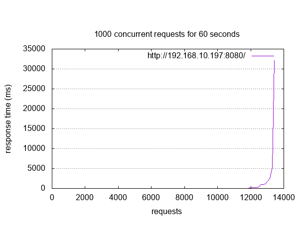

.. _tiac_magpie_sockets-dumb-http-server-mt-sample:

Multithreaded Dumb HTTP Server
##############################

Overview
********

See :ref:`sockets-dumb-http-server-mt-sample` for the original description.

.. _tiac_magpie_sockets-dumb-http-server-mt-sample-requirements:

Requirements
************

- This sample application negotiate IPv4 address from a DHCPv4 server
  running everywhere in your local network.
- The 10/100 Ethernet MAC already configured in RMII/MII mode with MDIO
  using the ``&mac`` :ref:`devicetree <dt-guide>` label.

Building and Running
********************

Build and flash Multithreaded Dumb HTTP Server as follows:

Build the Zephyr version of the sockets/dumb_http_server_mt application like
this:

.. zephyr-app-commands::
   :app: zephyr/samples/net/sockets/dumb_http_server_mt
   :build-dir: dumb_http_server_mt-tiac_magpie
   :board: tiac_magpie
   :gen-args: -DCONFIG_NET_UDP=y -DCONFIG_NET_DHCPV4=y
   :goals: build flash
   :host-os: unix

Once DHCPv4 client address negotiation completed with server, details
are shown on the console like this:

.. code-block:: none

   [00:00:00.269,000] <inf> net_config: Initializing network
   [00:00:00.269,000] <inf> net_config: Waiting interface 1 (0x20021140) to be up...
   [00:00:00.567,000] <inf> net_config: Interface 1 (0x20021140) coming up
   [00:00:00.567,000] <inf> net_config: IPv4 address: 192.0.2.1
   [00:00:00.567,000] <inf> net_config: Running dhcpv4 client...
   [00:00:00.667,000] <inf> net_config: IPv6 address: 2001:db8::1
   [00:00:00.667,000] <inf> net_config: IPv6 address: 2001:db8::1
   [00:00:00.667,000] <inf> net_dumb_http_srv_mt_sample: Network connected
   [00:00:00.667,000] <dbg> net_dumb_http_srv_mt_sample.process_tcp6: Waiting for IPv6 HTTP connections on port 8080, sock 0
   [00:00:00.667,000] <dbg> net_dumb_http_srv_mt_sample.process_tcp4: Waiting for IPv4 HTTP connections on port 8080, sock 2
   [00:00:12.894,000] <inf> net_dhcpv4: Received: 192.168.10.199
   [00:00:12.894,000] <inf> net_config: IPv4 address: 192.168.10.199
   [00:00:12.894,000] <inf> net_config: Lease time: 36000 seconds
   [00:00:12.894,000] <inf> net_config: Subnet: 255.255.255.0
   [00:00:12.894,000] <inf> net_config: Router: 192.168.10.1

Now the sample was starting, it expects connections at 192.168.10.199,
port 8080. The easiest way to connect is by opening a following URL in
a web browser: http://192.168.10.199:8080/

You should see a page with a sample content about Zephyr (captured at a
particular time from Zephyr's web site, note that it may differ from the
content on the live Zephyr site).

.. image:: dumb_http_server_mt.png
   :alt: What is Zephyr™ Project?
   :align: center

Alternatively, a tool like ``curl`` can be used:

.. code-block:: console

    $ curl http://192.168.10.199:8080/

Finally, you can run an HTTP profiling/load tool like Apache Bench
(``ab``) against the server:

.. code-block:: console

    $ ab -g dumb_http_server_mt_ab.csv -n 100 -c 50 \
         http://192.168.10.199:8080/ | tee dumb_http_server_mt_ab.log
    $ gnuplot dumb_http_server_mt_ab.p

The ``-n`` parameter specifies the number of HTTP requests to issue against
a server. The ``-c`` parameter specifies the number of multiple requests to
perform at a time. An example result would looks like:

.. literalinclude:: dumb_http_server_mt_ab.log
   :language: none

.. rubric:: GNUplot script:

.. literalinclude:: dumb_http_server_mt_ab.p
   :language: gnuplot
