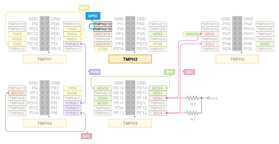

.. _tiac_magpie_drivers_gpio-tests:

GPIO Loopback
#############

Overview
********

See :zephyr_file:`tests/drivers/gpio`
for the original scope of tests, its structure and description.

.. _tiac_magpie_drivers_gpio-tests-requirements:

Requirements
************

You will need an ST-LINK/V2 debug tool adapter already connected to the
TiaC Magpie board, which has an already configured UART console connection.

On the TiaC MAGPIE pin headers the following GPIO pins must be connected.

Building and Running
********************

.. tabs::

   .. group-tab:: Running

      Build and run the tests on target as follows:

      .. code-block:: console

         west twister \
              --verbose --jobs 4 --inline-logs \
              --enable-size-report --platform-reports \
              --device-testing --hardware-map map.yaml \
              --extra-args SHIELD="loopback_test_tmph" \
              --alt-config-root bridle/zephyr/alt-config \
              --testsuite-root zephyr/tests --tag gpio

   .. group-tab:: Results

      You should see the following messages on host console:

      .. parsed-literal::
         :class: highlight

         Device testing on:

         \| Platform    \| ID       \| Serial device   \|
         \|-------------\|----------\|-----------------\|
         \| tiac_magpie \| DT04BNT1 \| /dev/ttyUSB0    \|

         INFO    - JOBS: 4
         INFO    - Adding tasks to the queue...
         INFO    - Added initial list of jobs to queue
         INFO    - 1567/1570 tiac_magpie               tests/drivers/gpio/gpio_enable_disable_interrupt/drivers.gpio.enable_disable_interrupt :byl:`SKIPPED` (runtime filter)
         INFO    - 1568/1570 tiac_magpie               tests/drivers/gpio/gpio_get_direction/drivers.gpio.get_direction :bgn:`PASSED` (device: DT04BNT1, 2.556s)
         INFO    - 1569/1570 tiac_magpie               tests/drivers/gpio/gpio_api_1pin/drivers.gpio.1pin :bgn:`PASSED` (device: DT04BNT1, 9.505s)
         INFO    - 1570/1570 tiac_magpie               tests/drivers/gpio/gpio_basic_api/drivers.gpio.2pin :bgn:`PASSED` (device: DT04BNT1, 17.884s)

         INFO    - 1782 test scenarios (1570 test instances) selected, 1567 configurations skipped (1566 by static filter, 1 at runtime).
         INFO    - :bgn:`3 of 1570` test configurations passed (100.00%), :bbk:`0` failed, :bbk:`0` errored, :byl:`1567` skipped with :bbk:`0` warnings in :bbk:`75.63 seconds`
         INFO    - In total 26 test cases were executed, 10971 skipped on 1 out of total 640 platforms (0.16%)
         INFO    - :bgn:`3` test configurations executed on platforms, :brd:`0` test configurations were only built.

         Hardware distribution summary:

         \| Board       \| ID       \|   Counter \|
         \|-------------\|----------\|-----------\|
         \| tiac_magpie \| DT04BNT1 \|         3 \|

         INFO    - Saving reports...
         INFO    - Writing JSON report .../twister-out/twister.json
         INFO    - Writing xunit report .../twister-out/twister.xml...
         INFO    - Writing xunit report .../twister-out/twister_report.xml...
         INFO    - Writing target report for tiac_magpie...
         INFO    - Run completed
