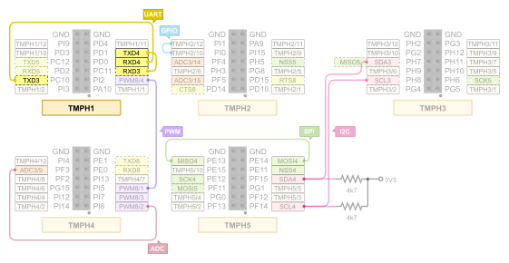

.. _tiac_magpie_drivers_uart-tests:

UART Loopback :byl:`(not yet)`
##############################

Overview
********

See :zephyr_file:`tests/drivers/uart`
for the original scope of tests, its structure and description.

.. _tiac_magpie_drivers_uart-tests-requirements:

Requirements
************

You will need an ST-LINK/V2 debug tool adapter already connected to the
TiaC Magpie board, which has an already configured UART console connection.

On the TiaC MAGPIE pin headers the following UART pins must be connected.

Building and Running
********************

.. tabs::

   .. group-tab:: Running ... t.b.d.

      Build and run the tests on target as follows:

      .. code-block:: console

         $ west twister \
             --verbose --jobs 4 --inline-logs \
             --enable-size-report --platform-reports \
             --device-testing --hardware-map map.yaml \
             --extra-args SHIELD="loopback_test_tmph" \
             --alt-config-root bridle/zephyr/alt-config \
             --testsuite-root zephyr/tests --tag uart

   .. group-tab:: Results ... t.b.d.

      You should see the following messages on host console:

      .. parsed-literal::
         :class: highlight

         Device testing on:

         \| Platform    \| ID       \| Serial device   \|
         \|-------------\|----------\|-----------------\|
         \| tiac_magpie \| DT04BNT1 \| /dev/ttyUSB0    \|

         INFO    - Adding tasks to the queue...
         INFO    - Added initial list of jobs to queue
         INFO    - 1541/1543 tiac_magpie               tests/drivers/uart/uart_async_api/drivers.uart.async_api :byl:`SKIPPED` (runtime filter)
         INFO    - 1542/1543 tiac_magpie               tests/drivers/uart/uart_async_api/drivers.uart.async_api.lpuart :byl:`SKIPPED` (runtime filter)
         INFO    - 1543/1543 tiac_magpie               tests/drivers/console/drivers.console.uart         :bgn:`PASSED` (device: DT04BNT1, 2.420s)

         INFO    - 1755 test scenarios (1543 test instances) selected, 1542 configurations skipped (1540 by static filter, 2 at runtime).
         INFO    - :bgn:`1 of 1543` test configurations passed (100.00%), :bbk:`0` failed, :bbk:`0` errored, :byl:`1542` skipped with :bbk:`0` warnings in :bbk:`22.21 seconds`
         INFO    - In total 1 test cases were executed, 10808 skipped on 1 out of total 634 platforms (0.16%)
         INFO    - :bgn:`1` test configurations executed on platforms, :brd:`0` test configurations were only built.

         Hardware distribution summary:

         \| Board       \| ID       \|   Counter \|
         \|-------------\|----------\|-----------\|
         \| tiac_magpie \| DT04BNT1 \|         1 \|

         INFO    - Saving reports...
         INFO    - Writing JSON report .../twister-out/twister.json
         INFO    - Writing xunit report .../twister-out/twister.xml...
         INFO    - Writing xunit report .../twister-out/twister_report.xml...
         INFO    - Writing target report for tiac_magpie...
         INFO    - Run completed
