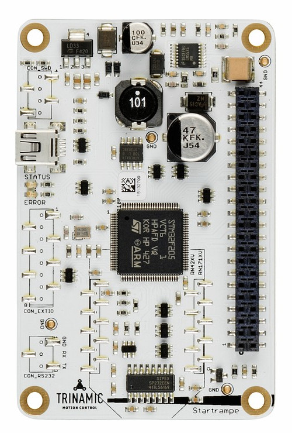

.. _trinamic_startrampe:

Trinamic Startrampe
###################

Overview
********

The Startrampe is the connection between your desktop computer and Trinamic’s
Chip solutions.  The heart of the Startrampe is a `STM32F205VC`_ ARM Cortex-M3
processor.  Here are some highlights of the Trinamic Startrampe board:

- STM32 microcontroller in LQFP100 package
- Trinamic Evaluation-Kit connector Landungsbruecke
- Flexible board power supply:

  - 5 V from USB VBUS
  - External power sources: 7 - 26 V on VM on Landungsbruecke connector

- Two user LEDs for STATUS (green) and ERROR (red)

More information about the board can be found at the `Trinamic Startrampe website`_.

Hardware
********

Trinamic Startrampe provides the following hardware components:

- STM32F205VCT6 in LQFP100 (14 x 14 x 1.4 mm) package
- ARM® 32-bit Cortex®-M3 CPU
- 120 MHz max CPU frequency
- VDD from 1.8 V to 3.6 V
- 256 KB Flash
- 96 KB SRAM
- GPIO with external interrupt capability
- 12-bit ADC with 6 channels
- RTC
- 2 General purpose timers with 4/3 channels
- 2 watchdog timers (independent and window)
- SysTick timer
- 2 USARTs for RS232 console and Wireless Module
- 3 SPI for motor channel 1 and 2 and on-board EEPROM `AT25128B`_
- USB 2.0 OTG FS
- DMA Controller
- CRC calculation unit
- True random number generator

More information about STM32F205VC can be found here:

- `STM32F205VC on www.st.com`_
- `STM32F205 reference manual`_

Supported Features
==================

The Zephyr :code:`trinamic_startrampe` board configuration supports the
following hardware features:

+-------------+------------+-------------------------------------+
| Interface   | Controller | Driver/Component                    |
+=============+============+=====================================+
| NVIC        | on-chip    | nested vector interrupt controller  |
+-------------+------------+-------------------------------------+
| UART        | on-chip    | serial port-polling;                |
|             |            | serial port-interrupt               |
+-------------+------------+-------------------------------------+
| PINCTRL     | on-chip    | Pin control and multiplexing        |
+-------------+------------+-------------------------------------+
| GPIO        | on-chip    | gpio                                |
+-------------+------------+-------------------------------------+
| USB         | on-chip    | USB device                          |
+-------------+------------+-------------------------------------+
| SPI         | on-chip    | spi                                 |
+-------------+------------+-------------------------------------+
| WATCHDOG    | on-chip    | independent watchdog                |
+-------------+------------+-------------------------------------+
| ADC         | on-chip    | ADC Controller                      |
+-------------+------------+-------------------------------------+
| DAC         | on-chip    | DAC Controller                      |
+-------------+------------+-------------------------------------+
| Backup SRAM | on-chip    | Backup SRAM                         |
+-------------+------------+-------------------------------------+
| PWM         | on-chip    | PWM                                 |
+-------------+------------+-------------------------------------+
| RNG         | on-chip    | Random Number Generator             |
+-------------+------------+-------------------------------------+
| DMA         | on-chip    | Direct Memory Access                |
+-------------+------------+-------------------------------------+
| die-temp    | on-chip    | die temperature sensor              |
+-------------+------------+-------------------------------------+

Other hardware features are not yet supported on this Zephyr port.

The default configuration can be found in the defconfig file:
``boards/arm/trinamic_startrampe/trinamic_startrampe_defconfig``

Connections and IOs
===================

The Trinamic Startrampe Board has 8 GPIO controllers.  These controllers are
responsible for pin muxing, input/output, pull-up, etc.

For more details please refer to `Trinamic Startrampe PCB and Schematic`_.

Default Zephyr Peripheral Mapping:
----------------------------------

- USART_6 TX/RX : PC6/PC7 (RS232 connector)
- SPI1 NSS/SCK/MISO/MOSI : PB6/PB3/PB4/PB5
  (on-board SPI3 to EEPROM)
- SPI2 NSS[0-2]/SCK/MISO/MOSI : [PE15/PB11/PB12]/PB13/PB14/PB15
  (Landungsbruecke SPI2 to Motor 2)
- SPI3 NSS/SCK/MISO/MOSI : PA15/PC10/PC11/PC12
  (Landungsbruecke SPI1 to Motor 1)
- USB_DM : PA11
- USB_DP : PA12
- LD1(STATUS,green) : PE0
- LD2(ERROR,red) : PE1

System Clock
------------

The Trinamic Startrampe System Clock could be driven by internal or external oscillator,
as well as main PLL clock.  By default System clock is driven by PLL clock at 120MHz,
driven by 16MHz high speed external crystal.

Serial Port
-----------

The Trinamic Startrampe board has 4 USARTs and 2 UARTs.  The Zephyr console output is
ssigned to USART6.  Default settings are 115200 8N1.

USB
---

The Trinamic Startrampe board has a USB OTG dual-role device (DRD) controller that
supports both device and host functions through its mini USB connector
(USB USER).  Only USB device function is supported in Zephyr at the moment.

Programming and Debugging
*************************

The Trinamic Startrampe board needs an external embedded debug tool, e.g.
Segger J-Link, connected to the SWD interface.  This interface is supported
by the OpenOCD version included in Zephyr SDK.

Samples
*******

LED Blinky
==========

.. zephyr-app-commands::
   :app: zephyr/samples/basic/blinky
   :board: trinamic_startrampe
   :goals: build flash
   :west-args: -p always
   :host-os: unix
   :compact:

Basic Threads
=============

.. zephyr-app-commands::
   :app: zephyr/samples/basic/threads
   :board: trinamic_startrampe
   :goals: build flash
   :west-args: -p always
   :host-os: unix
   :compact:

Hello Shell with USB-CDC/ACM Console
====================================

.. zephyr-app-commands::
   :app: zephyr/samples/subsys/shell/shell_module
   :board: trinamic_startrampe@usbcons
   :goals: build flash
   :gen-args: -DCONFIG_EEPROM=y
   :west-args: -p always
   :host-os: unix
   :compact:

References
**********

.. target-notes::

.. _Trinamic Startrampe website:
   https://www.trinamic.com/support/eval-kits/details/startrampe

.. _STM32F205VC:
   https://www.st.com/resource/en/datasheet/stm32f205vc.pdf

.. _STM32F205VC on www.st.com:
   http://www.st.com/en/microcontrollers/stm32f205vc.html

.. _STM32F205 reference manual:
   http://www.st.com/resource/en/reference_manual/cd00225773.pdf

.. _AT25128B:
   https://www.microchip.com/product/AT25128B

.. _Trinamic Startrampe PCB and Schematic:
   https://www.trinamic.com/fileadmin/assets/Products/Eval_Drawings/Startrampe_v10_09_PCB-PDF.zip
