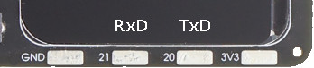

.. _the_picoboy:

The PicoBoy (Color)
###################

The **PicoBoy** is a powerful mini handheld measuring just 3×5 ㎝. It is
suitable for learning programming, developing your own games or simply
playing with it. All you need is a PC, the *PicoBoy* and a USB-C cable.
As the *PicoBoy* based on the `RP2040 SoC`_ by Raspberry Pi Ltd. and is
compatible with the |zephyr:board:rpi_pico| programming model and process,
there are countless other tutorials, examples and libraries on the internet
to make programming easier.

The **PicoBoy Color** is the further development of the popular *PicoBoy*
handheld, now with a color display for even more gaming fun. Whether you
want to learn programming, develop your own games or simply play, the
*PicoBoy Color* offers a wide range of possibilities. Although the original
*PicoBoy* remains a great starting point for beginners and school classes,
the *PicoBoy Color* offers an enhanced gaming experience and new possibilities
for those who want more.

Board Overview
**************

Hardware
========

.. tabs::

   .. group-tab:: PicoBoy Color

      .. _picoboy_rp2040_color:

      .. include:: picoboy-rp2040-color/hardware.rsti

   .. group-tab:: PicoBoy

      .. _picoboy_rp2040:

      .. include:: picoboy-rp2040/hardware.rsti

Positions
=========

.. tabs::

   .. group-tab:: PicoBoy Color

      .. include:: picoboy-rp2040-color/positions.rsti

   .. group-tab:: PicoBoy

      .. include:: picoboy-rp2040/positions.rsti

Pinouts
=======

The peripherals of the `RP2040 SoC`_ can be routed to various pins on
the board. The configuration of these routes can be modified through
:zephyr:ref:`DTS <devicetree>`. Please refer to the datasheet to see
the possible routings for each peripheral. The default assignments
for the PicoBoy on-board wiring is defined below. There are no edge
connectors, headers or solder pads with additional signals routed to
outside of the board.

.. tabs::

   .. group-tab:: PicoBoy Color

      .. include:: picoboy-rp2040-color/pinouts.rsti

   .. group-tab:: PicoBoy

      .. include:: picoboy-rp2040/pinouts.rsti

Supported Features
******************

Similar to the |zephyr:board:rpi_pico| the PicoBoy board configuration
supports the following hardware features:

.. list-table:: Hardware Features Supported by Zephyr
   :class: longtable
   :align: center
   :header-rows: 1

   * - Peripheral
     - Kconfig option
     - Devicetree compatible
     - Zephyr API
   * - PINCTRL
     - :kconfig:option:`CONFIG_PINCTRL`
     - :dtcompatible:`raspberrypi,pico-pinctrl`
     - :zephyr:ref:`pinctrl_api`
   * - GPIO
     - :kconfig:option:`CONFIG_GPIO`
     - :dtcompatible:`raspberrypi,pico-gpio`
     - :zephyr:ref:`gpio_api`
   * - UDC (USB Device Controller)
     - :kconfig:option:`CONFIG_USB_DEVICE_STACK`
     - :dtcompatible:`raspberrypi,pico-usbd`
     - :zephyr:ref:`usb_api`
   * - I2C
     - :kconfig:option:`CONFIG_I2C`
     - | :dtcompatible:`raspberrypi,pico-i2c`
       | :dtcompatible:`gpio-i2c`
     - :zephyr:ref:`i2c_api`
   * - SPI
     - :kconfig:option:`CONFIG_SPI`
     - :dtcompatible:`raspberrypi,pico-spi`
     - :zephyr:ref:`spi_api`
   * - PWM
     - :kconfig:option:`CONFIG_PWM`
     - :dtcompatible:`raspberrypi,pico-pwm`
     - :zephyr:ref:`pwm_api`
   * - ADC
     - :kconfig:option:`CONFIG_ADC`
     - :dtcompatible:`raspberrypi,pico-adc`
     - :zephyr:ref:`adc_api`
   * - Temperature (Sensor)
     - :kconfig:option:`CONFIG_SENSOR`
     - :dtcompatible:`raspberrypi,pico-temp`
     - :zephyr:ref:`sensor`
   * - RTC
     - :kconfig:option:`CONFIG_RTC`
     - :dtcompatible:`raspberrypi,pico-rtc`
     - :zephyr:ref:`rtc_api`
   * - Timer (Counter)
     - :kconfig:option:`CONFIG_COUNTER`
     - :dtcompatible:`raspberrypi,pico-timer`
     - :zephyr:ref:`counter_api`
   * - Watchdog Timer (WDT)
     - :kconfig:option:`CONFIG_WATCHDOG`
     - :dtcompatible:`raspberrypi,pico-watchdog`
     - :zephyr:ref:`watchdog_api`
   * - Flash
     - :kconfig:option:`CONFIG_FLASH`
     - :dtcompatible:`raspberrypi,pico-flash-controller`
     - :zephyr:ref:`flash_api` and
       :zephyr:ref:`flash_map_api`
   * - PIO
     - :kconfig:option:`CONFIG_PIO_RPI_PICO`
     - :dtcompatible:`raspberrypi,pico-pio`
     - N/A
   * - SPI (PIO)
     - :kconfig:option:`CONFIG_SPI`
     - :dtcompatible:`raspberrypi,pico-spi-pio`
     - :zephyr:ref:`spi_api`
   * - DMA
     - :kconfig:option:`CONFIG_DMA`
     - :dtcompatible:`raspberrypi,pico-dma`
     - :zephyr:ref:`dma_api`
   * - HWINFO
     - :kconfig:option:`CONFIG_HWINFO`
     - N/A
     - :zephyr:ref:`hwinfo_api`
   * - VREG
     - :kconfig:option:`CONFIG_REGULATOR`
     - :dtcompatible:`raspberrypi,core-supply-regulator`
     - :zephyr:ref:`regulator_api`
   * - RESET
     - :kconfig:option:`CONFIG_RESET`
     - :dtcompatible:`raspberrypi,pico-reset`
     - :zephyr:ref:`reset_api`
   * - CLOCK
     - :kconfig:option:`CONFIG_CLOCK_CONTROL`
     - | :dtcompatible:`raspberrypi,pico-clock-controller`
       | :dtcompatible:`raspberrypi,pico-clock`
     - :zephyr:ref:`clock_control_api`
   * - NVIC
     - N/A
     - :dtcompatible:`arm,v6m-nvic`
     - Nested Vector :zephyr:ref:`interrupts_v2` Controller
   * - SYSTICK
     - N/A
     - :dtcompatible:`arm,armv6m-systick`
     -

Other hardware features are not currently supported by Zephyr. The default
configuration can be found in the following Kconfig file:

   - :bridle_file:`boards/jsed/picoboy/picoboy_rp2040_color_defconfig`
   - :bridle_file:`boards/jsed/picoboy/picoboy_rp2040_defconfig`

Board Configurations
====================

The PicoBoy boards can be configured only for the following single use cases.

.. tabs::

   .. group-tab:: PicoBoy Color

      .. rubric:: :command:`west build -b picoboy/rp2040/color`

      Use the native USB device port with CDC-ACM as
      Zephyr console and for the shell.

   .. group-tab:: PicoBoy

      .. rubric:: :command:`west build -b picoboy/rp2040`

      Use the native USB device port with CDC-ACM as
      Zephyr console and for the shell.

Connections and IOs
===================

The `PicoBoy <PicoBoy Details_>`_
and `PicoBoy Color <PicoBoy Color Details_>`_ website has detailed information
about board connections. Download the different datasheets there or as linked
above on the positions for more details.

System Clock
============

The `RP2040 <RP2040 SoC_>`_ MCU is configured to use the 12㎒ external crystal
with the on-chip PLL generating the 125㎒ system clock. The internal AHB and
APB units are set up in the same way as the upstream `Raspberry Pi Pico C/C++
SDK`_ libraries.

GPIO (PWM) Ports
================

The `RP2040 <RP2040 SoC_>`_ MCU has 1 GPIO cell which covers all I/O pads and
8 PWM function unit each with 2 channels beside a dedicated Timer unit. On
the |PicoBoy|, only 4 PWM channels are available on the three user LEDs and
the passive magnetic speaker. On the |PicoBoy Color|, only 5 PWM channels are
available on the LCD backlight, the three user LEDs and the passive magnetic
speaker.

ADC/TS Ports
============

The `RP2040 <RP2040 SoC_>`_ MCU has 1 ADC with 4 channels and an additional
fifth channel for the on-chip temperature sensor (TS). The ADC channels 0-3
are no available for any on-board function and may be completely unusable,
but they ar all configured.

SPI Port
========

The `RP2040 <RP2040 SoC_>`_ MCU has 2 SPIs. The serial bus SPI0 is connect
to the on-board OLED display or LCD over GP19 (MOSI), GP16 (MISO), GP18 (SCK),
and GP17 (CSn), but only MOSI and SCK is used for write-only communication.
The display chip-select signal will driven as simple GPIO by GP10 and the
display itself does not provide any data out signal (MISO). SPI1 is not
available in any default setup.

I2C Port
========

The `RP2040 <RP2040 SoC_>`_ MCU has 2 I2Cs. On the |PicoBoy|, serial bus
I2C0 is connect to the on-board acceleration sensor over GP20 (I2C0_SDA),
GP21 (I2C0_SCL). I2C1 is not available in any default setup.

.. image:: picoboy-rp2040-color/solderpads-i2c.jpg
   :align: right
   :alt: PicoBoy Color I2C Port

The |PicoBoy Color| has no on-board acceleration sensor, but the serial bus
I2C0 is connect to the on-board solder pads. The I2C port cannot be used at
the same time as the UART port. Both share the required lines on GP20 and GP21.

The I2C port is **enabled** by default.

Serial Port
===========

The `RP2040 <RP2040 SoC_>`_ MCU has 2 UARTs. On the |PicoBoy|, neither UART0
nor UART1 are available in any of the default setups. When ever a Zephyr
serial console will be needed, the USB port have to be used.

On the |PicoBoy Color|, the serial port UART1 is connect to the on-board
solder pads over GP20 (UART1_TX), GP21 (UART1_RX). UART0 is not available
in any default setup. The UART port cannot be used at the same time as the
I2C port. Both share the required lines on GP20 and GP21.

The UART port is **disabled** by default.

USB Device Port
===============

The `RP2040 <RP2040 SoC_>`_ MCU has a (native) USB device port that can be
used to communicate with a host PC. See the :zephyr:code-sample-category:`usb`
sample applications for more, such as the :zephyr:code-sample:`usb-cdc-acm`
sample which sets up a virtual serial port that echos characters back to the
host PC. The |PicoBoy| and |PicoBoy Color| provides the Zephyr console per
default on the USB port as :zephyr:ref:`usb_device_cdc_acm`:

.. tabs::

   .. group-tab:: PicoBoy Color

         .. container:: highlight-console notranslate literal-block

            .. parsed-literal::

               USB device idVendor=\ |picoboy_color_VID|, idProduct=\ |picoboy_color_PID_CON|, bcdDevice=\ |picoboy_color_BCD_CON|
               USB device strings: Mfr=1, Product=2, SerialNumber=3
               Product: |picoboy_color_PStr_CON|
               Manufacturer: |picoboy_color_VStr|
               SerialNumber: B69CA314D5626E5B

   .. group-tab:: PicoBoy

         .. container:: highlight-console notranslate literal-block

            .. parsed-literal::

               USB device idVendor=\ |picoboy_VID|, idProduct=\ |picoboy_PID_CON|, bcdDevice=\ |picoboy_BCD_CON|
               USB device strings: Mfr=1, Product=2, SerialNumber=3
               Product: |picoboy_PStr_CON|
               Manufacturer: |picoboy_VStr|
               SerialNumber: BD774B2618DAAA7D

Programmable I/O (PIO)
**********************

The `RP2040 SoC`_ comes with two PIO periherals. These are two simple
co-processors that are designed for I/O operations. The PIOs run a custom
instruction set, generated from a custom assembly language. PIO programs
are assembled using :program:`pioasm`, a tool provided by Raspberry Pi.
Further information can be found in the `Raspberry Pi Pico C/C++ SDK`_
document, section with title :emphasis:`"Using PIOASM, the PIO Assembler"`.

Zephyr does not (currently) assemble PIO programs. Rather, they should be
manually assembled and embedded in source code. An example of how this is done
can be found at :zephyr_file:`drivers/serial/uart_rpi_pico_pio.c` or
:zephyr_file:`drivers/spi/spi_rpi_pico_pio.c`.

Programming and Debugging
*************************

Flashing
========

The |PicoBoy| can only be flashed with a UF2 file. There is no SWD connector.

Using UF2
---------

By default, building an app for the |PicoBoy| or |PicoBoy Color| board will
generate a :file:`build/zephyr/zephyr.uf2` file. If the board is powered on
with the :kbd:`BOOTSEL` button pressed, it will appear on the host as a mass
storage device:

   .. container:: highlight-console notranslate literal-block

      .. parsed-literal::

         USB device idVendor=\ |rpi_VID|, idProduct=\ |rpi_rp2040_PID|, bcdDevice=\ |rpi_rp2040_BCD|
         USB device strings: Mfr=1, Product=2, SerialNumber=0
         Product: |rpi_rp2040_PStr|
         Manufacturer: |rpi_VStr|
         SerialNumber: E0C9125B0D9B

The UF2 file should be drag-and-dropped or copied on command line to the
device, which will then flash the |PicoBoy| or |PicoBoy Color| board.

Each `RP2040 SoC`_ ships the `UF2 compatible <UF2 bootloader_>`_ bootloader
pico-bootrom_, a native support in silicon. The full source for the RP2040
bootrom at pico-bootrom_ includes versions 1, 2 and 3 of the bootrom, which
correspond to the B0, B1 and B2 silicon revisions, respectively.

Note that every time you build a program for the RP2040, the Pico SDK selects
an appropriate second stage bootloader based on what kind of external QSPI
Flash type the board configuration you are building for was giving. There
are |several versions of boot2|_ for different flash chips, and each one is
exactly 256 bytes of code which is put right at the start of the eventual
program binary. On Zephyr the :code:`boot2` versions are part of the
`Raspberry Pi Pico HAL`_ module. Possible selections:

:|CONFIG_RP2_FLASH_AT25SF128A|: |boot2_at25sf128a.S|_
:|CONFIG_RP2_FLASH_GENERIC_03H|: |boot2_generic_03h.S|_
:|CONFIG_RP2_FLASH_IS25LP080|: |boot2_is25lp080.S|_
:|CONFIG_RP2_FLASH_W25Q080|: |boot2_w25q080.S|_
:|CONFIG_RP2_FLASH_W25X10CL|: |boot2_w25x10cl.S|_

The |PicoBoy| board set this option to |CONFIG_RP2_FLASH_W25Q080|. Further
information can be found in the `RP2040 Datasheet`_, sections with title
:emphasis:`"Bootrom"` and :emphasis:`"Processor Controlled Boot Sequence"`
or Brian Starkey's Blog article `Pico serial bootloader`_

Debugging
=========

The |PicoBoy| or |PicoBoy Color| does not provide any SWD connector, thus
debugging software is not possible.

Basic Samples
*************

LED Blinky and Fade
===================

.. tabs::

   .. group-tab:: PicoBoy Color

      .. include:: picoboy-rp2040-color/blinky_fade.rsti

   .. group-tab:: PicoBoy

      .. include:: picoboy-rp2040/blinky_fade.rsti

Hello Shell on USB-CDC/ACM Console
==================================

.. tabs::

   .. group-tab:: PicoBoy Color

      .. include:: picoboy-rp2040-color/helloshell.rsti

   .. group-tab:: PicoBoy

      .. include:: picoboy-rp2040/helloshell.rsti

More Samples
************

Sounds from the speaker on USB-CDC/ACM Console
==============================================

The sample is prepared for the on-board :hwftlbl-spk:`PWM_SPEAKER` connected
to the PWM channel at :rpi-pico-pio:`GP15` / :rpi-pico-pwm:`PWM15` (PWM7CHB).

The PWM period is 880 ㎐, twice the concert pitch frequency of 440 ㎐.

.. literalinclude:: ../picoboy-speaker.dtsi
   :caption: core_speaker.dtsi
   :language: DTS
   :encoding: ISO-8859-1
   :emphasize-lines: 3,11,19
   :linenos:
   :start-at: / {

.. tabs::

   .. group-tab:: PicoBoy Color

      .. include:: picoboy-rp2040-color/speaker.rsti

   .. group-tab:: PicoBoy

      .. include:: picoboy-rp2040/speaker.rsti

Input dump on USB-CDC/ACM Console
=================================

.. tabs::

   .. group-tab:: PicoBoy Color

      .. include:: picoboy-rp2040-color/input_dump.rsti

   .. group-tab:: PicoBoy

      .. include:: picoboy-rp2040/input_dump.rsti

Display Test and Demonstration
==============================

.. tabs::

   .. group-tab:: PicoBoy Color

      .. include:: picoboy-rp2040-color/display_test.rsti

   .. group-tab:: PicoBoy

      .. include:: picoboy-rp2040/display_test.rsti

References
**********

.. target-notes::
