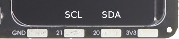
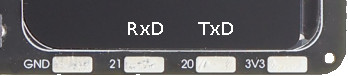

.. _picoboy_color:

PicoBoy Color
#############

The **PicoBoy Color (PBC)** is the further development of the popular *PicoBoy*
handheld, now with a color display for even more gaming fun. Whether you want
to learn programming, develop your own games or simply play, the *PicoBoy Color*
offers a wide range of possibilities. Although the original *PicoBoy* remains
a great starting point for beginners and school classes, the *PicoBoy Color*
offers an enhanced gaming experience and new possibilities for those who want
more.

Board Overview
**************

Hardware
========

.. include:: hardware.rsti

Positions
=========

.. include:: positions.rsti

Pinouts
=======

The peripherals of the `RP2040 SoC`_ can be routed to various pins on the board.
The configuration of these routes can be modified through
:external+zephyr:ref:`DTS <devicetree>`. Please refer to the datasheet to see
the possible routings for each peripheral. The default assignments for the
on-board wiring is defined below. There are solder pads with additional signals
routed to outside of the board.

.. include:: pinouts.rsti

Supported Features
******************

Similar to the |zephyr:board:rpi_pico| the board configuration supports the
following hardware features:

.. list-table:: Hardware Features Supported by Zephyr
   :class: longtable
   :align: center
   :header-rows: 1

   * - Peripheral
     - Kconfig option
     - Devicetree compatible
     - Zephyr API
   * - PINCTRL
     - :kconfig:option:`CONFIG_PINCTRL`
     - :dtcompatible:`raspberrypi,pico-pinctrl`
     - :external+zephyr:ref:`pinctrl_api`
   * - GPIO
     - :kconfig:option:`CONFIG_GPIO`
     - :dtcompatible:`raspberrypi,pico-gpio`
     - :external+zephyr:ref:`gpio_api`
   * - UART
     - :kconfig:option:`CONFIG_SERIAL`
     - | :dtcompatible:`raspberrypi,pico-uart`
       | :dtcompatible:`arm,pl011`
     - :external+zephyr:ref:`uart_api`
   * - UDC (USB Device Controller)
     - :kconfig:option:`CONFIG_USB_DEVICE_STACK_NEXT`
     - :dtcompatible:`raspberrypi,pico-usbd`
     - :external+zephyr:ref:`usb_device_next_api`
   * - I2C
     - :kconfig:option:`CONFIG_I2C`
     - :dtcompatible:`raspberrypi,pico-i2c`
     - :external+zephyr:ref:`i2c_api`
   * - SPI
     - :kconfig:option:`CONFIG_SPI`
     - | :dtcompatible:`raspberrypi,pico-spi`
       | :dtcompatible:`arm,pl022`
     - :external+zephyr:ref:`spi_api`
   * - PWM
     - :kconfig:option:`CONFIG_PWM`
     - :dtcompatible:`raspberrypi,pico-pwm`
     - :external+zephyr:ref:`pwm_api`
   * - ADC
     - :kconfig:option:`CONFIG_ADC`
     - :dtcompatible:`raspberrypi,pico-adc`
     - :external+zephyr:ref:`adc_api`
   * - Temperature (Sensor)
     - :kconfig:option:`CONFIG_SENSOR`
     - :dtcompatible:`raspberrypi,pico-temp`
     - :external+zephyr:ref:`sensor`
   * - RTC
     - :kconfig:option:`CONFIG_RTC`
     - :dtcompatible:`raspberrypi,pico-rtc`
     - :external+zephyr:ref:`rtc_api`
   * - Timer (Counter)
     - :kconfig:option:`CONFIG_COUNTER`
     - :dtcompatible:`raspberrypi,pico-timer`
     - :external+zephyr:ref:`counter_api`
   * - Watchdog Timer (WDT)
     - :kconfig:option:`CONFIG_WATCHDOG`
     - :dtcompatible:`raspberrypi,pico-watchdog`
     - :external+zephyr:ref:`watchdog_api`
   * - Flash
     - :kconfig:option:`CONFIG_FLASH`
     - :dtcompatible:`raspberrypi,pico-flash-controller`
     - :external+zephyr:ref:`flash_api` and
       :external+zephyr:ref:`flash_map_api`
   * - PIO
     - :kconfig:option:`CONFIG_PIO_RPI_PICO`
     - :dtcompatible:`raspberrypi,pico-pio`
     - N/A
   * - UART (PIO)
     - :kconfig:option:`CONFIG_SERIAL`
     - :dtcompatible:`raspberrypi,pico-uart-pio`
     - :external+zephyr:ref:`uart_api`
   * - SPI (PIO)
     - :kconfig:option:`CONFIG_SPI`
     - :dtcompatible:`raspberrypi,pico-spi-pio`
     - :external+zephyr:ref:`spi_api`
   * - WS2812 (PIO)
     - :kconfig:option:`CONFIG_LED_STRIP`
     - :dtcompatible:`worldsemi,ws2812-rpi-pico-pio`
     - N/A
   * - DMA
     - :kconfig:option:`CONFIG_DMA`
     - :dtcompatible:`raspberrypi,pico-dma`
     - :external+zephyr:ref:`dma_api`
   * - HWINFO
     - :kconfig:option:`CONFIG_HWINFO`
     - N/A
     - :external+zephyr:ref:`hwinfo_api`
   * - VREG
     - :kconfig:option:`CONFIG_REGULATOR`
     - :dtcompatible:`raspberrypi,core-supply-regulator`
     - :external+zephyr:ref:`regulator_api`
   * - RESET
     - :kconfig:option:`CONFIG_RESET`
     - :dtcompatible:`raspberrypi,pico-reset`
     - :external+zephyr:ref:`reset_api`
   * - CLOCK
     - :kconfig:option:`CONFIG_CLOCK_CONTROL`
     - | :dtcompatible:`raspberrypi,pico-clock-controller`
       | :dtcompatible:`raspberrypi,pico-clock`
     - :external+zephyr:ref:`clock_control_api`
   * - NVIC
     - N/A
     - :dtcompatible:`arm,v6m-nvic`
     - Nested Vector :external+zephyr:ref:`interrupts_v2` Controller
   * - SYSTICK
     - N/A
     - :dtcompatible:`arm,armv6m-systick`
     -

Other hardware features are not currently supported by Zephyr. The default
configuration can be found in the following Kconfig file:

.. zephyr-keep-sorted-start re(^\* :bridle_file:`\w)

* :bridle_file:`boards/jsed/picoboy/picoboy_color_defconfig`

.. zephyr-keep-sorted-stop

Board Configurations
====================

The board can be configured only for the following single use cases.

.. rubric:: :command:`west build -b picoboy_color/rp2040`

Use the native USB device port with CDC-ACM as
Zephyr console and for the shell.

Connections and IOs
===================

The `PicoBoy Color <PicoBoy Color Details_>`_ website has detailed information
about board connections. Download the different datasheets there or as linked
above on the positions for more details.

System Clock
============

The `RP2040 <RP2040 SoC_>`_ MCU is configured to use the 12㎒ external crystal
with the on-chip PLL generating the 125㎒ system clock.

GPIO (PWM) Ports
================

The `RP2040 <RP2040 SoC_>`_ MCU has 1 GPIO cell which covers all I/O pads and
8 PWM function unit each with 2 channels beside a dedicated Timer unit. Only
5 PWM channels are available, for the LCD backlight, the three user LEDs and
the passive magnetic speaker.

ADC/TS Ports
============

The `RP2040 <RP2040 SoC_>`_ MCU has 1 ADC with 4 channels and an additional
fifth channel for the on-chip temperature sensor (TS). The ADC channels 0-3
are not available for any on-board function.

The external voltage reference ADC_VREF is directly connected to the 3.3V
power supply.

SPI Port
========

The `RP2040 <RP2040 SoC_>`_ MCU has 2 SPIs. The serial bus SPI0 is connect to
the on-board LCD over GP19 (MOSI), GP16 (MISO), GP18 (SCK), and GP17 (CSn),
but only MOSI and SCK is used for write-only communication. The display
chip-select signal will driven as simple GPIO by GP10 and the display itself
does not provide any data out signal (MISO).

SPI1 is not available in any default setup.

I2C Port
========

The `RP2040 <RP2040 SoC_>`_ MCU has 2 I2Cs. The serial bus I2C0 is connect to
the on-board solder pads over GP20 (I2C0_SDA), GP21 (I2C0_SCL). I2C1 is not
available in any default setup.

There is no on-board acceleration sensor. The I2C port cannot be used at the
same time as the UART port. Both share the required lines on GP20 and GP21.

The I2C port on solder pads is **enabled** by default.

Serial Port
===========

The `RP2040 <RP2040 SoC_>`_ MCU has 2 UARTs.

The serial port UART1 is connect to the on-board solder pads over
GP20 (UART1_TX), GP21 (UART1_RX). UART0 is not available in any default setup.
The UART port cannot be used at the same time as the I2C port. Both share the
required lines on GP20 and GP21.

The UART port on solder pads is **disabled** by default.

USB Device Port
===============

The `RP2040 <RP2040 SoC_>`_ MCU has a (native) USB device port that can be used
to communicate with a host PC. See the
:external+zephyr:zephyr:code-sample-category:`usb` sample applications for more,
such as the :external+zephyr:zephyr:code-sample:`usb-cdc-acm` sample which sets
up a virtual serial port that echos characters back to the host PC. The board
provide the Zephyr console per default on the USB port as
:external+zephyr:ref:`usb_device_cdc_acm`:

   .. container:: highlight-console notranslate literal-block

      .. parsed-literal::

         USB device idVendor=\ |picoboy_color_VID|, idProduct=\ |picoboy_color_PID_CON|, bcdDevice=\ |picoboy_color_BCD_CON|
         USB device strings: Mfr=1, Product=2, SerialNumber=3
         Product: |picoboy_color_PStr_CON|
         Manufacturer: |picoboy_color_VStr|
         SerialNumber: B69CA314D5626E5B

Programmable I/O (PIO)
**********************

The `RP2040 SoC`_ comes with two PIO periherals. These are simple
co-processors that are designed for I/O operations. The PIOs run a custom
instruction set, generated from a custom assembly language. PIO programs
are assembled using :program:`pioasm`, a tool provided by Raspberry Pi.
Further information can be found in the `Raspberry Pi Pico C/C++ SDK`_
document, section with title :emphasis:`"Using PIOASM, the PIO Assembler"`.

Zephyr does not (currently) assemble PIO programs. Rather, they should be
manually assembled and embedded in source code. An example of how this is done
can be found at :zephyr_file:`drivers/serial/uart_rpi_pico_pio.c` or
:zephyr_file:`drivers/spi/spi_rpi_pico_pio.c`.

Programming and Debugging
*************************

Flashing
========

The board can only be flashed with a UF2 file. There is no SWD connector.

Using UF2
---------

By default, building an application for the board will generate a
:file:`build/zephyr/zephyr.uf2` file. If the board is powered on with
the :kbd:`BOOTSEL` button pressed, it will appear on the host as a mass
storage device:

   .. container:: highlight-console notranslate literal-block

      .. parsed-literal::

         USB device idVendor=\ |rpi_VID|, idProduct=\ |rpi_rp2040_PID|, bcdDevice=\ |rpi_rp2040_BCD|
         USB device strings: Mfr=1, Product=2, SerialNumber=0
         Product: |rpi_rp2040_PStr|
         Manufacturer: |rpi_VStr|
         SerialNumber: E0C9125B0D9B

The UF2 file should be drag-and-dropped or copied on command line to the
device, which will then flash the board.

RP2040 Boot-ROM
---------------

Each `RP2040 SoC`_ ships the `UF2 compatible <UF2 bootloader_>`_ bootloader
pico-bootrom-rp2040_, a native support in silicon. The full source for the
RP2040 bootrom at pico-bootrom-rp2040_ includes versions B0, B1 and B2 of
the bootrom, which correspond to the same silicon revisions, respectively.

Note that every time you build a program for the RP2040, the Pico SDK selects
an appropriate second stage bootloader based on what kind of external QSPI
Flash type the board configuration you are building for was giving. There
are |several versions of boot2|_ for different flash chips, and each one is
exactly 256 bytes of code which is put right at the start of the eventual
program binary. On Zephyr the :code:`boot2` versions are part of the
`Raspberry Pi Pico HAL`_ module. Possible selections:

:|CONFIG_RP2_FLASH_AT25SF128A|: |boot2_at25sf128a.S|_
:|CONFIG_RP2_FLASH_GENERIC_03H|: |boot2_generic_03h.S|_
:|CONFIG_RP2_FLASH_IS25LP080|: |boot2_is25lp080.S|_
:|CONFIG_RP2_FLASH_W25Q080|: |boot2_w25q080.S|_
:|CONFIG_RP2_FLASH_W25X10CL|: |boot2_w25x10cl.S|_

The board set this option to |CONFIG_RP2_FLASH_W25Q080|.

Further information can be found in the `RP2040 Datasheet`_, sections with
title :emphasis:`"Bootrom"` and :emphasis:`"Processor Controlled Boot Sequence"`
or Brian Starkey's Blog article `Pico serial bootloader`_

Debugging
=========

The board does not provide any SWD connector, thus debugging software
is not possible.

Basic Samples
*************

LED Blinky and Fade
===================

.. include:: blinky_fade.rsti

Hello Shell on USB-CDC/ACM Console
==================================

.. include:: helloshell.rsti

More Samples
************

Sounds from the speaker on USB-CDC/ACM Console
==============================================

The sample is prepared for the on-board :hwftlbl-spk:`PWM_SPEAKER` connected
to the PWM channel at :rpi-pico-pio:`GP15` / :rpi-pico-pwm:`PWM15` (PWM7CHB).

The PWM period is 880 ㎐, twice the concert pitch frequency of 440 ㎐.

.. include:: speaker.rsti

Input dump on USB-CDC/ACM Console
=================================

.. include:: input_dump.rsti

Display Test and Demonstration
==============================

.. include:: display_test.rsti

References
**********

.. target-notes::
