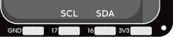
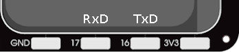

.. _picoboy_color_plus:

PicoBoy Color Plus (PBC+)
#########################

The **PicoBoy Color Plus (PBC+)**, based on the new `RP2350 SoC`_ by Raspberry
Pi Ltd., is a new extended and in some points optimized version of the *PicoBoy
Color*. The computing and memory performance has been significantly increased
and missing functions have been added.

Board Overview
**************

Hardware
========

.. include:: hardware.rsti

Positions
=========

.. include:: positions.rsti

Pinouts
=======

The peripherals of the `RP2350 SoC`_ can be routed to various pins on the board.
The configuration of these routes can be modified through
:external+zephyr:ref:`DTS <devicetree>`. Please refer to the datasheet to see
the possible routings for each peripheral. The default assignments for the
on-board wiring is defined below. There is an additional edge connector and
there are solder pads with additional signals routed to outside of the board.

.. include:: pinouts.rsti

Supported Features
******************

Similar to the |zephyr:board:rpi_pico| the board configuration supports the
following hardware features:

.. list-table:: Hardware Features Supported by Zephyr
   :class: longtable
   :align: center
   :header-rows: 1

   * - Peripheral
     - Kconfig option
     - Devicetree compatible
     - Zephyr API
   * - PINCTRL
     - :kconfig:option:`CONFIG_PINCTRL`
     - :dtcompatible:`raspberrypi,pico-pinctrl`
     - :external+zephyr:ref:`pinctrl_api`
   * - GPIO
     - :kconfig:option:`CONFIG_GPIO`
     - :dtcompatible:`raspberrypi,pico-gpio`
     - :external+zephyr:ref:`gpio_api`
   * - UART
     - :kconfig:option:`CONFIG_SERIAL`
     - | :dtcompatible:`raspberrypi,pico-uart`
       | :dtcompatible:`arm,pl011`
     - :external+zephyr:ref:`uart_api`
   * - UDC (USB Device Controller)
     - :kconfig:option:`CONFIG_USB_DEVICE_STACK_NEXT`
     - :dtcompatible:`raspberrypi,pico-usbd`
     - :external+zephyr:ref:`usb_device_next_api`
   * - I2C
     - :kconfig:option:`CONFIG_I2C`
     - :dtcompatible:`raspberrypi,pico-i2c`
     - :external+zephyr:ref:`i2c_api`
   * - SPI
     - :kconfig:option:`CONFIG_SPI`
     - | :dtcompatible:`raspberrypi,pico-spi`
       | :dtcompatible:`arm,pl022`
     - :external+zephyr:ref:`spi_api`
   * - PWM
     - :kconfig:option:`CONFIG_PWM`
     - :dtcompatible:`raspberrypi,pico-pwm`
     - :external+zephyr:ref:`pwm_api`
   * - ADC
     - :kconfig:option:`CONFIG_ADC`
     - :dtcompatible:`raspberrypi,pico-adc`
     - :external+zephyr:ref:`adc_api`
   * - Temperature (Sensor)
     - :kconfig:option:`CONFIG_SENSOR`
     - :dtcompatible:`raspberrypi,pico-temp`
     - :external+zephyr:ref:`sensor`
   * - Timer (Counter)
     - :kconfig:option:`CONFIG_COUNTER`
     - :dtcompatible:`raspberrypi,pico-timer`
     - :external+zephyr:ref:`counter_api`
   * - Watchdog Timer (WDT)
     - :kconfig:option:`CONFIG_WATCHDOG`
     - :dtcompatible:`raspberrypi,pico-watchdog`
     - :external+zephyr:ref:`watchdog_api`
   * - Flash
     - :kconfig:option:`CONFIG_FLASH`
     - :dtcompatible:`raspberrypi,pico-flash-controller`
     - :external+zephyr:ref:`flash_api` and
       :external+zephyr:ref:`flash_map_api`
   * - PIO
     - :kconfig:option:`CONFIG_PIO_RPI_PICO`
     - :dtcompatible:`raspberrypi,pico-pio`
     - N/A
   * - UART (PIO)
     - :kconfig:option:`CONFIG_SERIAL`
     - :dtcompatible:`raspberrypi,pico-uart-pio`
     - :external+zephyr:ref:`uart_api`
   * - SPI (PIO)
     - :kconfig:option:`CONFIG_SPI`
     - :dtcompatible:`raspberrypi,pico-spi-pio`
     - :external+zephyr:ref:`spi_api`
   * - WS2812 (PIO)
     - :kconfig:option:`CONFIG_LED_STRIP`
     - :dtcompatible:`worldsemi,ws2812-rpi-pico-pio`
     - N/A
   * - DMA
     - :kconfig:option:`CONFIG_DMA`
     - :dtcompatible:`raspberrypi,pico-dma`
     - :external+zephyr:ref:`dma_api`
   * - HWINFO
     - :kconfig:option:`CONFIG_HWINFO`
     - N/A
     - :external+zephyr:ref:`hwinfo_api`
   * - VREG
     - :kconfig:option:`CONFIG_REGULATOR`
     - :dtcompatible:`raspberrypi,core-supply-regulator`
     - :external+zephyr:ref:`regulator_api`
   * - RESET
     - :kconfig:option:`CONFIG_RESET`
     - :dtcompatible:`raspberrypi,pico-reset`
     - :external+zephyr:ref:`reset_api`
   * - CLOCK
     - :kconfig:option:`CONFIG_CLOCK_CONTROL`
     - | :dtcompatible:`raspberrypi,pico-clock-controller`
       | :dtcompatible:`raspberrypi,pico-clock`
     - :external+zephyr:ref:`clock_control_api`
   * - NVIC
     - N/A
     - :dtcompatible:`arm,v8m-nvic`
     - Nested Vector :external+zephyr:ref:`interrupts_v2` Controller
   * - SYSTICK
     - N/A
     - :dtcompatible:`arm,v8m-systick`
     -

Other hardware features are not currently supported by Zephyr. The default
configuration can be found in the following Kconfig file:

.. zephyr-keep-sorted-start re(^\* :bridle_file:`\w)

* :bridle_file:`boards/jsed/picoboy_color_plus/picoboy_color_plus_rp2350a_hazard3_defconfig`
* :bridle_file:`boards/jsed/picoboy_color_plus/picoboy_color_plus_rp2350a_m33_defconfig`

.. zephyr-keep-sorted-stop

Board Configurations
====================

The board can be configured only for the following different use cases.

.. rubric:: :command:`west build -b picoboy_color_plus/rp2350a/hazard3`

Use the native USB device port with CDC-ACM as
Zephyr console and for the shell.
Running on Hazard3/RISC-V core.

.. rubric:: :command:`west build -b picoboy_color_plus/rp2350a/m33`

Use the native USB device port with CDC-ACM as
Zephyr console and for the shell.
Running on Cortex-M33 core.

Connections and IOs
===================

The `PicoBoy Color Plus <PicoBoy Color Plus Details_>`_ website has detailed
information about board connections. Download the different datasheets there
or as linked above on the positions for more details.

System Clock
============

The `RP2350 <RP2350 SoC_>`_ MCU is configured to use the 12㎒ external crystal
with the on-chip PLL generating the 150㎒ system clock. The internal AHB and
APB units are set up in the same way as the upstream `Raspberry Pi Pico C/C++
SDK`_ libraries.

GPIO (PWM) Ports
================

The `RP2350 <RP2350 SoC_>`_ MCU has 1 GPIO cell which covers all I/O pads and
12 PWM function unit each with 2 channels beside a dedicated Timer unit. Only
5 PWM channels are available, for the LCD backlight, the three user LEDs and
the passive magnetic speaker.

ADC/TS Ports
============

The `RP2350 <RP2350 SoC_>`_ MCU has 1 ADC with 4 channels and an additional
fifth channel for the on-chip temperature sensor (TS). The ADC channels 0-2
are not available for any on-board function on and may be completely unusable.
ADC channel 3 will be used for internal on-board voltage monitoring.

The external voltage reference ADC_VREF is directly connected to the 3.3V
power supply.

SPI Port
========

The `RP2350 <RP2350 SoC_>`_ MCU has 2 SPIs. The serial bus SPI0 is connect to
the on-board LCD over GP19 (MOSI), GP16 (MISO), GP18 (SCK), and GP17 (CSn),
but only MOSI and SCK is used for write-only communication. The display
chip-select signal will driven as simple GPIO by GP10 and the display itself
does not provide any data out signal (MISO).

The serial bus SPI1 will be used internaly to drive the on-board RGB LED over
a one-wire digital signal on GP11 (MOSI).

I2C Port
========

The `RP2350 <RP2350 SoC_>`_ MCU has 2 I2Cs. The serial bus I2C0 is connect to
the on-board acceleration sensor over GP20 (I2C0_SDA), GP21 (I2C0_SCL). I2C1 is
not available in any default setup.

The board also provides the I2C0 serial bus with the same pin assignment for
external sensors via a Maker Port as a Qwiic / STEMMA QT connector. On the
solder pads, however, the I2C0 is optionally accessible with GP16 (SDA) and
GP17 (SCL).

The I2C port on solder pads is **disabled** by default.

Serial Port
===========

The `RP2350 <RP2350 SoC_>`_ MCU has 2 UARTs.

The serial port UART0 is connect to the on-board solder pads over
GP16 (UART0_TX), GP17 (UART0_RX). UART1 would be optional available
on the Maker Port (Qwiic / STEMMA QT connector). The UART port cannot
be used at the same time as the I2C port on the solder pads. Both share
the required lines on GP16 and GP17.

The UART port on solder pads is **enabled** by default.

USB Device Port
===============

The `RP2350 <RP2350 SoC_>`_ MCU has a (native) USB device port that can be used
to communicate with a host PC. See the
:external+zephyr:zephyr:code-sample-category:`usb` sample applications for more,
such as the :external+zephyr:zephyr:code-sample:`usb-cdc-acm` sample which sets
up a virtual serial port that echos characters back to the host PC. The board
provides the Zephyr console per default on the USB port as
:external+zephyr:ref:`usb_device_cdc_acm`:

   .. container:: highlight-console notranslate literal-block

      .. parsed-literal::

         USB device idVendor=\ |picoboy_color_plus_VID|, idProduct=\ |picoboy_color_plus_PID_CON|, bcdDevice=\ |picoboy_color_plus_BCD_CON|
         USB device strings: Mfr=1, Product=2, SerialNumber=3
         Product: |picoboy_color_plus_PStr_CON|
         Manufacturer: |picoboy_color_plus_VStr|
         SerialNumber: B163A72F0CF0C97A

Programmable I/O (PIO)
**********************

The `RP2350 SoC`_ comes with three PIO periherals. These are two simple
co-processors that are designed for I/O operations. The PIOs run a custom
instruction set, generated from a custom assembly language. PIO programs
are assembled using :program:`pioasm`, a tool provided by Raspberry Pi.
Further information can be found in the `Raspberry Pi Pico C/C++ SDK`_
document, section with title :emphasis:`"Using PIOASM, the PIO Assembler"`.

Zephyr does not (currently) assemble PIO programs. Rather, they should be
manually assembled and embedded in source code. An example of how this is done
can be found at :zephyr_file:`drivers/serial/uart_rpi_pico_pio.c` or
:zephyr_file:`drivers/spi/spi_rpi_pico_pio.c`.

Programming and Debugging
*************************

Flashing
========

The board can only be flashed with a UF2 file. There is no SWD connector.

Using UF2
---------

By default, building an application for the board will generate a
:file:`build/zephyr/zephyr.uf2` file. If the board is powered on with
the :kbd:`BOOTSEL` button pressed, it will appear on the host as a mass
storage device:

   .. container:: highlight-console notranslate literal-block

      .. parsed-literal::

         USB device idVendor=\ |rpi_VID|, idProduct=\ |rpi_rp2350_PID|, bcdDevice=\ |rpi_rp2350_BCD|
         USB device strings: Mfr=1, Product=2, SerialNumber=0
         Product: |rpi_rp2350_PStr|
         Manufacturer: |rpi_VStr|
         SerialNumber: E9DB4B801D503140

The UF2 file should be drag-and-dropped or copied on command line to the
device, which will then flash the board.

RP2350 Boot-ROM
---------------

Each `RP2350 SoC`_ ships the `UF2 compatible <UF2 bootloader_>`_ bootloader
pico-bootrom-rp2350_, a native support in silicon. The full source for the
RP2350 bootrom at pico-bootrom-rp2350_ includes versions A2, A3 and A4 of
the bootrom, which correspond to the same silicon revisions, respectively.

Note that every time you build a program for the RP2350, the Pico SDK selects
and creates an appropriate image definition and/or partition table block with
attributes and precedes it in the firmware. Further information can be found
in the `RP2350 Datasheet`_, sections with title :emphasis:`"Bootrom"` and
:emphasis:`"Processor Controlled Boot Sequence"`.

Debugging
=========

The board does not provide any SWD connector, thus debugging software
is not possible.

Basic Samples
*************

LED Blinky and Fade
===================

.. include:: blinky_fade.rsti

Hello Shell on USB-CDC/ACM Console
==================================

.. include:: helloshell.rsti

More Samples
************

3-Axis accelerometer data on USB-CDC/ACM Console
================================================

The samples are prepared for the on-board :hwftlbl-cps:`3-DOF` accelerometer
connected to the I2C0 bus.

Chip-specific
-------------

Get 3-axis accelerometer data from an STK8BA58 sensor (polling & trigger mode)
using the :external+zephyr:ref:`Sensors API <sensor>`. See also Bridle sample
:ref:`stk8ba58_3_axis_accelerometer-sample` and also the console output in
section :ref:`stk8ba58-sample-pbcp` of the Bridle sample documentation.

Polling Mode
------------

Get 3-axis accelerometer data from the on-board sensor (polling mode) using
the :external+zephyr:ref:`Sensors API <sensor>`. See also Zephyr sample
:external+zephyr:zephyr:code-sample:`accel_polling`.

.. include:: 3dof-accel-polling.rsti

Trigger Mode
------------

Get 3-axis accelerometer data from the on-board sensor (trigger mode) using
the :external+zephyr:ref:`Sensors API <sensor>`. See also Zephyr sample
:external+zephyr:zephyr:code-sample:`accel_trig`.

.. include:: 3dof-accel-trigger.rsti

Sounds from the speaker on USB-CDC/ACM Console
==============================================

The sample is prepared for the on-board :hwftlbl-spk:`PWM_SPEAKER` connected
to the PWM channel at :rpi-pico-pio:`GP15` / :rpi-pico-pwm:`PWM15` (PWM7CHB).

The PWM period is 880 ㎐, twice the concert pitch frequency of 440 ㎐.

.. include:: speaker.rsti

Input dump on USB-CDC/ACM Console
=================================

.. include:: input_dump.rsti

Display Test and Demonstration
==============================

.. include:: display_test.rsti

Grove Module Samples
********************

The following examples require the Qwiic / STEMMA QT connection (Maker Port) and
can therefore only be built and executed for and on the |PicoBoy Color Plus|.

Sensor access to Grove BMP280 (Qwiic signals as I2C)
====================================================

.. include:: helloshell_grove.rsti
.. include:: bme280_grove.rsti

LED Blinky and Fade with Grove LED Button (Qwiic signals as GPIO)
=================================================================

.. include:: blinky_fade_grove.rsti

References
**********

.. target-notes::

.. |LED Shields| replace:: :ref:`grove_led_shield`
.. |Button Shields| replace:: :ref:`grove_button_shield`
.. |Sensor Shields| replace:: :ref:`grove_sensor_shield`
