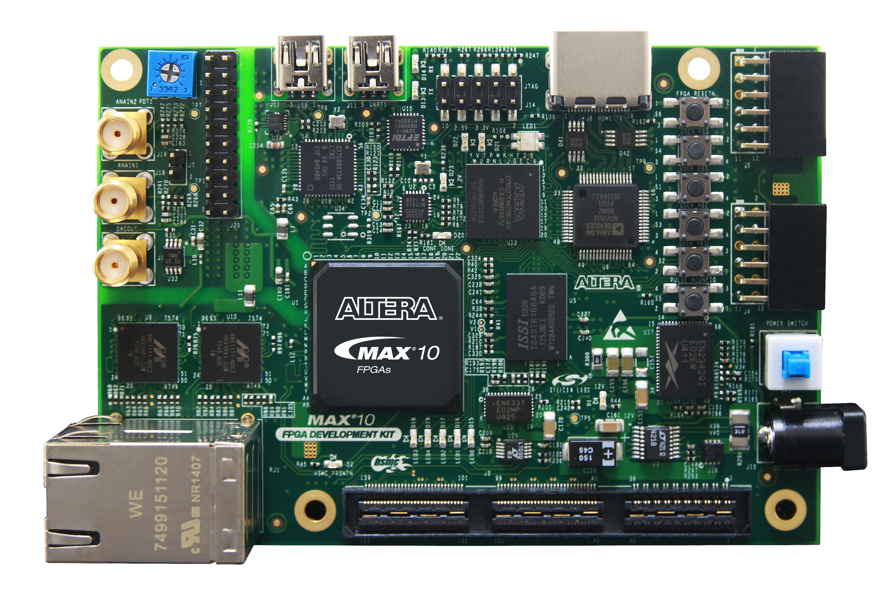
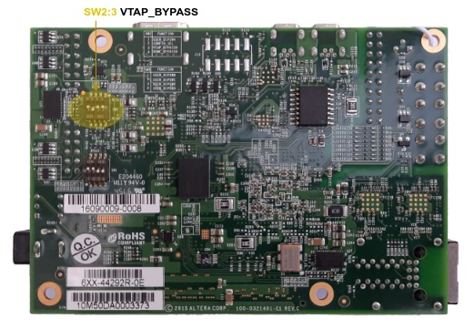

.. _intel_dk_dev_10m50:

Intel MAX 10 FPGA Development Kit
#################################

Overview
********

The Zephyr kernel is supported on the Intel MAX10 FPGA Development Kit Rev C,
using the Nios II Gen 2 soft CPU.

The board doesn't requires any separate JTAG probe, it comes with an on-board
`Intel FPGA Download Cable II`_.

   Intel's MAX10 FPGA Development Kit, DK-DEV-10M50-A (Credit: Intel)

.. rubric:: Key Features

- Develop designs for the 10M50D, dual supply, F484 package FPGA
- Interface Intel MAX 10 FPGAs analog-to-digital block conversion
- Interface Intel MAX 10 FPGAs to DDR3 memory at 300 MHz
- Interface Intel MAX 10 FPGAs to Quad SPI flash memory
- Ready to integrate Nios II Gen 2 (fast) soft CPU at 75 MHz
- Memory devices:

  - 64Mx16 1 Gb DDR3 SDRAM with soft memory controller
  - 128Mx8 1 Gb DDR3 SDRAM with soft memory controller
  - 512Mb quad serial peripheral interface (QSPI) flash memory

- Board connectors:

  - Optional JTAG direct via 10-pin header
  - One mini-USB 2.0 UART
  - Two Gigabit Ethernet (GbE) RJ45 ports
  - One HDMI video output
  - One universal HSMC connector
  - Two 12-pin Digilent Pmod compatible connectors
  - Potentiometer input to ADC
  - 2x10 ADC header
  - One external 16 bit digital-to-analog converter with SMA output
  - Two Intel MAX 10 FPGA ADC SMA inputs
  - Switches, push buttons, jumpers, and status LEDs
  - Single power-supply input: 12V/2A external sources

More information about the board can be found at the
`Intel MAX 10 FPGA Development Kit website`_.

.. rubric:: Further Literature

* `Intel MAX 10 FPGA Development Kit User Guide`_
* `Intel MAX 10 FPGA Development Kit Rev C Schematic`_
* `Intel MAX 10 FPGA Development Kit Rev C PCB Complete kit installation`_

.. ...........................................................................

Hardware
********

DIP Switch settings
===================

There are two sets of switches on the back of the board. Of particular
importance is :byl:`SW2`:

:Switch 2:

   **CONFIG_SEL**:
   should be in the **OFF** (*up*) position
   so that the first boot image is *CFM0*.

:Switch 3:

   **VTAP_BYPASS**:
   needs to be in the **ON** (*down*) position
   :rd:`or the flashing scripts won't work`.

:Switch 4:

   **HSMC_BYPASSN**:
   should be **OFF** (*up*).

Other switches are user switches, their position is application-specific.

Necessary Software
==================

You will need the Nios II Embedded Design Suite (EDS) in order to work with
this device. The `Intel Quartus Prime Lite Edition`_ comes with that EDS and
may be obtained without charge.

For your convenience using the Nios II Embedded Design Suite (EDS) tools
(such as :command:`nios2-configure-sof`), you should put the binaries
provided by the Nios II EDS in your path. Below is an example, adjust
:envvar:`QUARTUS_BASE` to where you installed the Quartus Prime software:

.. code-block:: console

   export QUARTUS_BASE=/opt/intelFPGA_lite/20.1.1
   export PATH=$PATH:$QUARTUS_BASE/quartus/bin:$QUARTUS_BASE/nios2eds/bin

You may need to adjust your udev rules so that you can talk to the USB Blaster
II peripheral, which is the built-in JTAG interface for this device.

The following works for Ubuntu 20.04:

.. code-block:: console

   # Intel FPGA Download Cable (Altera USB Blaster)
   ATTRS{idVendor}=="09fb", ATTRS{idProduct}=="6001", \
   MODE="660", GROUP="plugdev", TAG+="uaccess"
   ATTRS{idVendor}=="09fb", ATTRS{idProduct}=="6002", \
   MODE="660", GROUP="plugdev", TAG+="uaccess"
   ATTRS{idVendor}=="09fb", ATTRS{idProduct}=="6003", \
   MODE="660", GROUP="plugdev", TAG+="uaccess"

   # Intel FPGA Download Cable II (USB Blaster II)
   ATTRS{idVendor}=="09fb", ATTRS{idProduct}=="6010", \
   MODE="660", GROUP="plugdev", TAG+="uaccess"
   ATTRS{idVendor}=="09fb", ATTRS{idProduct}=="6810", \
   MODE="660", GROUP="plugdev", TAG+="uaccess"

You can test connectivity with the EDS :command:`jtagconfig` tool,
you should see something like:

.. code-block:: console

   $ jtagconfig
   1) USB-BlasterII [1-4.3]
     031050DD   10M50DA(.|ES)/10M50DC

.. rubric:: Further Literature

* `Intel Quartus Prime Software User Guides`_
* `Quartus II Handbook Volume 1 (Design and Synthesis)`_
* `Quartus II Handbook Volume 2 (Design Implementation and Optimization)`_
* `Quartus II Handbook Volume 3 (Verification)`_
* `Quartus II Scripting Reference Manual (2013)`_
* `Nios II Command-Line Tools (2011)`_

Reference CPU
=============

A reference CPU design of a Nios II/f core is included in the Zephyr tree
in the :zephyr_file:`soc/nios2/nios2f-zephyr/cpu` directory. This was provided
for the original Zephyr board support, :ref:`zephyr:altera_max10`, and was used
as the starting point for an improved and further developed reference in this
Zephyr board support, now called :ref:`intel_dk_dev_10m50`
(``intel_dk_dev_10m50``). Further development takes place in an independent
Git repository: `Golden Hardware Reference Designs (GHDR) for System On Chips
in FPGA (SOCFPGA)`_. This is supplied as Zephyr modules, so that the reference
designs contained therein can be used directly for Zephyr software development.

For the :ref:`intel_dk_dev_10m50` you have to use the SRAM Object File
ghrd_10m50daf484c6ges.sof_ in folder :file:`nios2f-zephyr/dk-dev-10m50-a`.

Flash this CPU using the :command:`nios2-configure-sof` SDK tool with the FPGA
configuration file ghrd_10m50daf484c6ges.sof_:

.. code-block:: console

   $ nios2-configure-sof ghrd_10m50daf484c6ges.sof

This CPU is a Nios II/F core with a 16550 UART, JTAG UART, and the Avalon
Timer. For any Nios II SOC definition, you can find out more details about
the CPU configuration by inspecting
:zephyr_file:`soc/nios2/nios2f-zephyr/include/system.h`
in the SOC's include directory.

- 736 kB On-Chip Flash Memory
- 128 kB On-Chip SRAM Memory
-  64 MB External QSPI Flash Memory

.. table:: Nios II Memory Map and Interrupts
   :class: longtable
   :align: center

   +-----------------------------+----------+------------+-----+--------------------+-----------------------------------------------------------------------+
   | Address Range               | Size     | Type       | IRQ | Instance           | Description                                                           |
   +=============================+==========+============+=====+====================+=======================================================================+
   | *Memory (Core and Peripherals)*                                                                                                                        |
   +-----------------------------+----------+------------+-----+--------------------+-----------------------------------------------------------------------+
   | 0x00000000 - 0x000B7FFF (!) |   753664 | Flash      |     | onchip_flash_0     | On-Chip Flash, `Intel MAX 10 User Flash Memory User Guide`_           |
   +-----------------------------+----------+------------+-----+--------------------+-----------------------------------------------------------------------+
   | 0x00400000 - 0x0041FFFF (!) |   131072 | SRAM (DMA) |     | onchip_memory2_0   | On-Chip Memory (RAM or ROM), `Embedded Peripherals IP User Guide`_    |
   +-----------------------------+----------+------------+-----+--------------------+-----------------------------------------------------------------------+
   | 0x70000000 - 0x73FFFFFF     | 67108864 | QSPI Flash |     | ext_flash_0        | Generic QUAD SPI controller II, `Embedded Peripherals IP User Guide`_ |
   +-----------------------------+----------+------------+-----+--------------------+-----------------------------------------------------------------------+
   | *Memory Mapped I/O (Peripherals)*                                                                                                                      |
   +-----------------------------+----------+------------+-----+--------------------+-----------------------------------------------------------------------+
   | 0x00100000 - 0x001001FF     |      512 | Register   |   8 | uart_16550_0       | 16550 Compatible UART, `Embedded Peripherals IP User Guide`_          |
   +-----------------------------+----------+------------+-----+--------------------+-----------------------------------------------------------------------+
   | 0x00101000 - 0x0010103F     |       64 | Register   |  16 | i2c_avalon_0       | Avalon I2C (Master), `Embedded Peripherals IP User Guide`_            |
   +-----------------------------+----------+------------+-----+--------------------+-----------------------------------------------------------------------+
   | 0x00102000 - 0x0010201F     |       32 | Register   |  20 | spi_avalon_0       | SPI (3 Wire Serial), `Embedded Peripherals IP User Guide`_            |
   +-----------------------------+----------+------------+-----+--------------------+-----------------------------------------------------------------------+
   | 0x00103000 - 0x0010300F     |       16 | Register   |     | pio_avalon_led     | PIO (Parallel I/O), `Embedded Peripherals IP User Guide`_             |
   +-----------------------------+----------+------------+-----+--------------------+-----------------------------------------------------------------------+
   | 0x00181000 - 0x0018103F     |       64 | Register   |  28 | ext_flash_0.csr    | Generic QUAD SPI controller II, `Embedded Peripherals IP User Guide`_ |
   +-----------------------------+----------+------------+-----+--------------------+-----------------------------------------------------------------------+
   | 0x00183000 - 0x0018300F     |       16 | Register   |     | altpll_0           | QSPI Flash Clock, `ALTPLL (Phase-Locked Loop) IP Core User Guide`_    |
   +-----------------------------+----------+------------+-----+--------------------+-----------------------------------------------------------------------+
   | *Memory Mapped I/O (Core)*                                                                                                                             |
   +-----------------------------+----------+------------+-----+--------------------+-----------------------------------------------------------------------+
   | 0x00200000 - 0x002007FF (!) |     4096 | Register   |     | nios2_gen2_0.debug | Nios II Processor, `Nios II Processor Reference Guide`_               |
   +-----------------------------+----------+------------+-----+--------------------+-----------------------------------------------------------------------+
   | 0x00200800 - 0x00200807 (!) |        8 | Register   |     | sysid              | System ID Peripheral, `Embedded Peripherals IP User Guide`_           |
   +-----------------------------+----------+------------+-----+--------------------+-----------------------------------------------------------------------+
   | 0x00200840 - 0x00200847 (!) |        8 | Register   |   0 | uart_jtag_0        | JTAG UART, `Embedded Peripherals IP User Guide`_                      |
   +-----------------------------+----------+------------+-----+--------------------+-----------------------------------------------------------------------+
   | 0x00200880 - 0x0020089F (!) |       32 | Register   |   1 | timer_avalon_0     | Interval Timer, `Embedded Peripherals IP User Guide`_                 |
   +-----------------------------+----------+------------+-----+--------------------+                                                                       +
   | 0x002008A0 - 0x002008BF (!) |       32 | Register   |   2 | timer_avalon_1     |                                                                       |
   +-----------------------------+----------+------------+-----+--------------------+                                                                       +
   | 0x002008C0 - 0x002008DF (!) |       32 | Register   |   3 | timer_avalon_2     |                                                                       |
   +-----------------------------+----------+------------+-----+--------------------+-----------------------------------------------------------------------+
   | 0x00202000 - 0x00202007 (!) |        8 | Register   |     | onchip_flash_0.csr | On-Chip Flash, `Intel MAX 10 User Flash Memory User Guide`_           |
   +-----------------------------+----------+------------+-----+--------------------+-----------------------------------------------------------------------+
   | 0x00202100 - 0x0020211F (!) |       32 | Register   |   4 | msgdma_0.csr       | Modular Scatter-Gather DMA, `Embedded Peripherals IP User Guide`_     |
   +-----------------------------+----------+------------+-----+--------------------+                                                                       +
   | 0x00202120 - 0x0020212F (!) |       16 | Register   |     | msgdma_0.descr     |                                                                       |
   +-----------------------------+----------+------------+-----+--------------------+                                                                       +
   | 0x00202140 - 0x0020215F (!) |       32 | Register   |   5 | msgdma_1.csr       |                                                                       |
   +-----------------------------+----------+------------+-----+--------------------+                                                                       +
   | 0x00202160 - 0x0020216F (!) |       16 | Register   |     | msgdma_1.descr     |                                                                       |
   +-----------------------------+----------+------------+-----+--------------------+-----------------------------------------------------------------------+

(!) Locked address range:
    This memory range is fixed in CPU refernece design and should never
    change or swap by further development.

.. rubric:: Further Literature

* `Embedded Design Handbook`_
* `Nios II Software Developer Handbook`_
* `Nios II Processor Reference Guide`_
* `Nios II Processor Booting Methods in MAX 10 FPGA Devices (AN-730)`_
* `Embedded Peripherals IP User Guide`_
* `ALTPLL (Phase-Locked Loop) IP Core User Guide`_
* `Intel MAX 10 Clocking and PLL User Guide`_
* `Intel MAX 10 Embedded Multipliers User Guide`_
* `Intel MAX 10 Analog to Digital Converter User Guide`_
* `Intel MAX 10 User Embedded Memory User Guide`_
* `Intel MAX 10 User Flash Memory User Guide`_
* `Intel MAX 10 FPGA Configuration User Guide`_
* `Intel MAX 10 FPGA Power Management User Guide`_
* `Intel MAX 10 FPGA JTAG Boundary-Scan Testing User Guide`_
* `Intel MAX 10 FPGA High-Speed LVDS I/O User Guide`_
* `Intel MAX 10 FPGA General Purpose I/O User Guide`_
* `Intel MAX 10 FPGA Device Family Pin Connection Guidelines`_
* `Intel MAX 10 FPGA Design Guidelines`_
* `Intel MAX 10 FPGA Device Architecture`_
* `Intel MAX 10 FPGA Device Overview`_
* `Intel MAX 10 FPGA Device Datasheet`_
* `MAX 10 Device Errata`_

Console Output
==============

16550 UART
----------

By default, the kernel is configured to send console output to the 16550 UART.
You can monitor this on your workstation by connecting to the top right mini
USB port on the board (it will show up in /dev as a ttyUSB node), and then
running minicom with flow control disabled, 115200-8N1 settings.

JTAG UART
---------

You can also have it send its console output to the JTAG UART. Set these in
your project configuration:

.. code-block:: console

   CONFIG_UART_ALTERA_JTAG=y
   CONFIG_UART_CONSOLE_ON_DEV_NAME="JTAG_UART_0"

To view these messages on your local workstation, run the terminal application
:command:`nios2-terminal` in the SDK:

.. code-block:: console

   $ nios2-terminal

.. ...........................................................................

Programming and Debugging
*************************

Flashing
========

Flashing Kernel into UFM
------------------------

The usual ``flash`` target will work with the ``intel_dk_dev_10m50`` board
configuration. Here is an example for the :ref:`hello_world` application.

.. zephyr-app-commands::
   :app: zephyr/samples/hello_world
   :build-dir: hello_world-intel_dk_dev_10m50
   :board: intel_dk_dev_10m50
   :goals: build flash
   :host-os: unix

Refer to :ref:`build_an_application` and :ref:`application_run` for more
details.

This provisions the Zephyr kernel and the CPU configuration onto the board,
using the :zephyr_file:`scripts/support/quartus-flash.py` script. After it
completes the kernel will immediately boot.

Flashing Kernel directly into RAM over JTAG
-------------------------------------------

The SDK included the :command:`nios2-download` tool which will let you flash
a kernel directly into RAM and then boot it from the ``__start`` symbol.

In order for this to work, your entire kernel must be located in RAM. Make sure
the following config options are disabled:

.. code-block:: console

   CONFIG_XIP=n
   CONFIG_INCLUDE_RESET_VECTOR=n

Then, after building your kernel, push it into device's RAM by running
this from the build directory:

.. code-block:: console

   $ nios2-download --go zephyr/zephyr.elf

If you have a console session running (either :command:`nios2-terminal`,
or :command:`screen`, or :command:`minicom`) you should see the application's
output. There are additional arguments you can pass to :command:`nios2-download`
so that it spawns a GDB server that you can connect to, although it's typically
simpler to just use :command:`nios2-gdb-server` as described below.

Debugging
=========

The Intel SDK includes a GDB server which can be used to debug on this board.
You can either debug a running image that was flashed onto the device in User
Flash Memory (UFM), or load an image over the JTAG using GDB.

Debugging With UFM Flashed Image
--------------------------------

You can debug an application in the usual way.  Here is an example.

.. zephyr-app-commands::
   :app: zephyr/samples/hello_world
   :build-dir: hello_world-intel_dk_dev_10m50-debug
   :board: intel_dk_dev_10m50
   :goals: build debug
   :host-os: unix

You will see output similar to the following:

.. code-block:: console

   -- runners.nios2: Nios II GDB server running on port 3333
   Ignoring --stop option because --tcpport also specified
   GNU gdb (crosstool-NG 1.24.0.212_d7da3a9) 9.2
   Copyright (C) 2020 Free Software Foundation, Inc.
   License GPLv3+: GNU GPL version 3 or later <http://gnu.org/licenses/gpl.html>
   This is free software: you are free to change and redistribute it.
   There is NO WARRANTY, to the extent permitted by law.
   Type "show copying" and "show warranty" for details.
   This GDB was configured as "--host=x86_64-build_pc-linux-gnu --target=nios2-zephyr-elf".
   Type "show configuration" for configuration details.
   For bug reporting instructions, please see:
       <http://www.gnu.org/software/gdb/bugs/>.
   Find the GDB manual and other documentation resources online at:
       <http://www.gnu.org/software/gdb/documentation/>.

   For help, type "help".
   Type "apropos word" to search for commands related to "word"...
   Reading symbols from build/hello_world-intel_dk_dev_10m50-debug/zephyr/zephyr.elf...
   Remote debugging using :3333
   Using cable "USB-BlasterII [1-4.3]", device 1, instance 0x00
   Resetting and pausing target processor: OK
   Listening on port 3333 for connection from GDB: accepted
   __reset () at .../workspace/zephyr/arch/nios2/core/crt0.S:64
   64		movhi r1, %hi(__start)
   (gdb) b _PrepC
   Breakpoint 1 at 0x1ec4: file .../workspace/zephyr/arch/nios2/core/prep_c.c, line 36.
   (gdb) b z_cstart
   Breakpoint 2 at 0x2464: file ../workspace/zephyr/kernel/init.c, line 430.
   (gdb) c
   Continuing.

   Breakpoint 1, _PrepC () at ../workspace/zephyr/arch/nios2/core/prep_c.c:36
   36		z_bss_zero();
   (gdb) _

To start debugging manually:

.. code-block:: console

   nios2-gdb-server --tcpport 1234 --stop --reset-target

You will see output similar to the following:

.. code-block:: console

   Ignoring --stop option because --tcpport also specified
   Using cable "USB-BlasterII [1-4.3]", device 1, instance 0x00
   Resetting and pausing target processor: OK
   Listening on port 1234 for connection from GDB: 60s
   Listening on port 1234 for connection from GDB: 59s
   Listening on port 1234 for connection from GDB: 58s
   Listening on port 1234 for connection from GDB: 57s

   Listening on port 1234 for connection from GDB: accepted

   Exiting due to 'k' command from GDB
   Leaving target processor paused

And then connect with GDB from the build directory:

.. code-block:: console

   nios2-zephyr-elf-gdb build/hello_world-intel_dk_dev_10m50-debug/zephyr/zephyr.elf \
                        -ex "target remote :1234"

You will see output similar to the following:

.. code-block:: console

   GNU gdb (crosstool-NG 1.24.0.212_d7da3a9) 9.2
   Copyright (C) 2020 Free Software Foundation, Inc.
   License GPLv3+: GNU GPL version 3 or later <http://gnu.org/licenses/gpl.html>
   This is free software: you are free to change and redistribute it.
   There is NO WARRANTY, to the extent permitted by law.
   Type "show copying" and "show warranty" for details.
   This GDB was configured as "--host=x86_64-build_pc-linux-gnu --target=nios2-zephyr-elf".
   Type "show configuration" for configuration details.
   For bug reporting instructions, please see:
       <http://www.gnu.org/software/gdb/bugs/>.
   Find the GDB manual and other documentation resources online at:
       <http://www.gnu.org/software/gdb/documentation/>.

   For help, type "help".
   Type "apropos word" to search for commands related to "word"...
   Reading symbols from build/hello_world-intel_dk_dev_10m50-debug/zephyr/zephyr.elf...
   Remote debugging using :1234
   __reset () at .../workspace/zephyr/arch/nios2/core/crt0.S:64
   64		movhi r1, %hi(__start)
   (gdb) b _PrepC
   Breakpoint 1 at 0x1ec4: file .../workspace/zephyr/arch/nios2/core/prep_c.c, line 36.
   (gdb) b z_cstart
   Breakpoint 2 at 0x2464: file .../workspace/zephyr/kernel/init.c, line 430.
   (gdb) c
   Continuing.

   Breakpoint 1, _PrepC () at .../workspace/zephyr/arch/nios2/core/prep_c.c:36
   36		z_bss_zero();
   (gdb) _

Debugging With JTAG Flashed Image
---------------------------------

In order for this to work, execute-in-place must be disabled, since the GDB
'load' command can only put text and data in RAM. Ensure this is in your
configuration:

.. code-block:: console

   CONFIG_XIP=n

It is OK for this procedure to leave the reset vector enabled, unlike
:command:`nios2-download` (which errors out if it finds sections outside
of SRAM) it will be ignored.

In a terminal, launch the nios2 GDB server. It doesn't matter what kernel (if
any) is on the device, but you should have at least flashed a CPU using
:command:`nios2-configure-sof`. You can leave this process running.

.. code-block:: console

   $ nios2-gdb-server --tcpport 1234 --tcppersist --init-cache --reset-target

Build your Zephyr kernel, and load it into a GDB built for Nios II (included in
the Zephyr SDK) from the build directory:

.. code-block:: console

   $ nios2-zephyr-elf-gdb build/hello_world-intel_dk_dev_10m50-debug/zephyr/zephyr.elf

Then connect to the GDB server:

.. code-block:: console

   (gdb) target remote :1234

And then load the kernel image over the wire. The CPU will not start from the
reset vector, instead it will boot from the ``__start`` symbol:

.. code-block:: console

   (gdb) load
   Loading section reset, size 0xc lma 0x0
   Loading section text, size 0x32d0 lma 0x20
   Loading section initlevel, size 0x18 lma 0x32f0
   Loading section devices, size 0x30 lma 0x3308
   Loading section sw_isr_table, size 0x100 lma 0x3338
   Loading section device_handles, size 0x10 lma 0x3438
   Loading section rodata, size 0x1ac lma 0x3448
   Loading section exceptions, size 0x19c lma 0x35f4
   Loading section datas, size 0x24 lma 0x3790
   Start address 0x00001f14, load size 14240
   Transfer rate: 220 KB/sec, 309 bytes/write.

After this is done you may set breakpoints and continue execution. If you ever
want to reset the CPU, issue the GDB :command:`load` command again.

.. ...........................................................................

References
**********

.. target-notes::

.. _Intel FPGA Download Cable II:
   https://www.intel.com/content/www/us/en/programmable/products/boards_and_kits/download-cables.html?wapkw=Download%20Cables

.. _Intel Quartus Prime Lite Edition:
   https://fpgasoftware.intel.com/?edition=lite

.. _Intel MAX 10 FPGA Development Kit website:
   https://fpgacloud.intel.com/devstore/board/max-10-fpga-development-kit

.. _Intel MAX 10 FPGA Development Kit User Guide:
   http://www.altera.com/literature/ug/ug-max10m50-fpga-dev-kit.pdf

.. _Intel MAX 10 FPGA Development Kit Rev C Schematic:
   https://www.intel.com/content/dam/altera-www/global/en_US/support/boards-kits/max10_dk_schematic_revC_pcb.pdf

.. _Intel MAX 10 FPGA Development Kit Rev C PCB Complete kit installation:
   https://www.intel.com/content/dam/altera-www/global/en_US/support/boards-kits/max10/max10_10m50daf484c6ges_v15.0.0_RevC.zip

.. _Embedded Design Handbook:
   http://www.altera.com/literature/hb/nios2/edh_ed_handbook.pdf

.. _Nios II Software Developer Handbook:
   http://www.altera.com/literature/hb/nios2/n2sw_nii5v2gen2.pdf

.. _Nios II Processor Reference Guide:
   http://www.altera.com/literature/hb/nios2/n2cpu-nii5v1gen2.pdf

.. _Nios II Processor Booting Methods in MAX 10 FPGA Devices (AN-730):
   http://www.altera.com/literature/an/an730.pdf

.. _Embedded Peripherals IP User Guide:
   http://www.altera.com/literature/ug/ug_embedded_ip.pdf

.. _ALTPLL (Phase-Locked Loop) IP Core User Guide:
   http://www.altera.com/literature/ug/ug_altpll.pdf

.. _Intel MAX 10 Clocking and PLL User Guide:
   http://www.altera.com/literature/hb/max-10/ug_m10_clkpll.pdf

.. _Intel MAX 10 Embedded Multipliers User Guide:
   http://www.altera.com/literature/hb/max-10/ug_m10_dsp.pdf

.. _Intel MAX 10 Analog to Digital Converter User Guide:
   http://www.altera.com/literature/hb/max-10/ug_m10_adc.pdf

.. _Intel MAX 10 User Embedded Memory User Guide:
   http://www.altera.com/literature/hb/max-10/ug_m10_memory.pdf

.. _Intel MAX 10 User Flash Memory User Guide:
   http://www.altera.com/literature/hb/max-10/ug_m10_ufm.pdf

.. _Intel MAX 10 FPGA Configuration User Guide:
   http://www.altera.com/literature/hb/max-10/ug_m10_config.pdf

.. _Intel MAX 10 FPGA Power Management User Guide:
   http://www.altera.com/literature/hb/max-10/ug_m10_pwr.pdf

.. _Intel MAX 10 FPGA JTAG Boundary-Scan Testing User Guide:
   http://www.altera.com/literature/hb/max-10/ug_m10_jtag.pdf

.. _Intel MAX 10 FPGA High-Speed LVDS I/O User Guide:
   http://www.altera.com/literature/hb/max-10/ug_m10_lvds.pdf

.. _Intel MAX 10 FPGA General Purpose I/O User Guide:
   http://www.altera.com/literature/hb/max-10/ug_m10_gpio.pdf

.. _Intel MAX 10 FPGA Device Family Pin Connection Guidelines:
   http://www.altera.com/literature/dp/max-10/pcg-01018.pdf

.. _Intel MAX 10 FPGA Design Guidelines:
   http://www.altera.com/literature/hb/max-10/m10_guidelines.pdf

.. _Intel MAX 10 FPGA Device Architecture:
   http://www.altera.com/literature/hb/max-10/m10_architecture.pdf

.. _Intel MAX 10 FPGA Device Overview:
   http://www.altera.com/literature/hb/max-10/m10_overview.pdf

.. _Intel MAX 10 FPGA Device Datasheet:
   http://www.altera.com/literature/hb/max-10/m10_datasheet.pdf

.. _MAX 10 Device Errata:
   http://www.altera.com/literature/es/es_max10.pdf

.. _Intel Quartus Prime Software User Guides:
   https://www.intel.com/content/www/us/en/programmable/products/design-software/fpga-design/quartus-prime/user-guides.html

.. _Quartus II Handbook Volume 1 (Design and Synthesis):
   http://www.altera.com/literature/hb/qts/qts_qii5v1.pdf

.. _Quartus II Handbook Volume 2 (Design Implementation and Optimization):
   http://www.altera.com/literature/hb/qts/qts_qii5v2.pdf

.. _Quartus II Handbook Volume 3 (Verification):
   http://www.altera.com/literature/hb/qts/qts_qii5v3.pdf

.. _Quartus II Scripting Reference Manual (2013):
   http://www.altera.com/literature/manual/tclscriptrefmnl.pdf

.. _Nios II Command-Line Tools (2011):
   http://www.altera.com/literature/hb/nios2/edh_ed51004.pdf

.. _Golden Hardware Reference Designs (GHDR) for System On Chips in FPGA (SOCFPGA):
   https://github.com/tiacsys/ghrd-socfpga

.. _ghrd_10m50daf484c6ges.sof:
   https://github.com/tiacsys/ghrd-socfpga/blob/main/nios2f-zephyr/dk-dev-10m50-a/ghrd_10m50daf484c6ges.sof?raw=true
