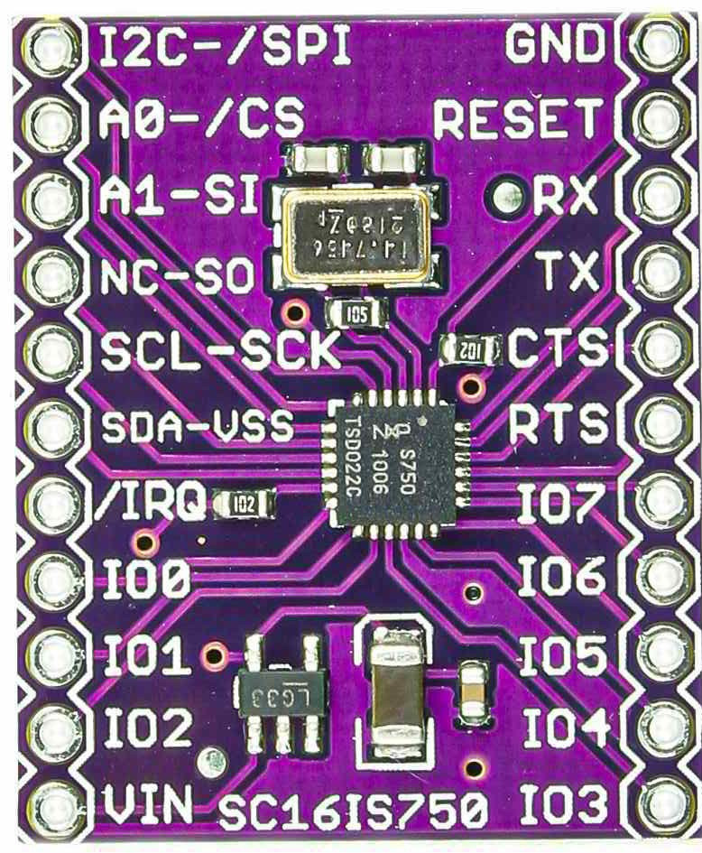

.. _boards_cjmcu_750:

CJMCU-750 (SC16IS750 Breakout)
##############################

.. toctree::

A breakout kit for the NXP SC16IS750 I2C/SPI to UART/GPIO bridge, providing one
outgoing serial connection and up to 8 GPIO pins. The board also contains a
14.7465 MHz clock rate source for the SC16IS750.

.. note::

   The board contains a design defect resulting in the interrupt pin (``irq``)
   of the SC16IS750 not being physically connected to the board outputs. See
   also `https://github.com/sparkfun/SC16IS750_Breakout/issues/1`_.

I2C Addressing
==============

The SC16IS750 supports variable I2C addressing through its address select pins
``A0`` and ``A1``. To select the I2C address ``0x48`` referenced in these
overlays, both of these pins must be pulled high. See the table below for other
address settings.

.. table:: I2C address selection.

   +------------+------------+-------------+----------+------------------+
   |     A1     |     A2     | Raw Address | 8bit Hex | Shifted 7bit Hex |
   +============+============+=============+==========+==================+
   | V:sub:`DD` | V:sub:`DD` | 1001 000X   | 0x90     | 0x48             |
   | V:sub:`DD` | V:sub:`SS` | 1001 001X   | 0x92     | 0x49             |
   | V:sub:`DD` | SCL        | 1001 010X   | 0x94     | 0x4A             |
   | V:sub:`DD` | SDA        | 1001 011X   | 0x96     | 0x4B             |
   | V:sub:`SS` | V:sub:`DD` | 1001 100X   | 0x98     | 0x4C             |
   | V:sub:`SS` | V:sub:`SS` | 1001 101X   | 0x9A     | 0x4D             |
   | V:sub:`SS` | SCL        | 1001 110X   | 0x9C     | 0x4E             |
   | V:sub:`SS` | SDA        | 1001 111X   | 0x9E     | 0x4F             |
   | SCL        | V:sub:`DD` | 1010 000X   | 0xA0     | 0x50             |
   | SCL        | V:sub:`SS` | 1010 001X   | 0xA2     | 0x51             |
   | SCL        | SCL        | 1010 010X   | 0xA4     | 0x52             |
   | SCL        | SDA        | 1010 011X   | 0xA6     | 0x53             |
   | SDA        | V:sub:`DD` | 1010 100X   | 0xA8     | 0x54             |
   | SDA        | V:sub:`SS` | 1010 101X   | 0xAA     | 0x55             |
   | SDA        | SCL        | 1010 110X   | 0xAC     | 0x56             |
   | SDA        | SDA        | 1010 111X   | 0xAE     | 0x57             |
   +------------+------------+-------------+----------+------------------+
