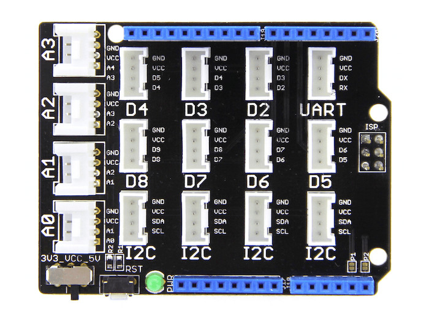
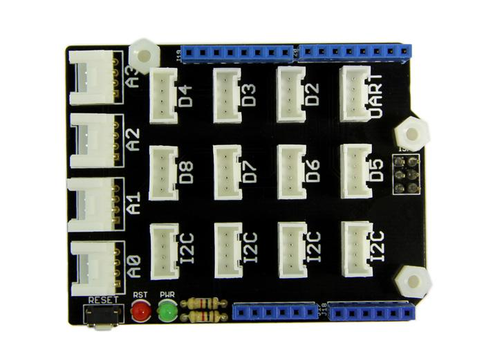
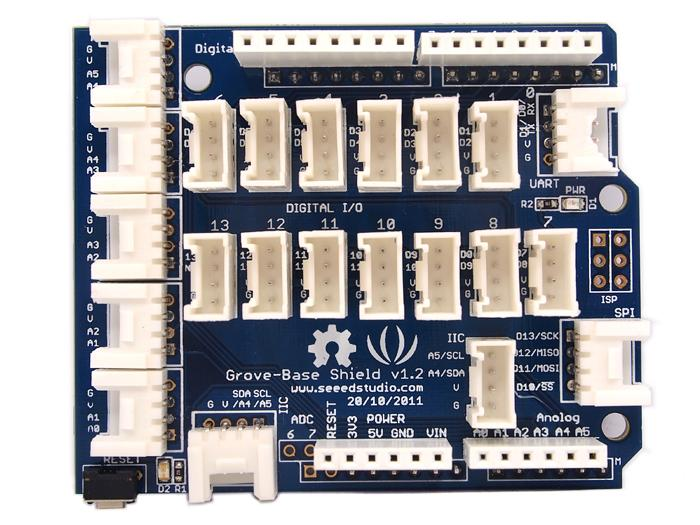
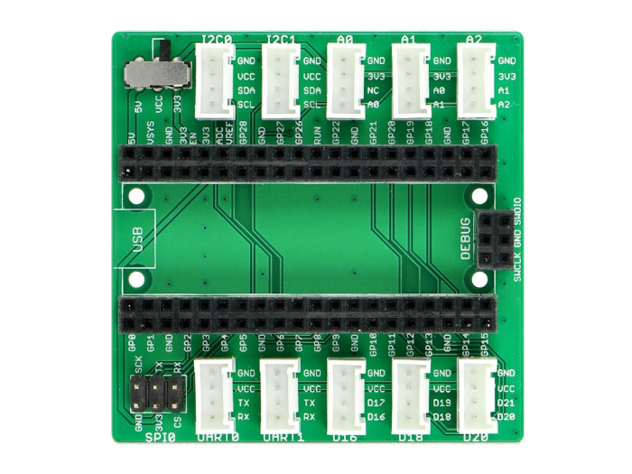

.. image:: /images/seeed_grove.png
   :align: right

.. _grove_shield:

Seeed Studio Grove Interconnect Shields
#######################################

Bridle supports a couple of different shields carrying Seeed Studio
`Grove System`_ connectors. Please download and read through the
`Preface - Getting Started`_ and `Introduction to Grove`_ before
use the product. Also have a look on the SiPEED Wiki page about the
`Grove standard interfaces`_.

.. _grove_base_shield:

Grove Base Shield
*****************

The `Grove Base Shield`_ is an Arduino Shield that breaks out the Arduino
pins to Grove connectors. Once you plug the Base shield on the Arduino,
you will be able to plug a Grove module to one of the Grove connectors
on the Base Shield. All I/O ports of the Arduino are exposed and adapted
into Grove connectors which include digital I/O, analog I/O, and specialized
ports (I2C, SPI, UART).

Versions
========

There are three versions, but nowadays only version 2 should be used actively.
Here find the comparison between various versions of Grove Base Shield:

+-----------------------+------------------+------------------+------------------+------------------+
| Parameter             | Base Shield V2.1 | Base Shield V2.0 | Base Shield V1.3 | Base Shield V1.2 |
+=======================+==================+==================+==================+==================+
| Release Date          | Aug 2015         | Mar 2014         | Aug 2012         | Oct 2011         |
+-----------------------+------------------+------------------+------------------+------------------+
| Operation Voltage     | 3.3V or 5V       | 3.3V or 5V       | 5V only          | 5V only          |
+-----------------------+------------------+------------------+------------------+------------------+
| Operation Temperature | -25℃ to +85℃     |                  |                  |                  |
+-----------------------+------------------+------------------+------------------+------------------+
| Grove Connectors      | 16               | 16               | 16               | 22               |
+-----------------------+------------------+------------------+------------------+------------------+
| Digital Ports         | 7 +1 (UART)      | 7 +1 (UART)      | 7 +1 (UART)      | 14               |
+-----------------------+------------------+------------------+------------------+------------------+
| Analog Ports          | 4                | 4                | 4                | 5                |
+-----------------------+------------------+------------------+------------------+------------------+
| UART Ports            | 1                | 1                | 1                | 1                |
+-----------------------+------------------+------------------+------------------+------------------+
| I2C Ports             | 4                | 4                | 4                | 3                |
+-----------------------+------------------+------------------+------------------+------------------+
| SPI Ports             |                  |                  |                  | 1                |
+-----------------------+------------------+------------------+------------------+------------------+

:Digital Ports: see `Grove Digital Layout`_
:Analog Ports: see `Grove Analog Layout`_
:UART Ports: see `Grove UART Layout`_
:I2C Ports: see `Grove I2C Layout`_
:SPI Ports: The `Grove System`_ does not specify an SPI port.
   The port listed here was therefore only provided exclusively
   and without standardization on the very first shield.

.. _grove_base_shield_v2:

Grove Base Shield V2
====================

Overview
--------

**Model:** 103030000

The `Grove Base Shield V2.1`_ and `Grove Base Shield V2.0`_ board provides
a simple way to connect with Arduino boards. This version 2 focuses on the
simplicity of power supply.

Power Compatible
----------------

Every Grove connector has four wires, one of which is the VCC. However, not
every controller main board needs a supply voltage of 5V, some boards only
need 3.3V. That's why now a power toggle switch was add to this version so
that one can select the suitable voltage of the controller main board using
via this switch.

Pinout Diagram
--------------

The pinout of Base Shield V2 is the same as `Arduino Uno R3`_. The shield
usually has the same pin position as the Arduino development board and can
be stacked and plugged into Arduino compatible boatds to implement specific
functions.

Hardware
--------

- `Grove Base Shield V2.1 Eagle Schematic`_
- `Grove Base Shield V2.1 Eagle Layout`_
- `Grove Base Shield V2.1 Schematic`_
- `Grove Base Shield V2.1 Layout`_
- `Grove Base Shield V2.0 Eagle Files`_
- `Grove Base Shield V2.0 Schematic`_

+-------+---------------------------------+----+----+----+----+-------+------+----+----+----+----+----+----+----+
| Name  | Function to Grove port-pin -->  | A0 | A1 | A2 | A3 |  I2C  | UART | D2 | D3 | D4 | D5 | D6 | D7 | D8 |
+=======+=================================+====+====+====+====+=======+======+====+====+====+====+====+====+====+
| A0    | Analog 0 / Digital 14           |  1 |    |    |    |       |      |    |    |    |    |    |    |    |
+-------+---------------------------------+----+----+----+----+-------+------+----+----+----+----+----+----+----+
| A1    | Analog 1 / Digital 15           |  2 |  1 |    |    |       |      |    |    |    |    |    |    |    |
+-------+---------------------------------+----+----+----+----+-------+------+----+----+----+----+----+----+----+
| A2    | Analog 2 / Digital 16           |    |  2 |  1 |    |       |      |    |    |    |    |    |    |    |
+-------+---------------------------------+----+----+----+----+-------+------+----+----+----+----+----+----+----+
| A3    | Analog 3 / Digital 17           |    |    |  2 |  1 |       |      |    |    |    |    |    |    |    |
+-------+---------------------------------+----+----+----+----+-------+------+----+----+----+----+----+----+----+
| A4    | Analog 4 / Digital 18 / I2C-SDA |    |    |    |  2 | 2 (*) |      |    |    |    |    |    |    |    |
+-------+---------------------------------+----+----+----+----+-------+------+----+----+----+----+----+----+----+
| A5    | Analog 5 / Digital 19 / I2C-SCL |    |    |    |    | 1 (*) |      |    |    |    |    |    |    |    |
+-------+---------------------------------+----+----+----+----+-------+------+----+----+----+----+----+----+----+
| D0    | Digital 0 / UART-RX             |    |    |    |    |       |   1  |    |    |    |    |    |    |    |
+-------+---------------------------------+----+----+----+----+-------+------+----+----+----+----+----+----+----+
| D1    | Digital 1 / UART-TX             |    |    |    |    |       |   2  |    |    |    |    |    |    |    |
+-------+---------------------------------+----+----+----+----+-------+------+----+----+----+----+----+----+----+
| D2    | Digital 2 (INT0)                |    |    |    |    |       |      |  1 |    |    |    |    |    |    |
+-------+---------------------------------+----+----+----+----+-------+------+----+----+----+----+----+----+----+
| D3    | Digital 3 (INT1)                |    |    |    |    |       |      |  2 |  1 |    |    |    |    |    |
+-------+---------------------------------+----+----+----+----+-------+------+----+----+----+----+----+----+----+
| D4    | Digital 4                       |    |    |    |    |       |      |    |  2 |  1 |    |    |    |    |
+-------+---------------------------------+----+----+----+----+-------+------+----+----+----+----+----+----+----+
| D5    | Digital 5                       |    |    |    |    |       |      |    |    |  2 |  1 |    |    |    |
+-------+---------------------------------+----+----+----+----+-------+------+----+----+----+----+----+----+----+
| D6    | Digital 6                       |    |    |    |    |       |      |    |    |    |  2 |  1 |    |    |
+-------+---------------------------------+----+----+----+----+-------+------+----+----+----+----+----+----+----+
| D7    | Digital 7                       |    |    |    |    |       |      |    |    |    |    |  2 |  1 |    |
+-------+---------------------------------+----+----+----+----+-------+------+----+----+----+----+----+----+----+
| D8    | Digital 8                       |    |    |    |    |       |      |    |    |    |    |    |  2 |  1 |
+-------+---------------------------------+----+----+----+----+-------+------+----+----+----+----+----+----+----+
| D9    | Digital 9                       |    |    |    |    |       |      |    |    |    |    |    |    |  2 |
+-------+---------------------------------+----+----+----+----+-------+------+----+----+----+----+----+----+----+
| D10   | Digital 10 / SPI-CS             |    |    |    |    |       |      |    |    |    |    |    |    |    |
+-------+---------------------------------+----+----+----+----+-------+------+----+----+----+----+----+----+----+
| D11   | Digital 11 / SPI-MOSI           |    |    |    |    |       |      |    |    |    |    |    |    |    |
+-------+---------------------------------+----+----+----+----+-------+------+----+----+----+----+----+----+----+
| D12   | Digital 12 / SPI-MISO           |    |    |    |    |       |      |    |    |    |    |    |    |    |
+-------+---------------------------------+----+----+----+----+-------+------+----+----+----+----+----+----+----+
| D13   | Digital 13 / SPI-CLK            |    |    |    |    |       |      |    |    |    |    |    |    |    |
+-------+---------------------------------+----+----+----+----+-------+------+----+----+----+----+----+----+----+
| D18   | Digital 18 / I2C-SDA            |    |    |    |    |   2   |      |    |    |    |    |    |    |    |
+-------+---------------------------------+----+----+----+----+-------+------+----+----+----+----+----+----+----+
| D19   | Digital 19 / I2C-SCL            |    |    |    |    |   1   |      |    |    |    |    |    |    |    |
+-------+---------------------------------+----+----+----+----+-------+------+----+----+----+----+----+----+----+

(*) I2C bus default disconnected by open solder pads.

Grove Base Shield V1.3
======================

Overview
--------

**Model:** SLD01099P

The `Grove Base Shield V1.3`_ board has a similar shape to Arduino, which
enables exact reflections of each I/O pins. This 1.3 version focuses on the
simplicity of the interface and convenience of operation, making it even easier
to use for newbies. Here is a top view:

The pinout of Base Shield V1.3 is the same as `Arduino Uno R2`_.

Hardware
--------

- `Grove Base Shield V1.3 Eagle Files`_
- `Grove Base Shield V1.3 Schematic`_

+-------+---------------------------------+----+----+----+----+-----+------+----+----+----+----+----+----+----+
| Name  | Function to Grove port-pin -->  | A0 | A1 | A2 | A3 | I2C | UART | D2 | D3 | D4 | D5 | D6 | D7 | D8 |
+=======+=================================+====+====+====+====+=====+======+====+====+====+====+====+====+====+
| A0    | Analog 0 / Digital 14           |  1 |    |    |    |     |      |    |    |    |    |    |    |    |
+-------+---------------------------------+----+----+----+----+-----+------+----+----+----+----+----+----+----+
| A1    | Analog 1 / Digital 15           |  2 |  1 |    |    |     |      |    |    |    |    |    |    |    |
+-------+---------------------------------+----+----+----+----+-----+------+----+----+----+----+----+----+----+
| A2    | Analog 2 / Digital 16           |    |  2 |  1 |    |     |      |    |    |    |    |    |    |    |
+-------+---------------------------------+----+----+----+----+-----+------+----+----+----+----+----+----+----+
| A3    | Analog 3 / Digital 17           |    |    |  2 |  1 |     |      |    |    |    |    |    |    |    |
+-------+---------------------------------+----+----+----+----+-----+------+----+----+----+----+----+----+----+
| A4    | Analog 4 / Digital 18 / I2C-SDA |    |    |    |  2 |  2  |      |    |    |    |    |    |    |    |
+-------+---------------------------------+----+----+----+----+-----+------+----+----+----+----+----+----+----+
| A5    | Analog 5 / Digital 19 / I2C-SCL |    |    |    |    |  1  |      |    |    |    |    |    |    |    |
+-------+---------------------------------+----+----+----+----+-----+------+----+----+----+----+----+----+----+
| D0    | Digital 0 / UART-RX             |    |    |    |    |     |   1  |    |    |    |    |    |    |    |
+-------+---------------------------------+----+----+----+----+-----+------+----+----+----+----+----+----+----+
| D1    | Digital 1 / UART-TX             |    |    |    |    |     |   2  |    |    |    |    |    |    |    |
+-------+---------------------------------+----+----+----+----+-----+------+----+----+----+----+----+----+----+
| D2    | Digital 2 (INT0)                |    |    |    |    |     |      |  1 |    |    |    |    |    |    |
+-------+---------------------------------+----+----+----+----+-----+------+----+----+----+----+----+----+----+
| D3    | Digital 3 (INT1)                |    |    |    |    |     |      |  2 |  1 |    |    |    |    |    |
+-------+---------------------------------+----+----+----+----+-----+------+----+----+----+----+----+----+----+
| D4    | Digital 4                       |    |    |    |    |     |      |    |  2 |  1 |    |    |    |    |
+-------+---------------------------------+----+----+----+----+-----+------+----+----+----+----+----+----+----+
| D5    | Digital 5                       |    |    |    |    |     |      |    |    |  2 |  1 |    |    |    |
+-------+---------------------------------+----+----+----+----+-----+------+----+----+----+----+----+----+----+
| D6    | Digital 6                       |    |    |    |    |     |      |    |    |    |  2 |  1 |    |    |
+-------+---------------------------------+----+----+----+----+-----+------+----+----+----+----+----+----+----+
| D7    | Digital 7                       |    |    |    |    |     |      |    |    |    |    |  2 |  1 |    |
+-------+---------------------------------+----+----+----+----+-----+------+----+----+----+----+----+----+----+
| D8    | Digital 8                       |    |    |    |    |     |      |    |    |    |    |    |  2 |  1 |
+-------+---------------------------------+----+----+----+----+-----+------+----+----+----+----+----+----+----+
| D9    | Digital 9                       |    |    |    |    |     |      |    |    |    |    |    |    |  2 |
+-------+---------------------------------+----+----+----+----+-----+------+----+----+----+----+----+----+----+
| D10   | Digital 10                      |    |    |    |    |     |      |    |    |    |    |    |    |    |
+-------+---------------------------------+----+----+----+----+-----+------+----+----+----+----+----+----+----+
| D11   | Digital 11                      |    |    |    |    |     |      |    |    |    |    |    |    |    |
+-------+---------------------------------+----+----+----+----+-----+------+----+----+----+----+----+----+----+
| D12   | Digital 12                      |    |    |    |    |     |      |    |    |    |    |    |    |    |
+-------+---------------------------------+----+----+----+----+-----+------+----+----+----+----+----+----+----+
| D13   | Digital 13                      |    |    |    |    |     |      |    |    |    |    |    |    |    |
+-------+---------------------------------+----+----+----+----+-----+------+----+----+----+----+----+----+----+

.. _grove_base_shield_v1:

Grove Base Shield V1.2
======================

Overview
--------

**Model:** SLD12148P

The initial `Grove Base Shield V1.2`_ board is very similar in fashion to an
Arduino shield board. Here is a top view:

The pinout of Base Shield V1.2 is the same as `Arduino Uno R2`_.

Hardware
--------

- `Grove Base Shield V1.2 Eagle Files`_

+-------+---------------------------------+----+----+----+----+----+-----+---------+----+----+----+----+----+----+----+----+----+-----+-----+-----+-----+-----+
| Name  | Function to Grove port-pin -->  | A0 | A1 | A2 | A3 | A4 | IIC | UART/D0 | D1 | D2 | D3 | D4 | D5 | D6 | D7 | D8 | D9 | D10 | D11 | D12 | D13 | SPI |
+=======+=================================+====+====+====+====+====+=====+=========+====+====+====+====+====+====+====+====+====+=====+=====+=====+=====+=====+
| A0    | Analog 0 / Digital 14           |  1 |    |    |    |    |     |         |    |    |    |    |    |    |    |    |    |     |     |     |     |     |
+-------+---------------------------------+----+----+----+----+----+-----+---------+----+----+----+----+----+----+----+----+----+-----+-----+-----+-----+-----+
| A1    | Analog 1 / Digital 15           |  2 |  1 |    |    |    |     |         |    |    |    |    |    |    |    |    |    |     |     |     |     |     |
+-------+---------------------------------+----+----+----+----+----+-----+---------+----+----+----+----+----+----+----+----+----+-----+-----+-----+-----+-----+
| A2    | Analog 2 / Digital 16           |    |  2 |  1 |    |    |     |         |    |    |    |    |    |    |    |    |    |     |     |     |     |     |
+-------+---------------------------------+----+----+----+----+----+-----+---------+----+----+----+----+----+----+----+----+----+-----+-----+-----+-----+-----+
| A3    | Analog 3 / Digital 17           |    |    |  2 |  1 |    |     |         |    |    |    |    |    |    |    |    |    |     |     |     |     |     |
+-------+---------------------------------+----+----+----+----+----+-----+---------+----+----+----+----+----+----+----+----+----+-----+-----+-----+-----+-----+
| A4    | Analog 4 / Digital 18 / I2C-SDA |    |    |    |  2 |  1 |  2  |         |    |    |    |    |    |    |    |    |    |     |     |     |     |     |
+-------+---------------------------------+----+----+----+----+----+-----+---------+----+----+----+----+----+----+----+----+----+-----+-----+-----+-----+-----+
| A5    | Analog 5 / Digital 19 / I2C-SCL |    |    |    |    |  2 |  1  |         |    |    |    |    |    |    |    |    |    |     |     |     |     |     |
+-------+---------------------------------+----+----+----+----+----+-----+---------+----+----+----+----+----+----+----+----+----+-----+-----+-----+-----+-----+
| D0    | Digital 0 / UART-RX             |    |    |    |    |    |     |    1    |    |    |    |    |    |    |    |    |    |     |     |     |     |     |
+-------+---------------------------------+----+----+----+----+----+-----+---------+----+----+----+----+----+----+----+----+----+-----+-----+-----+-----+-----+
| D1    | Digital 1 / UART-TX             |    |    |    |    |    |     |    2    |  1 |    |    |    |    |    |    |    |    |     |     |     |     |     |
+-------+---------------------------------+----+----+----+----+----+-----+---------+----+----+----+----+----+----+----+----+----+-----+-----+-----+-----+-----+
| D2    | Digital 2 (INT0)                |    |    |    |    |    |     |         |  2 |  1 |    |    |    |    |    |    |    |     |     |     |     |     |
+-------+---------------------------------+----+----+----+----+----+-----+---------+----+----+----+----+----+----+----+----+----+-----+-----+-----+-----+-----+
| D3    | Digital 3 (INT1)                |    |    |    |    |    |     |         |    |  2 |  1 |    |    |    |    |    |    |     |     |     |     |     |
+-------+---------------------------------+----+----+----+----+----+-----+---------+----+----+----+----+----+----+----+----+----+-----+-----+-----+-----+-----+
| D4    | Digital 4                       |    |    |    |    |    |     |         |    |    |  2 |  1 |    |    |    |    |    |     |     |     |     |     |
+-------+---------------------------------+----+----+----+----+----+-----+---------+----+----+----+----+----+----+----+----+----+-----+-----+-----+-----+-----+
| D5    | Digital 5                       |    |    |    |    |    |     |         |    |    |    |  2 |  1 |    |    |    |    |     |     |     |     |     |
+-------+---------------------------------+----+----+----+----+----+-----+---------+----+----+----+----+----+----+----+----+----+-----+-----+-----+-----+-----+
| D6    | Digital 6                       |    |    |    |    |    |     |         |    |    |    |    |  2 |  1 |    |    |    |     |     |     |     |     |
+-------+---------------------------------+----+----+----+----+----+-----+---------+----+----+----+----+----+----+----+----+----+-----+-----+-----+-----+-----+
| D7    | Digital 7                       |    |    |    |    |    |     |         |    |    |    |    |    |  2 |  1 |    |    |     |     |     |     |     |
+-------+---------------------------------+----+----+----+----+----+-----+---------+----+----+----+----+----+----+----+----+----+-----+-----+-----+-----+-----+
| D8    | Digital 8                       |    |    |    |    |    |     |         |    |    |    |    |    |    |  2 |  1 |    |     |     |     |     |     |
+-------+---------------------------------+----+----+----+----+----+-----+---------+----+----+----+----+----+----+----+----+----+-----+-----+-----+-----+-----+
| D9    | Digital 9                       |    |    |    |    |    |     |         |    |    |    |    |    |    |    |  2 |  1 |     |     |     |     |     |
+-------+---------------------------------+----+----+----+----+----+-----+---------+----+----+----+----+----+----+----+----+----+-----+-----+-----+-----+-----+
| D10   | Digital 10 / SPI-CS             |    |    |    |    |    |     |         |    |    |    |    |    |    |    |    |  2 |  1  |     |     |     |  4  |
+-------+---------------------------------+----+----+----+----+----+-----+---------+----+----+----+----+----+----+----+----+----+-----+-----+-----+-----+-----+
| D11   | Digital 11 / SPI-MOSI           |    |    |    |    |    |     |         |    |    |    |    |    |    |    |    |    |  2  |  1  |     |     |  3  |
+-------+---------------------------------+----+----+----+----+----+-----+---------+----+----+----+----+----+----+----+----+----+-----+-----+-----+-----+-----+
| D12   | Digital 12 / SPI-MISO           |    |    |    |    |    |     |         |    |    |    |    |    |    |    |    |    |     |  2  |  1  |     |  2  |
+-------+---------------------------------+----+----+----+----+----+-----+---------+----+----+----+----+----+----+----+----+----+-----+-----+-----+-----+-----+
| D13   | Digital 13 / SPI-CLK            |    |    |    |    |    |     |         |    |    |    |    |    |    |    |    |    |     |     |  2  |  1  |  1  |
+-------+---------------------------------+----+----+----+----+----+-----+---------+----+----+----+----+----+----+----+----+----+-----+-----+-----+-----+-----+

.. _grove_rpipico_shield:

Grove Basic Kit for Raspberry Pi Pico
*************************************

The `Grove Basic Kit for Pi Pico`_ comes with an carrier board for Raspberry Pi
Pico that breaks out the Raspberry Pi Pico pins to Grove connectors. Once you
plug the Shield on the Raspberry Pi Pico, you will be able to plug a Grove
module to one of the Grove connectors on the shield. Most of all I/O ports
of the Raspberry Pi Pico are exposed and adapted into Grove connectors which
include digital I/O, analog I/O, and specialized ports (I2C, SPI, UART).

Versions
========

Currently there is only one version known:

+-----------------------+-----------------------+
| Parameter             | Shield for Pi Pico V1 |
+=======================+=======================+
| Release Date          | Jan 2021              |
+-----------------------+-----------------------+
| Operation Voltage     | 3.3V or 5V            |
+-----------------------+-----------------------+
| Operation Temperature | -25℃ to +85℃          |
+-----------------------+-----------------------+
| Grove Connectors      | 10                    |
+-----------------------+-----------------------+
| Digital Ports         | 3 +2 (UART) +2 (I2C)  |
+-----------------------+-----------------------+
| Analog Ports          | 3                     |
+-----------------------+-----------------------+
| UART Ports            | 2                     |
+-----------------------+-----------------------+
| I2C Ports             | 2                     |
+-----------------------+-----------------------+
| SPI Ports             | 1                     |
+-----------------------+-----------------------+

:Digital Ports: see `Grove Digital Layout`_
:Analog Ports: see `Grove Analog Layout`_
:UART Ports: see `Grove UART Layout`_
:I2C Ports: see `Grove I2C Layout`_
:SPI Ports: The `Grove System`_ does not specify an SPI port.
   The port listed here is an simple 2x3 pin header.

.. _grove_rpipico_shield_v1:

Grove Shield for Pi Pico V1
===========================

Overview
--------

**Model:** 103100142

The `Grove Shield for Pi Pico V1`_ board provides a simple way to connect
with Raspberry Pi Pico boards. This version 1 is the first member in the
Grove System to support low-cost, high-performance microcontroller RP2040
on the Raspberry Pi Pico boards, either with or without W option.

Power Compatible
----------------

Every Grove connector has four wires, one of which is the VCC. However, not
every controller main board needs a supply voltage of 5V, some boards only
need 3.3V. That's why now a power toggle switch was add to this version so
that one can select the suitable voltage of the controller main board using
via this switch.

Pinout Diagram
--------------

The pinout of Shield for Pi Pico V1 is the same as `Raspberry Pi Pico R3`_ or
`Raspberry Pi Pico R3 W`_. The shield usually has the same pin position as the
Raspberry Pi Pico development board and will be used as an carrier board.

Hardware
--------

- `Grove Shield for Pi Pico V1.0 Schematic`_
- `Grove Shield for Pi Pico V1.0 Eagle Files`_

+-------+---------------------------------+-------+-------+------+------+-----+-----+-----+----+----+----+
| Name  | Function to Grove port-pin -->  | UART0 | UART1 | I2C0 | I2C1 | D16 | D18 | D20 | A0 | A1 | A2 |
+=======+=================================+=======+=======+======+======+=====+=====+=====+====+====+====+
| GP0   | Digital 0                       |   2   |       |      |      |     |     |     |    |    |    |
+-------+---------------------------------+-------+-------+------+------+-----+-----+-----+----+----+----+
| GP1   | Digital 1                       |   1   |       |      |      |     |     |     |    |    |    |
+-------+---------------------------------+-------+-------+------+------+-----+-----+-----+----+----+----+
| GP2   | Digital 2                       |       |       |      |      |     |     |     |    |    |    |
+-------+---------------------------------+-------+-------+------+------+-----+-----+-----+----+----+----+
| GP3   | Digital 3                       |       |       |      |      |     |     |     |    |    |    |
+-------+---------------------------------+-------+-------+------+------+-----+-----+-----+----+----+----+
| GP4   | Digital 4                       |       |   2   |      |      |     |     |     |    |    |    |
+-------+---------------------------------+-------+-------+------+------+-----+-----+-----+----+----+----+
| GP5   | Digital 5                       |       |   1   |      |      |     |     |     |    |    |    |
+-------+---------------------------------+-------+-------+------+------+-----+-----+-----+----+----+----+
| GP6   | Digital 6                       |       |       |      |   2  |     |     |     |    |    |    |
+-------+---------------------------------+-------+-------+------+------+-----+-----+-----+----+----+----+
| GP7   | Digital 7                       |       |       |      |   1  |     |     |     |    |    |    |
+-------+---------------------------------+-------+-------+------+------+-----+-----+-----+----+----+----+
| GP8   | Digital 8                       |       |       |   2  |      |     |     |     |    |    |    |
+-------+---------------------------------+-------+-------+------+------+-----+-----+-----+----+----+----+
| GP9   | Digital 9                       |       |       |   1  |      |     |     |     |    |    |    |
+-------+---------------------------------+-------+-------+------+------+-----+-----+-----+----+----+----+
| GP10  | Digital 10                      |       |       |      |      |     |     |     |    |    |    |
+-------+---------------------------------+-------+-------+------+------+-----+-----+-----+----+----+----+
| GP11  | Digital 11                      |       |       |      |      |     |     |     |    |    |    |
+-------+---------------------------------+-------+-------+------+------+-----+-----+-----+----+----+----+
| GP12  | Digital 12                      |       |       |      |      |     |     |     |    |    |    |
+-------+---------------------------------+-------+-------+------+------+-----+-----+-----+----+----+----+
| GP13  | Digital 13                      |       |       |      |      |     |     |     |    |    |    |
+-------+---------------------------------+-------+-------+------+------+-----+-----+-----+----+----+----+
| GP14  | Digital 14                      |       |       |      |      |     |     |     |    |    |    |
+-------+---------------------------------+-------+-------+------+------+-----+-----+-----+----+----+----+
| GP15  | Digital 15                      |       |       |      |      |     |     |     |    |    |    |
+-------+---------------------------------+-------+-------+------+------+-----+-----+-----+----+----+----+
| GP16  | Digital 16                      |       |       |      |      |  1  |     |     |    |    |    |
+-------+---------------------------------+-------+-------+------+------+-----+-----+-----+----+----+----+
| GP17  | Digital 17                      |       |       |      |      |  2  |     |     |    |    |    |
+-------+---------------------------------+-------+-------+------+------+-----+-----+-----+----+----+----+
| GP18  | Digital 18                      |       |       |      |      |     |  1  |     |    |    |    |
+-------+---------------------------------+-------+-------+------+------+-----+-----+-----+----+----+----+
| GP19  | Digital 19                      |       |       |      |      |     |  2  |     |    |    |    |
+-------+---------------------------------+-------+-------+------+------+-----+-----+-----+----+----+----+
| GP20  | Digital 20                      |       |       |      |      |     |     |  1  |    |    |    |
+-------+---------------------------------+-------+-------+------+------+-----+-----+-----+----+----+----+
| GP21  | Digital 21                      |       |       |      |      |     |     |  2  |    |    |    |
+-------+---------------------------------+-------+-------+------+------+-----+-----+-----+----+----+----+
| GP22  | Digital 22                      |       |       |      |      |     |     |     |    |    |    |
+-------+---------------------------------+-------+-------+------+------+-----+-----+-----+----+----+----+
| GP23  | (Digital 23) not on header      |       |       |      |      |     |     |     |    |    |    |
+-------+---------------------------------+-------+-------+------+------+-----+-----+-----+----+----+----+
| GP24  | (Digital 24) not on header      |       |       |      |      |     |     |     |    |    |    |
+-------+---------------------------------+-------+-------+------+------+-----+-----+-----+----+----+----+
| GP25  | (Digital 25) not on header      |       |       |      |      |     |     |     |    |    |    |
+-------+---------------------------------+-------+-------+------+------+-----+-----+-----+----+----+----+
| ADC0  | Analog 0 / Digital 26           |       |       |      |      |     |     |     |  1 |  2 |    |
+-------+---------------------------------+-------+-------+------+------+-----+-----+-----+----+----+----+
| ADC1  | Analog 1 / Digital 27           |       |       |      |      |     |     |     |    |  1 |  2 |
+-------+---------------------------------+-------+-------+------+------+-----+-----+-----+----+----+----+
| ADC2  | Analog 2 / Digital 28           |       |       |      |      |     |     |     |    |    |  1 |
+-------+---------------------------------+-------+-------+------+------+-----+-----+-----+----+----+----+

Utilization
***********

Laced Grove Signal Interface
============================

All Grove Interconnect Shields provide their specific interface for general
signal mapping, the |Laced Grove Signal Interface|.

Following mappings are well known:

* ``grove_gpios``: GPIO mapping
* ``grove_pwms``: PWM mapping

GPIO mapping
------------

.. tabs::

   .. group-tab:: Arduino Uno Header

      This is the **GPIO signal line mapping** from an `Arduino Uno R3`_
      or `Arduino Uno R2`_ header bindet with
      :ref:`devicetree:dtbinding_arduino_header_r3`.

      .. include:: /boards/shields/grove/doc/grove_gpios_arduino_header.rsti

   .. group-tab:: Raspberry Pi Pico Header

      This is the **GPIO signal line mapping** from a `Raspberry Pi Pico R3`_
      or `Raspberry Pi Pico R3 W`_ header bindet with
      :ref:`devicetree:dtbinding_raspberrypi_pico_header_r3`.

      .. include:: /boards/shields/grove/doc/grove_gpios_rpipico_header.rsti

PWM mapping
-----------

Not all boards provide a dedicated PWM channel for the output of a variable
average value of voltage or current over time on all digital lines. The
corresponding mapping is always board or SOC specific. In addition to the
**PWM signal line mapping**, the valid references to the PWM function units
in the SOC or on the board are therefore also defined as **Grove PWM Labels**.

The following tables reflects the currently supported boards, but this list
will be growing up with further development and maintenance. This list must
not be complete.

.. tabs::

   .. group-tab:: ``nucleo_f401re``

      This is based on the Zephyr board :ref:`nucleo_f401re_board` and its
      :ref:`devicetree:dtbinding_arduino_header_r3`.

      .. include:: /boards/shields/grove/doc/grove_pwms-nucleo_f401re.rsti

Programming
===========

Set ``-DSHIELD=seeed_grove_base_v2`` or ``-DSHIELD=seeed_grove_base_v1``
when you invoke ``west build`` or ``cmake`` in your Zephyr application. For
example:

.. zephyr-app-commands::
   :app: bridle/samples/helloshell
   :build-dir: helloshell-seeed_grove_base_v2
   :board: mimxrt1060_evkb
   :shield: seeed_grove_base_v2
   :goals: build flash
   :west-args: -p auto
   :host-os: unix
   :tool: all

.. zephyr-app-commands::
   :app: bridle/samples/helloshell
   :build-dir: helloshell-seeed_grove_base_v1
   :board: mimxrt1060_evkb
   :shield: seeed_grove_base_v1
   :goals: build flash
   :west-args: -p auto
   :host-os: unix
   :tool: all

.. ...........................................................................

.. _`Grove Base Shield`:
   https://seeeddoc.github.io/Grove-Base_Shield

.. _`Grove Base Shield V2.1`:
   https://wiki.seeedstudio.com/Base_Shield_V2

.. _`Grove Base Shield V2.1 Eagle Schematic`:
   https://files.seeedstudio.com/wiki/Base_Shield_V2/res/Base%20Shield%20v2_SCH.zip

.. _`Grove Base Shield V2.1 Eagle Layout`:
   https://files.seeedstudio.com/wiki/Base_Shield_V2/res/Base%20Shield%20v2_PCB.zip

.. _`Grove Base Shield V2.1 Schematic`:
   https://files.seeedstudio.com/wiki/Base_Shield_V2/res/Base%20Shield%20v2_SCH.pdf

.. _`Grove Base Shield V2.1 Layout`:
   https://files.seeedstudio.com/wiki/Base_Shield_V2/res/Base%20Shield%20v2_PCB.pdf

.. _`Grove Base Shield V2.0`:
   https://seeeddoc.github.io/Grove-Base_shield_v2

.. _`Grove Base Shield V2.0 Eagle Files`:
   https://seeeddoc.github.io/Grove-Base_shield_v2/res/Base_Shield_v2.zip

.. _`Grove Base Shield V2.0 Schematic`:
   https://seeeddoc.github.io/Grove-Base_shield_v2/res/Base_Shield_v2.pdf

.. _`Grove Base Shield V1.3`:
   https://seeeddoc.github.io/Grove-Base_Shield_V1.3

.. _`Grove Base Shield V1.3 Eagle Files`:
   https://seeeddoc.github.io/Grove-Base_Shield_V1.3/res/Grove-Base_Shield_v1.3_Eagle_File.zip

.. _`Grove Base Shield V1.3 Schematic`:
   https://seeeddoc.github.io/Grove-Base_Shield_V1.3/res/Grove-Base_Shield_v1.3_Schematic.pdf

.. _`Grove Base Shield V1.2`:
   https://seeeddoc.github.io/Grove-Base_Shield_v1.2

.. _`Grove Base Shield V1.2 Eagle Files`:
   https://seeeddoc.github.io/Grove-Base_Shield_v1.2/res/Base_shield_V1.2_Eagle_files.zip

.. _`Grove Basic Kit for Pi Pico`:
   https://wiki.seeedstudio.com/Grove-Starter-Kit-for-Raspberry-Pi-Pico

.. _`Grove Shield for Pi Pico V1`:
   https://wiki.seeedstudio.com/Grove_Shield_for_Pi_Pico_V1.0

.. _`Grove Shield for Pi Pico V1.0 Schematic`:
   https://files.seeedstudio.com/wiki/Grove_Shield_for_Pi_Pico_V1.0/Grove_shield_for_PI_PICOv1.0SCH.pdf

.. _`Grove Shield for Pi Pico V1.0 Eagle Files`:
   https://files.seeedstudio.com/wiki/Grove_Shield_for_Pi_Pico_V1.0/res/Grove_Shield_for_Pi_Pico.zip

.. |Laced Grove Signal Interface| replace::
   :ref:`Laced Grove Signal Interface <devicetree:dtbinding_seeed_grove_laced_if>`
