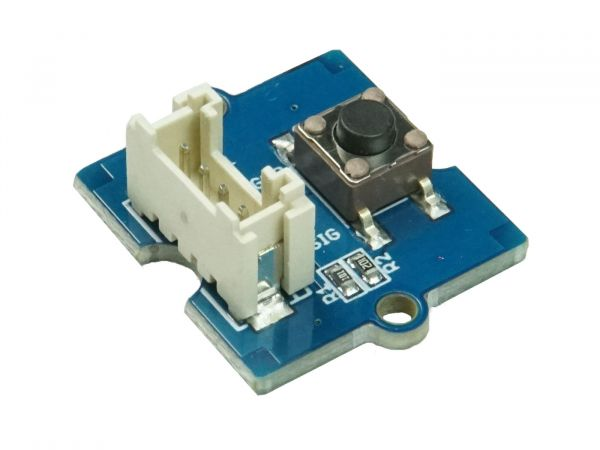

.. image:: /images/seeed_grove.png
   :align: right

.. _grove_button_shield:

Grove Button Shields
####################

Bridle supports a couple of different Button shields carrying Seeed Studio
`Grove System`_ connectors. Please download and read through the
`Preface - Getting Started`_ and `Introduction to Grove`_ before
use the product. Also have a look on the SiPEED Wiki page about the
`Grove standard interfaces`_.

Seeed Studio Button Shields
***************************

Variants and Versions
=====================

Here find the comparison between various variants and versions of Seeed Studio
Button Shields:

+-----------------------+--------------+--------------+
| Parameter             | Button V1.2  | Button V1.0  |
+=======================+==============+==============+
| Release Date          | Dec 2016     | Apr 2011     |
+-----------------------+--------------+--------------+
| Operation Voltage     | 3.3V or 5V   | 3.3V or 5V   |
+-----------------------+--------------+--------------+
| Operation Temperature | -25℃ to +70℃ |              |
+-----------------------+--------------+--------------+
| Grove Connectors      | 1            | 1            |
+-----------------------+--------------+--------------+
| Digital Ports         | 1            | 1            |
+-----------------------+--------------+--------------+
| Analog Ports          |              |              |
+-----------------------+--------------+--------------+
| UART Ports            |              |              |
+-----------------------+--------------+--------------+
| I2C Ports             |              |              |
+-----------------------+--------------+--------------+
| SPI Ports             |              |              |
+-----------------------+--------------+--------------+

Grove Button V1.2 and V1.0
==========================

Overview
--------

**Model:** 101020003, 111020000

The `Grove Button V1.2`_ or `Grove Button V1.0`_ is a momentary push button
module in Grove form factor. With V1.2 an additional series resistance in the
signal line was added and also the pull down resistance was reduced.

Pinout Diagram
--------------

The pinout of Grove Button following the `Grove Digital Layout`_.

+-----+----------+----------------+--------+--------+
| Pin | Function | Meaning        | Shield | Board  |
+=====+==========+================+========+========+
|  1  | Dn       | Digital Signal | Output | Input  |
+-----+----------+----------------+--------+--------+
|  2  | –        |                |        |        |
+-----+----------+----------------+--------+--------+
|  3  | VCC      | 3.3V or 5V     | Input  | Output |
+-----+----------+----------------+--------+--------+
|  4  | GND      | Ground         |        |        |
+-----+----------+----------------+--------+--------+

Hardware
--------

The button outputs a HIGH signal when pressed, and LOW when released.

- `Grove Button V1.2 OHSW Lab Project`_
- `Grove Button V1.0 Eagle Files, Schematic and Layout`_

Utilization
***********

Requirements
============

This shield can only be used with a development board or shield that provides
a configuration for `Grove System`_ connectors with `Grove Digital Layout`_
and defines a device tree phandle ``grove_gpios`` as an
|Laced Grove Signal Interface|.

Programming
===========

Set ``-DSHIELD=grove_btn_dX`` when you invoke ``west build``, wherein ``X``
corresponds to the ordinal number of a signal from the
|Laced Grove Signal Interface|. For example:

#. :ref:`grove_base_shield_v2` on :ref:`zephyr:mimxrt1060_evk`
   for **GPIO driven Button** on Grove ``D4``:

   .. zephyr-app-commands::
      :app: bridle/samples/helloshell
      :build-dir: helloshell-seeed_grove_base_v2-grove_btn_d4
      :board: mimxrt1060_evkb
      :shield: "seeed_grove_base_v2 grove_btn_d4"
      :goals: flash
      :west-args: -p
      :host-os: unix
      :tool: all

#. :ref:`grove_base_shield_v13` or :ref:`grove_base_shield_v12` on
   :ref:`zephyr:mimxrt1060_evk` for **GPIO driven Button** on Grove ``D4``:

   .. zephyr-app-commands::
      :app: bridle/samples/helloshell
      :build-dir: helloshell-seeed_grove_base_v1-grove_btn_d4
      :board: mimxrt1060_evkb
      :shield: "seeed_grove_base_v1 grove_btn_d4"
      :goals: flash
      :west-args: -p
      :host-os: unix
      :tool: all

References
**********

.. target-notes::
