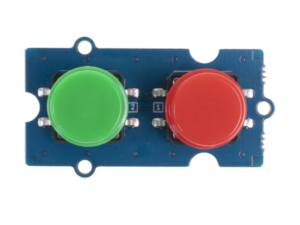
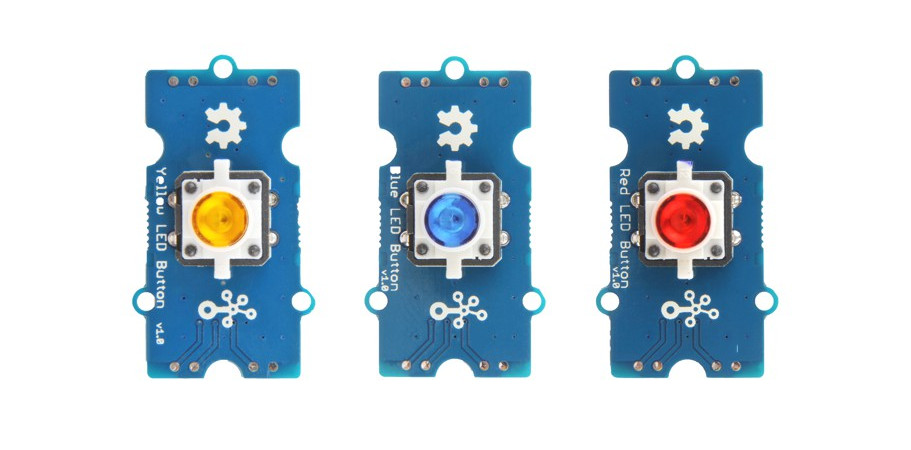

.. image:: /images/seeed_grove.png
   :align: right

.. _grove_button_shield:

Grove Button Shields
####################

Bridle supports a couple of different Button shields carrying Seeed Studio
`Grove System`_ connectors. Please download and read through the
`Preface - Getting Started`_ and `Introduction to Grove`_ before
use the product. Also have a look on the SiPEED Wiki page about the
`Grove standard interfaces`_.

Seeed Studio Button Shields
***************************

Variants and Versions
=====================

Here find the comparison between various variants and versions of Seeed Studio
Button Shields:

+-----------------------+------------------+-----------------+--------------+--------------+
| Parameter             | Dual Button V1.0 | LED Button V1.0 | Button V1.2  | Button V1.0  |
+=======================+==================+=================+==============+==============+
| Release Date          | Sep 2019         | Jun 2018        | Dec 2016     | Apr 2011     |
+-----------------------+------------------+-----------------+--------------+--------------+
| Operation Voltage     | 3.3V or 5V       | 3.3V or 5V      | 3.3V or 5V   | 3.3V or 5V   |
+-----------------------+------------------+-----------------+--------------+--------------+
| Operation Temperature |                  |                 | -25℃ to +70℃ | -25℃ to +70℃ |
+-----------------------+------------------+-----------------+--------------+--------------+
| Grove Connectors      | 1                | 1               | 1            | 1            |
+-----------------------+------------------+-----------------+--------------+--------------+
| Digital Ports         | 1                | 1               | 1            | 1            |
+-----------------------+------------------+-----------------+--------------+--------------+
| Analog Ports          |                  |                 |              |              |
+-----------------------+------------------+-----------------+--------------+--------------+
| UART Ports            |                  |                 |              |              |
+-----------------------+------------------+-----------------+--------------+--------------+
| I2C Ports             |                  |                 |              |              |
+-----------------------+------------------+-----------------+--------------+--------------+
| SPI Ports             |                  |                 |              |              |
+-----------------------+------------------+-----------------+--------------+--------------+

Grove Dual Button V1.0
======================

Overview
--------

**Model:** 111020103 (r/g/b/w)

The `Grove Dual Button V1.0`_ includes 2 buttons, controls two signal channel
with one module. Both buttons are low active and drives high in dormant state
by an pull up resistance.

Pinout Diagram
--------------

The pinout of Grove Button following the `Grove Digital Layout`_.

+-----+----------+----------------+--------+--------+
| Pin | Function | Meaning        | Shield | Board  |
+=====+==========+================+========+========+
|  1  | Dn       | Digital Signal | Output | Input  |
+-----+----------+----------------+--------+--------+
|  2  | Dn+1     | Digital Signal | Output | Input  |
+-----+----------+----------------+--------+--------+
|  3  | VCC      | 3.3V or 5V     | Input  | Output |
+-----+----------+----------------+--------+--------+
|  4  | GND      | Ground         |        |        |
+-----+----------+----------------+--------+--------+

Hardware
--------

The button outputs (Dn or Dn+1) a LOW signal when pressed,
and HIGH when released.

- `Grove Dual Button V1.0 Eagle Files, Schematic and Layout`_
- `Grove Dual Button V1.0 Schematic`_

Grove LED Button V1.0
=====================

Overview
--------

**Model:** 111020044 (r), 111020045 (y), 111020046 (b)

The `Grove LED Button V1.0`_ is a combined module of either yellow, blue
or red LED with a momentary and tactile push button in Grove form factor.
It uses a N-Channel MOSFET to control the LED to ensure the high switching
speed and a low current consumption. The button is low active and drives
high in dormant state by an pull up resistance.

Pinout Diagram
--------------

The pinout of Grove Button following the `Grove Digital Layout`_.

+-----+----------+----------------+--------+--------+
| Pin | Function | Meaning        | Shield | Board  |
+=====+==========+================+========+========+
|  1  | Dn       | Digital Signal | Input  | Output |
+-----+----------+----------------+--------+--------+
|  2  | Dn+1     | Digital Signal | Output | Input  |
+-----+----------+----------------+--------+--------+
|  3  | VCC      | 3.3V or 5V     | Input  | Output |
+-----+----------+----------------+--------+--------+
|  4  | GND      | Ground         |        |        |
+-----+----------+----------------+--------+--------+

Hardware
--------

The button outputs (Dn+1) a LOW signal when pressed, and HIGH when released.

- `Grove LED Button V1.0 Eagle Files, Schematic and Layout`_

Grove Button V1.2 and V1.0
==========================

Overview
--------

**Model:** 101020003, 111020000

The `Grove Button V1.2`_ or `Grove Button V1.0`_ is a momentary push button
module in Grove form factor. With V1.2 an additional series resistance in the
signal line was added and also the pull down resistance was reduced.

.. figure:: seeed_grove_button.jpg
   :align: center
   :alt: SEEED_GROVE_BUTTON

Pinout Diagram
--------------

The pinout of Grove Button following the `Grove Digital Layout`_.

+-----+----------+----------------+--------+--------+
| Pin | Function | Meaning        | Shield | Board  |
+=====+==========+================+========+========+
|  1  | Dn       | Digital Signal | Output | Input  |
+-----+----------+----------------+--------+--------+
|  2  | –        |                |        |        |
+-----+----------+----------------+--------+--------+
|  3  | VCC      | 3.3V or 5V     | Input  | Output |
+-----+----------+----------------+--------+--------+
|  4  | GND      | Ground         |        |        |
+-----+----------+----------------+--------+--------+

Hardware
--------

The button outputs a HIGH signal when pressed, and LOW when released.

- `Grove Button V1.2 OHSW Lab Project`_
- `Grove Button V1.0 Eagle Files, Schematic and Layout`_

Utilization
***********

Requirements
============

This shield can only be used with a development board or shield that provides
a configuration for `Grove System`_ connectors with `Grove Digital Layout`_
and defines a device tree phandle ``grove_gpios`` as an
|Laced Grove Signal Interface|.

Programming
===========

Set ``-DSHIELD=grove_btn_dX`` when you invoke ``west build``, wherein ``X``
corresponds to the ordinal number of a signal from the
|Laced Grove Signal Interface|. For example:

.. rubric:: Grove LED Button V1.0

#. :ref:`grove_base_shield_v2` on |zephyr:board:mimxrt1060_evk|
   for **GPIO driven Button** on Grove ``D4``:

   .. zephyr-app-commands::
      :app: bridle/samples/helloshell
      :build-dir: helloshell-seeed_grove_base_v2-grove_btn_d4_inv
      :board: mimxrt1060_evk@B//qspi
      :shield: "seeed_grove_base_v2 grove_btn_d4_inv"
      :goals: flash
      :west-args: -p
      :host-os: unix
      :tool: all

#. :ref:`grove_base_shield_v13` or :ref:`grove_base_shield_v12` on
   |zephyr:board:mimxrt1060_evk| for **GPIO driven Button** on Grove ``D4``:

   .. zephyr-app-commands::
      :app: bridle/samples/helloshell
      :build-dir: helloshell-seeed_grove_base_v1-grove_btn_d4_inv
      :board: mimxrt1060_evk@B//qspi
      :shield: "seeed_grove_base_v1 grove_btn_d4_inv"
      :goals: flash
      :west-args: -p
      :host-os: unix
      :tool: all

.. rubric:: Grove Button V1.2 and V1.0

#. :ref:`grove_base_shield_v2` on |zephyr:board:mimxrt1060_evk|
   for **GPIO driven Button** on Grove ``D4``:

   .. zephyr-app-commands::
      :app: bridle/samples/helloshell
      :build-dir: helloshell-seeed_grove_base_v2-grove_btn_d4
      :board: mimxrt1060_evk@B//qspi
      :shield: "seeed_grove_base_v2 grove_btn_d4"
      :goals: flash
      :west-args: -p
      :host-os: unix
      :tool: all

#. :ref:`grove_base_shield_v13` or :ref:`grove_base_shield_v12` on
   |zephyr:board:mimxrt1060_evk| for **GPIO driven Button** on Grove ``D4``:

   .. zephyr-app-commands::
      :app: bridle/samples/helloshell
      :build-dir: helloshell-seeed_grove_base_v1-grove_btn_d4
      :board: mimxrt1060_evk@B//qspi
      :shield: "seeed_grove_base_v1 grove_btn_d4"
      :goals: flash
      :west-args: -p
      :host-os: unix
      :tool: all

References
**********

.. target-notes::
