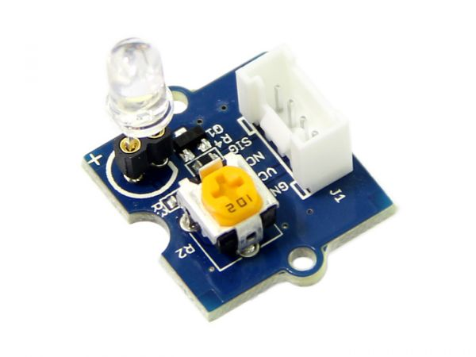
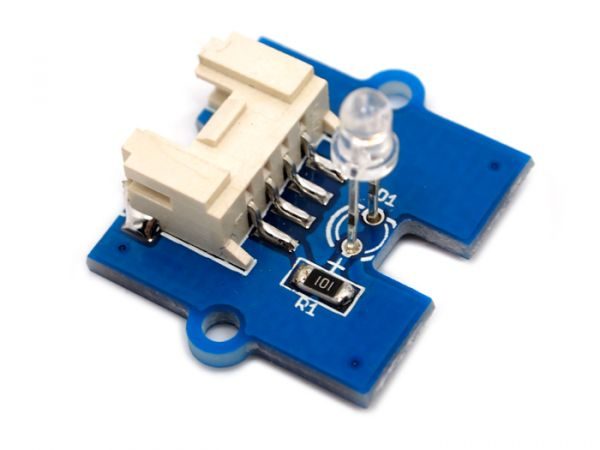
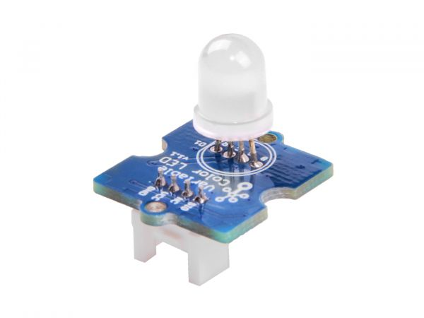

.. image:: /images/seeed_grove.png
   :align: right

.. _grove_led_shield:

Grove LED Shields
#################

Bridle supports a couple of different LED shields carrying Seeed Studio
`Grove System`_ connectors. Please download and read through the
`Preface - Getting Started`_ and `Introduction to Grove`_ before
use the product. Also have a look on the SiPEED Wiki page about the
`Grove standard interfaces`_.

Seeed Studio LED Shields
************************

Variants and Versions
=====================

Here find the comparison between various variants and versions of Seeed Studio
LED Shields:

+-----------------------+-----------------+----------------------------+------------+--------------------------------+
| Parameter             | LED Button V1.0 | LED Socket Kit V1.3 / V1.0 | LED V1.1   | Variable Color LED V1.1 / V1.0 |
+=======================+=================+============================+============+================================+
| Release Date          | Jun 2018        | Oct 2015 / Feb 2013        | Apr 2011   | Sep 2017 / Apr 2011            |
+-----------------------+-----------------+----------------------------+------------+--------------------------------+
| Operation Voltage     | 3.3V or 5V      | 3.3V or 5V                 | 3.3V or 5V | 5V only                        |
+-----------------------+-----------------+----------------------------+------------+--------------------------------+
| Operation Temperature |                 |                            |            |                                |
+-----------------------+-----------------+----------------------------+------------+--------------------------------+
| Grove Connectors      | 1               | 1                          | 1          | 1                              |
+-----------------------+-----------------+----------------------------+------------+--------------------------------+
| Digital Ports         | 1               | 1                          | 1          | 1                              |
+-----------------------+-----------------+----------------------------+------------+--------------------------------+
| Analog Ports          |                 |                            |            |                                |
+-----------------------+-----------------+----------------------------+------------+--------------------------------+
| UART Ports            |                 |                            |            |                                |
+-----------------------+-----------------+----------------------------+------------+--------------------------------+
| I2C Ports             |                 |                            |            |                                |
+-----------------------+-----------------+----------------------------+------------+--------------------------------+
| SPI Ports             |                 |                            |            |                                |
+-----------------------+-----------------+----------------------------+------------+--------------------------------+

Grove LED Button V1.0
=====================

Overview
--------

**Model:** 111020044 (r), 111020045 (y), 111020046 (b)

The `Grove LED Button V1.0`_ is a combined module of either yellow, blue
or red LED with a momentary and tactile push button in Grove form factor.
It uses a N-Channel MOSFET to control the LED to ensure the high switching
speed and a low current consumption. The button is low active and drives
high in dormant state by an pull up resistance.

.. figure:: seeed_grove_led_button.jpg
   :align: center
   :alt: SEEED_GROVE_LED_BUTTON

Pinout Diagram
--------------

The pinout of Grove Button following the `Grove Digital Layout`_.

+-----+----------+----------------+--------+--------+
| Pin | Function | Meaning        | Shield | Board  |
+=====+==========+================+========+========+
|  1  | Dn       | Digital Signal | Input  | Output |
+-----+----------+----------------+--------+--------+
|  2  | Dn+1     | Digital Signal | Output | Input  |
+-----+----------+----------------+--------+--------+
|  3  | VCC      | 3.3V or 5V     | Input  | Output |
+-----+----------+----------------+--------+--------+
|  4  | GND      | Ground         |        |        |
+-----+----------+----------------+--------+--------+

Hardware
--------

When input pin (Dn) is logic HIGH, the LED will light up.

- `Grove LED Button V1.0 Eagle Files, Schematic and Layout`_

Grove LED Socket Kit V1.3 and V1.0
==================================

Overview
--------

**Model:** 104030005 (r), 104030007 (g), 104030010 (b), 104030009 (w)

The `Grove LED Socket Kit V1.3`_ or `Grove LED Socket Kit V1.0`_ is the more
complex general-purpose LED module in Grove form factor, available in different
colors with adjustable LED brightness and orientation. With V1.3 the LED will
active driven by a bi-polar NPN transistor.

Pinout Diagram
--------------

The pinout of Grove LED Socket Kit following the `Grove Digital Layout`_.

+-----+----------+----------------+--------+--------+
| Pin | Function | Meaning        | Shield | Board  |
+=====+==========+================+========+========+
|  1  | Dn       | Digital Signal | Input  | Output |
+-----+----------+----------------+--------+--------+
|  2  | –        |                |        |        |
+-----+----------+----------------+--------+--------+
|  3  | VCC      | 3.3V or 5V     | Input  | Output |
+-----+----------+----------------+--------+--------+
|  4  | GND      | Ground         |        |        |
+-----+----------+----------------+--------+--------+

Hardware
--------

When input pin is logic HIGH, the LED will light up.

- `Grove LED Socket Kit V1.3 Eagle Files and Schematic`_
- `Grove LED Socket Kit V1.0 Eagle Files`_

Grove (Purple) LED V1.1
=======================

Overview
--------

**Model:** 104020002

The `Grove LED`_ is the simplest standard LED module in Grove form factor with
adjustable LED orientation. In V1.1 the LED size is 3mm and was 5mm in V1.0.

Pinout Diagram
--------------

The pinout of Grove LED following the `Grove Digital Layout`_.

+-----+----------+----------------+--------+--------+
| Pin | Function | Meaning        | Shield | Board  |
+=====+==========+================+========+========+
|  1  | Dn       | Digital Signal | Input  | Output |
+-----+----------+----------------+--------+--------+
|  2  | –        |                |        |        |
+-----+----------+----------------+--------+--------+
|  3  | VCC      | 3.3V or 5V     | Input  | Output |
+-----+----------+----------------+--------+--------+
|  4  | GND      | Ground         |        |        |
+-----+----------+----------------+--------+--------+

Hardware
--------

When input pin is logic HIGH, the LED will light up.

- `Grove LED V1.0 Eagle Files, Schematic and Layout`_

Grove Variable Color LED V1.1 and V1.0
======================================

**Model:** 101020472, 104020001

The `Grove Variable Color LED V1.1`_ or `Grove Variable Color LED V1.0`_ is an
RGB LED module in Grove form factor, the LED size is 8mm. It operates at 5V DC
only. The three resistances RED, GREEN and BLUE on the module control the R, G
and B channels respectively. By adjusting the three adjustable resistances, it
can turn out the variable color. With V1.1 a logic IC was add to avoid power
supply issues.

Pinout Diagram
--------------

The pinout of Grove Variable Color LED following the `Grove Digital Layout`_.

+-----+----------+----------------+--------+--------+
| Pin | Function | Meaning        | Shield | Board  |
+=====+==========+================+========+========+
|  1  | Dn       | Digital Signal | Input  | Output |
+-----+----------+----------------+--------+--------+
|  2  | –        |                |        |        |
+-----+----------+----------------+--------+--------+
|  3  | VCC      | 5V             | Input  | Output |
+-----+----------+----------------+--------+--------+
|  4  | GND      | Ground         |        |        |
+-----+----------+----------------+--------+--------+

Hardware
--------

When input pin is logic HIGH, the RGB LED will light up.

- `Grove Variable Color LED V1.1 Eagle Files and Schematic`_
- `Grove Variable Color LED V1.0 Eagle Files`_

Utilization
***********

Requirements
============

This shield can only be used with a development board or shield that provides
a configuration for `Grove System`_ connectors with `Grove Digital Layout`_
and defines the device tree phandle ``grove_gpios`` and ``grove_pwms`` as an
|Laced Grove Signal Interface|.

Programming
===========

Set ``-DSHIELD=grove_led_dX`` or ``-DSHIELD=grove_pwm_led_dX`` when you invoke
``west build``, wherein ``X`` corresponds to the ordinal number of Grove signal
from the |Laced Grove Signal Interface|. For example:

#. :ref:`grove_base_shield_v2` on |zephyr:board:mimxrt1060_evk|
   for **GPIO driven LED** on Grove ``D5``:

   .. zephyr-app-commands::
      :app: bridle/samples/helloshell
      :build-dir: helloshell-seeed_grove_base_v2-grove_led_d5
      :board: mimxrt1060_evkb
      :shield: "seeed_grove_base_v2 grove_led_d5"
      :goals: flash
      :west-args: -p
      :host-os: unix
      :tool: all

#. :ref:`grove_base_shield_v2` on |zephyr:board:mimxrt1060_evk|
   for **PWM driven LED** on Grove ``D5``:

   .. zephyr-app-commands::
      :app: bridle/samples/helloshell
      :build-dir: helloshell-seeed_grove_base_v2-grove_pwm_led_d5
      :board: mimxrt1060_evkb
      :shield: "seeed_grove_base_v2 grove_pwm_led_d5"
      :goals: flash
      :west-args: -p
      :host-os: unix
      :tool: all

#. :ref:`grove_base_shield_v13` or :ref:`grove_base_shield_v12` on
   |zephyr:board:mimxrt1060_evk| for **GPIO driven LED** on Grove ``D5``:

   .. zephyr-app-commands::
      :app: bridle/samples/helloshell
      :build-dir: helloshell-seeed_grove_base_v1-grove_led_d5
      :board: mimxrt1060_evkb
      :shield: "seeed_grove_base_v1 grove_led_d5"
      :goals: flash
      :west-args: -p
      :host-os: unix
      :tool: all

#. :ref:`grove_base_shield_v13` or :ref:`grove_base_shield_v12` on
   |zephyr:board:mimxrt1060_evk| for **GPIO driven LED** on Grove ``D5``:

   .. zephyr-app-commands::
      :app: bridle/samples/helloshell
      :build-dir: helloshell-seeed_grove_base_v1-grove_pwm_led_d5
      :board: mimxrt1060_evkb
      :shield: "seeed_grove_base_v1 grove_pwm_led_d5"
      :goals: flash
      :west-args: -p
      :host-os: unix
      :tool: all

References
**********

.. target-notes::
