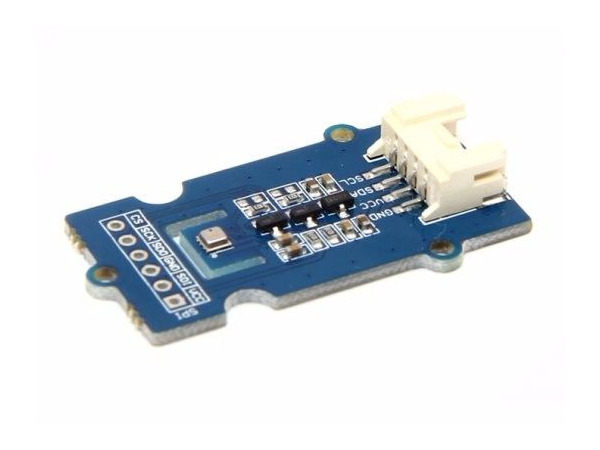
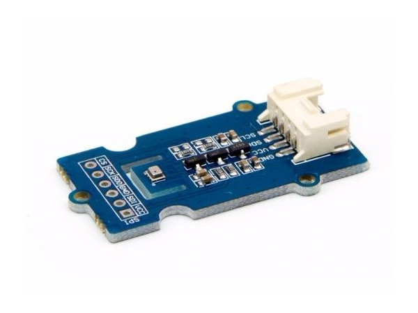
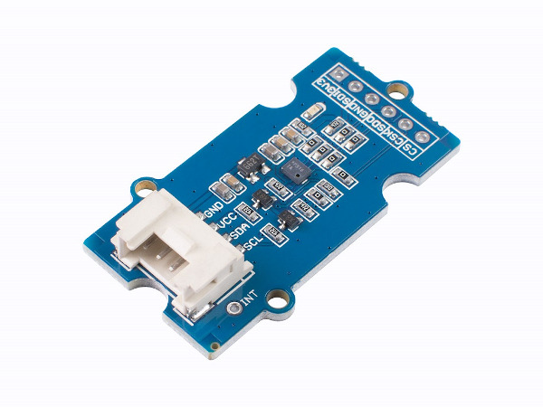

.. image:: /images/seeed_grove.png
   :align: right

.. _grove_sensor_shield:

Grove Sensor Shields
####################

Bridle supports a couple of different Sensor shields carrying Seeed Studio
`Grove System`_ connectors. Please download and read through the
`Preface - Getting Started`_ and `Introduction to Grove`_ before
use the product. Also have a look on the SiPEED Wiki page about the
`Grove standard interfaces`_.

Seeed Studio Sensor Shields
***************************

Variants and Versions
=====================

Here find the comparison between various variants and versions of Seeed Studio
Sensor Shields:

+--------------------------+----------------+----------------+----------------------+
| Parameter                | BME280 V1.0    | BMP280 V1.0    | DPS310 V1.0          |
+==========================+================+================+======================+
| Release Date             | Mar 2016       | Mar 2016       | Aug 2019             |
+--------------------------+----------------+----------------+----------------------+
| Operation Voltage        | 3.3V or 5V     | 3.3V or 5V     | 3.3V or 5V           |
+--------------------------+----------------+----------------+----------------------+
| Temperature Range        | -40℃ to +85℃   | -40℃ to +85℃   | -40℃ to +85℃         |
+--------------------------+----------------+----------------+----------------------+
| Humidity Range           | 0 to 100%      | –––––––––––––– | –––––––––––––––––––– |
+--------------------------+----------------+----------------+----------------------+
| Pressure Range           | 300 to 1100 ㍱ | 300 to 1100 ㍱ | 300 to 1200 ㍱       |
+--------------------------+----------------+----------------+----------------------+
| Pressure Precision       | –––––––––––––– | –––––––––––––– | ± 0.002 ㍱ / ±0.02 m |
+--------------------------+----------------+----------------+----------------------+
| Pressure Accuracy (abs.) | ± 1 ㍱ / ±8 m  | ± 1 ㍱ / ±8 m  | ± 1 ㍱ / ±8 m        |
+--------------------------+----------------+----------------+----------------------+
| Pressure Accuracy (rel.) | ± 0.12 ㍱      | ± 0.12 ㍱      | ± 0.06 ㍱ / ±0.5 m   |
+--------------------------+----------------+----------------+----------------------+
| Pressure Resolution      | 0.18 ㎩        | 0.18 ㎩        | 0.06 ㎩              |
+--------------------------+----------------+----------------+----------------------+
| Grove Connectors         | 1              | 1              | 1                    |
+--------------------------+----------------+----------------+----------------------+
| Digital Ports            |                |                |                      |
+--------------------------+----------------+----------------+----------------------+
| Analog Ports             |                |                |                      |
+--------------------------+----------------+----------------+----------------------+
| UART Ports               |                |                |                      |
+--------------------------+----------------+----------------+----------------------+
| I2C Ports                | 1 (Grove)      | 1 (Grove)      | 1 (Grove)            |
+--------------------------+----------------+----------------+----------------------+
| SPI Ports                | 1              | 1              | 1                    |
+--------------------------+----------------+----------------+----------------------+

Grove Temperature, Humidity and Barometer Sensor V1.0 (BME280)
==============================================================

Overview
--------

**Model:** 101020193

The |Grove BME280 Sensor|_ is a breakout module for Bosch BME280_
high-precision, low-power combined humidity, pressure, and temperature
sensor in Grove form factor.

Pinout Diagram
--------------

The pinout of Grove Button following the `Grove I2C Layout`_.

+-----+----------+------------------+--------+--------+
| Pin | Function | Meaning          | Shield | Board  |
+=====+==========+==================+========+========+
|  1  | SCL      | I2C Serial Clock | Input  | Output |
+-----+----------+------------------+--------+--------+
|  2  | SDA      | I2C Serial Data  | IN/OUT | OUT/IN |
+-----+----------+------------------+--------+--------+
|  3  | VCC      | 3.3V or 5V       | Input  | Output |
+-----+----------+------------------+--------+--------+
|  4  | GND      | Ground           |        |        |
+-----+----------+------------------+--------+--------+

Hardware
--------

- `Grove BME280 Sensor V1.0 Eagle Files, Schematic and Layout`_

Grove Temperature and Barometer Sensor V1.0 (BMP280)
====================================================

Overview
--------

**Model:** 101020192

The |Grove BMP280 Sensor|_ is a breakout module for Bosch BMP280_
high-precision and low-power digital barometer (atmospheric pressure)
and temperature sensor in Grove form factor.

Pinout Diagram
--------------

The pinout of Grove Button following the `Grove I2C Layout`_.

+-----+----------+------------------+--------+--------+
| Pin | Function | Meaning          | Shield | Board  |
+=====+==========+==================+========+========+
|  1  | SCL      | I2C Serial Clock | Input  | Output |
+-----+----------+------------------+--------+--------+
|  2  | SDA      | I2C Serial Data  | IN/OUT | OUT/IN |
+-----+----------+------------------+--------+--------+
|  3  | VCC      | 3.3V or 5V       | Input  | Output |
+-----+----------+------------------+--------+--------+
|  4  | GND      | Ground           |        |        |
+-----+----------+------------------+--------+--------+

Hardware
--------

- `Grove BMP280 Sensor V1.0 Eagle Files, Schematic and Layout`_

Grove High Precision Enviromental Sensor V1.0 (DPS310)
======================================================

Overview
--------

**Model:** 101020812

The |Grove DPS310 Sensor|_ is a breakout module for Infineon DPS310_,
a miniaturized digital barometer air pressure and temperature sensor
with high accuracy, in Grove form factor.

Pinout Diagram
--------------

The pinout of Grove Button following the `Grove I2C Layout`_.

+-----+----------+------------------+--------+--------+
| Pin | Function | Meaning          | Shield | Board  |
+=====+==========+==================+========+========+
|  1  | SCL      | I2C Serial Clock | Input  | Output |
+-----+----------+------------------+--------+--------+
|  2  | SDA      | I2C Serial Data  | IN/OUT | OUT/IN |
+-----+----------+------------------+--------+--------+
|  3  | VCC      | 3.3V or 5V       | Input  | Output |
+-----+----------+------------------+--------+--------+
|  4  | GND      | Ground           |        |        |
+-----+----------+------------------+--------+--------+

Hardware
--------

- `Grove DPS310 Sensor V1.0 Eagle Files, Schematic and Layout`_

Utilization
***********

Requirements
============

This shield can only be used with a development board or shield that provides
a configuration for `Grove System`_ connectors with `Grove I2C Layout`_
and defines a device tree phandle ``grove_i2c``.

Programming
===========

Set ``-DSHIELD=grove_sens_X`` when you invoke ``west build``, wherein ``X``
corresponds to the exact sensor type. For example:

#. :ref:`grove_base_shield_v2` on |zephyr:board:mimxrt1060_evk|
   for **Grove BME280 Sensor**:

   .. zephyr-app-commands::
      :app: bridle/samples/helloshell
      :build-dir: helloshell-seeed_grove_base_v2-grove_sens_bme280
      :board: mimxrt1060_evk@B/mimxrt1062/qspi
      :shield: "seeed_grove_base_v2 grove_sens_bme280"
      :goals: flash
      :west-args: -p
      :host-os: unix

#. :ref:`grove_base_shield_v13` or :ref:`grove_base_shield_v12` on
   |zephyr:board:mimxrt1060_evk| for **Grove BMP280 Sensor**:

   .. zephyr-app-commands::
      :app: bridle/samples/helloshell
      :build-dir: helloshell-seeed_grove_base_v1-grove_sens_bmp280
      :board: mimxrt1060_evk@B/mimxrt1062/qspi
      :shield: "seeed_grove_base_v1 grove_sens_bmp280"
      :goals: flash
      :west-args: -p
      :host-os: unix

References
**********

.. target-notes::
