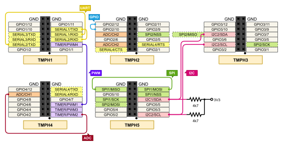

.. _loopback_test_shield:

Loopback wiring for tests
#########################

Overview
********

This shield is less a plug-on module in the conventional sense than more
a wiring for feedback of certain signals. It can be used to run most test
cases for Zephyr drivers that require a loopback connection on hardware
level.

Requirements
************

This shield requires a board which provides a configuration that allows:

- two GPIO lines, 1st for output and 2nd for loopback input
- two PWM lines, 1st for output and 2nd for loopback input
- one PWM line for output and one ADC line for input
- one SPI interface, MOSI for output and MISO for input
- two I2C interfaces, 1st for slave and 2nd for master mode
- two UART interfaces, 1st for counterpart and 2nd for test case

.. note::
   Sometimes boards declare standard headers like |Arduino R3| but not define
   all connections.  Make sure that the board you are using have all
   definitions to avoid build errors (see :ref:`shields` for more details).

Supported variations
====================

The below table suggests shield variation accordingly with test cases. When
a standard connector (arduino, mikrobus, tmph) is available on board, user
should select the matching shield configuration. When loopback_test shield
is used with a board that doesn't feature a standard connector, a dedicated
<board>.overlay file should be provided. The remaining configurations should
be used based on the board standard headers available.

+---------------------------------------+--------------------------+-----------+
| Connector Standard                    | Shield Designation       | Variation |
+=======================================+==========================+===========+
| Without standard (overlay)            | |loopback_test|          |     1     |
+---------------------------------------+--------------------------+-----------+
| |Arduino R3| (:yl:`not yet, planned`) | |loopback_test_arduino|  |     2     |
+---------------------------------------+--------------------------+-----------+
| |MikroBus| (:yl:`not yet, planned`)   | |loopback_test_mikrobus| |     3     |
+---------------------------------------+--------------------------+-----------+
| |TiaC MAGPIE Pin Header|              | |loopback_test_tmph|     |     4     |
+---------------------------------------+--------------------------+-----------+

.. |loopback_test| replace::
   :bridle_file:`loopback_test <boards/shields/loopback_test/loopback_test.overlay>`

.. |Arduino R3| replace::
   :ref:`Arduino R3 <devicetree:dtbinding_arduino_header_r3>`

.. |loopback_test_arduino| replace::
   :bridle_file:`loopback_test_arduino <boards/shields/loopback_test/loopback_test_arduino.overlay>`

.. |MikroBus| replace::
   :ref:`MikroBus <devicetree:dtbinding_mikro_bus>`

.. |loopback_test_mikrobus| replace::
   :bridle_file:`loopback_test_mikrobus <boards/shields/loopback_test/loopback_test_mikrobus.overlay>`

.. |TiaC MAGPIE Pin Header| replace::
   :ref:`TiaC MAGPIE Pin Header <devicetree:dtbinding_tiac_magpie_pin_header>`

.. |loopback_test_tmph| replace::
   :bridle_file:`loopback_test_tmph <boards/shields/loopback_test/loopback_test_tmph.overlay>`

Build and Programming
*********************

Set ``-DSHIELD=<shield designation>`` when you invoke ``west build``.

To build shield with specific overlay:

.. zephyr-app-commands::
   :app: zephyr/tests/drivers/gpio/gpio_basic_api
   :board: tiac_magpie
   :shield: loopback_test
   :goals: build flash

To build shield with standard headers:

.. zephyr-app-commands::
   :app: zephyr/tests/drivers/gpio/gpio_basic_api
   :board: [tiac_magpie | nucleo_f746zg]
   :shield: [loopback_test_arduino | loopback_test_mikrobus | loopback_test_tmph]
   :goals: build flash

Wiring Schematics
*****************

.. rubric:: |Arduino R3|

:byl:`not yet, planned`

.. rubric:: |MikroBus|

:byl:`not yet, planned`

.. rubric:: |TiaC MAGPIE Pin Header|

.. tabs::

   .. group-tab:: GPIO

      - for test cases in :zephyr_file:`tests/drivers/gpio`
      - needs test fixture: **gpio_loopback** in hardware map

      .. literalinclude:: ../loopback_test_tmph.overlay
         :caption: GPIO loopback
         :language: DTS
         :encoding: ISO-8859-1
         :emphasize-lines: 3,4
         :linenos:
         :start-at: gpio_basic_api_0 {
         :end-at: }; // gpio_basic_api_0

      :out-gpios:

         Identity of a GPIO that will be configured as an output. This must be
         on the **same device** as **in-gpios**, and **physically connected**
         to **in-gpios**.

      :in-gpios:

         Identity of a GPIO that will be configured as an input. This must be
         on the **same device** as **out-gpios**, and **physically connected**
         to **out-gpios**.

   .. group-tab:: PWM

      - for test cases in :zephyr_file:`tests/drivers/pwm`
      - needs test fixture: **pwm_loopback** in hardware map

      .. literalinclude:: ../loopback_test_tmph.overlay
         :caption: PWM loopback
         :language: DTS
         :encoding: ISO-8859-1
         :emphasize-lines: 4,5
         :linenos:
         :start-at: pwm_loopback_0 {
         :end-at: }; // pwm_loopback_0

      :pwms:

         PWM pins that will be used for generating and capturing a pulse-width
         modulated signal. The **pin at the first index** will be used **for**
         signal **generation** while the **pin at the second index** will be
         used **for capuring** the generated signal. The **two pins must be
         physically connected** to each other.

      .. literalinclude:: ../loopback_test_tmph.overlay
         :caption: PWM enable
         :language: DTS
         :encoding: ISO-8859-1
         :emphasize-lines: 2
         :linenos:
         :start-at: tmph_pwms {
         :end-at: }; // tmph_pwms

      .. literalinclude:: ../loopback_test_tmph.overlay
         :caption: Timer enable
         :language: DTS
         :encoding: ISO-8859-1
         :emphasize-lines: 2
         :linenos:
         :start-at: tmph_timers {
         :end-at: }; // tmph_timers

   .. group-tab:: ADC

      .. attention:: Not yet supported, missing integration test case.

   .. group-tab:: SPI

      - for test cases in :zephyr_file:`tests/drivers/spi`
      - needs test fixture: **spi_loopback** in hardware map

      .. literalinclude:: ../loopback_test_tmph.overlay
         :caption: SPI enable
         :language: DTS
         :encoding: ISO-8859-1
         :emphasize-lines: 2
         :linenos:
         :start-at: tmph_spi1 {
         :end-at: }; // tmph_spi1

   .. group-tab:: I2C

      - for test cases in :zephyr_file:`tests/drivers/i2c`
      - needs test fixture: **i2c_bus_short** in hardware map

      .. literalinclude:: ../loopback_test_tmph.overlay
         :caption: I2C one enable with EEPROM 1 as bus master
         :language: DTS
         :encoding: ISO-8859-1
         :emphasize-lines: 2,4,11,12
         :linenos:
         :start-at: tmph_i2c1 {
         :end-at: }; // tmph_i2c1

      .. literalinclude:: ../loopback_test_tmph.overlay
         :caption: I2C two enable with EEPROM 0 as slave device
         :language: DTS
         :encoding: ISO-8859-1
         :emphasize-lines: 2,4,11,12
         :linenos:
         :start-at: tmph_i2c2 {
         :end-at: }; // tmph_i2c2

      Transfer of commands from one bus controller to the other is
      accomplished by hardware through having the SCL (and SDA) signals
      shorted to join the two buses.

   .. group-tab:: UART

      .. attention:: Not yet supported, missing integration test case.

References
**********

.. target-notes::
