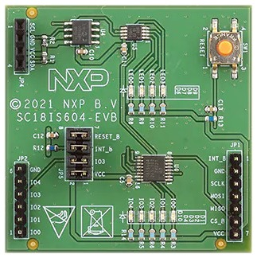

.. _nxp_sc18is604_evb_shield:

NXP SC18IS604-EVB
#################

.. toctree::

:hwftlbl-spi:`1`
:hwftlbl-i2c:`1`
:hwftlbl-pio:`5`
:hwftlbl-pwm:`4`
:hwftlbl-led:`9`
:hwftlbl-btn:`1 (RESET)`

The NXP_ `SC18IS604-EVB`_ is an evaluation kit for the SC18IS604_ chip, an
:ref:`SPI <zephyr:spi_api>` to :ref:`I2C <zephyr:i2c_api>` bus bridge with
an integrated :ref:`GPIO <zephyr:gpio_api>` controller. Apart from the bridge
it features:

- 5 LED connected to the :ref:`GPIO <zephyr:gpio_api>` pins
- 1 PCA9533_, an 4-bit :ref:`PWM <zephyr:pwm_api>` controller connected to the
  outgoing :ref:`I2C <zephyr:i2c_api>` bus which controls:

  - 4 additional dimmable LEDs

- 1 24LC02B_ 256×8-bit EEPROM, also connected to the outgoing
  :ref:`I2C <zephyr:i2c_api>` bus

.. note::

   There is currently no device driver support for the PCA9533 LED dimmer,
   either in Zephyr or in Bridle. Therefore, this shield will not set up
   the 4-bit PWM controller; the additional dimmable LEDs cannot be used
   by application code.

.. rubric:: Design Data
.. rst-class:: rst-columns

- `SC18IS604-EVB User Manual`_
- `SC18IS604-EVB Design Files`_
- `SC18IS604-EVB Schematic`_

.. rubric:: Data Sheets
.. rst-class:: rst-columns

- .. rubric:: SC18IS604_
- `SC18IS604 Datasheet`_
- .. rubric:: PCA9533_
- `PCA9533 Datasheet`_
- .. rubric:: 24LC02B_
- `24AA02/24LC02B/24FC02 Datasheet Rev. N (2021/08)`_
- `24AA02/24LC02B/24FC02 Datasheet Rev. M (2021/03)`_
- `24AA02/24LC02B/24FC02 Datasheet Rev. L (2019/05)`_

Utilization
***********

The shield abstraction of these breakout boards is deliberately kept small.
It is purely for evaluating the necessary drivers and Devicetree bindings
on known integration platforms.

Since the shield does not use a standard *plug-on* design, it must be manually
wired to the correct signals on the host board. This wiring is represented by
an additional *shield*, depending on the signal routing. This shields can be
used with any development board or shield that provides a Devicetree node with
the :dtcompatible:`nxp,sc18is604-evb-hif-header` property in the compatibility.
That is needed for GPIO mapping of the reset and interrupt line. Users can rely
on the :ref:`x_nxp_sc18is604_evb_shield` or create their own interconnection
shields with the necessary mappings in them.

Programming
===========

If the host board has an |Arduino UNO R3| connector available, its signals can
be used to connect the shield. The :ref:`x_nxp_sc18is604_evb_shield` contains
already the required signal definitions for this configuration. To use this (or
another) connector shield, include it in the shield list for your build:

.. zephyr-app-commands::
   :zephyr-app: <your-application>
   :board: <your_board>
   :shield: "x_nxp_sc18is604_evb;nxp_sc18is604_evb"
   :goals: build
   :compact:

Hello Shell on :ref:`zephyr:nucleo_f746zg_board`
------------------------------------------------

.. include:: helloshell.rsti

More Samples and Tests
**********************

On-Shield LED Blinky by GPIO
============================

.. include:: blinky.rsti

On-Shield LED Blinky by PWM
===========================

.. admonition:: Do not use!
   :class: error

   Not yet, because of missing PCA9533 device driver support.

   .. include:: blinky_pwm.rsti

On-Shield LED Fade by PWM
=========================

.. admonition:: Do not use!
   :class: error

   Not yet, because of missing PCA9533 device driver support.

   .. include:: fade.rsti

On-Shield EEPROM Read/Write
===========================

.. include:: eeprom.rsti

References
**********

.. target-notes::
