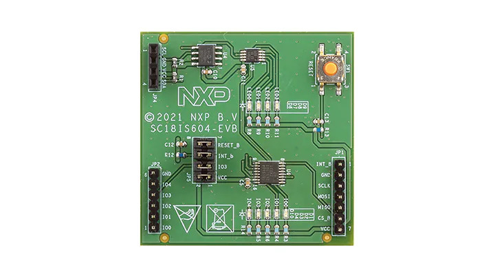

.. _boards_nxp_sc18is604_evb:

NXP SC18IS604-EVB
#################

.. toctree::

An evaluation kit for the NXP SC18IS604 SPI to I2C/GPIO bridge. Apart from the
SC18IS604 it features five LEDs connected to the GPIO pins, a PCA9533 PWM
controller connected to the outgoing I2C bus which controls 4 additional LEDs,
and a 24LC02B EEPROM, also on the outgoing I2C bus.

QUICK STEP BUILD::

   west build -b nucleo_f767zi -p always \
              -d build/nxp_sc18is604_evb \
              bridle/samples/helloshell -- \
              -DCONFIG_MFD_LOG_LEVEL_DBG=y \
              -DCONFIG_SPI_LOG_LEVEL_DBG=y \
              -DCONFIG_I2C_LOG_LEVEL_DBG=y \
              -DCONFIG_GPIO_LOG_LEVEL_DBG=y \
              -DSHIELD="x_arduino_header_to_nxp_sc18is604_evb;nxp_sc18is604_evb"

   west build -b nucleo_f767zi -p always \
              -d build/nxp_sc18is604_evb \
              bridle/samples/helloshell -- \
              -DCONFIG_MFD=y \
              -DCONFIG_MFD_LOG_LEVEL_DBG=y \
              -DCONFIG_SPI=y \
              -DCONFIG_SPI_LOG_LEVEL_DBG=y \
              -DCONFIG_I2C_LOG_LEVEL_DBG=y \
              -DCONFIG_GPIO_LOG_LEVEL_DBG=y \
              -DEXTRA_DTC_OVERLAY_FILE=$(pwd)/test_sc18is604.overlay

``test_sc18is604.overlay``::

   #include <freq.h>
   #include <zephyr/dt-bindings/i2c/i2c.h>
   #include <zephyr/dt-bindings/gpio/gpio.h>

   /*
    * Arduino UNO R3	NXP-SC18IS604-EVB	SC18IS604 Signal
    * ===================	======================	======================
    *	 8:D8			JP5:7			nRESET	(CHIP)
    *	 9:D9			JP1:1 (JP5:5)		nINT	(CHIP)
    * 	  :GND			JP1:2			VSS
    *	13:D13 (SPI:SCK)	JP1:3			SCLK	(SPI)
    *	11:D11 (SPI:COPI)	JP1:4			MOSI	(SPI)
    *	12:D12 (SPI:CIPO)	JP1:5			MISO	(SPI)
    *	10:D10 (SPI:SS)		JP1:6			nCS	(SPI)
    *	  3.3V			JP1:7 (JP5:1-2)		VDD & VREFP
    */

   &arduino_spi {
      test_spi_sc18is604: sc18is604@0 {
         compatible = "nxp,sc18is604";
         spi-max-frequency = <DT_FREQ_K(500)>;
         reg = <0>;

         int-gpios = <&arduino_header 15 (GPIO_ACTIVE_LOW | GPIO_PULL_UP)>; /* D9 */
         reset-gpios = <&arduino_header 14 (GPIO_ACTIVE_LOW | GPIO_PULL_UP)>; /* D8 */

         test_sc18is604_i2c: sc18is604-i2c {
            compatible = "nxp,sc18is604-i2c";

            #address-cells = <1>;
            #size-cells = <0>;
            clock-frequency = <I2C_BITRATE_STANDARD>;
         };

         test_sc18is604_gpio: sc18is604-gpio {
            compatible = "nxp,sc18is604-gpio";

            gpio-controller;
            #gpio-cells = <2>;
            ngpios = <5>;
         };
      };
   };

