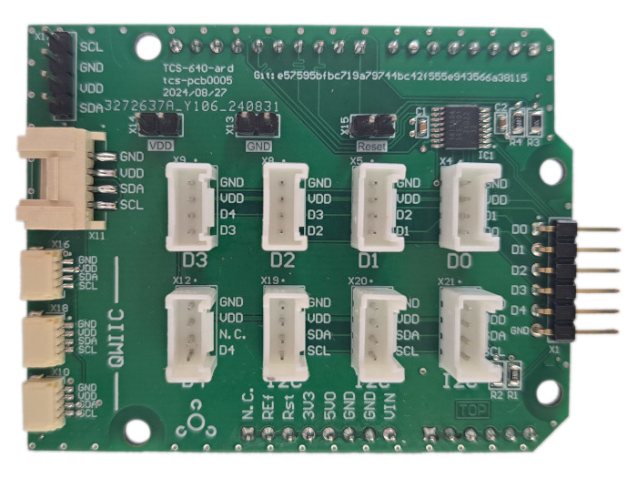

.. _tcs_604_ard_shield:

TiaC SC18IS604 Arduino
######################

.. toctree::

:hwftlbl-spi:`1`
:hwftlbl-i2c:`1`
:hwftlbl-pio:`5`
:hwftlbl-con:`4 Grove I2C`
:hwftlbl-con:`5 Grove Digital`

Overview
********

The TiaC SC18IS604 Arduino is an evaluation shield for the SC18IS604_ chip, an
:zephyr:ref:`SPI <spi_api>` to :zephyr:ref:`I2C <i2c_api>` bus bridge with an
integrated :zephyr:ref:`GPIO <gpio_api>` controller. This shield requires a
board which provides the standard |Arduino UNO R3| connector.

Apart from the bridge it features 3 Sparkfun `Qwiic System`_ and
9 Seeed Studio `Grove System`_ connectors:

- 4 ports with `Grove I2C Layout`_
- 5 ports with `Grove Digital Layout`_

Hardware
********

.. rubric:: Design Data
.. rst-class:: rst-columns

- `TCS-604-ARD Schematic`_
- `TCS-604-ARD PCBA`_

.. rubric:: Data Sheets
.. rst-class:: rst-columns

- .. rubric:: SC18IS604_
- `SC18IS604 Datasheet`_

Supported Features
==================

The :code:`tcs_604_ard` shield configuration supports the following
hardware features:

+-----------+------------+------------------------------------------+
| Interface | Controller | Driver/Component                         |
+===========+============+==========================================+
| GPIO      | on-chip    | I/O ports                                |
+-----------+------------+------------------------------------------+
| I2C       | on-chip    | Inter-Integrated Circuit                 |
+-----------+------------+------------------------------------------+

The default configuration can be found in the Kconfig file
:bridle_file:`boards/shields/tcs-604/Kconfig.defconfig`.

.. _tcs_604_ard_grove_if:

Laced Grove Signal Interface
----------------------------

In addition to the GPIO pin header, there are also 5 |Grove connectors| for the
digital I/O signals of the bridge. These are provided by a specific interface
for general signal mapping, the |Laced Grove Signal Interface|.

Following mappings are well known:

* ``grove_gpios``: GPIO mapping

.. tabs::

   .. group-tab:: GPIO mapping ``grove_gpios``

      This is the **GPIO signal line mapping** from the SC18IS604_
      chip bindet with to the set of |Grove connectors| provided as
      |Laced Grove Signal Interface|.

      +-----------------------------+-------------------------+----------------------------------+
      | phandle index to shield --> | **Signal** : *Meaning*  |   ``tcs_604_ard``                |
      +=============================+=========================+==================================+
      | ``<&grove_gpios 0 …>``      | **D0**                  | | ``<&grove_d0_header 0 …>``     |
      |                             |                         | | ``<&grove_d1_header 1 …>``     |
      |                             |                         | | ↳ ``<&sc18is604_0_gpio 0 …>``  |
      +-----------------------------+-------------------------+----------------------------------+
      | ``<&grove_gpios 1 …>``      | **D1**                  | | ``<&grove_d1_header 0 …>``     |
      |                             |                         | | ``<&grove_d2_header 1 …>``     |
      |                             |                         | | ↳ ``<&sc18is604_0_gpio 1 …>``  |
      +-----------------------------+-------------------------+----------------------------------+
      | ``<&grove_gpios 2 …>``      | **D2**                  | | ``<&grove_d2_header 0 …>``     |
      |                             |                         | | ``<&grove_d1_header 1 …>``     |
      |                             |                         | | ↳ ``<&sc18is604_0_gpio 2 …>``  |
      +-----------------------------+-------------------------+----------------------------------+
      | ``<&grove_gpios 3 …>``      | **D3**                  | | ``<&grove_d3_header 0 …>``     |
      |                             |                         | | ``<&grove_d4_header 1 …>``     |
      |                             |                         | | ↳ ``<&sc18is604_0_gpio 3 …>``  |
      +-----------------------------+-------------------------+----------------------------------+
      | ``<&grove_gpios 4 …>``      | **D4**                  | | ``<&grove_d4_header 0 …>``     |
      |                             |                         | | ↳ ``<&sc18is604_0_gpio 4 …>``  |
      +-----------------------------+-------------------------+----------------------------------+

Utilization
***********

The shield abstraction is deliberately kept small. It is purely for evaluating
the necessary drivers and Devicetree bindings on known integration platforms.

Programming
===========

If the host board has an |Arduino UNO R3| connector available, its signals can
be used to connect the shield:

.. zephyr-app-commands::
   :zephyr-app: <your-application>
   :board: <your_board>
   :shield: "tcs_604_ard"
   :goals: build
   :compact:

Hello Shell on |zephyr:board:nucleo_f746zg|
-------------------------------------------

.. include:: helloshell.rsti

More Samples and Tests
**********************

This is based on the Zephyr board |zephyr:board:nucleo_f746zg|.

.. tabs::

   .. group-tab:: Grove LED Blinky

      .. include:: grove_blinky.rsti

   .. group-tab:: Grove LED Button

      .. include:: grove_button.rsti

   .. group-tab:: Grove BMP280 Sensor

      .. include:: grove_bmp280.rsti

References
**********

.. target-notes::
