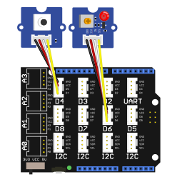

.. _x_grove_testbed_shield:

Grove wiring for tests
######################

Overview
********

This shield is less a plug-on module in the conventional sense than more
a wiring for interconnection of certain signals. It can be used to run most
samples from Zephyr  and Bridle that require special ``aliases`` or ``chosen``
entries on device tree level or other specific Kconfig setups.

Requirements
************

This shield requires a board, maybe with additional connected shields, which
provides a configuration that allows:

- one of |LED Shields| for digital data output line, optional with PWM
- one of |Button Shields| for digital data input line

When the board is not equipped with the required shield connectors, but instead
an |Arduino UNO R3| header, then the |Base Shield V2| can be plugged in between.

.. note::
   Sometimes boards declare standard headers like |Arduino UNO R3| but not
   define all connections. Make sure that the board you are using have all
   definitions to avoid build errors (see :ref:`zephyr:shields` for more
   details).

Supported variations
====================

+-------------------------+-----------+--------------------+
| Modules                 | Port Type | |Base Shield V2|   |
+=========================+===========+====================+
| |LED Shields|           | |digital| | :strong:`D6` (PWM) |
+-------------------------+-----------+--------------------+
| |Buzzer Shields|        | |digital| | :strong:`D5` (PWM) |
+-------------------------+-----------+--------------------+
| |OLED Shields|          | |i2c|     | :strong:`I2C`      |
+-------------------------+-----------+--------------------+
| |Button Shields|        | |digital| | :strong:`D4`       |
+-------------------------+-----------+--------------------+
| |Potentiometer Shields| | |analog|  | :strong:`A0`       |
+-------------------------+-----------+--------------------+
| |Sound Sensor Shields|  | |analog|  | :strong:`A2`       |
+-------------------------+-----------+--------------------+
| |Light Sensor Shields|  | |analog|  | :strong:`A3`       |
+-------------------------+-----------+--------------------+
| |THEnv Sensor Shields|  | |digital| | :strong:`D3`       |
+-------------------------+-----------+--------------------+
| |AirPr Sensor Shields|  | |i2c|     | :strong:`I2C`      |
+-------------------------+-----------+--------------------+
| |Acc3Ax Sensor Shields| | |i2c|     | :strong:`I2C`      |
+-------------------------+-----------+--------------------+

.. hint::
   The |Base Shield V2| together with all the sensors and actuators can be
   easily replaced by the |Arduino Sensor Kit|_ as also done in the examples
   below.

   * Fritzing part file (Arduino Sensor Kit – Base):
     :download:`fzp/arduino_sensor_kit_base.fzpz`

.. |digital| replace:: `Grove Digital Layout`_
.. |analog| replace:: `Grove Analog Layout`_
.. |uart| replace:: `Grove UART Layout`_
.. |i2c| replace:: `Grove I2C Layout`_

.. |Base Shield V2| replace:: :ref:`grove_base_shield_v2`
.. |LED Shields| replace:: :ref:`grove_led_shield`
.. |OLED Shields| replace::
   :s:`Grove OLED Shields` :emphasis:`(not yet)`
.. |Buzzer Shields| replace::
   :s:`Grove Buzzer Shields` :emphasis:`(not yet)`
.. |Button Shields| replace:: :ref:`grove_button_shield`
.. |Potentiometer Shields| replace::
   :s:`Grove Rotary Potentiometer Shields` :emphasis:`(not yet)`
.. |Sound Sensor Shields| replace::
   :s:`Grove Sound Sensor Shields` :emphasis:`(not yet)`
.. |Light Sensor Shields| replace::
   :s:`Grove Light Sensor Shields` :emphasis:`(not yet)`
.. |THEnv Sensor Shields| replace::
   :s:`Grove Temperature & Humidity Sensor Shields` :emphasis:`(not yet)`
.. |AirPr Sensor Shields| replace::
   :s:`Grove Air Pressure Sensor Shields` :emphasis:`(not yet)`
.. |Acc3Ax Sensor Shields| replace::
   :s:`Grove 3-Axis Accelerator Sensor Shields` :emphasis:`(not yet)`

Wiring Schematics
*****************

* Fritzing project file: :download:`x_grove_testbed.fzz`

* Fritzing part file (Grove Base Shield – V2): :download:`fzp/grove_base_shield_v2.fzpz`
* Fritzing part file (Grove LED Socket Kit): :download:`fzp/grove_led_socket_kit.fzpz`
* Fritzing part file (Grove Button): :download:`fzp/grove_button.fzpz`

Build and Programming
*********************

Set ``-DSHIELD=<shield designation>`` when you invoke ``west build``.
For example:

.. zephyr-app-commands::
   :app: <sample_folder>
   :build-dir: <sample_name>-x_grove_testbed
   :board: <board_name>
   :shield: "<shield_name_with_grove_connectors> grove_btn_d4 grove_led_d6 grove_pwm_led_d6 x_grove_testbed"
   :goals: flash
   :west-args: -p
   :host-os: unix
   :tool: all

.. tabs::

   .. group-tab:: STMicroelectronics

      .. tabs::

         .. group-tab:: ST Nucleo F303RE

            This is based on the Zephyr board :ref:`zephyr:nucleo_f303re_board`.

            * Diagrams.Net project file: :download:`x_grove_testbed.drawio`

            .. image:: img/x_grove_testbed_stmb1136_bb.svg
               :alt: ST Nucleo F303RE Wiring Schematics
               :align: center

            .. tabs::

               .. group-tab:: LED Blinky

                  This is based on the Zephyr sample
                  :zephyr:code-sample:`zephyr:blinky`.

                  .. zephyr-app-commands::
                     :app: zephyr/samples/basic/blinky
                     :build-dir: blinky-nucleo_f303re-x_grove_testbed
                     :board: nucleo_f303re
                     :shield: \
                              "seeed_grove_base_v2 grove_btn_d4 grove_led_d6 grove_pwm_led_d6 x_grove_testbed"
                     :goals: flash
                     :west-args: -p
                     :host-os: unix
                     :tool: all

               .. group-tab:: LED Fade

                  This is based on the Zephyr sample
                  :zephyr:code-sample:`zephyr:fade-led`.

                  .. zephyr-app-commands::
                     :app: zephyr/samples/basic/fade_led
                     :build-dir: fade-nucleo_f303re-x_grove_testbed
                     :board: nucleo_f303re
                     :shield: \
                              "seeed_grove_base_v2 grove_btn_d4 grove_led_d6 grove_pwm_led_d6 x_grove_testbed"
                     :goals: flash
                     :west-args: -p
                     :host-os: unix
                     :tool: all

               .. group-tab:: LED Button

                  This is based on the Zephyr sample
                  :zephyr:code-sample:`zephyr:button`.

                  .. zephyr-app-commands::
                     :app: zephyr/samples/basic/button
                     :build-dir: button-nucleo_f303re-x_grove_testbed
                     :board: nucleo_f303re
                     :shield: \
                              "seeed_grove_base_v2 grove_btn_d4 grove_led_d6 grove_pwm_led_d6 x_grove_testbed"
                     :goals: flash
                     :west-args: -p
                     :host-os: unix
                     :tool: all

         .. group-tab:: ST Nucleo F401RE

            This is based on the Zephyr board :ref:`zephyr:nucleo_f401re_board`.

            * Diagrams.Net project file: :download:`x_grove_testbed.drawio`

            .. image:: img/x_grove_testbed_stmb1136_bb.svg
               :alt: ST Nucleo F401RE Wiring Schematics
               :align: center

            .. tabs::

               .. group-tab:: LED Blinky

                  This is based on the Zephyr sample
                  :zephyr:code-sample:`zephyr:blinky`.

                  .. zephyr-app-commands::
                     :app: zephyr/samples/basic/blinky
                     :build-dir: blinky-nucleo_f401re-x_grove_testbed
                     :board: nucleo_f401re
                     :shield: \
                              "seeed_grove_base_v2 grove_btn_d4 grove_led_d6 grove_pwm_led_d6 x_grove_testbed"
                     :goals: flash
                     :west-args: -p
                     :host-os: unix
                     :tool: all

               .. group-tab:: LED Fade

                  This is based on the Zephyr sample
                  :zephyr:code-sample:`zephyr:fade-led`.

                  .. zephyr-app-commands::
                     :app: zephyr/samples/basic/fade_led
                     :build-dir: fade-nucleo_f401re-x_grove_testbed
                     :board: nucleo_f401re
                     :shield: \
                              "seeed_grove_base_v2 grove_btn_d4 grove_led_d6 grove_pwm_led_d6 x_grove_testbed"
                     :goals: flash
                     :west-args: -p
                     :host-os: unix
                     :tool: all

               .. group-tab:: LED Button

                  This is based on the Zephyr sample
                  :zephyr:code-sample:`zephyr:button`.

                  .. zephyr-app-commands::
                     :app: zephyr/samples/basic/button
                     :build-dir: button-nucleo_f401re-x_grove_testbed
                     :board: nucleo_f401re
                     :shield: \
                              "seeed_grove_base_v2 grove_btn_d4 grove_led_d6 grove_pwm_led_d6 x_grove_testbed"
                     :goals: flash
                     :west-args: -p
                     :host-os: unix
                     :tool: all

         .. group-tab:: ST Nucleo F413ZH

            This is based on the Zephyr board :ref:`zephyr:nucleo_f413zh_board`.

            * Diagrams.Net project file: :download:`x_grove_testbed.drawio`

            .. image:: img/x_grove_testbed_stmb1137_bb.svg
               :alt: ST Nucleo F413ZH Wiring Schematics
               :align: center

            .. tabs::

               .. group-tab:: LED Blinky

                  This is based on the Zephyr sample
                  :zephyr:code-sample:`zephyr:blinky`.

                  .. zephyr-app-commands::
                     :app: zephyr/samples/basic/blinky
                     :build-dir: blinky-nucleo_f413zh-x_grove_testbed
                     :board: nucleo_f413zh
                     :shield: \
                              "seeed_grove_base_v2 grove_btn_d4 grove_led_d6 grove_pwm_led_d6 x_grove_testbed"
                     :goals: flash
                     :west-args: -p
                     :host-os: unix
                     :tool: all

               .. group-tab:: LED Fade

                  This is based on the Zephyr sample
                  :zephyr:code-sample:`zephyr:fade-led`.

                  .. zephyr-app-commands::
                     :app: zephyr/samples/basic/fade_led
                     :build-dir: fade-nucleo_f413zh-x_grove_testbed
                     :board: nucleo_f413zh
                     :shield: \
                              "seeed_grove_base_v2 grove_btn_d4 grove_led_d6 grove_pwm_led_d6 x_grove_testbed"
                     :goals: flash
                     :west-args: -p
                     :host-os: unix
                     :tool: all

               .. group-tab:: LED Button

                  This is based on the Zephyr sample
                  :zephyr:code-sample:`zephyr:button`.

                  .. zephyr-app-commands::
                     :app: zephyr/samples/basic/button
                     :build-dir: button-nucleo_f413zh-x_grove_testbed
                     :board: nucleo_f413zh
                     :shield: \
                              "seeed_grove_base_v2 grove_btn_d4 grove_led_d6 grove_pwm_led_d6 x_grove_testbed"
                     :goals: flash
                     :west-args: -p
                     :host-os: unix
                     :tool: all

         .. group-tab:: ST Nucleo F767ZI

            This is based on the Zephyr board :ref:`zephyr:nucleo_f767zi_board`.

            * Diagrams.Net project file: :download:`x_grove_testbed.drawio`

            .. image:: img/x_grove_testbed_stmb1137_bb.svg
               :alt: ST Nucleo F767ZI Wiring Schematics
               :align: center

            .. tabs::

               .. group-tab:: LED Blinky

                  This is based on the Zephyr sample
                  :zephyr:code-sample:`zephyr:blinky`.

                  .. zephyr-app-commands::
                     :app: zephyr/samples/basic/blinky
                     :build-dir: blinky-nucleo_f767zi-x_grove_testbed
                     :board: nucleo_f767zi
                     :shield: \
                              "seeed_grove_base_v2 grove_btn_d4 grove_led_d6 grove_pwm_led_d6 x_grove_testbed"
                     :goals: flash
                     :west-args: -p
                     :host-os: unix
                     :tool: all

               .. group-tab:: LED Fade

                  This is based on the Zephyr sample
                  :zephyr:code-sample:`zephyr:fade-led`.

                  .. zephyr-app-commands::
                     :app: zephyr/samples/basic/fade_led
                     :build-dir: fade-nucleo_f767zi-x_grove_testbed
                     :board: nucleo_f767zi
                     :shield: \
                              "seeed_grove_base_v2 grove_btn_d4 grove_led_d6 grove_pwm_led_d6 x_grove_testbed"
                     :goals: flash
                     :west-args: -p
                     :host-os: unix
                     :tool: all

               .. group-tab:: LED Button

                  This is based on the Zephyr sample
                  :zephyr:code-sample:`zephyr:button`.

                  .. zephyr-app-commands::
                     :app: zephyr/samples/basic/button
                     :build-dir: button-nucleo_f767zi-x_grove_testbed
                     :board: nucleo_f767zi
                     :shield: \
                              "seeed_grove_base_v2 grove_btn_d4 grove_led_d6 grove_pwm_led_d6 x_grove_testbed"
                     :goals: flash
                     :west-args: -p
                     :host-os: unix
                     :tool: all

   .. group-tab:: NXP Semiconductors

      .. tabs::

         .. group-tab:: NXP MIMXRT1010-EVK

            This is based on the Zephyr board :ref:`zephyr:mimxrt1010_evk`.

            * Diagrams.Net project file: :download:`x_grove_testbed.drawio`

            .. image:: img/x_grove_testbed_mimxrt1010_evk_bb.svg
               :alt: NXP MIMXRT1010-EVK Wiring Schematics
               :align: center

            .. note::
               The :ref:`zephyr:mimxrt1010_evk` doesn't provide any PWM channel
               on the |Laced Grove Signal Interface| line :strong:`D6` for the
               output of a variable average value of voltage over time to the
               LED. Thus the Zephyr sample :zephyr:code-sample:`zephyr:fade-led`
               is not supported.

               Should it be absolutely necessary to use a PWM channel, then this
               can only be carried out in this test bed assembly on lines
               :strong:`D8` or :strong:`D9`.

            .. tabs::

               .. group-tab:: LED Blinky

                  This is based on the Zephyr sample
                  :zephyr:code-sample:`zephyr:blinky`.

                  .. zephyr-app-commands::
                     :app: zephyr/samples/basic/blinky
                     :build-dir: blinky-mimxrt1010_evk-x_grove_testbed
                     :board: mimxrt1010_evk
                     :shield: \
                              "seeed_grove_base_v2 grove_btn_d4 grove_led_d6 x_grove_testbed"
                     :goals: flash
                     :west-args: -p
                     :flash-args: -r pyocd
                     :host-os: unix
                     :tool: all

               .. group-tab:: LED Button

                  This is based on the Zephyr sample
                  :zephyr:code-sample:`zephyr:button`.

                  .. zephyr-app-commands::
                     :app: zephyr/samples/basic/button
                     :build-dir: button-mimxrt1010_evk-x_grove_testbed
                     :board: mimxrt1010_evk
                     :shield: \
                              "seeed_grove_base_v2 grove_btn_d4 grove_led_d6 x_grove_testbed"
                     :goals: flash
                     :west-args: -p
                     :flash-args: -r pyocd
                     :host-os: unix
                     :tool: all

         .. group-tab:: NXP MIMXRT1060-EVK(B)

            This is based on the Zephyr board :ref:`zephyr:mimxrt1060_evk`.

            * Diagrams.Net project file: :download:`x_grove_testbed.drawio`

            .. image:: img/x_grove_testbed_mimxrt1060_evk_bb.svg
               :alt: NXP MIMXRT1060-EVK(B) Wiring Schematics
               :align: center

            .. note::
               The :ref:`zephyr:mimxrt1060_evk` doesn't provide any PWM channel
               on the |Laced Grove Signal Interface| line :strong:`D6` for the
               output of a variable average value of voltage over time to the
               LED. Thus the Zephyr sample :zephyr:code-sample:`zephyr:fade-led`
               is not supported.

               Should it be absolutely necessary to use a PWM channel, then this
               can only be carried out in this test bed assembly on line
               :strong:`D2`.

            .. tabs::

               .. group-tab:: LED Blinky

                  This is based on the Zephyr sample
                  :zephyr:code-sample:`zephyr:blinky`.

                  .. zephyr-app-commands::
                     :app: zephyr/samples/basic/blinky
                     :build-dir: blinky-mimxrt1060_evkb-x_grove_testbed
                     :board: mimxrt1060_evkb
                     :shield: \
                              "seeed_grove_base_v2 grove_btn_d4 grove_led_d6 x_grove_testbed"
                     :goals: flash
                     :west-args: -p
                     :flash-args: -r pyocd
                     :host-os: unix
                     :tool: all

               .. group-tab:: LED Button

                  This is based on the Zephyr sample
                  :zephyr:code-sample:`zephyr:button`.

                  .. zephyr-app-commands::
                     :app: zephyr/samples/basic/button
                     :build-dir: button-mimxrt1060_evkb-x_grove_testbed
                     :board: mimxrt1060_evkb
                     :shield: \
                              "seeed_grove_base_v2 grove_btn_d4 grove_led_d6 x_grove_testbed"
                     :goals: flash
                     :west-args: -p
                     :flash-args: -r pyocd
                     :host-os: unix
                     :tool: all

   .. group-tab:: Atmel Semiconductors

      .. tabs::

         .. group-tab:: Arduino Zero

            This is based on the Bridle board :ref:`arduino_zero`.

            * Diagrams.Net project file: :download:`x_grove_testbed.drawio`

            .. image:: img/x_grove_testbed_arduino_zero_bb.svg
               :alt: Arduino Zero Wiring Schematics
               :align: center

            .. tabs::

               .. group-tab:: LED Blinky

                  This is based on the Zephyr sample
                  :zephyr:code-sample:`zephyr:blinky`.

                  .. zephyr-app-commands::
                     :app: zephyr/samples/basic/blinky
                     :build-dir: blinky-arduino_zero-x_grove_testbed
                     :board: arduino_zero
                     :shield: \
                              "seeed_grove_base_v2 grove_btn_d7 grove_led_d6 grove_pwm_led_d6 x_grove_testbed"
                     :goals: flash
                     :west-args: -p -S usb-console
                     :host-os: unix
                     :tool: all

               .. group-tab:: LED Fade

                  This is based on the Zephyr sample
                  :zephyr:code-sample:`zephyr:fade-led`.

                  .. zephyr-app-commands::
                     :app: zephyr/samples/basic/fade_led
                     :build-dir: fade-arduino_zero-x_grove_testbed
                     :board: arduino_zero
                     :shield: \
                              "seeed_grove_base_v2 grove_btn_d7 grove_led_d6 grove_pwm_led_d6 x_grove_testbed"
                     :goals: flash
                     :west-args: -p -S usb-console
                     :host-os: unix
                     :tool: all

               .. group-tab:: LED Button

                  This is based on the Zephyr sample
                  :zephyr:code-sample:`zephyr:button`.

                  .. zephyr-app-commands::
                     :app: zephyr/samples/basic/button
                     :build-dir: button-arduino_zero-x_grove_testbed
                     :board: arduino_zero
                     :shield: \
                              "seeed_grove_base_v2 grove_btn_d7 grove_led_d6 grove_pwm_led_d6 x_grove_testbed"
                     :goals: flash
                     :west-args: -p -S usb-console
                     :host-os: unix
                     :tool: all

         .. group-tab:: Seeeduino Cortex-M0+

            This is based on the Bridle board :ref:`seeeduino_cm0`.

            * Diagrams.Net project file: :download:`x_grove_testbed.drawio`

            .. image:: img/x_grove_testbed_seeduino_cm0_bb.svg
               :alt: Seeeduino Cortex-M0+ Wiring Schematics
               :align: center

            .. tabs::

               .. group-tab:: LED Blinky

                  This is based on the Zephyr sample
                  :zephyr:code-sample:`zephyr:blinky`.

                  .. zephyr-app-commands::
                     :app: zephyr/samples/basic/blinky
                     :build-dir: blinky-seeeduino_cm0-x_grove_testbed
                     :board: seeeduino_cm0
                     :shield: \
                              "seeed_grove_base_v2 grove_btn_d7 grove_led_d6 grove_pwm_led_d6 x_grove_testbed"
                     :goals: flash
                     :west-args: -p -S usb-console
                     :host-os: unix
                     :tool: all

               .. group-tab:: LED Fade

                  This is based on the Zephyr sample
                  :zephyr:code-sample:`zephyr:fade-led`.

                  .. zephyr-app-commands::
                     :app: zephyr/samples/basic/fade_led
                     :build-dir: fade-seeeduino_cm0-x_grove_testbed
                     :board: seeeduino_cm0
                     :shield: \
                              "seeed_grove_base_v2 grove_btn_d7 grove_led_d6 grove_pwm_led_d6 x_grove_testbed"
                     :goals: flash
                     :west-args: -p -S usb-console
                     :host-os: unix
                     :tool: all

               .. group-tab:: LED Button

                  This is based on the Zephyr sample
                  :zephyr:code-sample:`zephyr:button`.

                  .. zephyr-app-commands::
                     :app: zephyr/samples/basic/button
                     :build-dir: button-seeeduino_cm0-x_grove_testbed
                     :board: seeeduino_cm0
                     :shield: \
                              "seeed_grove_base_v2 grove_btn_d7 grove_led_d6 grove_pwm_led_d6 x_grove_testbed"
                     :goals: flash
                     :west-args: -p -S usb-console
                     :host-os: unix
                     :tool: all

         .. group-tab:: Seeeduino Lotus Cortex-M0+

            This is based on the Bridle board :ref:`seeeduino_lotus`.

            * Diagrams.Net project file: :download:`x_grove_testbed.drawio`

            .. image:: img/x_grove_testbed_seeduino_lotus_bb.svg
               :alt: Seeeduino Lotus Cortex-M0+ Wiring Schematics
               :align: center

            .. tabs::

               .. group-tab:: LED Blinky

                  This is based on the Zephyr sample
                  :zephyr:code-sample:`zephyr:blinky`.

                  .. zephyr-app-commands::
                     :app: zephyr/samples/basic/blinky
                     :build-dir: blinky-seeeduino_lotus-x_grove_testbed
                     :board: seeeduino_lotus
                     :shield: \
                              "grove_btn_d7 grove_led_d6 grove_pwm_led_d6 x_grove_testbed"
                     :goals: flash
                     :west-args: -p -S usb-console
                     :host-os: unix
                     :tool: all

               .. group-tab:: LED Fade

                  This is based on the Zephyr sample
                  :zephyr:code-sample:`zephyr:fade-led`.

                  .. zephyr-app-commands::
                     :app: zephyr/samples/basic/fade_led
                     :build-dir: fade-seeeduino_lotus-x_grove_testbed
                     :board: seeeduino_lotus
                     :shield: \
                              "grove_btn_d7 grove_led_d6 grove_pwm_led_d6 x_grove_testbed"
                     :goals: flash
                     :west-args: -p -S usb-console
                     :host-os: unix
                     :tool: all

               .. group-tab:: LED Button

                  This is based on the Zephyr sample
                  :zephyr:code-sample:`zephyr:button`.

                  .. zephyr-app-commands::
                     :app: zephyr/samples/basic/button
                     :build-dir: button-seeeduino_lotus-x_grove_testbed
                     :board: seeeduino_lotus
                     :shield: \
                              "grove_btn_d7 grove_led_d6 grove_pwm_led_d6 x_grove_testbed"
                     :goals: flash
                     :west-args: -p -S usb-console
                     :host-os: unix
                     :tool: all

         .. group-tab:: Seeeduino XIAO

            This is based on the Zephyr board :ref:`zephyr:seeeduino_xiao`.

            * Diagrams.Net project file: :download:`x_grove_testbed.drawio`

            .. image:: img/x_grove_testbed_seeeduino_xiao.svg
               :alt: Seeeduino XIAO Wiring Schematics
               :align: center

            .. tabs::

               .. group-tab:: LED Blinky

                  This is based on the Zephyr sample
                  :zephyr:code-sample:`zephyr:blinky`.

                  .. zephyr-app-commands::
                     :app: zephyr/samples/basic/blinky
                     :build-dir: blinky-seeeduino_xiao-x_grove_testbed
                     :board: seeeduino_xiao
                     :shield: \
                              "seeed_grove_xiao_v1 grove_btn_d0 grove_led_d1 grove_pwm_led_d1 x_grove_testbed"
                     :goals: flash
                     :west-args: -p -S usb-console
                     :host-os: unix
                     :tool: all

               .. group-tab:: LED Fade

                  This is based on the Zephyr sample
                  :zephyr:code-sample:`zephyr:fade-led`.

                  .. zephyr-app-commands::
                     :app: zephyr/samples/basic/fade_led
                     :build-dir: fade-seeeduino_xiao-x_grove_testbed
                     :board: seeeduino_xiao
                     :shield: \
                              "seeed_grove_xiao_v1 grove_btn_d0 grove_led_d1 grove_pwm_led_d1 x_grove_testbed"
                     :goals: flash
                     :west-args: -p -S usb-console
                     :host-os: unix
                     :tool: all

               .. group-tab:: LED Button

                  This is based on the Zephyr sample
                  :zephyr:code-sample:`zephyr:button`.

                  .. zephyr-app-commands::
                     :app: zephyr/samples/basic/button
                     :build-dir: button-seeeduino_xiao-x_grove_testbed
                     :board: seeeduino_xiao
                     :shield: \
                              "seeed_grove_xiao_v1 grove_btn_d0 grove_led_d1 grove_pwm_led_d1 x_grove_testbed"
                     :goals: flash
                     :west-args: -p -S usb-console
                     :host-os: unix
                     :tool: all

         .. group-tab:: XIAO SAMD21

            This is based on the Bridle board :ref:`xiao_samd21`.

            * Diagrams.Net project file: :download:`x_grove_testbed.drawio`

            .. image:: img/x_grove_testbed_seeeduino_xiao.svg
               :alt: XIAO SAMD21 Wiring Schematics
               :align: center

            .. tabs::

               .. group-tab:: LED Blinky

                  This is based on the Zephyr sample
                  :zephyr:code-sample:`zephyr:blinky`.

                  .. zephyr-app-commands::
                     :app: zephyr/samples/basic/blinky
                     :build-dir: blinky-xiao_samd21-x_grove_testbed
                     :board: xiao_samd21
                     :shield: \
                              "seeed_grove_xiao_v1 grove_btn_d0 grove_led_d1 grove_pwm_led_d1 x_grove_testbed"
                     :goals: flash
                     :west-args: -p -S usb-console
                     :host-os: unix
                     :tool: all

               .. group-tab:: LED Fade

                  This is based on the Zephyr sample
                  :zephyr:code-sample:`zephyr:fade-led`.

                  .. zephyr-app-commands::
                     :app: zephyr/samples/basic/fade_led
                     :build-dir: fade-xiao_samd21-x_grove_testbed
                     :board: xiao_samd21
                     :shield: \
                              "seeed_grove_xiao_v1 grove_btn_d0 grove_led_d1 grove_pwm_led_d1 x_grove_testbed"
                     :goals: flash
                     :west-args: -p -S usb-console
                     :host-os: unix
                     :tool: all

               .. group-tab:: LED Button

                  This is based on the Zephyr sample
                  :zephyr:code-sample:`zephyr:button`.

                  .. zephyr-app-commands::
                     :app: zephyr/samples/basic/button
                     :build-dir: button-xiao_samd21-x_grove_testbed
                     :board: xiao_samd21
                     :shield: \
                              "seeed_grove_xiao_v1 grove_btn_d0 grove_led_d1 grove_pwm_led_d1 x_grove_testbed"
                     :goals: flash
                     :west-args: -p -S usb-console
                     :host-os: unix
                     :tool: all

   .. group-tab:: Raspberry Pi

      .. tabs::

         .. group-tab:: Raspberry Pi Pico

            This is based on the Zephyr board :ref:`zephyr:rpi_pico`.

            * Diagrams.Net project file: :download:`x_grove_testbed.drawio`

            .. image:: img/x_grove_testbed_rpi_pico_bb.svg
               :alt: Raspberry Pi Pico Wiring Schematics
               :align: center

            .. tabs::

               .. group-tab:: LED Blinky

                  This is based on the Zephyr sample
                  :zephyr:code-sample:`zephyr:blinky`.

                  .. zephyr-app-commands::
                     :app: zephyr/samples/basic/blinky
                     :build-dir: blinky-rpi_pico-x_grove_testbed
                     :board: rpi_pico
                     :shield: \
                              "seeed_grove_rpipico_v1 grove_btn_d16 grove_led_d18 grove_pwm_led_d18 x_grove_testbed"
                     :goals: flash
                     :gen-args: \
                                -DBOARD_FLASH_RUNNER=openocd \
                                -DRPI_PICO_DEBUG_ADAPTER=cmsis-dap \
                                -DOPENOCD=/opt/openocd-rp2040/bin/openocd \
                                -DOPENOCD_DEFAULT_PATH=/opt/openocd-rp2040/share/openocd/scripts
                     :west-args: -p
                     :host-os: unix
                     :tool: all

               .. group-tab:: LED Fade

                  This is based on the Zephyr sample
                  :zephyr:code-sample:`zephyr:fade-led`.

                  .. zephyr-app-commands::
                     :app: zephyr/samples/basic/fade_led
                     :build-dir: fade-rpi_pico-x_grove_testbed
                     :board: rpi_pico
                     :shield: \
                              "seeed_grove_rpipico_v1 grove_btn_d16 grove_led_d18 grove_pwm_led_d18 x_grove_testbed"
                     :goals: flash
                     :gen-args: \
                                -DBOARD_FLASH_RUNNER=openocd \
                                -DRPI_PICO_DEBUG_ADAPTER=cmsis-dap \
                                -DOPENOCD=/opt/openocd-rp2040/bin/openocd \
                                -DOPENOCD_DEFAULT_PATH=/opt/openocd-rp2040/share/openocd/scripts
                     :west-args: -p
                     :host-os: unix
                     :tool: all

               .. group-tab:: LED Button

                  This is based on the Zephyr sample
                  :zephyr:code-sample:`zephyr:button`.

                  .. zephyr-app-commands::
                     :app: zephyr/samples/basic/button
                     :build-dir: button-rpi_pico-x_grove_testbed
                     :board: rpi_pico
                     :shield: \
                              "seeed_grove_rpipico_v1 grove_btn_d16 grove_led_d18 grove_pwm_led_d18 x_grove_testbed"
                     :goals: flash
                     :gen-args: \
                                -DBOARD_FLASH_RUNNER=openocd \
                                -DRPI_PICO_DEBUG_ADAPTER=cmsis-dap \
                                -DOPENOCD=/opt/openocd-rp2040/bin/openocd \
                                -DOPENOCD_DEFAULT_PATH=/opt/openocd-rp2040/share/openocd/scripts
                     :west-args: -p
                     :host-os: unix
                     :tool: all

         .. group-tab:: Raspberry Pi Pico W

            This is based on the Zephyr board :ref:`Raspberry Pi Pico W <zephyr:rpi_pico>`.

            * Diagrams.Net project file: :download:`x_grove_testbed.drawio`

            .. image:: img/x_grove_testbed_rpi_pico_w_bb.svg
               :alt: Raspberry Pi Pico W Wiring Schematics
               :align: center

            .. tabs::

               .. group-tab:: LED Blinky

                  This is based on the Zephyr sample
                  :zephyr:code-sample:`zephyr:blinky`.

                  .. zephyr-app-commands::
                     :app: zephyr/samples/basic/blinky
                     :build-dir: blinky-rpi_pico_w-x_grove_testbed
                     :board: rpi_pico_w
                     :shield: \
                              "seeed_grove_rpipico_v1 grove_btn_d16 grove_led_d18 grove_pwm_led_d18 x_grove_testbed"
                     :goals: flash
                     :gen-args: \
                                -DBOARD_FLASH_RUNNER=openocd \
                                -DRPI_PICO_DEBUG_ADAPTER=cmsis-dap \
                                -DOPENOCD=/opt/openocd-rp2040/bin/openocd \
                                -DOPENOCD_DEFAULT_PATH=/opt/openocd-rp2040/share/openocd/scripts
                     :west-args: -p
                     :host-os: unix
                     :tool: all

               .. group-tab:: LED Fade

                  This is based on the Zephyr sample
                  :zephyr:code-sample:`zephyr:fade-led`.

                  .. zephyr-app-commands::
                     :app: zephyr/samples/basic/fade_led
                     :build-dir: fade-rpi_pico_w-x_grove_testbed
                     :board: rpi_pico_w
                     :shield: \
                              "seeed_grove_rpipico_v1 grove_btn_d16 grove_led_d18 grove_pwm_led_d18 x_grove_testbed"
                     :goals: flash
                     :gen-args: \
                                -DBOARD_FLASH_RUNNER=openocd \
                                -DRPI_PICO_DEBUG_ADAPTER=cmsis-dap \
                                -DOPENOCD=/opt/openocd-rp2040/bin/openocd \
                                -DOPENOCD_DEFAULT_PATH=/opt/openocd-rp2040/share/openocd/scripts
                     :west-args: -p
                     :host-os: unix
                     :tool: all

               .. group-tab:: LED Button

                  This is based on the Zephyr sample
                  :zephyr:code-sample:`zephyr:button`.

                  .. zephyr-app-commands::
                     :app: zephyr/samples/basic/button
                     :build-dir: button-rpi_pico_w-x_grove_testbed
                     :board: rpi_pico_w
                     :shield: \
                              "seeed_grove_rpipico_v1 grove_btn_d16 grove_led_d18 grove_pwm_led_d18 x_grove_testbed"
                     :goals: flash
                     :gen-args: \
                                -DBOARD_FLASH_RUNNER=openocd \
                                -DRPI_PICO_DEBUG_ADAPTER=cmsis-dap \
                                -DOPENOCD=/opt/openocd-rp2040/bin/openocd \
                                -DOPENOCD_DEFAULT_PATH=/opt/openocd-rp2040/share/openocd/scripts
                     :west-args: -p
                     :host-os: unix
                     :tool: all

         .. group-tab:: Waveshare RP2040-Plus

            This is based on the Bridle board
            :ref:`RP2040-Plus <waveshare_rp2040_plus>`.

            * Diagrams.Net project file: :download:`x_grove_testbed.drawio`

            .. image:: img/x_grove_testbed_waveshare_rp2040_plus_bb.svg
               :alt: Waveshare RP2040-Plus Wiring Schematics
               :align: center

            .. tabs::

               .. group-tab:: LED Blinky

                  This is based on the Zephyr sample
                  :zephyr:code-sample:`zephyr:blinky`.

                  .. zephyr-app-commands::
                     :app: zephyr/samples/basic/blinky
                     :build-dir: blinky-waveshare_rp2040_plus-x_grove_testbed
                     :board: waveshare_rp2040_plus
                     :shield: \
                              "seeed_grove_rpipico_v1 grove_btn_d16 grove_led_d18 grove_pwm_led_d18 x_grove_testbed"
                     :goals: flash
                     :gen-args: \
                                -DBOARD_FLASH_RUNNER=openocd \
                                -DWAVESHARE_RP2040_DEBUG_ADAPTER=cmsis-dap \
                                -DOPENOCD=/opt/openocd-rp2040/bin/openocd \
                                -DOPENOCD_DEFAULT_PATH=/opt/openocd-rp2040/share/openocd/scripts
                     :west-args: -p
                     :host-os: unix
                     :tool: all

               .. group-tab:: LED Fade

                  This is based on the Zephyr sample
                  :zephyr:code-sample:`zephyr:fade-led`.

                  .. zephyr-app-commands::
                     :app: zephyr/samples/basic/fade_led
                     :build-dir: fade-waveshare_rp2040_plus-x_grove_testbed
                     :board: waveshare_rp2040_plus
                     :shield: \
                              "seeed_grove_rpipico_v1 grove_btn_d16 grove_led_d18 grove_pwm_led_d18 x_grove_testbed"
                     :goals: flash
                     :gen-args: \
                                -DBOARD_FLASH_RUNNER=openocd \
                                -DWAVESHARE_RP2040_DEBUG_ADAPTER=cmsis-dap \
                                -DOPENOCD=/opt/openocd-rp2040/bin/openocd \
                                -DOPENOCD_DEFAULT_PATH=/opt/openocd-rp2040/share/openocd/scripts
                     :west-args: -p
                     :host-os: unix
                     :tool: all

               .. group-tab:: LED Button

                  This is based on the Zephyr sample
                  :zephyr:code-sample:`zephyr:button`.

                  .. zephyr-app-commands::
                     :app: zephyr/samples/basic/button
                     :build-dir: button-waveshare_rp2040_plus-x_grove_testbed
                     :board: waveshare_rp2040_plus
                     :shield: \
                              "seeed_grove_rpipico_v1 grove_btn_d16 grove_led_d18 grove_pwm_led_d18 x_grove_testbed"
                     :goals: flash
                     :gen-args: \
                                -DBOARD_FLASH_RUNNER=openocd \
                                -DWAVESHARE_RP2040_DEBUG_ADAPTER=cmsis-dap \
                                -DOPENOCD=/opt/openocd-rp2040/bin/openocd \
                                -DOPENOCD_DEFAULT_PATH=/opt/openocd-rp2040/share/openocd/scripts
                     :west-args: -p
                     :host-os: unix
                     :tool: all

         .. group-tab:: Waveshare RP2040-LCD-0.96

            This is based on the Bridle board
            :ref:`RP2040-LCD-0.96 <waveshare_rp2040_lcd_0_96>`.

            * Diagrams.Net project file: :download:`x_grove_testbed.drawio`

            .. image:: img/x_grove_testbed_waveshare_rp2040_lcd_0_96_bb.svg
               :alt: Waveshare RP2040-LCD-0.96 Wiring Schematics
               :align: center

            .. tabs::

               .. group-tab:: LED Blinky

                  This is based on the Zephyr sample
                  :zephyr:code-sample:`zephyr:blinky`.

                  .. zephyr-app-commands::
                     :app: zephyr/samples/basic/blinky
                     :build-dir: blinky-waveshare_rp2040_lcd_0_96-x_grove_testbed
                     :board: waveshare_rp2040_lcd_0_96
                     :shield: \
                              "seeed_grove_rpipico_v1 grove_btn_d16 grove_led_d18 grove_pwm_led_d18 x_grove_testbed"
                     :goals: flash
                     :gen-args: \
                                -DBOARD_FLASH_RUNNER=openocd \
                                -DWAVESHARE_RP2040_DEBUG_ADAPTER=cmsis-dap \
                                -DOPENOCD=/opt/openocd-rp2040/bin/openocd \
                                -DOPENOCD_DEFAULT_PATH=/opt/openocd-rp2040/share/openocd/scripts
                     :west-args: -p
                     :host-os: unix
                     :tool: all

               .. group-tab:: LED Fade

                  This is based on the Zephyr sample
                  :zephyr:code-sample:`zephyr:fade-led`.

                  .. zephyr-app-commands::
                     :app: zephyr/samples/basic/fade_led
                     :build-dir: fade-waveshare_rp2040_lcd_0_96-x_grove_testbed
                     :board: waveshare_rp2040_lcd_0_96
                     :shield: \
                              "seeed_grove_rpipico_v1 grove_btn_d16 grove_led_d18 grove_pwm_led_d18 x_grove_testbed"
                     :goals: flash
                     :gen-args: \
                                -DBOARD_FLASH_RUNNER=openocd \
                                -DWAVESHARE_RP2040_DEBUG_ADAPTER=cmsis-dap \
                                -DOPENOCD=/opt/openocd-rp2040/bin/openocd \
                                -DOPENOCD_DEFAULT_PATH=/opt/openocd-rp2040/share/openocd/scripts
                     :west-args: -p
                     :host-os: unix
                     :tool: all

               .. group-tab:: LED Button

                  This is based on the Zephyr sample
                  :zephyr:code-sample:`zephyr:button`.

                  .. zephyr-app-commands::
                     :app: zephyr/samples/basic/button
                     :build-dir: button-waveshare_rp2040_lcd_0_96-x_grove_testbed
                     :board: waveshare_rp2040_lcd_0_96
                     :shield: \
                              "seeed_grove_rpipico_v1 grove_btn_d16 grove_led_d18 grove_pwm_led_d18 x_grove_testbed"
                     :goals: flash
                     :gen-args: \
                                -DBOARD_FLASH_RUNNER=openocd \
                                -DWAVESHARE_RP2040_DEBUG_ADAPTER=cmsis-dap \
                                -DOPENOCD=/opt/openocd-rp2040/bin/openocd \
                                -DOPENOCD_DEFAULT_PATH=/opt/openocd-rp2040/share/openocd/scripts
                     :west-args: -p
                     :host-os: unix
                     :tool: all

         .. group-tab:: Cytron Maker Nano RP2040

            This is based on the Bridle board
            :ref:`Maker Nano RP2040 <cytron_maker_nano_rp2040>`

            * Diagrams.Net project file: :download:`x_grove_testbed.drawio`

            .. image:: img/cytron_maker_nano_rp2040_bb.svg
               :alt: Cytron Maker Nano RP2040 Wiring Schematics
               :align: center

            .. tabs::

               .. group-tab:: LED Blinky

                  This is based on the Zephyr sample
                  :zephyr:code-sample:`zephyr:blinky`.

                  .. zephyr-app-commands::
                     :app: zephyr/samples/basic/blinky
                     :build-dir: blinky-cytron_maker_nano_rp2040-x_grove_testbed
                     :board: cytron_maker_nano_rp2040
                     :shield: \
                              "grove_btn_d0 grove_led_d15 grove_pwm_led_d15 x_grove_testbed"
                     :goals: flash
                     :west-args: -p -S usb-console
                     :flash-args: -r uf2
                     :host-os: unix
                     :tool: all

               .. group-tab:: LED Fade

                  This is based on the Zephyr sample
                  :zephyr:code-sample:`zephyr:fade-led`.

                  .. zephyr-app-commands::
                     :app: zephyr/samples/basic/fade_led
                     :build-dir: fade-cytron_maker_nano_rp2040-x_grove_testbed
                     :board: cytron_maker_nano_rp2040
                     :shield: \
                              "grove_btn_d0 grove_led_d15 grove_pwm_led_d15 x_grove_testbed"
                     :goals: flash
                     :west-args: -p -S usb-console
                     :flash-args: -r uf2
                     :host-os: unix
                     :tool: all

               .. group-tab:: LED Button

                  This is based on the Zephyr sample
                  :zephyr:code-sample:`zephyr:button`.

                  .. zephyr-app-commands::
                     :app: zephyr/samples/basic/button
                     :build-dir: button-cytron_maker_nano_rp2040-x_grove_testbed
                     :board: cytron_maker_nano_rp2040
                     :shield: \
                              "grove_btn_d0 grove_led_d15 grove_pwm_led_d15 x_grove_testbed"
                     :goals: flash
                     :west-args: -p -S usb-console
                     :flash-args: -r uf2
                     :host-os: unix
                     :tool: all

         .. group-tab:: Cytron Maker Pi RP2040

            This is based on the Bridle board
            :ref:`Maker Pi RP2040 <cytron_maker_pi_rp2040>`

            * Diagrams.Net project file: :download:`x_grove_testbed.drawio`

            .. image:: img/cytron_maker_pi_rp2040_bb.svg
               :alt: Cytron Maker Pi RP2040 Wiring Schematics
               :align: center

            .. tabs::

               .. group-tab:: LED Blinky

                  This is based on the Zephyr sample
                  :zephyr:code-sample:`zephyr:blinky`.

                  .. zephyr-app-commands::
                     :app: zephyr/samples/basic/blinky
                     :build-dir: blinky-cytron_maker_pi_rp2040-x_grove_testbed
                     :board: cytron_maker_pi_rp2040
                     :shield: \
                              "grove_btn_d3 grove_led_d5 grove_pwm_led_d5 x_grove_testbed"
                     :goals: flash
                     :gen-args: \
                                -DBOARD_FLASH_RUNNER=openocd \
                                -DCYTRON_RP2040_DEBUG_ADAPTER=cmsis-dap \
                                -DOPENOCD=/opt/openocd-rp2040/bin/openocd \
                                -DOPENOCD_DEFAULT_PATH=/opt/openocd-rp2040/share/openocd/scripts
                     :west-args: -p
                     :host-os: unix
                     :tool: all

               .. group-tab:: LED Fade

                  This is based on the Zephyr sample
                  :zephyr:code-sample:`zephyr:fade-led`.

                  .. zephyr-app-commands::
                     :app: zephyr/samples/basic/fade_led
                     :build-dir: fade-cytron_maker_pi_rp2040-x_grove_testbed
                     :board: cytron_maker_pi_rp2040
                     :shield: \
                              "grove_btn_d3 grove_led_d5 grove_pwm_led_d5 x_grove_testbed"
                     :goals: flash
                     :gen-args: \
                                -DBOARD_FLASH_RUNNER=openocd \
                                -DCYTRON_RP2040_DEBUG_ADAPTER=cmsis-dap \
                                -DOPENOCD=/opt/openocd-rp2040/bin/openocd \
                                -DOPENOCD_DEFAULT_PATH=/opt/openocd-rp2040/share/openocd/scripts
                     :west-args: -p
                     :host-os: unix
                     :tool: all

               .. group-tab:: LED Button

                  This is based on the Zephyr sample
                  :zephyr:code-sample:`zephyr:button`.

                  .. zephyr-app-commands::
                     :app: zephyr/samples/basic/button
                     :build-dir: button-cytron_maker_pi_rp2040-x_grove_testbed
                     :board: cytron_maker_pi_rp2040
                     :shield: \
                              "grove_btn_d3 grove_led_d5 grove_pwm_led_d5 x_grove_testbed"
                     :goals: flash
                     :gen-args: \
                                -DBOARD_FLASH_RUNNER=openocd \
                                -DCYTRON_RP2040_DEBUG_ADAPTER=cmsis-dap \
                                -DOPENOCD=/opt/openocd-rp2040/bin/openocd \
                                -DOPENOCD_DEFAULT_PATH=/opt/openocd-rp2040/share/openocd/scripts
                     :west-args: -p
                     :host-os: unix
                     :tool: all

References
**********

.. target-notes::
