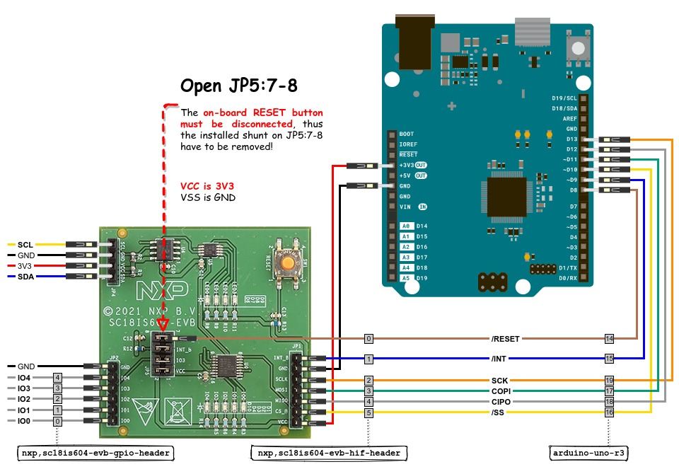

.. _x_nxp_sc18is604_evb_shield:

NXP SC18IS604-EVB Interconnection Shield
########################################

Overview
********

This shield is less a plug-on module in the conventional sense than more
a wiring for interconnection of certain signals from a board down to the
:ref:`nxp_sc18is604_evb_shield`.

Requirements
************

This shield requires a board which provides a configuration that allows:

- two GPIO lines, 1st for reset output and 2nd for optional interrupt input
- one SPI interface, COPI for output and CIPO for input

Supported variations
********************

The table below suggests shield variation often found on many development
boards:

+--------------------+-----------------------------------+-----------+
| Connector Standard | Shield Designation                | Variation |
+====================+===================================+===========+
| Without standard   | **needs board adaption**          |     1     |
+--------------------+-----------------------------------+-----------+
| |Arduino UNO R3|   | |arduino_to_nxp_sc18is604_evb_if| |     2     |
+--------------------+-----------------------------------+-----------+
| |MikroBus|         | (:yl:`not yet, planned`)          |     3     |
+--------------------+-----------------------------------+-----------+

.. |arduino_to_nxp_sc18is604_evb_if| replace::
   :bridle_file:`boards/arduino_to_nxp_sc18is604_evb_if.dtsi
   <boards/shields/x_nxp_sc18is604_evb/boards/arduino_to_nxp_sc18is604_evb_if.dtsi>`

Arduino Uno (R3) headers
========================

The connector standard |Arduino UNO R3| can be used with a variety of
development boards that provide it. Any of these boards must be added
separately. For example, the file |nucleo_f746zg_overlay| exists for
the |zephyr:board:nucleo_f746zg| and simply integrates the generally
valid interface |arduino_to_nxp_sc18is604_evb_if|:

.. literalinclude:: ../boards/nucleo_f746zg.overlay
   :caption: nucleo_f746zg.overlay (as an example)
   :language: DTS
   :encoding: ISO-8859-1
   :emphasize-lines: 1
   :linenos:
   :start-at: arduino_to_nxp_sc18is604_evb_if.dtsi
   :end-at: arduino_to_nxp_sc18is604_evb_if.dtsi

.. |nucleo_f746zg_overlay| replace::
   :bridle_file:`boards/nucleo_f746zg.overlay
   <boards/shields/x_nxp_sc18is604_evb/boards/nucleo_f746zg.overlay>`

.. rubric:: Serial Bus and GPIO Mapping

.. list-table::
   :class: longtable
   :align: center
   :widths: 50
   :header-rows: 1

   * - SPI Host Interface
   * - .. literalinclude:: ../boards/arduino_to_nxp_sc18is604_evb_if.dtsi
          :caption: arduino_to_nxp_sc18is604_evb_if.dtsi: SPI serial bus mapping
          :language: DTS
          :encoding: ISO-8859-1
          :emphasize-lines: 1
          :linenos:
          :start-at: nxp_sc18is604_evb_spi
          :end-at: nxp_sc18is604_evb_spi
       .. literalinclude:: ../boards/arduino_to_nxp_sc18is604_evb_if.dtsi
          :caption: arduino_to_nxp_sc18is604_evb_if.dtsi: SPI host interface GPIO mapping
          :language: DTS
          :encoding: ISO-8859-1
          :emphasize-lines: 2,7-12
          :linenos:
          :prepend: / {
          :start-at: nxp_sc18is604_evb_hif
          :end-at: };
          :append: };

.. rubric:: Interconnection

.. include:: arduino_to_nxp_sc18is604_evb_if_map.rsti

Sample Prototype
----------------

Mikro BUS headers
=================

.. note::

   The connector standard |MikroBus| is not yet supported
   and has yet to be defined.
