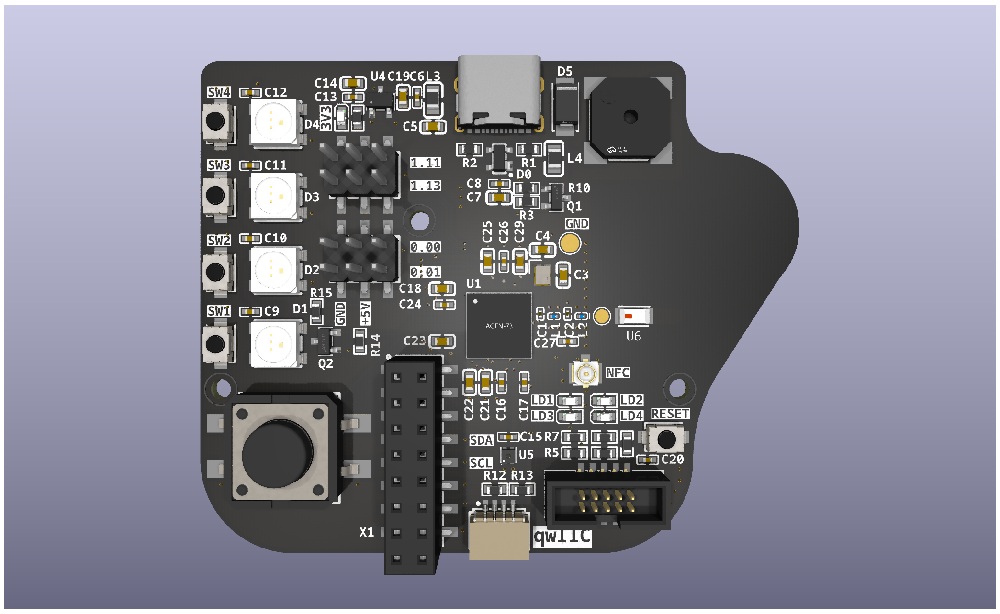

.. _tiac_coffeecaller_board:

TiaC CoffeeCaller
#################

Overview
********

The TiaC CoffeeCaller is based on the ``aQFN73`` package of the ``nRF52840`` chip. See
the `nRF52840 Product Overview`_ for a short description of the key features of
the chip or the more detailed `nRF52840 Product Specification`_ for all technical
details.

The board is powered by ``5 V`` via the USB-C connector and has a ``200 mA`` LDO for the
``3.3 V`` needed by the chip and other peripherals on the board. It features **5 user buttons**,
**4 GPIO LEDs**, **WS2812 RGB Strip with 4 LEDs**, **4 servo PIN headers**, **SHT40 temperature
and humidity sensor**, **qwIIC Connector** and a **PWM buzzer**.

Schematics and KiCad design files can be found in the `CoffeeCaller KiCad Repository`_.

Connections and IOs
===================

LED
---

* LD1 (white) = P1.06
* LD2 (white) = P1.07
* LD3 (white) = P1.02
* LD4 (white) = P1.04

RGB
---

* WS2812 Strip = P0.26

Push buttons
------------

* BUTTON0 (big) = SW0 = P0.04
* BUTTON1  (small) = SW1 = P0.31
* BUTTON2  (small) = SW2 = P0.29
* BUTTON3  (small) = SW3 = P0.03
* BUTTON4  (small) = SW4 = P1.15
* RESET  (small)

Flashing
********

The board features an `UF2 based bootloader`_ to program the application by copying the ``zephyr.uf2``
file to the mounted mass storage device ``TiaCCoffee``.

Here is an example for the :zephyr:code-sample:`hello_world` application.

First, run your favorite terminal program to listen for output.

.. code-block:: console

   $ minicom -D <tty_device> -b 115200

Replace :code:`<tty_device>` with the port where the board TiaC CoffeeCaller
can be found. For example, under Linux, :code:`/dev/ttyACM0`.

Then build and flash the application in the usual way.

.. zephyr-app-commands::
   :zephyr-app: samples/hello_world
   :board: tiac_coffeecaller/nrf52840
   :goals: build flash

Testing the LEDs and buttons
****************************

There are 3 samples that allow you to test that the buttons (switches) and LEDs on
the board are working properly with Zephyr:

.. code-block:: console

   samples/basic/blinky
   samples/basic/button
   samples/drivers/led/led_strip

You can build and flash the examples to make sure Zephyr is running correctly on
your board. The button and LED definitions can be found in
:bridle_file:`boards/tiac/coffeecaller/tiac_coffeecaller_nrf52840.dts`.

Selecting the pins
==================

Pins can be configured in the board pinctrl file. To see the available mappings,
open the `nRF52840 Product Specification`_, chapter 7 'Hardware and Layout'.
In the table 7.1.1 'aQFN73 ball assignments' select the pins marked
'General purpose I/O'.  Note that pins marked as 'low frequency I/O only' can only be used
in under-10KHz applications. They are not suitable for 115200 speed of UART.

References
**********

.. target-notes::

.. _nRF52840 Product Overview: https://www.nordicsemi.com/Products/nRF52840
.. _nRF52840 Product Specification: https://docs.nordicsemi.com/bundle/ps_nrf52840/page/keyfeatures_html5.html
.. _CoffeeCaller KiCad Repository: https://github.com/tiacsys/ecad-coffeecaller
.. _UF2 based bootloader: https://github.com/andreaskurz/Adafruit_nRF52_Bootloader
