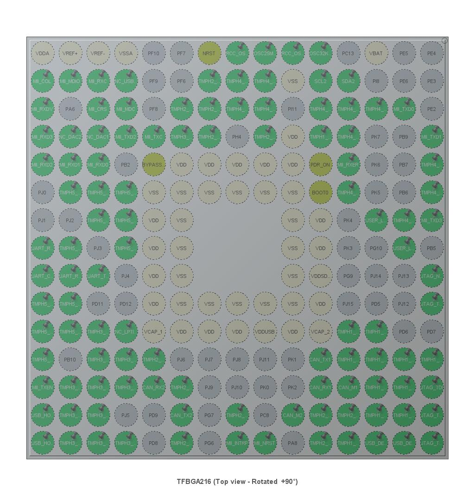

.. _magpie_f777ni_board:

TiaC Magpie F777NI
##################

Overview
********

The TiaC Magpie F777NI board offers combination of performance and power
that provide an affordable and flexible way for users to build prototypes
and try out new concepts for target communication systems.

The board requires any separate JTAG/SWD probe, e.g. the ST-LINK/V2
debugger/programmer.

.. rubric:: Key Features

- STM32 microcontroller in TFBGA216 package
- Ethernet compliant with IEEE-802.3-2002 (depending on STM32 support)
- USB full-speed device (depending on STM32 support)
- USB full-speed host with 7 port hub (depending on STM32 support)
- 2 user LEDs
- reset push-button
- 25.000 MHz high-speed on-board crystal oscillator (for system clock)
- 32.768 kHz low-speed on-board crystal oscillator (for on-chip RTC)
- Board connectors:

  - JTAG/SWD
  - UART Console over USB with Micro-AB
  - USB device with Micro-AB
  - Ethernet RJ45 (depending on STM32 support)
  - 6 2x8 pin header with dedicated CAN and USB busses
  - 5 2x7 :ref:`TiaC Magpie compatible pin header
    <magpie_f777ni_board_tmph_with_dts_bindings>` with spare GPIO
  - Single power-supply input: 12V/3A external sources

.. image:: img/magpie_f777ni.svg
   :alt: TiaC Magpie F777NI
   :align: center

.. More information about the board can be found at the
   `TiaC Magpie F777NI website`_.

.. ...........................................................................

Hardware
********

The STM32F777NIHx on the TiaC Magpie F777NI board provides the following
hardware components:

.. rst-class:: rst-columns

- STM32F777NIHx in TFBGA216 package
- ARM 32-bit Cortex®-M7 CPU with DPFPU
- Chrom-ART Accelerator
- ART Accelerator
- 216 MHz max CPU frequency
- VDD from 1.7 V to 3.6 V
- 2 MB Flash
- 512 KB SRAM
- 7-bit watchdog timer (1)
- 12-bit independent watchdog timer (1)
- 24-bit system-tick timer (1)
- 16-bit low-power timer (1)
- 16-bit timers (12)
- 32-bit timers (2)
- SPI (6)
- I2C (4)
- I2S (3)
- USART (4)
- UART (4)
- USB OTG Full Speed (1)
- USB OTG Full Speed and High Speed (1)
- 10/100 Ethernet MAC with MII/RMII and MDIO (1)
- CAN (3)
- SAI (2)
- Dual Mode Quad SPI (1)
- GPIO (up to 168) with external interrupt capability
- Digital Filters for Sigma Delta Modulator (DFSDM)
  with 8 channels / 4 filters
- 12-bit ADC with 24 channels / 2.4 MSPS (3)
- 12-bit DAC with 2 channels (2)
- 16-channel DMA
- Cryptographic Acceleration for AES 128, 192, 256, triple DES,
  HASH (MD5, SHA-1, SHA-2), and HMAC
- True Random Number Generator (RNG)
- CRC calculation unit
- RTC: subsecond accuracy, hardware calendar
- 96-bit unique ID

More information about the STM32F777NIHx can be found at the website about
`STM32F777NI on www.st.com`_ or in the `STM32F777 Reference Manual (RM0410)`_
and the `STM32F7 Series Cortex®-M7 Processor Programming Manual (PM0253)`_.

Supported Features
==================

The Zephyr ``magpie_f777ni`` board configuration supports the following
hardware features:

.. list-table:: Hardware Features Supported by Zephyr
   :class: longtable
   :align: center
   :header-rows: 1

   * - Peripheral
     - Kconfig option
     - Devicetree compatible
     - Zephyr API
   * - PINCTRL
     - :kconfig:option:`CONFIG_PINCTRL`
     - :dtcompatible:`st,stm32-pinctrl`
     - :external+zephyr:ref:`pinctrl_api`
   * - GPIO
     - :kconfig:option:`CONFIG_GPIO`
     - :dtcompatible:`st,stm32-gpio`
     - :external+zephyr:ref:`gpio_api`
   * - UART
     - :kconfig:option:`CONFIG_SERIAL`
     - | :dtcompatible:`st,stm32-uart`
       | :dtcompatible:`st,stm32-usart`
     - :external+zephyr:ref:`uart_api`
   * - UDC (USB Device Controller)
     - :kconfig:option:`CONFIG_USB_DEVICE_STACK_NEXT`
     - | :dtcompatible:`st,stm32-otgfs`
       | :dtcompatible:`st,stm32-otghs`
     - :external+zephyr:ref:`usb_device_next_api`
   * - ETH (L1: PHY, L2: MAC / LLC)
     - :kconfig:option:`CONFIG_NET_L2_ETHERNET`
     - :dtcompatible:`st,stm32-ethernet` (!)
     - :external+zephyr:ref:`ethernet_interface`
   * - MDIO (L1: PHY)
     - :kconfig:option:`CONFIG_MDIO`
     - :dtcompatible:`st,stm32-mdio`
     - :external+zephyr:ref:`mdio_api`
   * - CAN (L1: PMA / PCS, L2: DLL)
     - :kconfig:option:`CONFIG_CAN`
     - :dtcompatible:`st,stm32-bxcan`
     - :external+zephyr:ref:`canbus`
   * - I2C
     - :kconfig:option:`CONFIG_I2C`
     - :dtcompatible:`st,stm32-i2c-v2`
     - :external+zephyr:ref:`i2c_api`
   * - SPI
     - :kconfig:option:`CONFIG_SPI`
     - | :dtcompatible:`st,stm32-spi-fifo`
       | :dtcompatible:`st,stm32-spi`
     - :external+zephyr:ref:`spi_api`
   * - PWM
     - :kconfig:option:`CONFIG_PWM`
     - | :dtcompatible:`st,stm32-timers`
       | :dtcompatible:`st,stm32-pwm`
     - :external+zephyr:ref:`pwm_api`
   * - DAC
     - :kconfig:option:`CONFIG_DAC`
     - :dtcompatible:`st,stm32-dac`
     - :external+zephyr:ref:`dac_api`
   * - ADC
     - :kconfig:option:`CONFIG_ADC`
     - | :dtcompatible:`st,stm32f4-adc`
       | :dtcompatible:`st,stm32-adc`
     - :external+zephyr:ref:`adc_api`
   * - RTC
     - :kconfig:option:`CONFIG_RTC`
     - :dtcompatible:`st,stm32-rtc`
     - :external+zephyr:ref:`rtc_api` as
       :external+zephyr:ref:`counter_api`
   * - Timer (Counter)
     - :kconfig:option:`CONFIG_COUNTER`
     - | :dtcompatible:`st,stm32-timers`
       | :dtcompatible:`st,stm32-counter`
     - :external+zephyr:ref:`counter_api`
   * - Watchdog Timer (WDT)
     - :kconfig:option:`CONFIG_WATCHDOG`
     - | :dtcompatible:`st,stm32-watchdog`
       | :dtcompatible:`st,stm32-window-watchdog` (?)
     - :external+zephyr:ref:`watchdog_api`
   * - RNG
     - :kconfig:option:`CONFIG_ENTROPY_GENERATOR`
     - :dtcompatible:`st,stm32-rng`
     - :external+zephyr:ref:`entropy_api`
   * - Flash
     - :kconfig:option:`CONFIG_FLASH`
     - | :dtcompatible:`st,stm32f7-flash-controller`
       | :dtcompatible:`st,stm32-flash-controller`
     - :external+zephyr:ref:`flash_api` and
       :external+zephyr:ref:`flash_map_api`
   * - DMA
     - :kconfig:option:`CONFIG_DMA`
     - :dtcompatible:`st,stm32-dma-v1`
     - :external+zephyr:ref:`dma_api`
   * - HWINFO
     - :kconfig:option:`CONFIG_HWINFO`
     - N/A
     - :external+zephyr:ref:`hwinfo_api`
   * - RESET
     - :kconfig:option:`CONFIG_RESET`
     - | :dtcompatible:`st,stm32-rcc`
       | :dtcompatible:`st,stm32-rcc-rctl`
     - :external+zephyr:ref:`reset_api`
   * - CLOCK
     - :kconfig:option:`CONFIG_CLOCK_CONTROL`
     - :dtcompatible:`st,stm32-rcc`
     - :external+zephyr:ref:`clock_control_api`
   * - NVIC
     - N/A
     - | :dtcompatible:`st,stm32-exti`
       | :dtcompatible:`arm,v7m-nvic`
     - Nested Vector :external+zephyr:ref:`interrupts_v2` Controller
   * - SYSTICK
     - N/A
     - :dtcompatible:`arm,armv7m-systick`
     -

(!) Ethernet instability on SOC cut-A (Device marking A):
    TiaC Magpie with SOC cut-A (Device marking A) has some ethernet instability
    (https://github.com/zephyrproject-rtos/zephyr/issues/26519).
    Use of cut-Z is advised. See restrictions errata:
    https://www.st.com/resource/en/errata_sheet/DM00257543.pdf

(?) IWDG only tested:
    WWDG (Window Watchdog Timer) not yet part of board support,
    testet only with IWDG (Independent Watchdog Timer).

Other hardware features are not yet supported on this Zephyr board support.
The default configuration can be found in the defconfig file:
:bridle_file:`boards/tiac/magpie_f777ni/magpie_f777ni_defconfig`.

.. For mode details please refer to
   `TiaC Magpie F777NI board User Manual`_.

Default Zephyr Peripheral Mapping:
----------------------------------

The TiaC Magpie F777NI board is configured as follows:

   :User LED 1/2: PG11/PG12
   :JTAG(SWD) TMS/TCK/TDI/TDO/TRST: PA13/PA14/PA15/PB3/PB4 (**ST-Link**)
   :UART 7 TX/RX/RTS/CTS: PE8/PE7/PE9/PE10 (**Zephyr Shell Console**)
   :ETH: PA0, PA1, PA2, PA3, PA7, PB0, PB1, PB8, PB11, PC1, PC2, PC3,
         PC4, PC5, (PC6/PC7), PG13, PG14, PI10
   :USB OTG FS DM/DP (device): PA11/PA12
   :USB OTG HS DM/DP (host/hub): (PB14/PB15)
   :CAN 1 TX/RX: PH13/PH14, (PH15)
   :CAN 2 RX/TX: PB12/PB13, (PC9)
   :I2C 2 SDA/SCL: PF0/PF1
   :UART 4 TX/RX: PD1/PD0 (**shields**)
   :I2C 4 SCL/SDA: PF14/PF15 (**shields**)
   :SPI 5 MOSI/NSS/SCK/MISO: PF11/PH5/PH6/PH7 (**shields**)
   :PWM TIM 8 CH1/2/3: PI5/PI6/PI7 (**shields**)
   :ADC 3 IN9/IN14/IN15: PF3/PF4/PF5 (**shields**)

System and Real-Time Clock
--------------------------

The STM32F777NIHx System Clock on the TiaC Magpie board could be driven by an
internal or external oscillator, as well as the main PLL clock. By default,
the System clock is driven by the PLL clock at 216 MHz, driven by an 25 MHz
high-speed on-board clock.

The STM32F777NIHx Real-Time Clock on the TiaC Magpie board could be driven by
an internal or external oscillator. By default, the Real-Time Clock is driven
by an 32.768 kHz low-speed on-board clock.

See :ref:`magpie_f777ni_board_clocktree_with_kconfig`
for a more detailed specification.

User LED
--------

The TiaC Magpie provides two red LEDs for user purposes.

See :ref:`magpie_f777ni_board_gpioleds_with_dts_bindings`
for a more detailed specification.

Serial Port
-----------

The STM32F777NIHx on the TiaC Magpie board has 4 UARTs and 4 USARTs, but not
all are open usable or accessible. The Zephyr console output is assigned to
UART 7. Default settings are 115200 8N1 with hardware flow control (RTS/CTS).

See :ref:`magpie_f777ni_board_console_with_dts_bindings`
for a more detailed specification.

Ethernet MAC
------------

The STM32F777NIHx on the TiaC Magpie board has one 10/100 Ethernet MAC with
MII/RMII and MDIO. The Zephyr network stack, mostly with TCP/IP support, is
assigned to this MAC and will use the full MII with MDIO to communicate with
the underlyed Ethernet PHY.

See :ref:`magpie_f777ni_board_ethernet_with_dts_bindings`
for a more detailed specification.

USB OTG
-------

The STM32F777NIHx on the TiaC Magpie board has two independent USB 2.0 OTG
controller, one full-speed (FS) with an on-chip PHY and one high-speed (HS)
or full-speed (FS) with an on-chip PHY and ULPI. Both controllers supports
device or host mode. The TiaC Magpie uses the first USB 2.0 OTG FS controller
in USB device mode. The second USB 2.0 OTG HS controller is reserved for
USB host mode.

See :ref:`magpie_f777ni_board_usbdevice_with_dts_bindings`
for a more detailed specification.

CAN Busses
----------

The STM32F777NIHx on the TiaC Magpie board has 3 CAN controller, but not
all are open usable or accessible. The TiaC Magpie uses the first two
controllers, wherein the firstly enumerated is considered to be primarily.

.. warning::

   With current Zephyr version, either CAN controller 1 or 2 can be used on
   their own, not both simultaneously.

The bus timing is defined by the DTS and is preset to 1000 kBit/s. The
calculation was verified with the help of the `CAN Bit Time Calculation Sheet`_
and can also assume smaller bit rates according to the following table. Note
that the value of **Prescaler**, **Seg 1** and **Seg 2** will be calculated on
demand by the Zephyr :external+zephyr:ref:`can_api` API together with the driver.

.. list-table:: CAN bus timing calculation
   :class: longtable
   :align: center
   :widths: 10, 10, 10, 35, 35
   :header-rows: 1
   :stub-columns: 2

   * - Bit Rate
     - Sample Point at
     - Prescaler
     - Seg 1 (``prop-seg + phase-seg1``)
     - Seg 2 (``phase-seg2``)
   * - 1000 kBit/s
     - 88.9 %
     - 3
     - 15
     - 2
   * - 500 kBit/s
     - 88.9 %
     - 6
     - 15
     - 2
   * - 250 kBit/s
     - 88.9 %
     - 12
     - 15
     - 2
   * - 125 kBit/s
     - 88.9 %
     - 24
     - 15
     - 2
   * - 125 kBit/s
     - 87.5 %
     - 27
     - 13
     - 2
   * - 100 kBit/s
     - 88.9 %
     - 30
     - 15
     - 2
   * - 50 kBit/s
     - 88.9 %
     - 60
     - 15
     - 2
   * - 20 kBit/s
     - 88.9 %
     - 150
     - 15
     - 2
   * - 10 kBit/s
     - 88.9 %
     - 300
     - 15
     - 2

See :ref:`magpie_f777ni_board_canbus_with_dts_bindings`
for a more detailed specification.

System I2C Bus
--------------

The STM32F777NIHx on the TiaC Magpie board has 4 I2C controller, but not
all are open usable or accessible. The TiaC Magpie uses the second controller
on-board for Power and Reset Control on the 6 2x8 pin header, ``TUB[1..6]``.

See :ref:`magpie_f777ni_board_sysiic_with_dts_bindings`
for a more detailed specification.

Pin Header
----------

The five TiaC Magpie pin headers ``TMPH[1..5]`` have the following layout:

.. image:: img/magpie_f777ni_ph.svg
   :alt: TiaC Magpie Pin Header 1-5
   :align: center

See :ref:`magpie_f777ni_board_tmph_with_dts_bindings`
for a more detailed specification.

.. ...........................................................................

Programming and Debugging
*************************

Applications for the ``magpie_f777ni`` board configuration can be built and
flashed in the usual way (see :external+zephyr:ref:`build_an_application` and
:external+zephyr:ref:`application_run` for more details).

Flashing
========

The TiaC Magpie STM32F777NIHx needs an ST-LINK/V2 debug tool adapter.

Flashing an application to TiaC Magpie F777NI
---------------------------------------------

Here is an example for the :external+zephyr:zephyr:code-sample:`hello_world`
application.

Run a serial host program to connect with your TiaC Magpie board.

.. code-block:: console

   $ screen /dev/ttyUSBx 115200,cs8,parenb,-parodd,-cstopb

Build and flash the application:

.. zephyr-app-commands::
   :app: zephyr/samples/hello_world
   :build-dir: hello_world-magpie_f777ni
   :board: magpie_f777ni
   :west-args: -p
   :goals: flash
   :host-os: unix
   :compact:

You should see the following message on the console:

.. parsed-literal::
   :class: highlight-console notranslate

   \*\*\* Booting Zephyr OS build |zephyr_version_em|\ *…*\*\*\*
   Hello World! magpie_f777ni/stm32f777xx

Debugging
=========

You can debug an application in the usual way. Here is an example for the
:external+zephyr:zephyr:code-sample:`hello_world` application.

.. zephyr-app-commands::
   :app: zephyr/samples/hello_world
   :build-dir: hello_world-magpie_f777ni
   :board: magpie_f777ni
   :maybe-skip-config:
   :west-args: -p
   :goals: debug
   :host-os: unix

.. ...........................................................................

Tests and Examples
******************

Examples and Demonstrations
===========================

Zephyr provides a large number of samples and demonstration applications,
some of which can be used for the start-up of the TiaC Magpie without any
further modification:

.. toctree::
   :maxdepth: 1
   :glob:

   samples/**/*

Integration Tests
=================

Zephyr provides a large number of integration tests to evaluate the target
architecture, the operating system core components, drivers and subsystems.
Most of them can be build and running by the Zephyr
:external+zephyr:ref:`twister_script` without any further modification.

Before a single or multiple test cases can be executed directly on the
TiaC Magpie, a so-called hardware map must be created with the help of
Twister and adapted manually. You can do that with the following command
line inside your local workspace directory:

.. code-block:: console

   rm -f map.yaml && cd ./zephyr && \
       ./scripts/twister --generate-hardware-map ../map.yaml && \
       cd - && editor map.yaml

This hardware map (``map.yaml``) could look like the following. Bold
highlighted portions need to be added manually. Italic parts have to be
adapted to your own specific situation, important here is the platform
setup to :ibl:`magpie_f777ni/stm32f777xx`:

   .. container:: highlight highlight-console notranslate literal-block

      .. parsed-literal::

         - :bbl:`available: true`
           :bbl:`connected: true`
           :bbl:`fixtures:`
             :bbl:`- pwm_loopback`
             :bbl:`- uart_loopback`
             :bbl:`- gpio_loopback`
             :bbl:`- gpio_spi_loopback`
             :bbl:`- spi_loopback`
             :bbl:`- i2c_loopback`
             :bbl:`- i2c_bus_short`
           id: :ign:`DT04BNT1`
           platform: :ibl:`magpie_f777ni/stm32f777xx`
           product: :bbl:`TiaC Magpie F777NI`
           runner: :ign:`openocd`
           serial: :ign:`/dev/ttyUSB0`

All currently qualified tests for TiaC Magpie can be executed and verified
with a single call to Twister.

.. tabs::

   .. group-tab:: Running

      Build and run the tests on target as follows:

      .. code-block:: console

         $ west twister --jobs 4 \
                --enable-size-report --platform-reports \
                --device-testing --hardware-map map.yaml \
                --extra-args SHIELD="loopback_test_tmph" \
                --alt-config-root bridle/zephyr/alt-config/tests \
                --testsuite-root bridle/tests \
                --testsuite-root zephyr/tests \
                --tag arm --tag vector_relay \
                --tag kernel --exclude-tag security \
                             --exclude-tag benchmark \
                --tag bridle \
                --tag hwinfo \
                --tag random \
                --tag entropy \
                --tag watchdog \
                --tag counter \
                --tag gpio \
                --tag spi \
                --tag uart \
                --tag can

      .. attention:: That will take more than an hour.

   .. group-tab:: Results

      You should see the following messages on host console:

      .. parsed-literal::
         :class: highlight-console notranslate

         Device testing on:

         \| Platform                  \| ID       \| Serial device   \|
         \|---------------------------\|----------\|-----------------\|
         \| magpie_f777ni/stm32f777xx \| DT04BNT1 \| /dev/ttyUSB0    \|

         INFO    - JOBS: 4
         INFO    - Adding tasks to the queue...
         INFO    - Added initial list of jobs to queue
         INFO    - Total complete:  :bgn:`187/ 187`  100%  built (not run):    :bbl:`0`, filtered: :byl:`2923`, failed:    :brd:`0`, error:    :bbk:`0`
         INFO    - 3288 test scenarios (3076 configurations) selected, :byl:`2923` configurations filtered (:byl:`2889` by static filter, :byl:`34` at runtime).
         INFO    - :bgn:`153 of 153` executed test configurations passed (100.00%), :bbk:`0` built (not run), :brd:`0` failed, :bbk:`0` errored, with no warnings in :bbk:`3346.49 seconds`.
         INFO    - 1645 of 1645 executed test cases passed (100.00%), on 1 out of total 1293 platforms (0.08%).
         INFO    - 157 selected test cases not executed: 157 skipped.
         INFO    - :bgn:`153` test configurations executed on platforms, :bbl:`0` test configurations were only built.

         Hardware distribution summary:

         \| Board                     \| ID       \|   Counter \|   Failures \|
         \|---------------------------\|----------\|-----------\|------------\|
         \| magpie_f777ni/stm32f777xx \| DT04BNT1 \|       153 \|          0 \|

         INFO    - Saving reports...
         INFO    - Writing JSON report .../twister-out/twister.json
         INFO    - Writing xunit report .../twister-out/twister.xml...
         INFO    - Writing xunit report .../twister-out/twister_report.xml...
         INFO    - Writing target report for magpie_f777ni/stm32f777xx...
         INFO    - Writing JSON report .../twister-out/magpie_f777ni_stm32f777xx.json
         INFO    - Run completed

.. admonition:: Known but currently tolerated test cases with errors
   :class: attention

   .. toctree::
      :maxdepth: 1

      tests/drivers/adc
      tests/drivers/i2c
      tests/drivers/pwm

Likewise, each of these test suites can also be running individually.
The following are valid:

.. toctree::
   :maxdepth: 1
   :glob:

   tests/arch/arm
   tests/drivers/can
   tests/drivers/counter
   tests/drivers/entropy
   tests/drivers/gpio
   tests/drivers/hwinfo
   tests/drivers/spi
   tests/drivers/uart
   tests/drivers/watchdog
   tests/os/kernel
   tests/os/bridle

.. ...........................................................................

Detailed Specification
**********************

.. _magpie_f777ni_board_clocktree_with_kconfig:

System Clock with DTS Bindings and Kconfig
==========================================

The DTS binding following the :dtcompatible:`st,stm32-rcc`,
:dtcompatible:`st,stm32f7-pll-clock`, :dtcompatible:`st,stm32-hse-clock`
and :dtcompatible:`st,stm32-lse-clock` specification. The Kconfig default
configuration is for STM32 RTC (Real-Time Clock Controller) and will be used
by counter driver behind DTS binding following the :dtcompatible:`st,stm32-rtc`
specification.

.. list-table:: System Clock DTS Bindings and Kconfig
   :class: longtable
   :align: center
   :widths: 75, 25
   :header-rows: 1

   * - Clock-Tree
     - DTS Bindings / Kconfig

   * - .. image:: img/STM32F777NIHx_clocktree.jpg
          :alt: STM32F777NIHx System Clock Tree
          :align: center
          :scale: 75 %

     - :dtcompatible:`st,stm32-hse-clock` configuration:

       .. literalinclude:: ../magpie_f777ni.dts
          :caption: magpie_f777ni.dts
          :language: DTS
          :encoding: ISO-8859-1
          :emphasize-lines: 3
          :linenos:
          :start-at: clk_hse {
          :end-at: }; // clk_hse

       :dtcompatible:`st,stm32f7-pll-clock` configuration:

       .. literalinclude:: ../magpie_f777ni.dts
          :caption: magpie_f777ni.dts
          :language: DTS
          :encoding: ISO-8859-1
          :emphasize-lines: 3
          :linenos:
          :start-at: pll {
          :end-at: }; // pll

       :dtcompatible:`st,stm32-rcc` configuration:

       .. literalinclude:: ../magpie_f777ni.dts
          :caption: magpie_f777ni.dts
          :language: DTS
          :encoding: ISO-8859-1
          :emphasize-lines: 3,7
          :linenos:
          :start-at: rcc {
          :end-at: }; // rcc

       :dtcompatible:`st,stm32-lse-clock` configuration:

       .. literalinclude:: ../magpie_f777ni.dts
          :caption: magpie_f777ni.dts
          :language: DTS
          :encoding: ISO-8859-1
          :emphasize-lines: 3
          :linenos:
          :start-at: clk_lse {
          :end-at: }; // clk_lse

       :dtcompatible:`st,stm32-rtc` configuration:

       .. literalinclude:: ../magpie_f777ni.dts
          :caption: magpie_f777ni.dts
          :language: DTS
          :encoding: ISO-8859-1
          :emphasize-lines: 3-4
          :linenos:
          :start-at: rtc {
          :end-at: }; // rtc

       :kconfig:option:`CONFIG_CLOCK_CONTROL` and
       :kconfig:option:`CONFIG_COUNTER` configuration:

       .. literalinclude:: ../magpie_f777ni_defconfig
          :caption: magpie_f777ni_defconfig
          :language: cfg
          :encoding: ISO-8859-1
          :emphasize-lines: 2,5
          :linenos:
          :start-at: Clock Configuration
          :end-before: Enable MPU

.. _magpie_f777ni_board_gpioleds_with_dts_bindings:

User LED with DTS Bindings
==========================

The DTS binding following the :dtcompatible:`gpio-leds` specification.

.. list-table:: User LED Pin Binding
   :class: longtable
   :align: center
   :widths: 40, 60
   :header-rows: 1

   * - Multiplexing
     - Device-Tree

   * - .. csv-filter:: User LED Pin Multiplexing
          :file: STM32F777NIHx_with_alt.csv
          :encoding: ISO-8859-1
          :class: longtable
          :align: center
          :delim: ,
          :widths: 12, 12, 6
          :included_cols: 4,3,1
          :include: {1: '(PG11|PG12)$'}
          :header-rows: 1
          :stub-columns: 1
       .. :include: {4: '(USER_LED)'} <-- doesn't work

     - :dtcompatible:`gpio-leds` configuration:

       .. literalinclude:: ../magpie_f777ni.dts
          :caption: magpie_f777ni.dts
          :language: DTS
          :encoding: ISO-8859-1
          :emphasize-lines: 4,8
          :linenos:
          :start-at: leds {
          :end-at: }; // leds

       DTS :external+zephyr:ref:`aliases <dt-alias-chosen>`:

       .. literalinclude:: ../magpie_f777ni.dts
          :language: DTS
          :encoding: ISO-8859-1
          :start-at: led0 =
          :end-at: led1 =

.. _magpie_f777ni_board_console_with_dts_bindings:

Serial Console with DTS Bindings
================================

The DTS binding following the :dtcompatible:`st,stm32-uart` specification.

.. list-table:: Serial Console Pin Binding
   :class: longtable
   :align: center
   :widths: 40, 60
   :header-rows: 1

   * - Multiplexing
     - Device-Tree

   * - .. csv-filter:: Serial Console Pin Multiplexing
          :file: STM32F777NIHx_with_alt.csv
          :encoding: ISO-8859-1
          :class: longtable
          :align: center
          :delim: ,
          :widths: 12, 12, 6
          :included_cols: 4,3,1
          :include: {1: '(PE8|PE7|PE9|PE10)$'}
          :header-rows: 1
          :stub-columns: 1
       .. :include: {3: '(UART7)'} <-- doesn't work

     - :dtcompatible:`st,stm32-uart` configuration:

       .. literalinclude:: ../magpie_f777ni.dts
          :caption: magpie_f777ni.dts
          :language: DTS
          :encoding: ISO-8859-1
          :emphasize-lines: 4-7
          :linenos:
          :start-at: uart7 {
          :end-at: }; // uart7

       :kconfig:option:`CONFIG_HAS_DTS` configuration:

       .. literalinclude:: ../magpie_f777ni.dts
          :language: DTS
          :encoding: ISO-8859-1
          :start-at: zephyr,console
          :end-at: zephyr,console

       .. literalinclude:: ../magpie_f777ni.dts
          :language: DTS
          :encoding: ISO-8859-1
          :start-at: zephyr,shell-uart
          :end-at: zephyr,shell-uart

.. _magpie_f777ni_board_ethernet_with_dts_bindings:

Ethernet MAC with DTS Bindings
==============================

The DTS binding following the :dtcompatible:`st,stm32-ethernet` specification.

.. list-table:: Ethernet MAC Pin Binding
   :class: longtable
   :align: center
   :widths: 40, 60
   :header-rows: 1

   * - Multiplexing
     - Device-Tree

   * - .. csv-filter:: Ethernet MAC Pin Multiplexing
          :file: STM32F777NIHx_with_alt.csv
          :encoding: ISO-8859-1
          :class: longtable
          :align: center
          :delim: ,
          :widths: 12, 12, 6
          :included_cols: 4,3,1
          :include: {1: '(PA0/WKUP|PA1|PA2|PA3|PA7|PB0|PB1|PB8|PB11|PC1|PC2|PC3|PC4|PC5|PC6|PC7|PG13|PG14|PI10)$'}
          :header-rows: 1
          :stub-columns: 1
       .. :include: {3: '(ETH)'} <-- doesn't work

     - :dtcompatible:`st,stm32-ethernet` configuration:

       .. literalinclude:: ../magpie_f777ni.dts
          :caption: magpie_f777ni.dts
          :language: DTS
          :encoding: ISO-8859-1
          :emphasize-lines: 4-20
          :linenos:
          :start-at: mac {
          :end-at: }; // mac

.. _magpie_f777ni_board_usbdevice_with_dts_bindings:

USB OTG with DTS Bindings
=========================

The DTS binding following the :dtcompatible:`st,stm32-otgfs` and
:dtcompatible:`st,stm32-otghs` specification.

.. list-table:: USB OTG Pin Binding
   :class: longtable
   :align: center
   :widths: 40, 60
   :header-rows: 1

   * - Multiplexing
     - Device-Tree

   * - .. csv-filter:: USB OTG FS Pin Multiplexing
          :file: STM32F777NIHx_with_alt.csv
          :encoding: ISO-8859-1
          :class: longtable
          :align: center
          :delim: ,
          :widths: 12, 12, 6
          :included_cols: 4,3,1
          :include: {1: '(PA11|PA12)$'}
          :header-rows: 1
          :stub-columns: 1
       .. :include: {3: '(USB_OTG_FS)'} <-- doesn't work

     - :dtcompatible:`st,stm32-otgfs` configuration:

       .. literalinclude:: ../magpie_f777ni.dts
          :caption: magpie_f777ni.dts
          :language: DTS
          :encoding: ISO-8859-1
          :emphasize-lines: 4-5
          :linenos:
          :start-at: usbotg_fs {
          :end-at: }; // usbotg_fs

       :external+zephyr:ref:`usb_device_next_api` configuration:

       .. literalinclude:: ../magpie_f777ni.dts
          :language: DTS
          :encoding: ISO-8859-1
          :start-at: zephyr,usb-device
          :end-at: zephyr,usb-device

   * - .. csv-filter:: USB OTG HS Pin Multiplexing
          :file: STM32F777NIHx_with_alt.csv
          :encoding: ISO-8859-1
          :class: longtable
          :align: center
          :delim: ,
          :widths: 12, 12, 6
          :included_cols: 4,3,1
          :include: {1: '(PB14|PB15)$'}
          :header-rows: 1
          :stub-columns: 1
       .. :include: {3: '(USB_OTG_HS)'} <-- doesn't work

     - :dtcompatible:`st,stm32-otghs` configuration:

       .. admonition:: Not yet configured!
          :class: warning

          | Only USB device function is supported in Zephyr at the moment
          | (https://github.com/zephyrproject-rtos/zephyr/issues/42066).
          |
          | Since end of 2020 there is an PR with experimental USB host
          | support for Zephyr -- but that must be checked in detail
          | (https://github.com/zephyrproject-rtos/zephyr/pull/30361).

.. _magpie_f777ni_board_canbus_with_dts_bindings:

CAN Busses with DTS Bindings
============================

The DTS binding following the :dtcompatible:`st,stm32-bxcan` specification.

.. list-table:: CAN Busses Pin Binding
   :class: longtable
   :align: center
   :widths: 40, 60
   :header-rows: 1

   * - Multiplexing
     - Device-Tree

   * - .. csv-filter:: CAN Bus 1 Pin Multiplexing
          :file: STM32F777NIHx_with_alt.csv
          :encoding: ISO-8859-1
          :class: longtable
          :align: center
          :delim: ,
          :widths: 12, 12, 6
          :included_cols: 4,3,1
          :include: {1: '(PH13|PH14|PH15)$'}
          :header-rows: 1
          :stub-columns: 1
       .. :include: {3: '(CAN1)'} <-- doesn't work

     - :dtcompatible:`st,stm32-bxcan` configuration:

       .. literalinclude:: ../magpie_f777ni.dts
          :caption: magpie_f777ni.dts
          :language: DTS
          :encoding: ISO-8859-1
          :emphasize-lines: 4-5
          :linenos:
          :start-at: can1 {
          :end-at: }; // can1

       :external+zephyr:ref:`can_api` configuration:

       .. literalinclude:: ../magpie_f777ni.dts
          :language: DTS
          :encoding: ISO-8859-1
          :start-at: zephyr,canbus
          :end-at: zephyr,canbus

   * - .. csv-filter:: CAN Bus 2 Pin Multiplexing
          :file: STM32F777NIHx_with_alt.csv
          :encoding: ISO-8859-1
          :class: longtable
          :align: center
          :delim: ,
          :widths: 12, 12, 6
          :included_cols: 4,3,1
          :include: {1: '(PB12|PB13|PC9)$'}
          :header-rows: 1
          :stub-columns: 1
       .. :include: {3: '(CAN2)'} <-- doesn't work

     - :dtcompatible:`st,stm32-bxcan` configuration:

       .. literalinclude:: ../magpie_f777ni.dts
          :caption: magpie_f777ni.dts
          :language: DTS
          :encoding: ISO-8859-1
          :emphasize-lines: 4-5
          :linenos:
          :start-at: can2 {
          :end-at: }; // can2

.. _magpie_f777ni_board_sysiic_with_dts_bindings:

System I2C Bus with DTS Bindings
================================

The DTS binding following the :dtcompatible:`st,stm32-i2c-v2` specification.

.. list-table:: System I2C Bus 2 Pin Binding
   :class: longtable
   :align: center
   :widths: 40, 60
   :header-rows: 1

   * - Multiplexing
     - Device-Tree

   * - .. csv-filter:: I2C Bus 2 Pin Multiplexing
          :file: STM32F777NIHx_with_alt.csv
          :encoding: ISO-8859-1
          :class: longtable
          :align: center
          :delim: ,
          :widths: 12, 12, 6
          :included_cols: 4,3,1
          :include: {1: '(PF0|PF1)$'}
          :header-rows: 1
          :stub-columns: 1
       .. :include: {3: '(I2C2)'} <-- doesn't work

     - :dtcompatible:`st,stm32-i2c-v2` configuration:

       .. literalinclude:: ../magpie_f777ni.dts
          :caption: magpie_f777ni.dts
          :language: DTS
          :encoding: ISO-8859-1
          :emphasize-lines: 4-5
          :linenos:
          :start-at: i2c2 {
          :end-at: }; // i2c2

.. _magpie_f777ni_board_tmph_with_dts_bindings:

Pin Header with DTS Bindings
============================

The TiaC Magpie compatible pin header expands functionality of the TiaC
development platform, with a wide choice of specialized TiaC shields.
The DTS binding following the :dtcompatible:`tiac-magpie-pin-header`
specification.

TiaC Magpie Pin Header 1
------------------------

Alternate functions on the TiaC Magpie pin header ``TMPH1``:

.. csv-filter:: TMPH1 Pin Multiplexing
   :file: STM32F777NIHx_with_alt.csv
   :encoding: ISO-8859-1
   :class: longtable
   :align: center
   :delim: ,
   :widths: 16, 6, 16, 12, 12, 12, 12, 12, 12, 12
   :included_cols: 4,1,3,6,7,8,10,11,12,13
   :include: {1: '(PA10|PC10|PC11|PC12|PD0|PD1|PD2|PD3|PD4|PI2|PI3|PI9)$'}
   :header-rows: 1
   :stub-columns: 1
.. :include: {4: '(TMPH1)'} <-- doesn't work

.. list-table:: TMPH1 Pin Binding
   :class: longtable
   :align: center
   :widths: 40, 60
   :header-rows: 1
   :stub-columns: 1

   * - Relationship
     - Device-Tree

   * - .. image:: img/tmph1.svg
          :alt: TiaC Magpie Pin Header 1
          :align: center

     - .. literalinclude:: ../magpie_f777ni_pin_header.dtsi
          :caption: magpie_f777ni_pin_header.dtsi
          :language: DTS
          :encoding: ISO-8859-1
          :emphasize-lines: 8-14
          :linenos:
          :start-at: tmph1:
          :end-at: }; // tmph1

   * - .. literalinclude:: ../magpie_f777ni_pin_header.dtsi
          :language: DTS
          :encoding: ISO-8859-1
          :start-at: tmph_serial:
          :end-at: tmph_serial:
       .. literalinclude:: ../magpie_f777ni_pin_header.dtsi
          :language: DTS
          :encoding: ISO-8859-1
          :start-at: tmph_serial1:
          :end-at: tmph_serial1:

     - .. literalinclude:: ../magpie_f777ni.dts
          :caption: magpie_f777ni.dts
          :language: DTS
          :encoding: ISO-8859-1
          :emphasize-lines: 4-5
          :linenos:
          :start-at: uart4 {
          :end-at: }; // uart4

   * - .. literalinclude:: ../magpie_f777ni_pin_header.dtsi
          :language: DTS
          :encoding: ISO-8859-1
          :start-at: tmph_serial2:
          :end-at: tmph_serial2:

     - .. literalinclude:: ../magpie_f777ni.dts
          :caption: magpie_f777ni.dts
          :language: DTS
          :encoding: ISO-8859-1
          :emphasize-lines: 4-5
          :linenos:
          :start-at: usart3 {
          :end-at: }; // usart3

   * - .. literalinclude:: ../magpie_f777ni_pin_header.dtsi
          :language: DTS
          :encoding: ISO-8859-1
          :start-at: tmph_serial3:
          :end-at: tmph_serial3:

     - .. literalinclude:: ../magpie_f777ni.dts
          :caption: magpie_f777ni.dts
          :language: DTS
          :encoding: ISO-8859-1
          :emphasize-lines: 4-5
          :linenos:
          :start-at: uart5 {
          :end-at: }; // uart5

   * - .. literalinclude:: ../magpie_f777ni_pin_header.dtsi
          :language: DTS
          :encoding: ISO-8859-1
          :start-at: tmph_timers:
          :end-at: tmph_timers:
       .. literalinclude:: ../magpie_f777ni_pin_header.dtsi
          :language: DTS
          :encoding: ISO-8859-1
          :start-at: tmph_pwms:
          :end-at: tmph_pwms:

     - .. literalinclude:: ../magpie_f777ni.dts
          :caption: magpie_f777ni.dts
          :language: DTS
          :encoding: ISO-8859-1
          :emphasize-lines: 10
          :linenos:
          :start-at: timers8 {
          :end-at: }; // timers8

TiaC Magpie Pin Header 2
------------------------

Alternate functions on the TiaC Magpie pin header ``TMPH2``:

.. csv-filter:: TMPH2 Pin Multiplexing
   :file: STM32F777NIHx_with_alt.csv
   :encoding: ISO-8859-1
   :class: longtable
   :align: center
   :delim: ,
   :widths: 16, 6, 16, 12, 12, 12, 12, 12, 12, 12
   :included_cols: 4,1,3,6,7,8,9,10,12,13
   :include: {1: '(PA9|PD10|PD14|PD15|PF4|PF5|PG8|PH3|PH5|PI0|PI1|PI15)$'}
   :header-rows: 1
   :stub-columns: 1
.. :include: {4: '(TMPH2)'} <-- doesn't work

.. list-table:: TMPH2 Pin Binding
   :class: longtable
   :align: center
   :widths: 40, 60
   :header-rows: 1
   :stub-columns: 1

   * - Relationship
     - Device-Tree

   * - .. image:: img/tmph2.svg
          :alt: TiaC Magpie Pin Header 2
          :align: center

     - .. literalinclude:: ../magpie_f777ni_pin_header.dtsi
          :caption: magpie_f777ni_pin_header.dtsi
          :language: DTS
          :encoding: ISO-8859-1
          :emphasize-lines: 7-9,12,13
          :linenos:
          :start-at: tmph2:
          :end-at: }; // tmph2

   * - .. literalinclude:: ../magpie_f777ni_pin_header.dtsi
          :language: DTS
          :encoding: ISO-8859-1
          :start-at: tmph_serial4:
          :end-at: tmph_serial4:

     - .. literalinclude:: ../magpie_f777ni.dts
          :caption: magpie_f777ni.dts
          :language: DTS
          :encoding: ISO-8859-1
          :emphasize-lines: 6-7
          :linenos:
          :start-at: uart8 {
          :end-at: }; // uart8

   * - .. literalinclude:: ../magpie_f777ni_pin_header.dtsi
          :language: DTS
          :encoding: ISO-8859-1
          :start-at: tmph_spi2:
          :end-at: tmph_spi2:

     - .. literalinclude:: ../magpie_f777ni.dts
          :caption: magpie_f777ni.dts
          :language: DTS
          :encoding: ISO-8859-1
          :emphasize-lines: 4
          :linenos:
          :start-at: spi5 {
          :end-at: }; // spi5

   * - .. literalinclude:: ../magpie_f777ni_pin_header.dtsi
          :language: DTS
          :encoding: ISO-8859-1
          :start-at: tmph_adc:
          :end-at: tmph_adc:

     - .. literalinclude:: ../magpie_f777ni.dts
          :caption: magpie_f777ni.dts
          :language: DTS
          :encoding: ISO-8859-1
          :emphasize-lines: 5-6
          :linenos:
          :start-at: adc3 {
          :end-at: }; // adc3

TiaC Magpie Pin Header 3
------------------------

Alternate functions on the TiaC Magpie pin header ``TMPH3``:

.. csv-filter:: TMPH3 Pin Multiplexing
   :file: STM32F777NIHx_with_alt.csv
   :encoding: ISO-8859-1
   :class: longtable
   :align: center
   :delim: ,
   :widths: 16, 6, 16, 12, 12, 12, 12, 16
   :included_cols: 4,1,3,7,8,9,10,14
   :include: {1: '(PG2|PG3|PG4|PG5|PH2|PH6|PH7|PH8|PH9|PH10|PH11|PH12)$'}
   :header-rows: 1
   :stub-columns: 1
.. :include: {4: '(TMPH3)'} <-- doesn't work

.. list-table:: TMPH3 Pin Binding
   :class: longtable
   :align: center
   :widths: 40, 60
   :header-rows: 1
   :stub-columns: 1

   * - Relationship
     - Device-Tree

   * - .. image:: img/tmph3.svg
          :alt: TiaC Magpie Pin Header 3
          :align: center

     - .. literalinclude:: ../magpie_f777ni_pin_header.dtsi
          :caption: magpie_f777ni_pin_header.dtsi
          :language: DTS
          :encoding: ISO-8859-1
          :emphasize-lines: 8,9,13
          :linenos:
          :start-at: tmph3:
          :end-at: }; // tmph3

   * - .. literalinclude:: ../magpie_f777ni_pin_header.dtsi
          :language: DTS
          :encoding: ISO-8859-1
          :start-at: tmph_i2c2:
          :end-at: tmph_i2c2:

     - .. literalinclude:: ../magpie_f777ni.dts
          :caption: magpie_f777ni.dts
          :language: DTS
          :encoding: ISO-8859-1
          :emphasize-lines: 4-5
          :linenos:
          :start-at: i2c3 {
          :end-at: }; // i2c3

   * - .. literalinclude:: ../magpie_f777ni_pin_header.dtsi
          :language: DTS
          :encoding: ISO-8859-1
          :start-at: tmph_spi2:
          :end-at: tmph_spi2:

     - .. literalinclude:: ../magpie_f777ni.dts
          :caption: magpie_f777ni.dts
          :language: DTS
          :encoding: ISO-8859-1
          :emphasize-lines: 5-6
          :linenos:
          :start-at: spi5 {
          :end-at: }; // spi5

TiaC Magpie Pin Header 4
------------------------

Alternate functions on the TiaC Magpie pin header ``TMPH4``:

.. csv-filter:: TMPH4 Pin Multiplexing
   :file: STM32F777NIHx_with_alt.csv
   :encoding: ISO-8859-1
   :class: longtable
   :align: center
   :delim: ,
   :widths: 16, 6, 16, 12, 12, 12, 12
   :included_cols: 4,1,3,7,8,9,13
   :include: {1: '(PE0|PE1|PF2|PF3|PG15|PI4|PI5|PI6|PI7|PI12|PI13|PI14)$'}
   :header-rows: 1
   :stub-columns: 1
.. :include: {4: '(TMPH4)'} <-- doesn't work

.. list-table:: TMPH4 Pin Binding
   :class: longtable
   :align: center
   :widths: 40, 60
   :header-rows: 1
   :stub-columns: 1

   * - Relationship
     - Device-Tree

   * - .. image:: img/tmph4.svg
          :alt: TiaC Magpie Pin Header 4
          :align: center

     - .. literalinclude:: ../magpie_f777ni_pin_header.dtsi
          :caption: magpie_f777ni_pin_header.dtsi
          :language: DTS
          :encoding: ISO-8859-1
          :emphasize-lines: 6,8,10,14-16
          :linenos:
          :start-at: tmph4:
          :end-at: }; // tmph4

   * - .. literalinclude:: ../magpie_f777ni_pin_header.dtsi
          :language: DTS
          :encoding: ISO-8859-1
          :start-at: tmph_serial4:
          :end-at: tmph_serial4:

     - .. literalinclude:: ../magpie_f777ni.dts
          :caption: magpie_f777ni.dts
          :language: DTS
          :encoding: ISO-8859-1
          :emphasize-lines: 4-5
          :linenos:
          :start-at: uart8 {
          :end-at: }; // uart8

   * - .. literalinclude:: ../magpie_f777ni_pin_header.dtsi
          :language: DTS
          :encoding: ISO-8859-1
          :start-at: tmph_timers:
          :end-at: tmph_timers:
       .. literalinclude:: ../magpie_f777ni_pin_header.dtsi
          :language: DTS
          :encoding: ISO-8859-1
          :start-at: tmph_pwms:
          :end-at: tmph_pwms:

     - .. literalinclude:: ../magpie_f777ni.dts
          :caption: magpie_f777ni.dts
          :language: DTS
          :encoding: ISO-8859-1
          :emphasize-lines: 7-9
          :linenos:
          :start-at: timers8 {
          :end-at: }; // timers8

   * - .. literalinclude:: ../magpie_f777ni_pin_header.dtsi
          :language: DTS
          :encoding: ISO-8859-1
          :start-at: tmph_adc:
          :end-at: tmph_adc:

     - .. literalinclude:: ../magpie_f777ni.dts
          :caption: magpie_f777ni.dts
          :language: DTS
          :encoding: ISO-8859-1
          :emphasize-lines: 4
          :linenos:
          :start-at: adc3 {
          :end-at: }; // adc3

TiaC Magpie Pin Header 5
------------------------

Alternate functions on the TiaC Magpie pin header ``TMPH5``:

.. csv-filter:: TMPH5 Pin Multiplexing
   :file: STM32F777NIHx_with_alt.csv
   :encoding: ISO-8859-1
   :class: longtable
   :align: center
   :delim: ,
   :widths: 16, 6, 16, 12, 12, 12
   :included_cols: 4,1,3,6,9,10
   :include: {1: '(PE11|PE12|PE13|PE14|PE15|PF11|PF12|PF13|PF14|PF15|PG0|PG1)$'}
   :header-rows: 1
   :stub-columns: 1
.. :include: {4: '(TMPH5)'} <-- doesn't work

.. list-table:: TMPH5 Pin Binding
   :class: longtable
   :align: center
   :widths: 40, 60
   :header-rows: 1
   :stub-columns: 1

   * - Relationship
     - Device-Tree

   * - .. image:: img/tmph5.svg
          :alt: TiaC Magpie Pin Header 5
          :align: center

     - .. literalinclude:: ../magpie_f777ni_pin_header.dtsi
          :caption: magpie_f777ni_pin_header.dtsi
          :language: DTS
          :encoding: ISO-8859-1
          :emphasize-lines: 6,11-14,16,17
          :linenos:
          :start-at: tmph5:
          :end-at: }; // tmph5

   * - .. literalinclude:: ../magpie_f777ni_pin_header.dtsi
          :language: DTS
          :encoding: ISO-8859-1
          :start-at: tmph_i2c:
          :end-at: tmph_i2c:
       .. literalinclude:: ../magpie_f777ni_pin_header.dtsi
          :language: DTS
          :encoding: ISO-8859-1
          :start-at: tmph_i2c1:
          :end-at: tmph_i2c1:

     - .. literalinclude:: ../magpie_f777ni.dts
          :caption: magpie_f777ni.dts
          :language: DTS
          :encoding: ISO-8859-1
          :emphasize-lines: 4-5
          :linenos:
          :start-at: i2c4 {
          :end-at: }; // i2c4

   * - .. literalinclude:: ../magpie_f777ni_pin_header.dtsi
          :language: DTS
          :encoding: ISO-8859-1
          :start-at: tmph_spi:
          :end-at: tmph_spi:
       .. literalinclude:: ../magpie_f777ni_pin_header.dtsi
          :language: DTS
          :encoding: ISO-8859-1
          :start-at: tmph_spi1:
          :end-at: tmph_spi1:

     - .. literalinclude:: ../magpie_f777ni.dts
          :caption: magpie_f777ni.dts
          :language: DTS
          :encoding: ISO-8859-1
          :emphasize-lines: 4-7
          :linenos:
          :start-at: spi4 {
          :end-at: }; // spi4

   * - .. literalinclude:: ../magpie_f777ni_pin_header.dtsi
          :language: DTS
          :encoding: ISO-8859-1
          :start-at: tmph_spi2:
          :end-at: tmph_spi2:

     - .. literalinclude:: ../magpie_f777ni.dts
          :caption: magpie_f777ni.dts
          :language: DTS
          :encoding: ISO-8859-1
          :emphasize-lines: 7
          :linenos:
          :start-at: spi5 {
          :end-at: }; // spi5

STM32CubeMX Pin Multiplexing
============================

The STM32F7 exposes its various function blocks to the outside of the
device through a programmable I/O multiplex matrix on its hundreds of
pins. In order to be able to create and modify the configuration data
for this matrix in a semantically correct way, the CPU manufacturer
provides the tool `STM32CubeMX`_. This tool must then be used with the
IOC project file provided by this documentation to edit or export the
exact corresponding pin configurations of the given hardware design,
e.g. to CSV representation or PDF report:

* TiaC Magpie F777NI IOC project file: :download:`STM32F777NIHx.ioc`
* TiaC Magpie F777NI PDF report file: :download:`STM32F777NIHx.pdf`

.. csv-table:: STM32F7 Pin Multiplexing
   :file: STM32F777NIHx_no_alt.csv
   :encoding: ISO-8859-1
   :class: longtable
   :align: center
   :delim: ,
   :widths: 12, 24, 12, 36, 36
   :header-rows: 1
   :stub-columns: 1

.. ...........................................................................

References
**********

.. target-notes::
