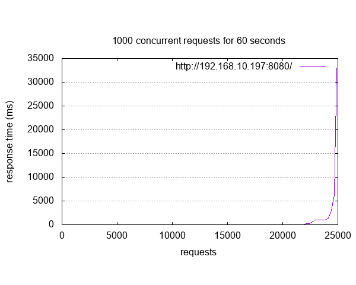

.. _magpie_f777ni_sockets-dumb-http-server-mt-sample:

Multithreaded Dumb HTTP Server
##############################

Overview
********

See :external+zephyr:zephyr:code-sample:`socket-dumb-http-server-mt` for the
original description.

.. _magpie_f777ni_sockets-dumb-http-server-mt-sample-requirements:

Requirements
************

- This sample application negotiate IPv4 address from a DHCPv4 server
  running everywhere in your local network.
- The 10/100 Ethernet MAC already configured in RMII/MII mode with MDIO
  using the ``&mac`` :external+zephyr:ref:`devicetree <dt-guide>` label.

Building and Running
********************

Build and flash Multithreaded Dumb HTTP Server as follows:

Build the Zephyr version of the sockets/dumb_http_server_mt application like
this:

.. zephyr-app-commands::
   :app: zephyr/samples/net/sockets/dumb_http_server_mt
   :build-dir: dumb_http_server_mt-magpie_f777ni
   :board: magpie_f777ni
   :gen-args: -DCONFIG_NET_UDP=y -DCONFIG_NET_DHCPV4=y
   :west-args: -p
   :goals: flash
   :host-os: unix

Once DHCPv4 client address negotiation completed with server, details
are shown on the console like this:

.. container:: highlight highlight-console notranslate no-copybutton

   .. parsed-literal::

      \*\*\* Booting Zephyr OS build |zephyr_version_em|\ *…* \*\*\*
      [00:00:00.011,000] <inf> net_config: Initializing network
      [00:00:00.011,000] <inf> net_config: Waiting interface 1 (0x200217e8) to be up...
      [00:00:00.512,000] <inf> net_config: Interface 1 (0x200217e8) coming up
      [00:00:00.512,000] <inf> net_config: IPv4 address: 192.0.2.1
      [00:00:00.512,000] <inf> net_config: Running dhcpv4 client...
      [00:00:00.614,000] <inf> net_config: IPv6 address: fd9c:33d7:ba99:0:280:e1ff:fee1:9a39
      [00:00:00.614,000] <inf> net_dumb_http_srv_mt_sample: Network connected
      [00:00:00.615,000] <dbg> net_dumb_http_srv_mt_sample: process_tcp6: Waiting for **IPv6 HTTP** connections on port **8080**, sock 3
      [00:00:00.615,000] <dbg> net_dumb_http_srv_mt_sample: process_tcp4: Waiting for **IPv4 HTTP** connections on port **8080**, sock 4
      [00:00:08.531,000] <inf> net_dhcpv4: Received: **192.168.10.197**
      [00:00:08.531,000] <inf> net_config: IPv4 address: 192.168.10.197
      [00:00:08.531,000] <inf> net_config: Lease time: 28800 seconds
      [00:00:08.532,000] <inf> net_config: Subnet: 255.255.255.0
      [00:00:08.532,000] <inf> net_config: Router: 192.168.10.1

Now the sample was starting, it expects connections at **192.168.10.197**,
port **8080**. The easiest way to connect is by opening a following URL in
a web browser: http://192.168.10.197:8080/

You should see a page with a sample content about Zephyr (captured at a
particular time from Zephyr's web site, note that it may differ from the
content on the live Zephyr site).

.. image:: dumb_http_server_mt.png
   :alt: What is Zephyr™ Project?
   :align: center

The following console output can be observed parallel to the action
of the web browser from the host:

.. container:: highlight highlight-console notranslate no-copybutton

   .. parsed-literal::

      [00:00:34.613,000] <dbg> net_dumb_http_srv_mt_sample: process_tcp: [5] Connection #1 from **192.168.10.100**
      [00:00:34.613,000] <dbg> net_dumb_http_srv_mt_sample: process_tcp: [6] Connection #2 from **192.168.10.100**

Alternatively, a tool like ``curl`` can be used:

.. container:: highlight highlight-console notranslate

   .. parsed-literal::

      :bgn:`$` **curl http://192.168.10.197:8080/**

The following raw HTML output should appear:

   .. container:: highlight-console notranslate literal-block

      .. tsn-include:: samples/net/sockets/dumb_http_server_mt/src/response_big.html.bin
         :docset: zephyr
         :dedent: 6
         :start-after: Content-Type: text/html; charset=utf-8

Finally, you can run an HTTP profiling/load tool like Apache Bench
(``ab``) against the server:

.. container:: highlight highlight-console notranslate

   .. parsed-literal::

      :bgn:`$` **ab -r -g dumb_http_server_mt_ab.csv -t 60 -c 1000 http://192.168.10.197:8080/** | \\
             **tee dumb_http_server_mt_ab.log** && **gnuplot dumb_http_server_mt_ab.p**

The ``-n`` parameter specifies the number of HTTP requests to issue against
a server. The ``-c`` parameter specifies the number of multiple requests to
perform at a time. An example result would looks like:

.. literalinclude:: dumb_http_server_mt_ab.log
   :language: none

.. rubric:: GNUplot script:

.. literalinclude:: dumb_http_server_mt_ab.p
   :language: gnuplot
