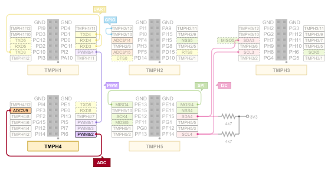

.. _magpie_f777ni_drivers_adc-tests:

ADC Loopback (:byl:`FILTERED`)
##############################

Overview
********

See :zephyr_file:`tests/drivers/adc`
for the original scope of tests, its structure and description.

.. _magpie_f777ni_drivers_adc-tests-requirements:

Requirements
************

You will need an ST-LINK/V2 debug tool adapter already connected to the
TiaC Magpie board, which has an already configured UART console connection.

On the TiaC MAGPIE pin headers the following ADC pins must be connected.

Building and Running
********************

.. tabs::

   .. group-tab:: Running

      Build and run the tests on target as follows:

      .. code-block:: console

         $ west twister \
                --verbose --jobs 4 --inline-logs \
                --enable-size-report --platform-reports \
                --device-testing --hardware-map map.yaml \
                --extra-args SHIELD="loopback_test_tmph" \
                --alt-config-root bridle/zephyr/alt-config/tests \
                --testsuite-root zephyr/tests --tag adc

   .. group-tab:: Results

      You should see the following messages on host console:

      .. parsed-literal::
         :class: highlight-console notranslate

         Device testing on:

         \| Platform                  \| ID       \| Serial device   \|
         \|---------------------------\|----------\|-----------------\|
         \| magpie_f777ni/stm32f777xx \| DT04BNT1 \| /dev/ttyUSB0    \|

         INFO    - JOBS: 4
         INFO    - Adding tasks to the queue...
         INFO    - Added initial list of jobs to queue
         INFO    - 1/2 magpie_f777ni/stm32f777xx drivers.adc.b_u585i_iot02a_adc4                    :byl:`FILTERED` (runtime filter)
         INFO    - 2/2 magpie_f777ni/stm32f777xx drivers.adc                                        :byl:`FILTERED` (runtime filter)

         INFO    - 2867 test scenarios (2655 configurations) selected, :byl:`2655` configurations filtered (:byl:`2653` by static filter, :byl:`2` at runtime).
         INFO    - :bgn:`0 of 0` test configurations passed (0.00%), :bbk:`0` built (not run), :brd:`0` failed, :bbk:`0` errored, with no warnings in :bbk:`19.91 seconds`.
         INFO    - 0 of 0 executed test cases passed (0.00%) on 0 out of total 1293 platforms (0.00%).
         INFO    - :bgn:`0` test configurations executed on platforms, :bbl:`0` test configurations were only built.

         Hardware distribution summary:

         \| Board                     \| ID       \|   Counter \|   Failures \|
         \|---------------------------\|----------\|-----------\|------------\|
         \| magpie_f777ni/stm32f777xx \| DT04BNT1 \|         0 \|          0 \|

         INFO    - Saving reports...
         INFO    - Writing JSON report .../twister-out/twister.json
         INFO    - Writing xunit report .../twister-out/twister.xml...
         INFO    - Writing xunit report .../twister-out/twister_report.xml...
         INFO    - Writing target report for magpie_f777ni/stm32f777xx...
         INFO    - Writing JSON report .../twister-out/magpie_f777ni_stm32f777xx.json
         INFO    - Run completed
