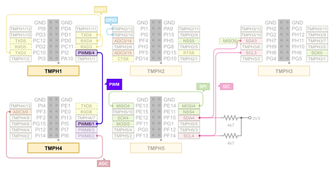

.. _magpie_f777ni_drivers_pwm-tests:

PWM Loopback (:brd:`FAILED`)
############################

Overview
********

See :zephyr_file:`tests/drivers/pwm`
for the original scope of tests, its structure and description.

.. _magpie_f777ni_drivers_pwm-tests-requirements:

Requirements
************

You will need an ST-LINK/V2 debug tool adapter already connected to the
TiaC Magpie board, which has an already configured UART console connection.

On the TiaC MAGPIE pin headers the following PWM pins must be connected.

Building and Running
********************

.. tabs::

   .. group-tab:: Running

      Build and run the tests on target as follows:

      .. code-block:: console

         $ west twister \
                --verbose --jobs 4 --inline-logs \
                --enable-size-report --platform-reports \
                --device-testing --hardware-map map.yaml \
                --extra-args SHIELD="loopback_test_tmph" \
                --alt-config-root bridle/zephyr/alt-config/tests \
                --testsuite-root zephyr/tests --tag pwm

   .. group-tab:: Results

      You should see the following messages on host console:

      .. parsed-literal::
         :class: highlight-console notranslate

         Device testing on:

         \| Platform                  \| ID       \| Serial device   \|
         \|---------------------------\|----------\|-----------------\|
         \| magpie_f777ni/stm32f777xx \| DT04BNT1 \| /dev/ttyUSB0    \|

         INFO    - JOBS: 4
         INFO    - Adding tasks to the queue...
         INFO    - Added initial list of jobs to queue
         INFO    - 1/3 magpie_f777ni/stm32f777xx tests/drivers/clock_control/pwm_clock/drivers.clock.pwm_clock :byl:`FILTERED` (runtime filter)
         INFO    - 2/3 magpie_f777ni/stm32f777xx tests/drivers/pwm/pwm_api/drivers.pwm              :bgn:`PASSED` (device: DT04BNT1, 9.002s)
         INFO    - 3/3 magpie_f777ni/stm32f777xx tests/drivers/pwm/pwm_loopback/drivers.pwm.loopback :brd:`FAILED` Failed (device: DT04BNT1, 3.274s)
         INFO    - :byl:`.../twister-out/magpie_f777ni_stm32f777xx/tests/drivers/pwm/pwm_loopback/drivers.pwm.loopback/handler.log`

         INFO    - 2294 test scenarios (2077 test instances) selected, :byl:`2075` configurations filtered (2074 by static filter, 1 at runtime).
         INFO    - :brd:`1 of 2` executed test configurations passed (50.00%), :bbk:`0` built (not run), :brd:`1` failed, :bbk:`0` errored, with no warnings in :bbk:`53.42 seconds`.
         INFO    - 2 of 5 executed test cases passed (40.00%), 3 failed on 1 out of total 876 platforms (0.11%).
         INFO    - 16086 selected test cases not executed: 7 skipped, 16079 filtered.
         INFO    - :bgn:`2` test configurations executed on platforms, :bbl:`0` test configurations were only built.

         Hardware distribution summary:

         \| Board                     \| ID       \|   Counter \|   Failures \|
         \|---------------------------\|----------\|-----------\|------------\|
         \| magpie_f777ni/stm32f777xx \| DT04BNT1 \|         2 \|          1 \|

         INFO    - Saving reports...
         INFO    - Writing JSON report .../twister-out/twister.json
         INFO    - Writing xunit report .../twister-out/twister.xml...
         INFO    - Writing xunit report .../twister-out/twister_report.xml...
         INFO    - Writing target report for magpie_f777ni/stm32f777xx...
         INFO    - Writing JSON report .../twister-out/magpie_f777ni_stm32f777xx.json
         INFO    - -+-+-+-+-+-+-+-+-+-+-+-+-+-+-+-+-+-+-+-+-+-+-+-+-+-+-+-+-+-+-+-+-+-+-+-+-+-+-+-+
         INFO    - The following issues were found (showing the top 10 items):
         INFO    - 1) tests/drivers/pwm/pwm_loopback/drivers.pwm.loopback on magpie_f777ni/stm32f777xx failed (Failed)
         INFO    -
         INFO    - To rerun the tests, call twister using the following commandline:
         INFO    - west twister -p <PLATFORM> -s <TEST ID>, for example:
         INFO    -
         INFO    - west twister -p magpie_f777ni/stm32f777xx -s tests/drivers/pwm/pwm_loopback/drivers.pwm.loopback
         INFO    - or with west:
         INFO    - west build -p -b magpie_f777ni/stm32f777xx zephyr/tests/drivers/pwm/pwm_loopback -T drivers.pwm.loopback
         INFO    - -+-+-+-+-+-+-+-+-+-+-+-+-+-+-+-+-+-+-+-+-+-+-+-+-+-+-+-+-+-+-+-+-+-+-+-+-+-+-+-+
         INFO    - Run completed

Open Issues
***********

PWM Loopback
============

Verify PWM can capture pulse, period, or pulse and period. It needs
the ``test-pwm-loopback`` DTS binding with two PWM channels, first
index must be a 32-Bit timer.

.. parsed-literal::
   :class: highlight-console notranslate

   Running TESTSUITE pwm_loopback
   ===================================================================
   START - test_capture_busy
   :bbk:`E: PWM capture only supported on first two channels`
   Pulse capture not supported, trying period capture
   :bbk:`E: PWM capture only supported on first two channels`
   :brd:`Assertion failed` at WEST_TOPDIR/zephyr/tests/drivers/pwm/pwm_loopback/src/test_pwm_loopback.c:312: :byl:`pwm_loopback_test_capture_busy: (err not equal to 0)`
   :bbk:`failed to configure pwm input (err -134)`
   :brd:`FAIL` - test_capture_busy in 0.032 seconds
   ===================================================================
   START - test_capture_timeout
   :bbk:`E: PWM capture only supported on first two channels`
   E: failed to configure pwm capture
   Pulse capture not supported, trying period capture
   :bbk:`E: PWM capture only supported on first two channels`
   E: failed to configure pwm capture
   :brd:`Assertion failed` at WEST_TOPDIR/zephyr/tests/drivers/pwm/pwm_loopback/src/test_pwm_loopback.c:179: :byl:`pwm_loopback_test_capture_timeout: (err not equal to -EAGAIN)`
   :bbk:`pwm capture did not timeout (err -134)`
   :brd:`FAIL` - test_capture_timeout in 0.039 seconds
   ===================================================================
   START - test_continuous_capture
   :bbk:`E: PWM capture only supported on first two channels`
   Pulse capture not supported, trying period capture
   :bbk:`E: PWM capture only supported on first two channels`
   :brd:`Assertion failed` at WEST_TOPDIR/zephyr/tests/drivers/pwm/pwm_loopback/src/test_pwm_loopback.c:252: :byl:`pwm_loopback_test_continuous_capture: (err not equal to 0)`
   :bbk:`failed to configure pwm input (err -134)`
   :brd:`FAIL` - test_continuous_capture in 0.032 seconds
   ===================================================================
   START - test_period_capture
   Testing PWM capture @ 15000000/100000000 nsec
   :bbk:`E: PWM capture only supported on first two channels`
   E: failed to configure pwm capture
   :byl:`capture type not supported`
   :byl:`SKIP` - test_period_capture in 0.015 seconds
   ===================================================================
   START - test_period_capture_inverted
   Testing PWM capture @ 15000000/100000000 nsec
   :bbk:`E: PWM capture only supported on first two channels`
   E: failed to configure pwm capture
   :byl:`capture type not supported`
   :byl:`SKIP` - test_period_capture_inverted in 0.015 seconds
   ===================================================================
   START - test_pulse_and_period_capture
   Testing PWM capture @ 15000000/100000000 nsec
   :bbk:`E: PWM capture only supported on first two channels`
   E: failed to configure pwm capture
   :byl:`capture type not supported`
   :byl:`SKIP` - test_pulse_and_period_capture in 0.015 seconds
   ===================================================================
   START - test_pulse_capture
   Testing PWM capture @ 15000000/100000000 nsec
   :bbk:`E: PWM capture only supported on first two channels`
   E: failed to configure pwm capture
   :byl:`capture type not supported`
   :byl:`SKIP` - test_pulse_capture in 0.015 seconds
   ===================================================================
   START - test_pulse_capture_inverted
   Testing PWM capture @ 15000000/100000000 nsec
   :bbk:`E: PWM capture only supported on first two channels`
   E: failed to configure pwm capture
   :byl:`capture type not supported`
   :byl:`SKIP` - test_pulse_capture_inverted in 0.015 seconds
   ===================================================================
   TESTSUITE pwm_loopback failed.
   ------ TESTSUITE SUMMARY START ------
   SUITE FAIL -   0.00% [pwm_loopback]: pass = :bgn:`0`, fail = :brd:`3`, skip = :byl:`5`, total = :bbk:`8` duration = :bbk:`0.178 seconds`
   - :brd:`FAIL` - [pwm_loopback.test_capture_busy] duration = 0.032 seconds
   - :brd:`FAIL` - [pwm_loopback.test_capture_timeout] duration = 0.039 seconds
   - :brd:`FAIL` - [pwm_loopback.test_continuous_capture] duration = 0.032 seconds
   - :byl:`SKIP` - [pwm_loopback.test_period_capture] duration = 0.015 seconds
   - :byl:`SKIP` - [pwm_loopback.test_period_capture_inverted] duration = 0.015 seconds
   - :byl:`SKIP` - [pwm_loopback.test_pulse_and_period_capture] duration = 0.015 seconds
   - :byl:`SKIP` - [pwm_loopback.test_pulse_capture] duration = 0.015 seconds
   - :byl:`SKIP` - [pwm_loopback.test_pulse_capture_inverted] duration = 0.015 seconds
   ------ TESTSUITE SUMMARY END ------
   ===================================================================
   RunID: 5578af0ad4393e6cd32bdfd459ff680f
   PROJECT EXECUTION FAILED
