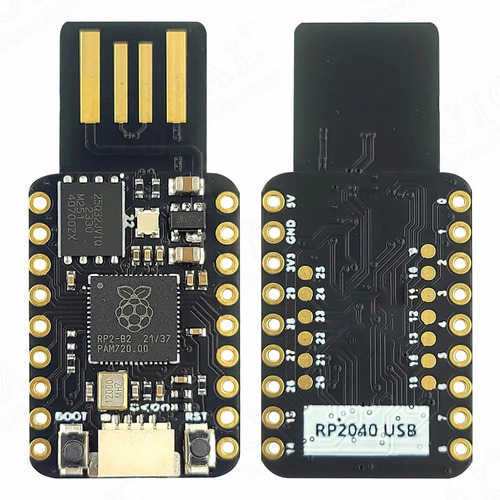

.. _mini_usb_rp2040-board:

Mini USB RP2040
###############

Overview
********

The `Mini USB RP2040`_ is a very small, low-cost and versatile Chinese board
from the official `AliExpress webshop of UICPAL`_. It has no SWD interface,
but a USB-A plug-in connector built directly into the PCB with a direct
connection to the RP2040 on-chip USB controller. The Raspberry Pi Pico
on-chip USB bootloader allows the ability to flash without any adapter,
in a drag-and-drop manner.

.. admonition:: Incorrect PCB assemblies in circulation!
   :class: error

   The feedback on AliExpress indicates that instead of the digital LED
   WS2812 (NeoPixel), a normal two or three-color chip LED (0606) is
   populated. Without the necessary series resistor, the LED is operated
   with far too much current and the lifetime of either the LED or the
   output pad in the RP2040 is limited. **This leads to damage during
   continuous operation and should never be left unattended!**

   In this case, the **LED must be throttled via the PWM. Please use the
   special board revision** ``mini_usb_rp2040@chipled`` and not the default
   revision ``mini_usb_rp2040@neopixel``.

Hardware
********

- Dual core Arm Cortex-M0+ processor running up to 133MHz
- 264KB on-chip SRAM
- 4MB on-board QSPI flash with XIP capabilities
- 25 GPIO pins
- 4 Analog inputs
- 2 UART peripherals
- 2 SPI controllers
- 2 I2C controllers
- 16 PWM channels
- USB 1.1 controller (host/device)
- 8 Programmable I/O (PIO) for custom peripherals
- On-board digital LED WS2812 (NeoPixel) – **See warning above!**
- 1 Watchdog timer peripheral

Supported Features
==================

The ``mini_usb_rp2040`` board configuration supports the following
hardware features:

.. list-table:: Hardware Features Supported by Zephyr
   :class: longtable
   :align: center
   :header-rows: 1

   * - Peripheral
     - Kconfig option
     - Devicetree compatible
     - Zephyr API
   * - PINCTRL
     - :kconfig:option:`CONFIG_PINCTRL`
     - :dtcompatible:`raspberrypi,pico-pinctrl`
     - :zephyr:ref:`pinctrl_api`
   * - GPIO
     - :kconfig:option:`CONFIG_GPIO`
     - :dtcompatible:`raspberrypi,pico-gpio`
     - :zephyr:ref:`gpio_api`
   * - UART
     - :kconfig:option:`CONFIG_SERIAL`
     - :dtcompatible:`raspberrypi,pico-uart`
     - :zephyr:ref:`uart_api`
   * - UDC (USB Device Controller)
     - :kconfig:option:`CONFIG_USB_DEVICE_STACK`
     - :dtcompatible:`raspberrypi,pico-usbd`
     - :zephyr:ref:`usb_api`
   * - I2C
     - :kconfig:option:`CONFIG_I2C`
     - :dtcompatible:`raspberrypi,pico-i2c` (!)
     - :zephyr:ref:`i2c_api`
   * - SPI
     - :kconfig:option:`CONFIG_SPI`
     - :dtcompatible:`raspberrypi,pico-spi`
     - :zephyr:ref:`spi_api`
   * - PWM
     - :kconfig:option:`CONFIG_PWM`
     - :dtcompatible:`raspberrypi,pico-pwm`
     - :zephyr:ref:`pwm_api`
   * - ADC
     - :kconfig:option:`CONFIG_ADC`
     - :dtcompatible:`raspberrypi,pico-adc`
     - :zephyr:ref:`adc_api`
   * - Temperature (Sensor)
     - :kconfig:option:`CONFIG_SENSOR`
     - :dtcompatible:`raspberrypi,pico-temp`
     - :zephyr:ref:`sensor`
   * - RTC
     - :kconfig:option:`CONFIG_RTC`
     - :dtcompatible:`raspberrypi,pico-rtc`
     - :zephyr:ref:`rtc_api`
   * - Timer (Counter)
     - :kconfig:option:`CONFIG_COUNTER`
     - :dtcompatible:`raspberrypi,pico-timer`
     - :zephyr:ref:`counter_api`
   * - Watchdog Timer (WDT)
     - :kconfig:option:`CONFIG_WATCHDOG`
     - :dtcompatible:`raspberrypi,pico-watchdog`
     - :zephyr:ref:`watchdog_api`
   * - Flash
     - :kconfig:option:`CONFIG_FLASH`
     - :dtcompatible:`raspberrypi,pico-flash-controller`
     - :zephyr:ref:`flash_api` and
       :zephyr:ref:`flash_map_api`
   * - PIO
     - :kconfig:option:`CONFIG_PIO_RPI_PICO`
     - :dtcompatible:`raspberrypi,pico-pio`
     - N/A
   * - UART (PIO)
     - :kconfig:option:`CONFIG_SERIAL`
     - :dtcompatible:`raspberrypi,pico-uart-pio`
     - :zephyr:ref:`uart_api`
   * - SPI (PIO)
     - :kconfig:option:`CONFIG_SPI`
     - :dtcompatible:`raspberrypi,pico-spi-pio`
     - :zephyr:ref:`spi_api`
   * - WS2812 (PIO)
     - :kconfig:option:`CONFIG_LED_STRIP`
     - :dtcompatible:`worldsemi,ws2812-rpi-pico-pio`
     - N/A
   * - DMA
     - :kconfig:option:`CONFIG_DMA`
     - :dtcompatible:`raspberrypi,pico-dma`
     - :zephyr:ref:`dma_api`
   * - HWINFO
     - :kconfig:option:`CONFIG_HWINFO`
     - N/A
     - :zephyr:ref:`hwinfo_api`
   * - VREG
     - :kconfig:option:`CONFIG_REGULATOR`
     - :dtcompatible:`raspberrypi,core-supply-regulator`
     - :zephyr:ref:`regulator_api`
   * - RESET
     - :kconfig:option:`CONFIG_RESET`
     - :dtcompatible:`raspberrypi,pico-reset`
     - :zephyr:ref:`reset_api`
   * - CLOCK
     - :kconfig:option:`CONFIG_CLOCK_CONTROL`
     - | :dtcompatible:`raspberrypi,pico-clock-controller`
       | :dtcompatible:`raspberrypi,pico-clock`
     - :zephyr:ref:`clock_control_api`
   * - NVIC
     - N/A
     - :dtcompatible:`arm,v6m-nvic`
     - Nested Vector :zephyr:ref:`interrupts_v2` Controller
   * - SYSTICK
     - N/A
     - :dtcompatible:`arm,armv6m-systick`
     -

(!) Designware I2C driver has issues:
    The *Raspberry Pi Pico I2C driver* is using the *Designware I2C driver*
    automatically. There is an open PR on upstream. See also:

       https://github.com/zephyrproject-rtos/zephyr/pull/60427

Pin Mapping
===========

The peripherals of the RP2040 SoC can be routed to various pins on the board.
The configuration of these routes can be modified through DTS. Please refer to
the datasheet to see the possible routings for each peripheral.

Since GPIO 22 is routed to the on-board digital LED (WS2812/NeoPixel) and there
is no additional simpler on-board LED, the "blinky" sample program does not work
on this board (use hello_world for a simple test program instead).

Default Zephyr Peripheral Mapping:
----------------------------------

.. rst-class:: rst-columns

- UART0_TX : GP0
- UART0_RX : GP1
- SPI0_SCK : GP2
- SPI0_TX : GP3
- SPI0_RX : GP4
- SPI0_CSN : GP5
- I2C1_SDA : GP6
- I2C1_SCL : GP7
- GPIO8 : GP8
- UART0_CTS : GP14 (optional, not default)
- UART0_RTS : GP15 (optional, not default)
- I2C0_SDA : GP16 (Qwiic)
- I2C0_SCL : GP17 (Qwiic)
- PIO0 : GP22 (on ``mini_usb_rp2040@neopixel``)
- PWM_3A : GP22 (on ``mini_usb_rp2040@chipled``)
- ADC_CH0 : GP26
- ADC_CH1 : GP27
- ADC_CH2 : GP28
- ADC_CH3 : GP29

Programmable I/O (PIO)
**********************

The RP2040 SoC comes with two PIO periherals. These are two simple co-processors
that are designed for I/O operations. The PIOs run a custom instruction set,
generated from a custom assembly language. PIO programs are assembled using
:command:`pioasm`, a tool provided by Raspberry Pi.

Zephyr does not (currently) assemble PIO programs. Rather, they should be
manually assembled and embedded in source code. An example of how this is done
can be found at :zephyr_file:`drivers/serial/uart_rpi_pico_pio.c`.

Sample: SPI via PIO
===================

The :zephyr_file:`samples/sensor/bme280/README.rst` sample includes a
demonstration of using the PIO SPI driver to communicate with an
environmental sensor. The PIO SPI driver supports using any
combination of GPIO pins for an SPI bus, as well as allowing up to
four independent SPI buses on a single board (using the two SPI
devices as well as both PIO devices).

Programming and Debugging
*************************

Flashing
========

Using UF2
---------

You can flash the Mini USB RP2040 with a UF2 file. By default, building an
application for this board will generate a :file:`build/zephyr/zephyr.uf2`
file. If the board is powered on with the ``BOOTSEL`` button pressed, it will
appear on the host as a mass storage device. The UF2 file should be
drag-and-dropped to the device, which will flash the board.

Debugging
=========

There is no SWD interface, thus debugging is not possible on thsi board.

Hello Shell on the USB Console (CDC/ACM)
========================================

.. rubric:: For board revision ``mini_usb_rp2040@neopixel`` (default):

.. zephyr-app-commands::
   :app: bridle/samples/helloshell
   :board: mini_usb_rp2040
   :build-dir: mini_usb_rp2040
   :west-args: -p
   :goals: flash
   :compact:

.. rubric:: For board revision ``mini_usb_rp2040@chipled``:

.. zephyr-app-commands::
   :app: bridle/samples/helloshell
   :board: mini_usb_rp2040@chipled
   :build-dir: mini_usb_rp2040
   :west-args: -p
   :goals: flash
   :compact:

Simple test execution on target
-------------------------------

(text in bold is a command input)

   .. admonition:: System
      :class: note dropdown toggle-shown

      .. container:: highlight highlight-console notranslate

         .. parsed-literal::

            :bgn:`uart:~$` **hwinfo devid**
            Length: 8
            ID: 0xbd774b2618daaa7d

            :bgn:`uart:~$` **kernel version**
            Zephyr version |zephyr_version_number_em|

            :bgn:`uart:~$` **bridle version**
            Bridle version |shortversion_number_em|

            :bgn:`uart:~$` **bridle version long**
            Bridle version |longversion_number_em|

            :bgn:`uart:~$` **bridle info**
            Zephyr: |zephyr_release_number_em|
            Bridle: |release_number_em|

   .. admonition:: Devices
      :class: note dropdown

      .. rubric:: On board revision ``mini_usb_rp2040@neopixel`` (default):

      .. container:: highlight highlight-console notranslate

         .. parsed-literal::

            :bgn:`uart:~$` **device list**
            devices:
            - clock-controller\ @\ 40008000 (READY)
              DT node labels: clocks
            - reset-controller\ @\ 4000c000 (READY)
              DT node labels: reset
            - cdc-acm-console-uart (READY)
              DT node labels: cdc_acm_console_uart
            - uart\ @\ 40034000 (READY)
              DT node labels: uart0
            - watchdog\ @\ 40058000 (READY)
              DT node labels: wdt0
            - timer\ @\ 40054000 (READY)
              DT node labels: timer
            - pio\ @\ 50200000 (READY)
              DT node labels: ((pio_hw_t \*)0x50200000u)
            - dma\ @\ 50000000 (READY)
              DT node labels: dma
            - gpio\ @\ 40014000 (READY)
              DT node labels: gpio0
            - adc\ @\ 4004c000 (READY)
              DT node labels: adc
            - flash-controller\ @\ 18000000 (READY)
              DT node labels: ssi
            - i2c\ @\ 40044000 (READY)
              DT node labels: i2c0 grove_i2c
            - vreg\ @\ 40064000 (READY)
              DT node labels: vreg
            - rtc\ @\ 4005c000 (READY)
              DT node labels: rtc
            - dietemp (READY)
              DT node labels: die_temp

      .. rubric:: On board revision ``mini_usb_rp2040@chipled``:

      .. container:: highlight highlight-console notranslate

         .. parsed-literal::

            :bgn:`uart:~$` **device list**
            devices:
            - clock-controller\ @\ 40008000 (READY)
              DT node labels: clocks
            - reset-controller\ @\ 4000c000 (READY)
              DT node labels: reset
            - cdc-acm-console-uart (READY)
              DT node labels: cdc_acm_console_uart
            - uart\ @\ 40034000 (READY)
              DT node labels: uart0
            - watchdog\ @\ 40058000 (READY)
              DT node labels: wdt0
            - timer\ @\ 40054000 (READY)
              DT node labels: timer
            - dma\ @\ 50000000 (READY)
              DT node labels: dma
            - gpio\ @\ 40014000 (READY)
              DT node labels: gpio0
            - adc\ @\ 4004c000 (READY)
              DT node labels: adc
            - flash-controller\ @\ 18000000 (READY)
              DT node labels: ssi
            - i2c\ @\ 40044000 (READY)
              DT node labels: i2c0 grove_i2c
            - pwm\ @\ 40050000 (READY)
              DT node labels: pwm grove_pwm_d16 grove_pwm_d17
            - vreg\ @\ 40064000 (READY)
              DT node labels: vreg
            - rtc\ @\ 4005c000 (READY)
              DT node labels: rtc
            - pwm-leds (READY)
              DT node labels: pwm_leds
            - dietemp (READY)
              DT node labels: die_temp

   .. admonition:: Voltage Regulator
      :class: note dropdown

      .. rubric:: Operate with the on-chip voltage regulator unit:

      .. container:: highlight highlight-console notranslate

         .. parsed-literal::

            :bgn:`uart:~$` **regulator vlist vreg@40064000**
            0.800 V
            0.850 V
            0.900 V
            0.950 V
            1.000 V
            1.050 V
            1.100 V
            1.150 V
            1.200 V
            1.250 V
            1.300 V

      .. rubric:: Trigger a power-off/on sequence:

      .. container:: highlight highlight-console notranslate

         .. parsed-literal::

            :bgn:`uart:~$` **hwinfo reset_cause**
            reset caused by:
            - pin

            :bgn:`uart:~$` **regulator disable vreg@40064000**
            \*\*\* Booting Zephyr OS build |zephyr_version_em|\ *…* (delayed boot 4000ms) \*\*\*
            Hello World! I'm THE SHELL from mini_usb_rp2040

      .. container:: highlight highlight-console notranslate

         .. parsed-literal::

            :bgn:`uart:~$` **hwinfo reset_cause**
            reset caused by:
            - power-on reset

   .. admonition:: RTC shell command not working!
      :class: warning

      It seems, more precise compiler optimazations have to be set
      to fetch valid RTC values from hardware by the Pico SDK.

      .. admonition:: RTC
         :class: note dropdown

         .. rubric:: Operate with the on-chip RTC unit:

         .. container:: highlight highlight-console notranslate

            .. parsed-literal::

               :bgn:`uart:~$` **rtc get rtc@4005c000**
               RTC not set

         .. container:: highlight highlight-console notranslate

            .. parsed-literal::

               :bgn:`uart:~$` **rtc set rtc@4005c000 2024-11-23T18:37:55**

         .. container:: highlight highlight-console notranslate

            .. parsed-literal::

               :bgn:`uart:~$` **rtc get rtc@4005c000**
               2024-11-23T18:37:59.000

   .. admonition:: Timer
      :class: note dropdown

      .. rubric:: Operate with the on-chip timer unit:

      .. container:: highlight highlight-console notranslate

         .. parsed-literal::

            :bgn:`uart:~$` **timer oneshot timer@40054000 0 1000000**
            :bgn:`timer@40054000: Alarm triggered`

   .. admonition:: Die Temperature Sensor
      :class: note dropdown

      .. rubric:: Operate with the on-chip temperature sensor on ADC channel 4:

      .. container:: highlight highlight-console notranslate

         .. parsed-literal::

            :bgn:`uart:~$` **sensor info**
            device name: dietemp, vendor: Raspberry Pi Foundation, model: pico-temp, friendly name: RP2040 chip temperature

      .. container:: highlight highlight-console notranslate

         .. parsed-literal::

            :bgn:`uart:~$` **sensor get dietemp**
            :bgn:`channel type=12(die_temp) index=0 shift=6 num_samples=1 value=560319800000ns (35.134804)`

   .. admonition:: ADC Channel
      :class: note dropdown

      .. rubric:: Operate with the ADC channels 0 until 4:

      .. container:: highlight highlight-console notranslate

         .. parsed-literal::

            :bgn:`uart:~$` **adc adc@4004c000 resolution 12**

      .. container:: highlight highlight-console notranslate

         .. parsed-literal::

            :bgn:`uart:~$` **adc adc@4004c000 read 0**
            read: 749

      .. container:: highlight highlight-console notranslate

         .. parsed-literal::

            :bgn:`uart:~$` **adc adc@4004c000 read 1**
            read: 959

      .. container:: highlight highlight-console notranslate

         .. parsed-literal::

            :bgn:`uart:~$` **adc adc@4004c000 read 2**
            read: 1197

      .. container:: highlight highlight-console notranslate

         .. parsed-literal::

            :bgn:`uart:~$` **adc adc@4004c000 read 3**
            read: 1107

      .. container:: highlight highlight-console notranslate

         .. parsed-literal::

            :bgn:`uart:~$` **adc adc@4004c000 read 4**
            read: 860

   .. admonition:: Flash Controller
      :class: note dropdown

      .. rubric:: Erase, Write and Verify

      .. container:: highlight highlight-console notranslate

         .. parsed-literal::

            :bgn:`uart:~$` **flash read flash-controller@18000000 e0000 40**
            000E0000: ff ff ff ff ff ff ff ff  ff ff ff ff ff ff ff ff \|........ ........\|
            000E0010: ff ff ff ff ff ff ff ff  ff ff ff ff ff ff ff ff \|........ ........\|
            000E0020: ff ff ff ff ff ff ff ff  ff ff ff ff ff ff ff ff \|........ ........\|
            000E0030: ff ff ff ff ff ff ff ff  ff ff ff ff ff ff ff ff \|........ ........\|

            :bgn:`uart:~$` **flash test flash-controller@18000000 e0000 1000 2**
            Erase OK.
            Write OK.
            Verified OK.
            Erase OK.
            Write OK.
            Verified OK.
            Erase-Write-Verify test done.

      .. rubric:: Details

      .. container:: highlight highlight-console notranslate

         .. parsed-literal::

            :bgn:`uart:~$` **flash read flash-controller@18000000 e0000 40**
            000E0000: 00 01 02 03 04 05 06 07  08 09 0a 0b 0c 0d 0e 0f \|........ ........\|
            000E0010: 10 11 12 13 14 15 16 17  18 19 1a 1b 1c 1d 1e 1f \|........ ........\|
            000E0020: 20 21 22 23 24 25 26 27  28 29 2a 2b 2c 2d 2e 2f \| !"#$%&' ()*+,-./\|
            000E0030: 30 31 32 33 34 35 36 37  38 39 3a 3b 3c 3d 3e 3f \|01234567 89:;<=>?\|

            :bgn:`uart:~$` **flash page_info e0000**
            Page for address 0xe0000:
            start offset: 0xe0000
            size: 4096
            index: 224

      .. rubric:: Revert

      .. container:: highlight highlight-console notranslate

         .. parsed-literal::

            :bgn:`uart:~$` **flash erase flash-controller@18000000 e0000 1000**
            Erase success.

            :bgn:`uart:~$` **flash read flash-controller@18000000 e0000 40**
            000E0000: ff ff ff ff ff ff ff ff  ff ff ff ff ff ff ff ff \|........ ........\|
            000E0010: ff ff ff ff ff ff ff ff  ff ff ff ff ff ff ff ff \|........ ........\|
            000E0020: ff ff ff ff ff ff ff ff  ff ff ff ff ff ff ff ff \|........ ........\|
            000E0030: ff ff ff ff ff ff ff ff  ff ff ff ff ff ff ff ff \|........ ........\|

   .. admonition:: I2C on Qwiic with BMP280
      :class: note dropdown

      The Mini USB RP2040 has no on-board I2C devices. For this example an
      |Grove BMP280 Sensor|_ was plugged into the Qwiic connector.

      .. container:: highlight highlight-console notranslate

         .. parsed-literal::

            :bgn:`uart:~$` **i2c scan i2c@40044000**
                 0  1  2  3  4  5  6  7  8  9  a  b  c  d  e  f
            00:             -- -- -- -- -- -- -- -- -- -- -- --
            10: -- -- -- -- -- -- -- -- -- -- -- -- -- -- -- --
            20: -- -- -- -- -- -- -- -- -- -- -- -- -- -- -- --
            30: -- -- -- -- -- -- -- -- -- -- -- -- -- -- -- --
            40: -- -- -- -- -- -- -- -- -- -- -- -- -- -- -- --
            50: -- -- -- -- -- -- -- -- -- -- -- -- -- -- -- --
            60: -- -- -- -- -- -- -- -- -- -- -- -- -- -- -- --
            70: -- -- -- -- -- -- -- 77
            1 devices found on i2c\ @\ 40044000

      The I2C address ``0x77`` is a Bosch BMP280 Air Pressure Sensor and their
      Chip-ID can read from register ``0xd0``. The Chip-ID must be ``0x58``:

      .. container:: highlight highlight-console notranslate

         .. parsed-literal::

            :bgn:`uart:~$` **i2c read_byte i2c@40044000 77 d0**
            Output: 0x58

Samples with Grove Modules on Qwiic connector
=============================================

Hello Shell with sensor access to Grove BMP280
----------------------------------------------

.. rubric:: For board revision ``mini_usb_rp2040@neopixel`` (default):

.. zephyr-app-commands::
   :app: bridle/samples/helloshell
   :board: mini_usb_rp2040
   :shield: "grove_sens_bmp280"
   :build-dir: mini_usb_rp2040
   :west-args: -p
   :goals: flash
   :compact:

.. rubric:: For board revision ``mini_usb_rp2040@chipled``:

.. zephyr-app-commands::
   :app: bridle/samples/helloshell
   :board: mini_usb_rp2040@chipled
   :shield: "grove_sens_bmp280"
   :build-dir: mini_usb_rp2040
   :west-args: -p
   :goals: flash
   :compact:

(text in bold is a command input)

   .. admonition:: Devices
      :class: note dropdown

      .. rubric:: Only an excerpt from the full list:

      .. container:: highlight highlight-console notranslate

         .. parsed-literal::

            :bgn:`uart:~$` **device list**
            devices:
              … … …
            - bmp280\ @\ 77 (READY)
            - dietemp (READY)
              DT node labels: die_temp

   .. admonition:: Sensor access from Zephyr Shell
      :class: note dropdown toggle-shown

      .. container:: highlight highlight-console notranslate

         .. parsed-literal::

            :bgn:`uart:~$` **sensor info**
            device name: dietemp, vendor: Raspberry Pi Foundation, model: pico-temp, friendly name: RP2040 chip temperature
            device name: bmp280\ @\ 77, vendor: Bosch Sensortec GmbH, model: bme280, friendly name: (null)

      .. container:: highlight highlight-console notranslate

         .. parsed-literal::

            :bgn:`uart:~$` **sensor get bmp280@77**
            :bgn:`channel type=13(ambient_temp) index=0 shift=16 num_samples=1 value=53909207971ns (24.739990)`
            :bgn:`channel type=14(press) index=0 shift=23 num_samples=1 value=53909207971ns (99.210937)`
            :bgn:`channel type=16(humidity) index=0 shift=21 num_samples=1 value=53909207971ns (0.000000)`

LED Blinky with Grove LED Button (Qwiic signals as GPIO)
--------------------------------------------------------

.. rubric:: For board revision ``mini_usb_rp2040@neopixel`` (default):

.. zephyr-app-commands::
   :app: zephyr/samples/basic/blinky
   :board: mini_usb_rp2040
   :shield: "grove_btn_d16 grove_led_d17 grove_pwm_led_d17 x_grove_testbed"
   :build-dir: mini_usb_rp2040
   :west-args: -p
   :goals: flash
   :compact:

.. rubric:: For board revision ``mini_usb_rp2040@chipled``:

.. zephyr-app-commands::
   :app: zephyr/samples/basic/blinky
   :board: mini_usb_rp2040@chipled
   :shield: "grove_btn_d16 grove_led_d17 grove_pwm_led_d17 x_grove_testbed"
   :build-dir: mini_usb_rp2040
   :west-args: -p
   :goals: flash
   :compact:

(text in bold is a command input)

   .. admonition:: Console Output
      :class: note dropdown toggle-shown

      .. container:: highlight highlight-console notranslate

         .. parsed-literal::

            … … …
            LED state: OFF
            LED state: ON
            LED state: OFF
            LED state: ON
            LED … … …

LED Fade with Grove LED Button (Qwiic signals as PWM)
-----------------------------------------------------

.. rubric:: For board revision ``mini_usb_rp2040@neopixel`` (default):

.. zephyr-app-commands::
   :app: zephyr/samples/basic/fade_led
   :board: mini_usb_rp2040
   :shield: "grove_btn_d16 grove_led_d17 grove_pwm_led_d17 x_grove_testbed"
   :build-dir: mini_usb_rp2040
   :west-args: -p
   :goals: flash
   :compact:

.. rubric:: For board revision ``mini_usb_rp2040@chipled``:

.. zephyr-app-commands::
   :app: zephyr/samples/basic/fade_led
   :board: mini_usb_rp2040@chipled
   :shield: "grove_btn_d16 grove_led_d17 grove_pwm_led_d17 x_grove_testbed"
   :build-dir: mini_usb_rp2040
   :west-args: -p
   :goals: flash
   :compact:

(text in bold is a command input)

   .. admonition:: Console Output
      :class: note dropdown toggle-shown

      .. container:: highlight highlight-console notranslate

         .. parsed-literal::

            PWM-based LED fade
            Using pulse width 0%
            Using pulse width 2%
            Using pulse width 4%
            … … …
            Using pulse width 94%
            Using pulse width 96%
            Using pulse width 98%
            Using pulse width 96%
            Using pulse width 94%
            … … …
            Using pulse width 4%
            Using pulse width 2%
            Using pulse width 0%
            Using pulse width 2%
            Using pulse width 4%
            Using pulse width … … …

LED Switch with Grove LED Button (Qwiic signals as GPIO)
--------------------------------------------------------

.. rubric:: For board revision ``mini_usb_rp2040@neopixel`` (default):

.. zephyr-app-commands::
   :app: zephyr/samples/basic/button
   :board: mini_usb_rp2040
   :shield: "grove_btn_d16 grove_led_d17 grove_pwm_led_d17 x_grove_testbed"
   :build-dir: mini_usb_rp2040
   :west-args: -p
   :goals: flash
   :compact:

.. rubric:: For board revision ``mini_usb_rp2040@chipled``:

.. zephyr-app-commands::
   :app: zephyr/samples/basic/button
   :board: mini_usb_rp2040@chipled
   :shield: "grove_btn_d16 grove_led_d17 grove_pwm_led_d17 x_grove_testbed"
   :build-dir: mini_usb_rp2040
   :west-args: -p
   :goals: flash
   :compact:

(text in bold is a command input)

   .. admonition:: Console Output
      :class: note dropdown toggle-shown

      .. container:: highlight highlight-console notranslate

         .. parsed-literal::

            Set up button at gpio@40014000 pin 16
            Set up LED at gpio@40014000 pin 17
            Press the button
            Button pressed at 1050252053
            Button pressed at 1338164194
            Button pressed at 1515853740
            Button pressed at 1595751687
            Button … … …

References
**********

.. target-notes::

.. _`Mini USB RP2040`: https://aliexpress.com/item/1005006710298380.html
.. _`AliExpress webshop of UICPAL`: https://aliexpress.com/store/1102351032
