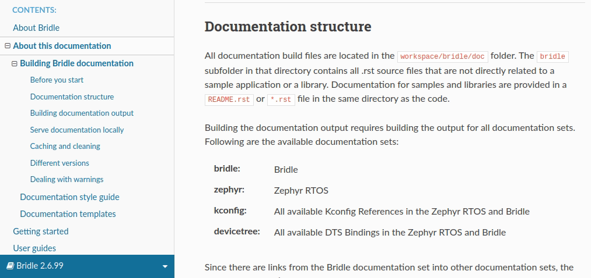
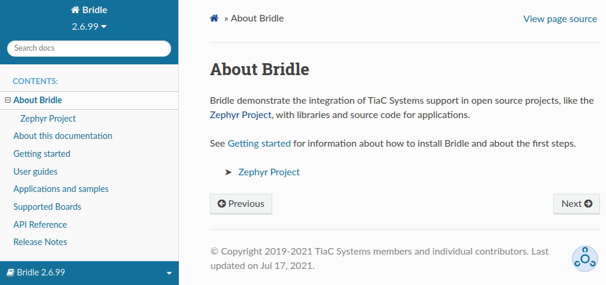
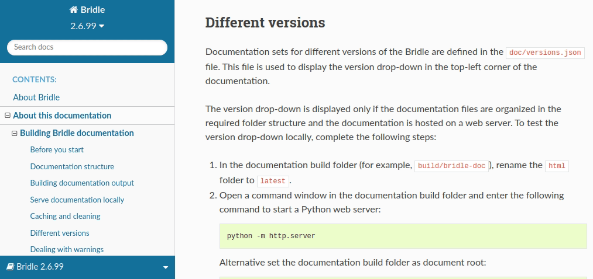

.. _doc_structure:
.. _documentation_sets:

Documentation structure
#######################

.. doc_structure_start

The documentation consists of several inter-linked documentation sets, one for
each repository. You can switch between these documentation sets by using the
selector in the *bottom-left corner of each page*.

The entry point is the |BRIDLE| documentation that you are currently reading.
The local :doc:`Zephyr documentation <zephyr:index>` is a slightly extended
version of the official `Zephyr Project documentation`_, containing some
additions specific to |TIAC|.

   |BRIDLE| documentation set selector

.. doc_structure_end

All documentation build files are located in the :file:`workspace/bridle/doc`
folder. The :file:`bridle` subfolder in that directory contains all .rst source
files that are not directly related to a sample application or a library.
Documentation for samples and libraries are provided in a :file:`README.rst` or
:file:`*.rst` file in the same directory as the code.

Building the documentation output requires building the output for all
documentation sets. Following are the available documentation sets:

:bridle: |BRIDLE|
:zephyr: Zephyr RTOS
:kconfig: All available Kconfig References in the Zephyr RTOS and |BRIDLE|
:devicetree: All available DTS Bindings in the Zephyr RTOS and |BRIDLE|

Since there are links from the |BRIDLE| documentation set into other
documentation sets, the other documentation sets built in a predefined order,
also when you :ref:`build it manually <doc_build_steps>`.

.. _doc_structure_search:

Documentation search
********************

Use the :guilabel:`Search docs` field in the *top-left corner of each
documentation page* to search for a given word or phrase in all the
documentation sets. The search engine only looks up the perfect matches
for each word or phrase.

   |BRIDLE| documentation search field

The results are displayed for all documentation sets, with each search result
entry prefixed with the name of the documentation set in which the result is
found. For example, the search result "Bridle » Getting started" refers to the
Getting Started page from the "Bridle" documentation set. The search match is
highlighted.

.. error::

   At the moment only each documentation set is searchable by itself!

.. .. figure:: images/doc_structure_search_results.png
   :alt: Bridle documentation search result entry

   |BRIDLE| documentation search result entry

.. _doc_structure_versions:

Different set versions
**********************

Some documentation sets are available in different versions. Use the version
drop-down in the *top-left corner of each documentation page* to change the
documentation version.

   |BRIDLE| documentation version drop-down

The version drop-down is displayed only if the documentation files are organized
in the required folder structure and the documentation is hosted on a web server.
You can :ref:`test the different versions locally <testing_versions>` when you
build the documentation.
