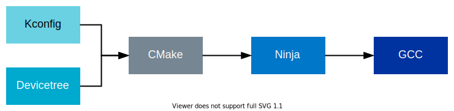

.. _introduction:

About |BRIDLE|
##############

|BRIDLE| demonstrate the integration of |TIAC| support in open source projects,
like the :ref:`zephyr_intro`, with libraries and source code for applications.
It is a combination of software developed by |TIAC| and open source projects,
hosted as `Git`_ repositories in the `DevZone`_ or the
`Zephyr GitHub organization`_.

Every |BRIDLE| release consists of a combination of all those repositories
at different revisions. See the :ref:`repos_and_revs` section for
a comprehensive list of repositories and their current revisions.
The revision of each of those repositories is determined by the current
revision of the main (manifest) repository, ``tiac-bridle``, which contains
the |BRIDLE| manifest file that helps manage the repositories as one
:ref:`code base <dm_code_base>` with the :ref:`west_intro`.

.. _license_intro:

About the |BRIDLE| license
**************************

Licenses are located close to the source files. You can find a
:bridle_file:`LICENSE` file, containing the details of the license, at the top
of every |BRIDLE| repository. Each file included in the repositories also has
an `SPDX identifier`_ that mentions this license.

If a folder or set of files is open source and included in |BRIDLE| under its
own license (for example, any of the Apache or MIT licenses), it will have
either its own :file:`LICENSE` file included in the folder or the license
information embedded inside the source files themselves.

The `SPDX tool`_ is used to generate license reports on each release of the
|BRIDLE|. You can also use SPDX to generate license reports for your projects
that are specific to the code included in your application.

.. _doc_intro:

Documentation pages
*******************

.. include:: doc_structure.rst
   :start-after: doc_structure_start
   :end-before: doc_structure_end

The |BRIDLE| documentation contains all information that is specific to the
|BRIDLE| and describes our libraries, samples, and applications. The API
documentation is extracted from the source code and included with the
library documentation.

For instructions about building the documentation locally, see
:ref:`doc_build`. For more information about the documentation
conventions and templates, see :ref:`documentation`.

.. _tools_intro:

Tools and configuration
***********************

The figure below visualizes the tools and configuration methods in the |BRIDLE|.
They are based on the :ref:`zephyr_intro`. All of them have a role in the
creation of an application, from configuring the libraries or applications
to building them.

   |BRIDLE| tools and configuration methods

* :external+zephyr:ref:`kconfig` generates definitions that configure libraries
  and subsystems.
  See also the `Kconfig language`_.
* :external+zephyr:ref:`Devicetree <dt-guide>` describes the hardware.
  See also the `Devicetree reference`_.
* CMake generates build files based on the provided :file:`CMakeLists.txt`
  files, which use information from Kconfig and devicetree.
  See the `CMake documentation`_.
* Ninja (comparable to make) uses the build files to build the program,
  see the `Ninja documentation`_.
* The `GCC compiler`_ creates the executables.

.. _git_intro:

Git Tool
********

`Git`_ is a free and open source distributed version control system that
allows managing the changes in the code or other collections of information
(set of files) over time.

Git organizes data (files or directories) in project repositories. The data is
managed like a series of snapshots. Every time you commit, or save the state
of your project, Git takes a snapshot of what the files look like at that
exact moment and stores a reference to that snapshot. For unchanged files,
Git provides just a link to the previous identical file it has already stored.

Git offers a lot of flexibility in how users manage changes, and repositories
are easily duplicated. In |BRIDLE|, forking is the agreed-upon Git workflow.
To contribute, the official public repository in GitHub is forked.

When you say you are *forking* a repository, you are creating a copy of the
repository under your GitHub ID. This means that you are creating an identical
copy that might diverge from the original over time. This copy is your personal
public repository that nobody else is allowed to push to, but changes can be
pulled from it.

The original repository is called the *upstream* repository, and the newly
created copy the *downstream* repository. Any changes made to the original
repository are reflected back to your forked repositories by using fetch
and rebase commands.

A :command:`git clone` command is used to get a copy of your downstream
repository onto your local machine. This serves as a private development
environment.

Local commits are pushed to your own downstream repository, and not the
official one. To integrate the changes into the main upstream repository,
a pull request is created explicitly. Before it is merged, the pull request
also serves as a convenient discussion thread if there are issues with the
contributed code. If your pull request is approved, the changes are merged
with the existing original content. Until then, your changes are reflected
only in the copy you forked.

A fork can be hosted on any server, including a public Git hosting site like
`GitHub`_. It is, however, important to differentiate between the generic
concept of a fork and GitHub's concept of a `GitHub fork`_. When you create
a GitHub fork, GitHub copies the original repository and tags the downstream
repository (the fork) with a flag that allows users to send pull requests
from the fork to its upstream repository. GitHub also supports creating
forks without linking them to the upstream respository. See the
`GitHub documentation <GitHub duplicate_>`_ for information about
how to do this.

Everything in Git is checksummed before it is stored and is then referred to
by that checksum. The mechanism that Git uses for this checksumming is called
a SHA-1 hash. This hash is a 40-character string, composed of hexadecimal
characters (0–9 and a–f), and calculated based on the contents of a file
or directory structure in Git.

.. _west_intro:

West Tool
*********

The Zephyr project includes a tool called west. The |BRIDLE| uses
:external+zephyr:ref:`west <west>` to manage the combination of multiple
Git repositories and versions.

Some of west’s features are similar to those provided by Git Submodules and
Google’s Repo tool. But west also includes custom features required by the
:ref:`zephyr_intro` that were not sufficiently supported by the existing tools.
For more details about the reasons behind the introduction of west, see the
:external+zephyr:ref:`west-history` section of the Zephyr documentation.

West's workspace contains exactly one
:external+zephyr:ref:`manifest repository <west-basics>`, which is a main
Git repository containing a `west manifest file`_. Additional Git repositories
in the workspace managed by west are called projects. The manifest repository
controls which commits to use from the different projects through the manifest
file. In the |BRIDLE|, the main repository `tiac-bridle`_ contains a west
manifest file |west manifest file|_, that determines the revision of all other
repositories and that is complete different from Zephyr’s west manifest file
:zephyr_file:`west.yml`. This means that ``tiac-bridle`` acts as the manifest
repository, while the other repositories are projects, like Zephyr in the case
of |BRIDLE|. When developing in the |BRIDLE|, your application will use
libraries and features from folders that are cloned from different repositories
or projects. The west tool keeps control of which commits to use from the
different projects. It also makes it fairly simple to add and remove modules.

Some west commands are related to Git commands with the same name, but operate
on the entire west workspace. Some west commands take projects as arguments. The
two most important workspace-related commands in west are :command:`west init`
and :command:`west update`. The :command:`west init` command creates a west
workspace, and you typically need to run it only once to initialize west with
the revision of the |BRIDLE| that you want to check out. It clones the manifest
repository into the workspace. However, the content of the manifest repository
is managed using Git commands, since west does not modify or update it. To clone
the project repositories, use the :command:`west update` command. This command
makes sure your workspace contains Git repositories matching the projects
defined in the manifest file. Whenever you check out a different revision
in your manifest repository, you should run :command:`west update` to make
sure your workspace contains the project repositories the new revision expects
(according to the manifest file).

For more information about :command:`west init`, :command:`west update`, and
other built-in commands, see :external+zephyr:ref:`west-built-in-cmds`. For more
information about the west tool, see the :external+zephyr:ref:`west` user guide.

See :ref:`getting_started` for information about how to install |BRIDLE| and
about the first steps. See :ref:`dev-model` for more information about the
|BRIDLE| code base and how to manage it.

.. _repos_and_revs:

Repositories and revisions
**************************

The following table lists all the repositories (and their respective revisions)
that are included as part of |BRIDLE| |version| release:

.. manifest-revisions-table::
   :show-first: zephyr

.. toctree::
   :maxdepth: 2

   zephyr
